# Awesome 360 Panorama Prompts

> GPT Image / AI 360全景提示词合集 | 来自 [绘梦拾光](https://www.diysq.com)

---

- 共收录 **50** 个案例
- 含 JSON 提示词: **50** 个
- 含配图: **50** 个
- 来源: [360全景视觉](https://www.diysq.com/archives/category/aitupian/360quanjing)

---

## 目录

1. **[KEY] [IMG]** [春日梯田大地颂歌·360全景提示词](https://www.diysq.com/archives/5070)
2. **[KEY] [IMG]** [万物复苏云巅梯田春色沉浸式空间全景提示词](https://www.diysq.com/archives/5063)
3. **[KEY] [IMG]** [金色黄昏下的蒲公英花田360全景提示词](https://www.diysq.com/archives/5011)
4. **[KEY] [IMG]** [冰岛春日花海瀑布全景提示词](https://www.diysq.com/archives/5006)
5. **[KEY] [IMG]** [梦幻春日大地：繁花梯田与孤傲樱树 360 全景提示词](https://www.diysq.com/archives/5001)
6. **[KEY] [IMG]** [金山玉幕·360度春天雪山日落梯田奇观全景提示词](https://www.diysq.com/archives/4991)
7. **[KEY] [IMG]** [春日雏菊花海超低机位沉浸全景提示词](https://www.diysq.com/archives/4984)
8. **[KEY] [IMG]** [湖畔漫步：1.6米人眼高度360度沉浸全景提示词](https://www.diysq.com/archives/4976)
9. **[KEY] [IMG]** [幻境之巅：银河拱门下的云端天梯360°全景提示词](https://www.diysq.com/archives/4864)
10. **[KEY] [IMG]** [星轨云海下的山巅灯火 360全景提示词](https://www.diysq.com/archives/4859)
11. **[KEY] [IMG]** [暮色苍穹：雪国极巅的360度全景颂歌提示词](https://www.diysq.com/archives/4854)
12. **[KEY] [IMG]** [春日林地全景，花海与晨光的洗礼提示词](https://www.diysq.com/archives/4833)
13. **[KEY] [IMG]** [欧式庄园春日郁金香360全景提示词](https://www.diysq.com/archives/4828)
14. **[KEY] [IMG]** [🌷 春意盎然：微距视界下的360全景宇宙提示词](https://www.diysq.com/archives/4823)
15. **[KEY] [IMG]** [高原俯视：红土地质的宏大指纹](https://www.diysq.com/archives/4600)
16. **[KEY] [IMG]** [纪念碑谷：图腾柱的时间之塔](https://www.diysq.com/archives/4595)
17. **[KEY] [IMG]** [莫斯科：新圣女修道院之夜](https://www.diysq.com/archives/4589)
18. **[KEY] [IMG]** [死亡谷：红沙丘与千年枯木](https://www.diysq.com/archives/4584)
19. **[KEY] [IMG]** [死谷恶水盆地：盐碱之花的几何](https://www.diysq.com/archives/4579)
20. **[KEY] [IMG]** [伊瓜苏：雨林之巅的圣水](https://www.diysq.com/archives/4573)
21. **[KEY] [IMG]** [纳瓦霍高原：光影雕琢的迷宫](https://www.diysq.com/archives/4568)
22. **[KEY] [IMG]** [纪念碑谷：史诗般的晚霞孤峰](https://www.diysq.com/archives/4563)
23. **[KEY] [IMG]** [悉尼港：世界级都市海港全景](https://www.diysq.com/archives/4558)
24. **[KEY] [IMG]** [亚利桑那州：马蹄湾翡翠之环](https://www.diysq.com/archives/4553)
25. **[KEY] [IMG]** [60度绝美海岛全景图：碧海、金沙与绿岛](https://www.diysq.com/archives/4313)
26. **[KEY] [IMG]** [拉贾安帕特：360度热带群岛航拍全景](https://www.diysq.com/archives/4308)
27. **[KEY] [IMG]** [拉贾安帕特喀斯特群岛高空全景](https://www.diysq.com/archives/4302)
28. **[KEY] [IMG]** [航拍拉贾安帕特群岛：黎明时分梦幻般的喀斯特海景](https://www.diysq.com/archives/4297)
29. **[KEY] [IMG]** [四王群岛，360度空中全景：遗失的蓝色天堂](https://www.diysq.com/archives/4292)
30. **[KEY] [IMG]** [龙目岛吉利群岛的高空无缝360全景](https://www.diysq.com/archives/4287)
31. **[KEY] [IMG]** [光影赞歌：塞洛姆主峰的“日照金山”360度落日全景](https://www.diysq.com/archives/4282)
32. **[KEY] [IMG]** [山河咏叹：塔吉姆峡谷与阿萨河的360度田园诗画](https://www.diysq.com/archives/4276)
33. **[KEY] [IMG]** [暮色金顶：塞洛姆山脊的360度黄昏全景史诗](https://www.diysq.com/archives/4271)
34. **[KEY] [IMG]** [360度高空无人机视角下雄伟的梯田群山](https://www.diysq.com/archives/4239)
35. **[KEY] [IMG]** [梦幻云海：黄山奇峰360度航拍全景提示词](https://www.diysq.com/archives/4002)
36. **[KEY] [IMG]** [堪察加火山湖与云海全景：自然的极致壮丽](https://www.diysq.com/archives/3997)
37. **[KEY] [IMG]** [阿尔及利亚塔西里·纳杰尔（Tassili n&#8217;Ajjer）沙漠与石林 360° 全景：壮阔的自然奇观](https://www.diysq.com/archives/3992)
38. **[KEY] [IMG]** [极地冰雪日落，360度航拍全景提示词](https://www.diysq.com/archives/3987)
39. **[KEY] [IMG]** [云端救赎：里约基督像与日照金山全景提示词](https://www.diysq.com/archives/3977)
40. **[KEY] [IMG]** [云巅之上的自然史诗：哈尼梯田日出全景提示词](https://www.diysq.com/archives/3972)
41. **[KEY] [IMG]** [上海陆家嘴黄浦江日出 360° 全景航拍](https://www.diysq.com/archives/3724)
42. **[KEY] [IMG]** [约旦瓦迪拉姆沙漠峡谷地貌正午 360° 全景航拍](https://www.diysq.com/archives/3718)
43. **[KEY] [IMG]** [黄山花岗岩峰林云海 360° 全景航拍](https://www.diysq.com/archives/3713)
44. **[KEY] [IMG]** [堪察加半岛火山与火山湖 360° 全景航拍](https://www.diysq.com/archives/3708)
45. **[KEY] [IMG]** [阿尔及利亚撒哈拉沙漠峡谷地貌正午 360° 全景航拍](https://www.diysq.com/archives/3702)
46. **[KEY] [IMG]** [南极半岛冰雪海湾日出 360° 全景航拍](https://www.diysq.com/archives/3698)
47. **[KEY] [IMG]** [约旦瓦迪拉姆沙漠峡谷地貌正午 360° 全景航拍](https://www.diysq.com/archives/3692)
48. **[KEY] [IMG]** [里约热内卢基督像云海日出 360° 全景航拍](https://www.diysq.com/archives/3686)
49. **[KEY] [IMG]** [云南元阳梯田日出 360° 全景航拍](https://www.diysq.com/archives/3680)
50. **[KEY] [IMG]** [安第斯高原地热池与湖泊 360° 全景航拍](https://www.diysq.com/archives/3655)

---

## 案例详情

### 1. 春日梯田大地颂歌·360全景提示词

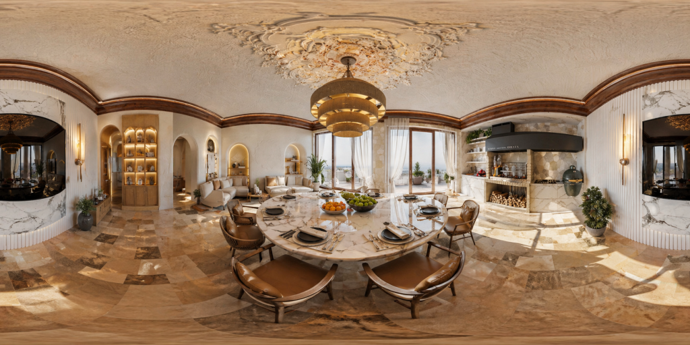

```json
{
  "{
  "图像元 metadata": {
    "类型": "360度等距柱状全景图",
    "投影方式": "完整球形等距柱状投影",
    "宽高比": "2:1",
    "分辨率": "超高分辨率全景"
  },
  "场景构图": {
    "地点": "中国南方山区梯田，春季",
    "相机位置": "地面（模拟无人机视角）",
    "相机高度": "中等高度，高空俯瞰",
    "视野范围": "水平360度，垂直180度",
    "投影行为": "正确的等距柱状畸变，确保无缝球形拼接",
    "天气状况": "清晨或黄昏，柔和的云层，无雨",
    "景深": "全景清晰，从前景到背景均有细节"
  },
  "视觉元素": {
    "前景": {
      "主体视图": "360度围绕，地面是翠绿的新草，点缀着嫩黄和粉色的小野花，几块巨大的、质感粗糙的岩石（如image_0.png所示，覆盖着苔藓）分布在四周，作为自然的框架。低矮的春季灌木郁郁葱葱。",
      "动态": "微风吹拂新草和野花"
    },
    "中景主体": {
      "地形": "宏大的层层梯田，如镜面般平滑，灌满了春水，水面完美地反射着天空的色彩（粉紫色、金色、深蓝）。梯田的田埂被新绿的植被覆盖。几个古朴的夯土和木质民居点缀在梯田之间。",
      "村落": "一个安静的小村庄，石板路穿梭其间",
      "云雾": "山间有轻薄的、如丝般的春雾漂浮"
    },
    "背景": {
      "景观": "连绵不绝的远山轮廓，被春天的植被覆盖，呈现出深邃的绿色和蓝色。远山如 image_0.png 般的尖峰和圆顶，被柔和的光线照亮。",
      "天空": "日落（或日出）的黄金时刻，天空呈现出柔和的粉紫色、淡金色和深蓝色的渐变，云层细腻而有层次（参考 image_0.png 的天空质感）。"
    },
    "环境氛围": {
      "地面半球": "完整的360度梯田和地形分布",
      "整体氛围": "生机勃勃、宁静、自然、宏大、水墨画般的写实感"
    }
  },
  "渲染风格": {
    "光照": "柔和的侧逆光（日落/日出方向），暖色调，光线穿过云雾",
    "调色": "自然、饱满、春天的色彩（嫩绿、水蓝、粉紫、淡黄），参考image_0.png的暖色调和紫色调",
    "质感质量": {
      "描述": "超高清晰度写实摄影，细腻的岩石纹理、水面反射、植被细节",
      "痕迹": "无人工痕迹，画面纯净，自然锐化，颗粒感细腻",
      "拼接": "完美的360度无缝拼接，无任何接缝或畸变断裂"
    }
  },
  "约束条件": {
    "必须保留": [
      "纯360度全景透视",
      "无人机高空视角",
      "梯田为核心主体",
      "无任何界面元素",
      "高度写实摄影感",
      "岩石和植被细节"
    ],
    "必须避免": [
      "城市或现代建筑",
      "人物",
      "电影感夸张灯光",
      "奇幻或游戏风格",
      "绘画或插画感",
      "非全景的普通照片布局",
      "任何形式的水印或UI"
    ]
  },
  "负面提示词": [
    "用户界面",
    "抬头显示",
    "文本覆盖",
    "水印",
    "现代建筑",
    "桥梁",
    "行人",
    "汽车",
    "奇幻艺术",
    "插图",
    "过度处理",
    "边框",
    "裁剪视图",
    "全景接缝断裂",
    "低分辨率",
    "模糊",
    "人工痕迹"
  ]
}"
}
```

[原文链接](https://www.diysq.com/archives/5070)

---

### 2. 万物复苏云巅梯田春色沉浸式空间全景提示词

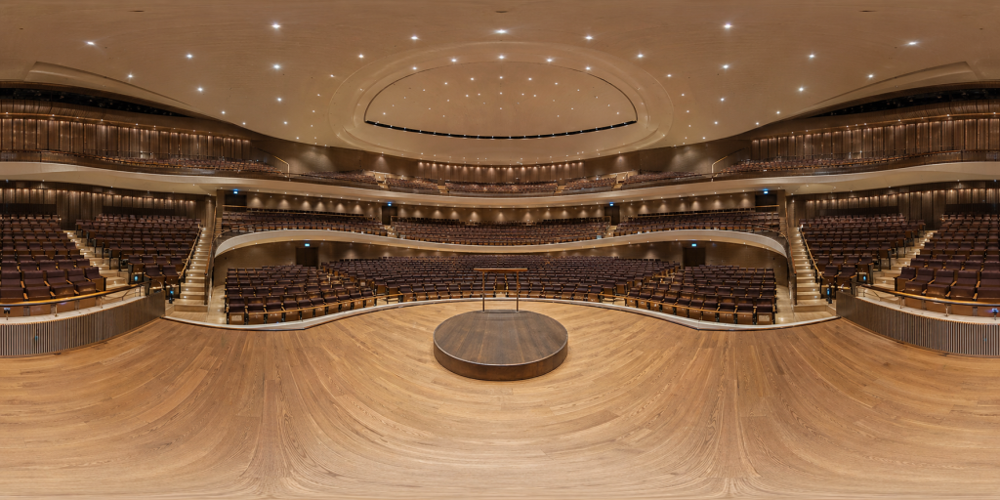

```json
{
  "{
  "图像元数据": {
    "类型": "360度等距柱状全景图",
    "投影方式": "完整球形等距柱状投影",
    "宽高比": "2:1",
    "分辨率": "超高分辨率8K全景"
  },
  "场景构图": {
    "地点": "高山云雾梯田带",
    "相机位置": "地面观景平台视角",
    "相机高度": "约1.7米人眼高度",
    "视野范围": "水平360度，垂直180度",
    "投影行为": "正确的等距柱状畸变，确保无缝球形拼接",
    "天气状况": "清晨，微风，伴有流动的薄雾",
    "景深": "全景深，确保从近景到远山细节清晰"
  },
  "视觉元素": {
    "前景": {
      "主体视图": "几株挺拔的翠绿高山冷杉，枝条悬挂着透明露珠，脚下是点缀着浅紫色野花的嫩绿草地",
      "动态": "露珠在微光下闪烁，薄雾轻拂草尖"
    },
    "中景主体": {
      "地形": "层层叠叠的灌水梯田，如银带般环绕山腰，倒映着天空色彩",
      "村落": "远方若隐若现的古朴木质吊脚楼，屋顶升起淡淡炊烟",
      "云雾": "如白纱般的半透明山雾，穿梭在梯田与林间"
    },
    "背景": {
      "景观": "连绵起伏的黛青色远山，山顶残雪正在消融",
      "天空": "清晨的淡紫色至浅蓝色的渐变天空，天际线处透出温润的橘粉色晨光"
    },
    "环境氛围": {
      "地面半球": "丰富多样的植被纹理，湿润的泥土路径，自然的生态细节",
      "整体氛围": "宁静、生机勃勃、空灵、治愈系自然奇观"
    }
  },
  "渲染风格": {
    "光照": "柔和的清晨自然光，带有丁达尔效应，侧逆光勾勒植物轮廓",
    "调色": "清新自然色调，以嫩绿、水蓝、藕粉为主，高动态范围渲染",
    "质感质量": {
      "描述": "国家地理摄影级别，超清纹理，极高像素密度",
      "痕迹": "无人工痕迹，画面纯净，自然锐化",
      "拼接": "完美的360度无缝拼接，顶部与底部极点无拉伸畸变"
    }
  },
  "约束条件": {
    "必须保留": [
      "纯360度全景透视",
      "高度写实的摄影质感",
      "梯田与古树的几何秩序感",
      "无任何界面元素",
      "自然的空气透视感"
    ],
    "必须避免": [
      "城市或现代建筑",
      "人物与车辆",
      "电影感夸张人造灯光",
      "奇幻或饱和度过高的风格",
      "绘画、插画或3D模型感",
      "非全景的普通扁平照片布局"
    ]
  },
  "负面提示词": [
    "用户界面",
    "文本覆盖",
    "水印",
    "标志",
    "现代电线杆",
    "柏油马路",
    "行人",
    "卡通",
    "CG渲染感",
    "过度锐化",
    "边框",
    "全景接缝断裂",
    "顶部拉伸黑洞",
    "底部极点模糊"
  ]
}"
}
```

[原文链接](https://www.diysq.com/archives/5063)

---

### 3. 金色黄昏下的蒲公英花田360全景提示词

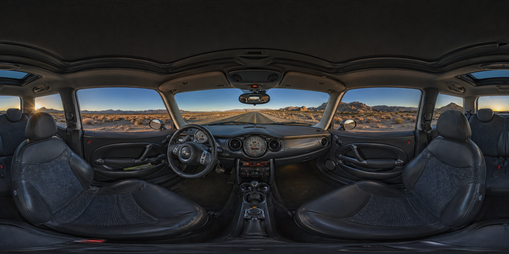

```json
{
  "{
  "图像元数据": {
    "类型": "360度等距柱状全景图",
    "投影方式": "完整球形（Equirectangular）等距柱状投影",
    "宽高比": "2:1",
    "分辨率": "超高分辨率全景，8K+"
  },
  "场景构图": {
    "地点": "偏远的、未受破坏的乡村草甸",
    "相机位置": "极低视角，贴近地面（大约15-20厘米高），仿佛置身于草丛中",
    "视野范围": "完整的水平360度，垂直180度天顶至底点",
    "投影行为": "正确的、数学上精确的等距柱状畸变，确保从底点到天顶的无缝球形拼接，无可见接缝",
    "天气状况": "清澈的春日黄昏，空气纯净",
    "景深": "浅景深（浅F-stop，如F/1.8），前景和中景焦点清晰，远景和天空完全散焦"
  },
  "视觉元素": {
    "前景（0-2米）": {
      "主体视图": "无数精致、毛茸茸的蒲公英种球（类似于参考图中的三个），它们是画面的核心焦点，被细腻的绿叶、小野花芽、嫩草茎和少量其他野花（如小黄花和紫色野豌豆）包围。这些元素在前景中占据较大的画面比例。每一个种球的纤细结构和绒毛都极其细腻，仿佛可以触摸。",
      "动态": "极轻的春风微动，几粒零星的蒲公英种子正在空中轻轻飘舞（类似于参考图中的状态）。"
    },
    "中景主体（2-10米）": {
      "地形": "起伏的草甸和低矮的灌木丛，蒲公英种球逐渐增多，形成一片花海。地面细节（草、叶）逐渐过渡为更柔和的纹理。",
      "村落": "在极远的中景（大约在90度和270度方向）有几座极小的、传统的、土坯和木质结构的古老农舍（非现代建筑），它们与环境完美融合。",
      "云雾": "无，空气清晰。"
    },
    "背景（10米-无穷大）": {
      "景观": "起伏的低山丘陵，覆盖着春天的嫩绿树林，形成一个包围式的天际线。",
      "天空": "完整的、包围式、柔焦的天空（Bokeh）。在“主体视图”方向（约0度）有强烈的、柔和的、金橙色的“黄金时刻”太阳光晕（Bokeh），正如参考图所示。这个光晕柔和地散射，延伸至约180度（反方向），那里的天空逐渐转为温暖的、柔焦的淡蓝色和粉色调。天空完全散焦成柔软、温暖的光斑。"
    },
    "环境氛围": {
      "地面半球（底点）": "完全覆盖着细腻的、低角度透视的草地、野花、落叶和蒲公英根部，形成一个完美的、无接缝的圆形底点。",
      "整体氛围": "宁静、梦幻、金色、怀旧、宏观般的细腻与无限宏大的全景视角的奇妙结合。"
    }
  },
  "渲染风格": {
    "光照": "极致温暖、金色的自然光。太阳位于主体视图方向（约0度），光线强烈且柔和地散射开来，形成包围式的光晕。中景和前景元素被温暖的背光和侧光照亮，强调其透明和纤细的质感。全景图反方向（180度）则表现出更柔和、更凉爽的余晖色调。",
    "调色": "温暖的金色和淡黄色调，与春天的嫩绿、淡蓝和粉色调平衡。高饱和度的金色，低饱和度的绿色。怀旧、柔和的电影感色调。",
    "质感质量": {
      "描述": "超高分辨率、宏观级的清晰度（针对前景物体）。蒲公英绒毛的每一根纤维都必须清晰可辨。场景整体具有柔焦和光斑（Bokeh）的艺术感。",
      "痕迹": "无人工痕迹，画面纯净，自然锐化，无过度处理。",
      "拼接": "完美的360度无缝拼接，确保在任何角度查看都不会出现断裂、拉伸或错位。"
    }
  },
  "约束条件": {
    "必须保留": [
      "纯360度全景透视，无缝拼接",
      "极低地面视角（Ground-level macro perspective）",
      "以宏观蒲公英种球为核心前景主体（参考图的扩展）",
      "金色散焦的“黄金时刻”光照（参考图的扩展）",
      "无任何现代人类活动或建筑（除了极远的古老农舍）",
      "极高的写实摄影感"
    ],
    "必须避免": [
      "城市或现代建筑",
      "人物、车辆、电线杆",
      "电影感夸张灯光、科幻或奇幻元素",
      "绘画或插画风格，必须是摄影质感",
      "非全景的普通照片布局"
    ]
  },
  "负面提示词": [
    "用户界面 (UI)",
    "抬头显示 (HUD)",
    "文本覆盖",
    "水印",
    "现代建筑",
    "桥梁",
    "行人",
    "车辆",
    "科幻艺术",
    "奇幻艺术",
    "插图",
    "过度处理",
    "边框",
    "裁剪视图",
    "全景接缝断裂",
    "底点或天顶扭曲",
    "非球形透视"
  ]
}"
}
```

[原文链接](https://www.diysq.com/archives/5011)

---

### 4. 冰岛春日花海瀑布全景提示词

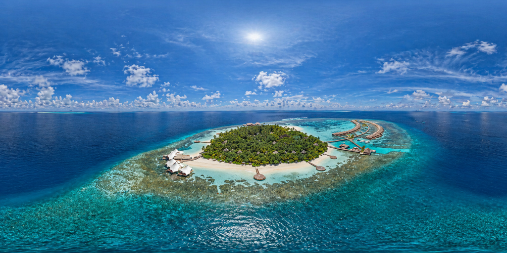

```json
{
  "{
  "图像元数据": {
    "类型": "360度等距柱状全景图",
    "投影方式": "完整球形https://youpai.diysq.com/2026/04/20260416143811229.png等距柱状投影",
    "宽高比": "2:1",
    "分辨率": "超高分辨率全景"
  },
  "场景构图": {
    "地点": "冰岛Skógafoss瀑布，春季",
    "相机位置": "贴近地面，位于紫色鲁冰花花海中心",
    "相机高度": "约0.5米",
    "视野范围": "水平360度，垂直180度",
    "投影行为": "正确的等距柱状畸变，确保无缝球形拼接",
    "天气状况": "柔和的春日晨光，天空晴朗，有轻薄的卷云",
    "景深": "大景深，前景花卉清晰，远景瀑布和山峦也保持清晰度，但保持层次感"
  },
  "视觉元素": {
    "前景": {
      "主体视图": "水平360度环绕着浓密、盛开的紫色鲁冰花（Lupine）花海，间杂着鲜绿的野草和苔藓。花朵细节极度清晰，露珠在花瓣上闪烁。花海从脚下一直延伸到中景。",
      "动态": "花朵在轻风中微微摇曳，前景偶尔可见一只忙碌的蜜蜂"
    },
    "中景主体": {
      "地形": "宏伟的Skógafoss瀑布（如image_0.png所示）位于场景的正前方（水平0度），其上方是一片广阔的翠绿色高山草甸和陡峭的山崖（如image_0.png）。",
      "村落": "在瀑布左侧和右侧的远方，环绕着花海边缘，点缀着几座经典的冰岛式红顶小教堂和几座传统的草皮房（turf houses），构成了一个宁静的小村落。在瀑布后方的山谷深处，隐约可见蜿蜒的河流。",
      "云雾": "瀑布底部的巨大水雾水幕（如image_0.png），在阳光下形成微弱的彩虹"
    },
    "背景": {
      "景观": "远景是连绵的、覆盖着残雪的雪山和冰川，环绕全景一周。",
      "天空": "广阔、干净的蔚蓝色天空，带有柔和的白色卷云，环绕整个天空半球"
    },
    "环境氛围": {
      "地面半球": "完全被鲁冰花花海、苔藓和岩石地面填满，没有任何人工痕迹",
      "整体氛围": "生机勃勃、宁静、自然、神秘、宏大"
    }
  },
  "渲染风格": {
    "光照": "柔和的金色春日晨光，从右侧（偏东）射入，为花海和瀑布边缘涂上一层暖色。避免强烈的直射光，光线均匀分布。",
    "调色": "鲜艳的紫色（鲁冰花）、翠绿色（草甸和苔藓）、冷白色和蓝色（瀑布和冰川）形成强烈对比，色彩饱和度高但自然，不失真。",
    "质感质量": {
      "描述": "极高精度的写实主义，水珠、花瓣纹理、岩石质感、苔藓细节都极度逼真",
      "痕迹": "无人工痕迹，画面纯净，自然锐化",
      "拼接": "完美的360度无缝拼接"
    }
  },
  "约束条件": {
    "必须保留": [
      "纯360度全景透视",
      "贴地花海视角",
      "Skógafoss瀑布和绿色山脉为核心主体",
      "无任何界面元素",
      "高度写实摄影感",
      "春季氛围（花、绿地、雪山）"
    ],
    "必须避免": [
      "城市或现代建筑",
      "人物",
      "电影感夸张灯光",
      "奇幻或游戏风格",
      "绘画或插画感",
      "非全景的普通照片布局"
    ]
  },
  "负面提示词": [
    "用户界面",
    "抬头显示",
    "文本覆盖",
    "水印",
    "现代建筑",
    "桥梁",
    "行人",
    "奇幻艺术",
    "插图",
    "过度处理",
    "边框",
    "裁剪视图",
    "全景接缝断裂",
    "人工路面"
  ]
}"
}
```

[原文链接](https://www.diysq.com/archives/5006)

---

### 5. 梦幻春日大地：繁花梯田与孤傲樱树 360 全景提示词

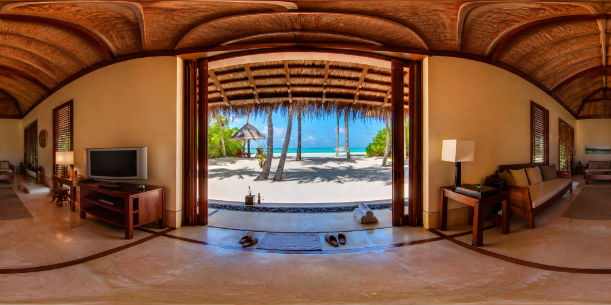

```json
{
  "{
  "图像元数据": {
    "类型": "360度等距柱状全景图",
    "投影方式": "完整球形（Equirectangular）等距柱状投影",
    "宽高比": "2:1 (例如：8192x4096)",
    "分辨率": "超高分辨率 8K 全景"
  },
  "场景构图": {
    "地点": "一个广阔、超现实的春日山丘地带，灵感源自 image_0.png",
    "相机位置": "贴近地面（靠近野花丛），位于梯田拼布的中心",
    "相机高度": "低角度（约 0.5 米），强调野花和地面的延伸感",
    "视野范围": "水平 360 度，垂直 180 度，完整球形覆盖",
    "投影行为": "完美的等距柱状畸变，确保无缝球形拼接",
    "天气状况": "清晨，晴朗，淡蓝色天空，带有稀薄的卷云",
    "景深": "超大景深，从脚下到远山都清晰可见"
  },
  "视觉元素": {
    "前景": {
      "主体视图": "近距离的、极其逼真的白色野花和草叶丛（如 image_0.png 所示），触手可及。野花和绿草形成复杂的、有机的拼布图案，围绕相机360度延展。能清晰辨别花朵细节。",
      "动态": "极微风，野花和草叶微微摇曳"
    },
    "中景主体": {
      "地形": "起伏不平的山丘，完全被由白色野花和嫩绿新草交替构成的复杂梯田拼布图案覆盖。这些拼布图案以一种有机的、流动的、类似于迷宫的方式环绕整个中景。远处山丘之巅矗立着那棵盛开的、孤傲的粉色樱树（如 image_0.png 所示），作为核心视觉焦点。",
      "村落": "在极远处的梯田间，隐约可见几处古朴、自然的石质或木质村屋，融入自然风景中",
      "云雾": "极轻薄的晨雾，缭绕在远山基部"
    },
    "背景": {
      "景观": "连绵不绝的、同样覆盖着拼布花海梯田的远山，直至地平线。远山顶端也可见其他极少的樱树和自然植被点缀。",
      "天空": "完整的、纯净的淡蓝色天穹，带有轻薄、自然的卷云纹理。在垂直180度方向上均匀分布。"
    },
    "环境氛围": {
      "地面半球": "完全被精细的野花和草地梯田覆盖，360度无缝连续。",
      "整体氛围": "极度宁静、清新、充满生命力、超现实的春日神圣感"
    }
  },
  "渲染风格": {
    "光照": "自然、温和的清晨日光，强调纹理和色彩",
    "调色": "自然、鲜艳但不失真的色彩。白色花海纯净，绿草嫩绿，樱树粉嫩。整体色调清新、明亮。",
    "质感质量": {
      "描述": "超写实电影级摄影感，极致的细节（能看清花瓣、草叶脉络）。",
      "痕迹": "绝对没有水印、文本覆盖、界面元素或人工痕迹。画面纯净，自然锐化。",
      "拼接": "完美的360度无缝拼接，无任何接缝或畸变断裂"
    }
  },
  "约束条件": {
    "必须保留": [
      "纯360度球形全景透视",
      "低角度、贴近地面的视角",
      "起伏的花海/绿草拼布梯田为核心主体",
      "那一棵盛开的粉色孤傲樱树作为核心焦点",
      "无任何界面元素（UI/HUD）",
      "高度写实摄影感（无可感知的3D模型感）"
    ],
    "必须避免": [
      "城市或现代建筑",
      "大量人物或动物（隐约可见的极远村落除外）",
      "电影感夸张灯光或人工光晕",
      "奇幻或游戏风格的过度渲染",
      "绘画或插画感",
      "非全景的、裁剪的或普通照片布局",
      "任何可见的拼接接缝"
    ]
  },
  "负面提示词": [
    "用户界面",
    "抬头显示",
    "文本覆盖",
    "水印",
    "现代建筑",
    "桥梁",
    "行人",
    "奇幻艺术",
    "插图",
    "过度处理",
    "边框",
    "裁剪视图",
    "全景接缝断裂",
    "低分辨率",
    "模糊前景"
  ]
}"
}
```

[原文链接](https://www.diysq.com/archives/5001)

---

### 6. 金山玉幕·360度春天雪山日落梯田奇观全景提示词

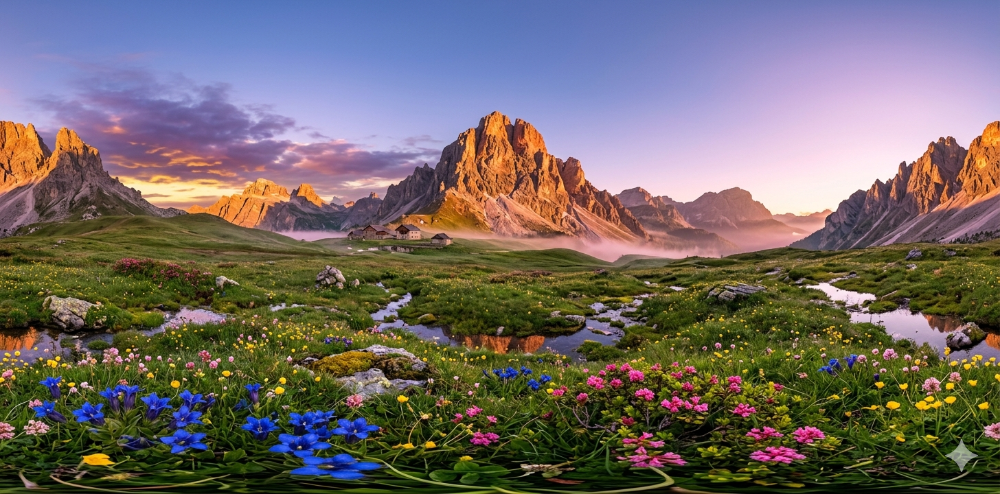

```json
{
  "{
  "图像元数据": {
    "类型": "360度等距柱状全景图",
    "投影方式": "完整球形等距柱状投影",
    "宽高比": "2:1",
    "分辨率": "超高分辨率全景"
  },
  "场景构图": {
    "地点": "阿尔卑斯之光下的春日藏区高山谷地梯田",
    "相机位置": "无人机高空俯瞰",
    "相机高度": "中高空 (约200米)，俯瞰梯田和村落",
    "视野范围": "水平360度，垂直180度",
    "投影行为": "正确的等距柱状畸变，确保无缝球形拼接",
    "天气状况": "清澈的日落黄昏，Alpenglow现象",
    "景深": "全景清晰，远近细节丰富"
  },
  "视觉元素": {
    "前景": {
      "主体视图": "层层叠叠的春季梯田，田埂上残存春雪",
      "动态": "梯田内新绿秧苗随微风轻摇，溪水潺潺"
    },
    "中景主体": {
      "地形": "宏伟的岩石山峰 (参考 image_0.png 形态)，被Alpenglow完全点亮为金色/橙色",
      "村落": "一个古朴的藏族村落 (碉楼和经幡)，与自然融合",
      "云雾": "山间点缀着淡淡的、被染成粉紫色的低云"
    },
    "背景": {
      "景观": "连绵的雪山群，以及环绕谷地的茂密春季果园 (开满桃花和李花)",
      "天空": "参考 image_0.png，绚丽的紫色与橙色渐变，层积云被染成暖色"
    },
    "环境氛围": {
      "地面半球": "完美的等距柱状纹理，呈现大地的几何图案",
      "整体氛围": "神圣、宁静、复苏、震撼"
    }
  },
  "渲染风格": {
    "光照": "强烈的阿尔卑斯之光 (Alpenglow)，日落余晖将山顶染成金红，梯田水面反光",
    "调色": "金黄色、橙色、紫色 (天空)、嫩绿色 (新绿)、冷白色 (残雪) 的和谐对比",
    "质感质量": {
      "描述": "超高清晰度，极致纹理细节 (岩石、泥土、植物、织物)",
      "痕迹": "无人工痕迹，画面纯净，自然锐化",
      "拼接": "完美的360度无缝拼接，无明显接缝"
    }
  },
  "约束条件": {
    "必须保留": [
      "纯360度全景透视",
      "无人机高空视角俯瞰",
      "梯田为核心主体",
      "无任何界面元素",
      "高度写实摄影感",
      "山峰被Alpenglow点亮为金色",
      "春季新绿与残雪的对比"
    ],
    "必须避免": [
      "城市或现代建筑",
      "现代交通工具",
      "行人 (除非是极小的环境点缀)",
      "电影感夸张灯光",
      "奇幻或游戏风格",
      "绘画或插画感",
      "非全景的普通照片布局"
    ]
  },
  "负面提示词": [
    "用户界面",
    "抬头显示",
    "文本覆盖",
    "水印",
    "现代建筑",
    "桥梁",
    "行人",
    "奇幻艺术",
    "插图",
    "过度处理",
    "边框",
    "裁剪视图",
    "全景接缝断裂",
    "非全景",
    "插画感",
    "卡通",
    "低分辨率",
    "现代道路"
  ]
}"
}
```

[原文链接](https://www.diysq.com/archives/4991)

---

### 7. 春日雏菊花海超低机位沉浸全景提示词

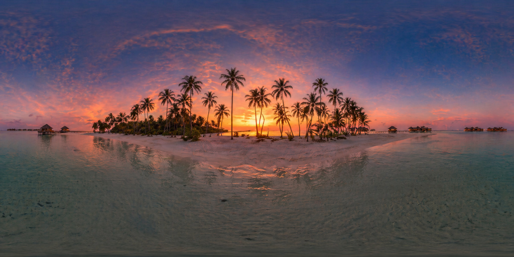

```json
{
  "{
  "图像元数据": {
    "类型": "360度等距柱状全景图",
    "投影方式": "完整球形等距柱状投影",
    "宽高比": "2:1",
    "分辨率": "8K 超高分辨率全景"
  },
  "场景构图": {
    "地点": "无尽的春日郊野雏原",
    "相机位置": "极低机位，贴近地面，位于花丛之间",
    "相机高度": "低于花茎顶部",
    "视野范围": "水平360度，垂直180度，完全沉浸",
    "投影行为": "完美的等距柱状畸变，确保无缝球形拼接",
    "天气状况": "清晨薄雾，柔和的漫射日光",
    "景深": "极浅景深（BOKEH），特写清晰，远景逐渐融化"
  },
  "视觉元素": {
    "前景": {
      "主体视图": "正前方（0度视角）几朵金黄色雏菊（Euryops chrysanthemoides）特写，清晰展示参考图片 image_0.png 中的花瓣细节、绿色花萼和纤细茎干。地面散落着参考图片中的羽状叶片和粉色干枯瓣。",
      "动态": "周围360度被特写和近景的雏菊环绕，呈现出多角度的侧影、背面和不同生长阶段的花朵，形成无尽的花丛"
    },
    "中景主体": {
      "地形": "随着视角的旋转，层层叠叠的雏菊花毯向各个方向延伸，逐渐融入梦幻般的黄色色块。",
      "村落": "无",
      "云雾": "空气中弥漫着轻微的晨雾，使远处的黄色花毯呈现出柔和、奶油般的质感（大面积奶油bokeh）。"
    },
    "背景": {
      "景观": "极远处的模糊绿色植被轮廓，完全虚化。",
      "天空": "（垂直180度天顶）柔和、多云的天空，如参考图片 image_0.png 所示，干净且柔和，提供高处的广阔视角。"
    },
    "环境氛围": {
      "地面半球": "（相机底部）湿润的深色泥土和茂密的绿叶，确保画面底部稳定，无脚架痕迹。",
      "整体氛围": "清新、私密、宁静、梦幻、春意盎然，被花海温柔包裹"
    }
  },
  "渲染风格": {
    "光照": "柔和的晨曦，自然的漫射日光，无强烈阴影",
    "调色": "保留参考图片 image_0.png 的柔和、自然的色调：鲜亮的黄色、嫩绿色、柔和的粉白干瓣、深泥土色",
    "质感质量": {
      "描述": "超高写实主义摄影，微距级别的花瓣质感与极浅景深的奶油虚化相结合",
      "痕迹": "无人工痕迹，画面纯净，自然锐化，质感细腻",
      "拼接": "完美的360度无缝拼接，无明显接缝或几何错误"
    }
  },
  "约束条件": {
    "必须保留": [
      "纯360度全景透视",
      "极低机位、贴近地面视角",
      "金黄色雏菊（Euryops chrysanthemoides）为主体",
      "保留 image_0.png 特有的花卉特写和前景叶片细节",
      "极浅的奶油般BOKEH虚化效果",
      "高度写实摄影感"
    ],
    "必须避免": [
      "无人机高空视角",
      "城市或现代建筑",
      "人物",
      "电影感夸张灯光",
      "奇幻或游戏风格",
      "非全景的普通照片布局",
      "梯田景观"
    ]
  },
  "负面提示词": [
    "用户界面",
    "抬头显示",
    "文本覆盖",
    "水印",
    "现代建筑",
    "桥梁",
    "行人",
    "车辆",
    "奇幻艺术",
    "插图",
    "过度处理",
    "边框",
    "裁剪视图",
    "全景接缝断裂",
    "脚架痕迹",
    "硬阴影"
  ]
}"
}
```

[原文链接](https://www.diysq.com/archives/4984)

---

### 8. 湖畔漫步：1.6米人眼高度360度沉浸全景提示词

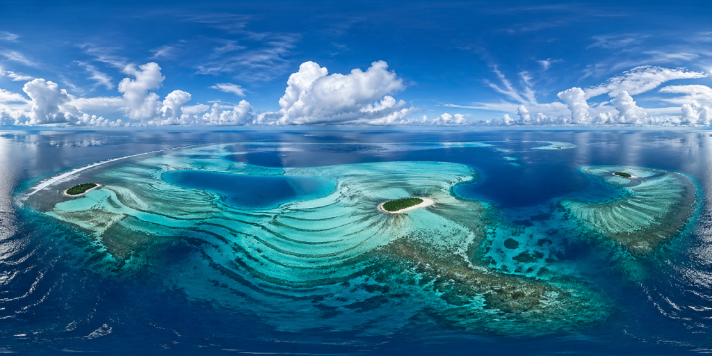

```json
{
  "{
  "图像元数据": {
    "类型": "360度等距柱状全景图",
    "投影方式": "完整球形等距柱状投影",
    "宽高比": "2:1",
    "分辨率": "超高分辨率全景，8K-16K细节"
  },
  "场景构图": {
    "地点": "湖滨樱花大道，紧邻水岸的木质围栏步道",
    "相机位置": "位于柏油路与湖泊边缘的步行区域中心",
    "相机高度": "地面视角，约1.6米人眼高度，模拟真实漫步视角",
    "视野范围": "水平360度，垂直180度",
    "投影行为": "完美的等距柱状畸变，确保道路线条在全景中自然弯曲且无缝衔接",
    "天气状况": "微风，明亮的春日午后，阳光穿透花瓣形成斑驳光影",
    "景深": "中等景深，近处樱花细节锐利，远山呈现自然的空气感虚化"
  },
  "视觉元素": {
    "前景": {
      "主体视图": "路边盛开的樱花树干，树皮纹理清晰，低垂的樱花枝条几乎触及镜头",
      "动态": "地面上有随风滚动落下的樱花瓣，柏油路面有清晰的斑马线纹理"
    },
    "中景主体": {
      "地形": "左侧为带有滑梯的微型社区公园草地，右侧为波光粼粼的开阔湖泊",
      "道路": "平整的灰色柏油马路，带有清晰的黄色中心线和交通指示标志",
      "植被": "修剪整齐的深绿色灌木丛作为路缘，与粉色樱花形成强烈的色彩层次"
    },
    "背景": {
      "景观": "湖泊对岸延绵的青色群山，山脚下零星分布的日式传统民居",
      "天空": "广阔的淡蓝色天空，带有大片如棉絮般的白云"
    },
    "环境氛围": {
      "地面半球": "柏油路面呈现细腻的颗粒感，阳光投射出密集的樱花树影",
      "整体氛围": "静谧、悠闲、具有浓郁的生活气息和旅行感"
    }
  },
  "渲染风格": {
    "光照": "明媚的自然采光，光线从侧上方摄入，在地面形成丰富的明暗对比",
    "调色": "胶片质感，温暖的阳光调性，强调淡粉色、湖蓝色与草绿色的和谐对比",
    "质感质量": {
      "描述": "极致的写实摄影质感，模拟专业单反相机的全幅成像效果",
      "痕迹": "无任何数字噪点，无镜头污垢，画面纯净通透",
      "拼接": "天顶和脚底无任何拉伸断裂，360度无缝环绕"
    }
  },
  "约束条件": {
    "必须保留": [
      "严格的1.6米人眼高度视角",
      "参考图中的斑马线与黄色中心线元素",
      "湖泊与路面平行的构图逻辑",
      "全景透视下的道路延伸感"
    ],
    "必须避免": [
      "无人机俯视感",
      "鱼眼镜头中心过度畸变",
      "模糊的纹理",
      "多余的现代行人或杂乱车辆",
      "任何非自然的人工光源"
    ]
  },
  "负面提示词": [
    "俯视视角",
    "拼接裂缝",
    "模糊不清",
    "数字绘图感",
    "黑边",
    "文字水印",
    "低分辨率",
    "扭曲的建筑",
    "杂乱的电线杆",
    "逻辑错误的阴影"
  ]
}"
}
```

[原文链接](https://www.diysq.com/archives/4976)

---

### 9. 幻境之巅：银河拱门下的云端天梯360°全景提示词

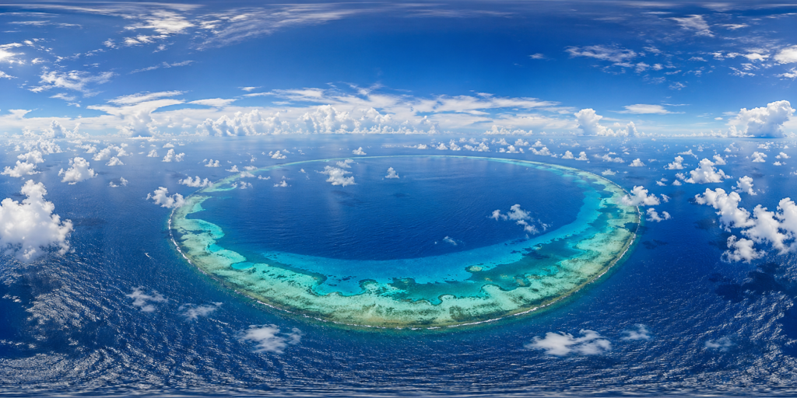

```json
{
  "{
  "图像元数据": {
    "类型": "360度等距柱状全景图",
    "投影方式": "完整球形等距柱状投影",
    "宽高比": "2:1",
    "分辨率": "超高分辨率全景"
  },
  "场景构图": {
    "地点": "一个被云海包围的、孤独的、陡峭的云端山脊",
    "相机位置": "位于原始石阶小径的中部，视角略高",
    "相机高度": "高空航拍视角，上帝视角，俯瞰山脊和小径",
    "视野范围": "水平360度，垂直180度，完整的球形视野",
    "投影行为": "正确的等距柱状畸变，确保天极（Nadir）和地极（Zenith）无任何接缝或人工痕迹，小径在水平方向上闭合",
    "天气状况": "清澈寒冷的夜，风平浪静，能见度极高，无雨雪，空气纯净",
    "景深": "超全景深，从脚下石板到最远星系皆清晰可见"
  },
  "视觉元素": {
    "前景": {
      "主体视图": "一条由粗糙石块铺成的古老小径，环绕观察者四周，形成一个水平闭合的环形，石板纹理清晰，生锈的金属栏杆和植物点缀其间（保留参考图细节），小径引导视线向天顶和四周延伸",
      "动态": "无，静止"
    },
    "中景主体": {
      "地形": "孤独的山峰和陡峭的山脊，像岛屿一样悬浮在云海之上，山石纹理崎岖，覆盖着稀疏的灌木和苔藓，在参考图基础上扩展到360度环绕",
      "村落": "在全景的远端，通过云层的缝隙，可以看到更丰富的远方城市或村落的微弱灯火点缀",
      "云雾": "翻滚的、无边无际的云海，铺满整个下半球，形成一望无际的云之汪洋，深邃的峡谷被云海填满，环绕整个山脉"
    },
    "背景": {
      "景观": "远方更广阔的、被云海包围的山脊线，扩展至360度，形成一个连续的、环形的山脉网络",
      "天空": "完整的360度深邃夜空。壮丽的银河系（Milky Way）如一个巨大的、绚丽的拱门，横跨天际（扩展其宽度和深度，覆盖更大的天区），带有紫色、粉色和金色的星云细节，天空中布满密集的、清晰的星辰"
    },
    "环境氛围": {
      "地面半球": "（Nadir点）完美的无接缝处理，融合了云海、深邃的峡谷和山脚，给人一种站在极高悬崖边缘眺望深渊和云海的眩晕感",
      "整体氛围": "神秘、神圣、浩瀚无垠、宁静而冷冽，仿佛站在世界尽头的通天之路上"
    }
  },
  "渲染风格": {
    "光照": "深邃的夜景光照，主要来源是壮丽的银河和繁星，微弱的城市远光，光线在石板和金属上产生自然的冷色调反光，保持原始图片的紫色/粉色星空基调",
    "调色": "深紫色、粉色、深蓝和金色的银河与星空，与深棕色、灰色和冷绿色的山石形成对比，云海呈柔和的灰色和白色",
    "质感质量": {
      "描述": "极高细节，电影级写实主义，石材、金属、植物和云层的纹理清晰锐利，无人工痕迹，画面纯净，自然锐化",
      "痕迹": "无人工痕迹，画面纯净，自然锐化，确保无噪点和颗粒感",
      "拼接": "完美的360度无缝拼接，无任何接缝或错位，在全景查看器中低头（Nadir）和抬头（Zenith）均自然过渡"
    }
  },
  "约束条件": {
    "必须保留": [
      "纯360度全景透视",
      "无人机高空视角",
      "石阶小径为核心主体并环绕",
      "壮丽的银河拱门并横跨天际",
      "无任何界面元素",
      "高度写实摄影感"
    ],
    "必须避免": [
      "城市或现代建筑（作为主体）",
      "人物",
      "电影感夸张灯光",
      "奇幻或游戏风格",
      "绘画或插画感",
      "非全景的普通照片布局"
    ]
  },
  "负面提示词": [
    "用户界面",
    "抬头显示",
    "文本覆盖",
    "水印",
    "现代建筑",
    "桥梁",
    "行人",
    "奇幻艺术",
    "插图",
    "过度处理",
    "边框",
    "裁剪视图",
    "全景接缝断裂",
    "天极畸变",
    "地极畸变",
    "噪点",
    "人为拼接痕迹",
    "非全景比例",
    "非球形投影"
  ]
}"
}
```

[原文链接](https://www.diysq.com/archives/4864)

---

### 10. 星轨云海下的山巅灯火 360全景提示词

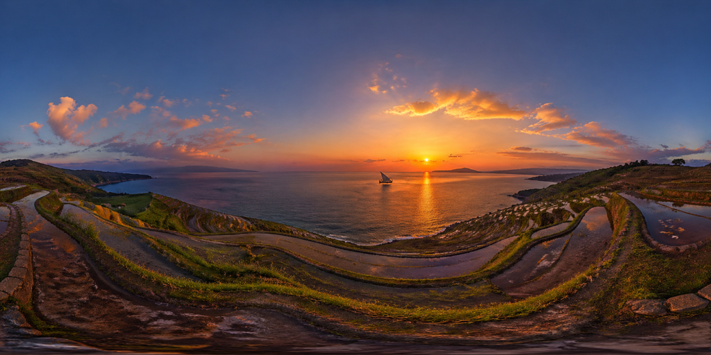

```json
{
  "{
  "图像元数据": {
    "类型": "360度等距柱状全景图",
    "投影方式": "完整球形等距柱状投影",
    "宽高比": "2:1",
    "分辨率": "8K超高分辨率全景"
  },
  "场景构图": {
    "地点": "偏远高山之巅，俯瞰巨大的火山口或峡谷",
    "相机位置": "位于最高峰的俯瞰点，可360度旋转视角",
    "相机高度": "高空航拍视角，上帝视角",
    "视野范围": "水平360度，垂直180度，完全沉浸式",
    "投影行为": "正确的等距柱状畸变，确保天顶、地底无缝球形拼接",
    "天气状况": "极其清澈的夜空，大气透明度极高",
    "景深": "全景景深，从脚下到天际线皆清晰"
  },
  "视觉元素": {
    "前景": {
      "主体视图": "脚下是陡峭的岩石地面。一条蜿蜒的徒步山径从脚下延伸，小径两旁整齐排列着明亮的 LED 小灯，如同一条发光的珍珠项链，指引向远处的山脊。山径旁有几个人影（使用头灯或手电筒的登山者），人影因长时间曝光而略显模糊，增加了尺度感。",
      "动态": "登山者的轻微移动"
    },
    "中景主体": {
      "地形": "巨大的火山口或峡谷盆地，四周由险峻、黑暗的岩石山峰和峭壁环绕。这些山峰的轮廓清晰，形成壮观的黑色剪影。",
      "村落": "在极远处的火山口底部或另一侧山腰，有几处极其微弱的村落灯光点，点缀在无边的黑暗中。",
      "云雾": "巨大的云海（逆温层）填充了整个火山口或峡谷盆地。云层厚重如波涛，呈现出冷蓝色和紫色调，在星光和微弱的城市天光下显得柔和而深邃。"
    },
    "背景": {
      "景观": "远处的山脉地平线，分界清晰。地平线上方有一条极窄的、微妙的日出前或日落后留下的粉色和橙色暮光带。",
      "天空": "广阔无垠的深蓝色夜空，从地平线的深蓝色过渡到天顶的极深邃蓝色。天空被无数清晰、细长的星轨（长时间曝光形成）所占据，星轨呈现一致的圆弧运动方向。偶尔可见一颗更亮的流星或卫星划过的直线轨迹。全景视角的球形投影使星轨呈现出围绕天极的壮观圆形排列。"
    },
    "环境氛围": {
      "地面半球": "完全由岩石地形、蜿蜒的发光山径和下方的广阔云海占据。",
      "整体氛围": "壮丽、寂静、冷峻、史诗感、人类活动的微小与自然伟大的对比。"
    }
  },
  "渲染风格": {
    "光照": "极低环境光，主要由星光、微弱的暮光和人工LED小径灯光（冷色调）组成。长时间曝光带来的动态和深度。",
    "调色": "冷色调为主：深蓝、天青、紫罗兰、冷白（灯光）、冷灰（岩石）。仅在地平线处有微量的暖色调（粉色、橙色）。",
    "质感质量": {
      "描述": "超高细节，清晰呈现岩石纹理、云海层理和每条星轨。长时间曝光的平滑感与岩石的粗糙感形成对比。",
      "痕迹": "无人工接缝，画面纯净，自然锐化，确保高动态范围",
      "拼接": "完美的360度无缝拼接，无伪影，天顶（Nadir）和地底（Zenith）无拉伸畸变。"
    }
  },
  "约束条件": {
    "必须保留": [
      "完整的360度沉浸式视角",
      "高空俯瞰的上帝视角",
      "核心主体：星轨夜空、云海火山口、发光小径",
      "无任何界面元素和水印",
      "高度写实的长时间曝光摄影感",
      "地平线的暮光分界线",
      "清晰的岩石山峰剪影"
    ],
    "必须避免": [
      "城市景观或大量现代建筑",
      "清晰、静止的人物或面部（必须是模糊或远景）",
      "电影感夸张的饱和度和不真实灯光",
      "奇幻、游戏或科幻元素（如发光植物、魔法）",
      "绘画、插画、矢量或AI生成的非摄影质感",
      "任何遮挡视角的UI、文字或框架",
      "明显的全景接缝"
    ]
  },
  "负面提示词": [
    "用户界面",
    "抬头显示",
    "文本覆盖",
    "水印",
    "现代建筑",
    "桥梁",
    "清晰的人物",
    "面部",
    "奇幻艺术",
    "插图",
    "卡通",
    "电影感过度处理",
    "边框",
    "裁剪视图",
    "全景接缝断裂",
    "镜头光晕",
    "噪点",
    "模糊",
    "畸变过度",
    "日间场景"
  ]
}"
}
```

[原文链接](https://www.diysq.com/archives/4859)

---

### 11. 暮色苍穹：雪国极巅的360度全景颂歌提示词

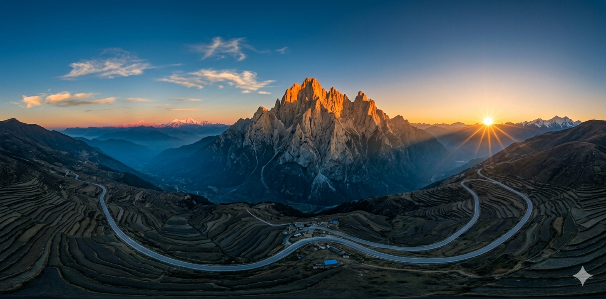

```json
{
  "{
  "图像元数据": {
    "类型": "360度等距柱状全景图",
    "投影方式": "完整球形等距柱状投影",
    "宽高比": "2:1",
    "分辨率": "超高分辨率全景"
  },
  "场景构图": {
    "地点": "极寒雪国山脉腹地",
    "相机位置": "悬浮在万米高空的上帝视角",
    "相机高度": "极高，俯瞰整个山系",
    "视野范围": "水平360度，垂直180度",
    "投影行为": "正确的等距柱状畸变，确保完美的无缝球形拼接",
    "天气状况": "清澈的暮色，有柔和的夕阳云层",
    "景深": "全景锐利，所有元素清晰"
  },
  "视觉元素": {
    "前景": {
      "主体视图": "无干扰物，纯净的雪山全景",
      "动态": "无"
    },
    "中景主体": {
      "地形": "绵延不绝、崎岖不平的积雪山脉系，覆盖着成千上万棵深色针叶树（松树和杉树），山势雄伟复杂。主峰群沐浴在金色和粉色的夕阳中，岩石和积雪的细节清晰锐利，明暗对比极强。",
      "村落": "无任何建筑",
      "云雾": "在360度地平线上，有被夕阳染成柔和粉色和紫色的暮色云层环绕。"
    },
    "背景": {
      "景观": "向四面八方无限延伸的、逐渐变深和变暗的雪山山脊，最终融入幽蓝的暮色天际线。",
      "天空": "广阔无垠的暮色天空，上部保持幽深冷蓝色，接近地平线处则有夕阳的粉色和紫色过渡，整个天空在360度范围内环绕。"
    },
    "环境氛围": {
      "地面半球": "完全被覆盖着密集深色松林的雪原和山谷覆盖，地形纹理极富节奏感。",
      "整体氛围": "壮丽、清冷、神秘、寂静，远离尘嚣，神圣的暮色雪山颂歌。"
    }
  },
  "渲染风格": {
    "光照": "极具戏剧感的暮色光照。主峰和地平线云层被金色和粉色夕阳从低角度点亮，其他区域则处于幽蓝的阴影中，冷暖对比强烈。这种光照在360度范围内自然过渡。",
    "调色": "以幽蓝、深紫和冷白为主基调，局部点缀金色和粉色的暖色调。",
    "质感质量": {
      "描述": "高度写实摄影感，积雪颗粒、岩石粗糙度和松针细节清晰可见。画面纯净，高清晰度。",
      "痕迹": "无人工痕迹，画面纯净，自然锐化，无用户界面元素。",
      "拼接": "完美的360度无缝拼接"
    }
  },
  "约束条件": {
    "必须保留": [
      "纯360度全景透视",
      "无人机极高空上帝视角",
      "以宏大雪山为核心主体",
      "参考图片中特定的暮色光影（金色和粉色）",
      "密集的针叶林纹理",
      "无任何界面元素",
      "高度写实摄影感"
    ],
    "必须避免": [
      "城市或现代建筑",
      "人物",
      "道路",
      "电线杆",
      "电影感夸张灯光",
      "奇幻或游戏风格",
      "绘画或插画感",
      "非全景的普通照片布局",
      "用户界面、HUD、水印"
    ]
  },
  "负面提示词": [
    "用户界面",
    "抬头显示",
    "文本覆盖",
    "水印",
    "现代建筑",
    "桥梁",
    "行人",
    "汽车",
    "公路",
    "奇幻艺术",
    "插图",
    "绘画",
    "过度处理",
    "边框",
    "裁剪视图",
    "全景接缝断裂",
    "低分辨率"
  ]
}"
}
```

[原文链接](https://www.diysq.com/archives/4854)

---

### 12. 春日林地全景，花海与晨光的洗礼提示词

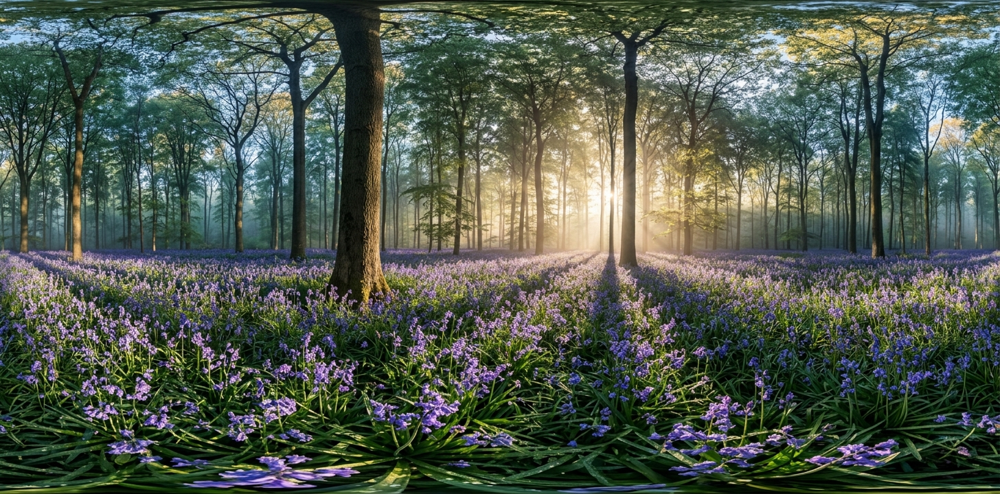

```json
{
  "{
  "图像元数据": {
    "类型": "360度等距柱状全景图",
    "投影方式": "完整球形等距柱状投影 (Monoscopic 360)",
    "宽高比": "2:1",
    "分辨率": "超高分辨率全景，16k以上"
  },
  "场景构图": {
    "地点": "一片广阔、古老的温带森林，完全被春日花海覆盖",
    "相机位置": "低机位，接近地面（地毯视角）",
    "相机高度": "模拟人眼站立或半蹲高度",
    "视野范围": "水平360度，垂直180度（全向）",
    "投影行为": "完美的等距柱状畸变，确保球形全景查看时无缝且无畸变，视野流畅无断裂",
    "天气状况": "清晨，阳光穿透薄雾，空气清新",
    "景深": "极宽，从前景的花朵细节到背景的树林深处都保持清晰，强调空间深度"
  },
  "视觉元素": {
    "前景": {
      "主体视图": "无数密集的蓝紫色小花（类似参考图），从脚下一直延伸出去。前景花朵细节清晰，包括花瓣纹理和露珠。几根粗壮的树干从前景底部向上延伸至天顶，树皮纹理逼真。",
      "动态": "地面花海和树干上布满长长的、平行的阴影（由晨曦投射），随视角旋转而变化透视"
    },
    "中景主体": {
      "地形": "起伏不大的林地，完全覆盖着蓝色和紫色的花朵海洋。无数不同粗细的树干（如白桦、橡树）在360度范围内分布，形成一个完整的森林包围圈。",
      "村落": "无任何建筑迹象",
      "云雾": "淡淡的晨雾弥漫在林间，增强光线的丁达尔效应和空间深度感"
    },
    "背景": {
      "景观": "向四面八方延伸的更深邃的森林，背景树木逐渐模糊在雾气和阴影中。一束强烈、金色的晨曦从某一特定方位（如后方偏上）穿透树梢，在地面和花海上形成斑驳的光点。",
      "天空": "在阳光来源方向，透过树叶的天空是金黄色的；在阴影方向，天空是清晨的冷蓝色。天顶被茂密的树叶冠层覆盖，透过光线，叶脉清晰。"
    },
    "环境氛围": {
      "地面半球": "完全被无穷无尽的花海和树干底座覆盖。地面没有明显的小路，强调自然原始感。",
      "整体氛围": "静谧、宁静、充满生机、梦幻的春日清晨"
    }
  },
  "渲染风格": {
    "光照": "高动态范围（HDR）光照。戏剧性的斑驳光影，丁达尔效应。阳光是金黄色的，阴影部分是冷蓝色的，形成鲜明对比。",
    "调色": "丰富的蓝、紫（花海）、金黄（晨曦）、深褐（树干）、冷绿（阴影叶片）。色彩饱和度高，自然但不夸张。",
    "质感质量": {
      "描述": "超高分辨率、超高写实主义摄影风格。树皮、花瓣、叶片质感逼真。",
      "痕迹": "无人工痕迹，画面纯净，自然锐化，无过度处理感",
      "拼接": "完美的360度无缝拼接，无任何接缝线或明显的拼接点"
    }
  },
  "约束条件": {
    "必须保留": [
      "纯360度全景透视",
      "低机位（地面视角）",
      "无穷无尽的蓝紫色花海为核心主体",
      "戏剧性的斑驳光影和长阴影",
      "高度写实摄影感",
      "无任何界面元素"
    ],
    "必须避免": [
      "现代建筑、电线杆",
      "人物、动物",
      "垃圾、人工痕迹",
      "电影感夸张灯光、梦幻光斑（Bokeh）",
      "奇幻艺术或游戏风格",
      "插图或绘画感",
      "非全景的普通照片布局"
    ]
  },
  "负面提示词": [
    "用户界面",
    "抬头显示",
    "文本覆盖",
    "水印",
    "现代建筑",
    "桥梁",
    "行人",
    "奇幻艺术",
    "插图",
    "过度处理",
    "边框",
    "裁剪视图",
    "全景接缝断裂",
    "过度曝光",
    "低分辨率",
    "人工接缝",
    "镜头光晕过度"
  ]
}"
}
```

[原文链接](https://www.diysq.com/archives/4833)

---

### 13. 欧式庄园春日郁金香360全景提示词


```json
{
  "{
  "图像元数据": {
    "类型": "360度等距柱状全景图",
    "投影方式": "完整球形等距柱状投影",
    "宽高比": "2:1",
    "分辨率": "12K超高分辨率全景"
  },
  "场景构图": {
    "地点": "一座古老的欧式乡村庄园，以参考图image_0.png中的古老石砌哥特式教堂为核心地标",
    "相机位置": "直接放置在庄园郁金香花海中间的地面上，极低视角",
    "相机高度": "地面低视角（约30厘米），被郁金香包围",
    "视野范围": "水平360度，垂直180度",
    "投影行为": "完美的等距柱状畸变，确保全景浏览无断裂、无拉伸",
    "天气状况": "清晨黄金时刻，柔和且有方向性的日光，天空有淡淡的、层次丰富的云朵",
    "景深": "深景深，前、中、远景皆清晰，突出前景细节"
  },
  "视觉元素": {
    "前景": {
      "主体视图": "360度环绕的、极近距离的粉橙双色（pink-orange bi-color）郁金香花朵和茎叶。用户仿佛被无数巨大的花朵包围。花瓣上的细微脉络、花蕊结构、甚至叶片上的露珠都极度清晰。",
      "动态": "微风吹过，密集的花丛和茎叶产生细微的摇曳动态（静态全景中表现为柔和的姿态分布）"
    },
    "中景主体": {
      "地形": "起伏的低丘陵，全部被密集的郁金香花海覆盖。透过花丛的缝隙，隐约可见蜿蜒的碎石小径和古老的庄园石墙根部。",
      "古老庄园建筑群": "位于郁金香花丛的上方和远处，以参考图image_0.png中的石砌哥特式教堂建筑（带有尖拱窗）为主要地标，透过密集的花朵和茎叶缝隙可见。其他古老的庄园建筑、钟楼和庄园主屋也被保留在远处。",
      "森林": "建筑群周围和远处的丘陵上是茂密的、具有春日嫩绿叶片的森林，环绕整个全景，位于郁金香花海的上方。"
    },
    "背景": {
      "景观": "地平线尽头是绵延的低山脉和一片宁静的、倒映着天空的湖泊。",
      "天空": "完整的360度天空穹顶，从东方的清晨金色霞光过渡到西方的柔和蔚蓝，云朵层次清晰。"
    },
    "环境氛围": {
      "地面半球": "完全被密集、延伸的郁金香茎叶、根部和小径碎石填满，无缝拼接。",
      "整体氛围": "生机勃勃、宁静、古老、充满历史感和诗意的春日早晨，极具沉浸感和压迫感。"
    }
  },
  "渲染风格": {
    "光照": "清晨黄金时刻的柔和、温暖日光，在密集的花瓣、茎叶和古老石墙根部之间产生丰富复杂的、穿梭的光影效果。",
    "调色": "自然、饱和度适中的春日色彩，保留参考图的粉、橙、绿、灰调。具有细腻的电影级色彩分级。",
    "质感质量": {
      "描述": "超高清写实摄影感，具有细腻的胶片颗粒感（细颗粒，约2-5%），使画面看起来更自然、更有质感。所有花瓣纹理、叶片、石材根部的细节都极度清晰。",
      "痕迹": "无任何数字人工合成痕迹，画面纯净，自然锐化，确保球形拼接处无重影。",
      "拼接": "完美的360度水平和垂直无缝拼接，地平线平直"
    }
  },
  "约束条件": {
    "必须保留": [
      "纯360度全景透视",
      "地面极低视角，被郁金香包围",
      "粉橙双色郁金香花海为核心主体，细节极致呈现",
      "透过花丛缝隙可见的石砌哥特式教堂建筑群（质感复刻自参考图）",
      "极高的细节和写实胶片质感",
      "无任何界面元素"
    ],
    "必须避免": [
      "高空俯视上帝视角",
      "现代城市或混凝土建筑",
      "人物和现代交通工具",
      "电影感夸张灯光（如霓虹灯）",
      "奇幻或游戏风格",
      "绘画或插画感",
      "非全景的普通照片布局"
    ]
  },
  "负面提示词": [
    "上帝视角",
    "高空俯视",
    "用户界面",
    "抬头显示",
    "文本覆盖",
    "水印",
    "现代城市建筑",
    "混凝土大楼",
    "柏油路",
    "现代汽车",
    "行人",
    "奇幻艺术",
    "插图",
    "过度锐化",
    "边框",
    "裁剪视图",
    "全景接缝断裂",
    "重影"
  ]
}"
}
```

[原文链接](https://www.diysq.com/archives/4828)

---

### 14. 🌷 春意盎然：微距视界下的360全景宇宙提示词


```json
{
  "{
  "图像元数据": {
    "类型": "360度等距柱状全景图 (Equirectangular Panorama)",
    "投影方式": "完整球形 360x180 投影",
    "宽高比": "2:1",
    "分辨率": "16K 超高解析度，极致微距细节"
  },
  "场景构图": {
    "地点": "一片未受干扰的、生机勃勃的春日草地中心",
    "相机位置": "地面微距视角 (Macro Viewpoint)，高度约3-5厘米",
    "视角": "模拟昆虫视线，被巨大的草叶和花卉环绕",
    "视野范围": "水平360度无缝，垂直180度完整球形",
    "投影行为": "正确的等距柱状畸变处理，确保极点无拉伸，接缝处完美拼接",
    "天气与光照": "清晨黄金时段 (Golden Hour)，强烈的低角度逆光，空气中有极轻微的丁达尔效应"
  },
  "视觉元素": {
    "前景核心": {
      "主体描述": "一朵半透明的淡粉色铁筷子花 (Helleborus)，逆光穿透花瓣展示出细腻的静脉纹理，边缘带有金色的光晕。",
      "地表细节": "地面覆盖着质感清晰的棕橙色落叶、晶莹剔透的晨露、以及刚破土的嫩绿色幼苗。"
    },
    "中景环境": {
      "植被": "错落有致的草茎和花苞，形成层层叠叠的焦外层次。",
      "光影": "光线穿过草丛缝隙形成的细碎光影，充满律动感。"
    },
    "背景/天空": {
      "视觉效果": "360度环绕的梦幻圆形散景 (Bokeh)，大面积绚烂的光斑效果，色彩涵盖淡金、柔粉与翠绿。",
      "天空部分": "天顶呈现清透的淡蓝色与晨曦的暖橙色自然过渡，无云，光线通透。"
    }
  },
  "渲染风格": {
    "光照模型": "电影级逆光渲染，全局光照 (GI)，次表面散射 (SSS) 应用于花瓣",
    "色彩科学": "低饱和度粉色与高饱和度嫩绿、暖棕的和谐对比，画面干净清透",
    "画质指标": "无人工痕迹，写实摄影质感，8k/16k 纹理映射，完美球形拼合"
  },
  "约束条件": {
    "必须保留": [
      "纯净的360度全景透视",
      "极低空微距视角",
      "逆光半透明花瓣效果",
      "全方位的梦幻散景光斑",
      "高度写实的自然材质"
    ],
    "严禁出现": [
      "任何人类建筑或人工制品",
      "任何人物、动物或昆虫实体",
      "文字、水印、UI界面",
      "广角镜头边缘的直线断裂",
      "插画感、油画感或CG感过强的塑料质感"
    ]
  },
  "负面提示词": [
    "text, watermark, logo, architecture, people, street, distortion at poles, broken seams, painting, cartoon, blurry foreground, dark shadows, flat lighting, high camera angle"
  ]
}"
}
```

[原文链接](https://www.diysq.com/archives/4823)

---

### 15. 高原俯视：红土地质的宏大指纹


```json
{
  "{
  "图像元数据": {
    "类型": "360度等距柱状全景图",
    "投影方式": "完整球形等距柱状投影",
    "宽高比": "2:1",
    "分辨率": "超高分辨率全景"
  },
  "场景构图": {
    "地点": "美国西部高原，纪念碑谷俯瞰视角",
    "相机位置": "云层下方中心位置",
    "相机高度": "高空航拍视角，上帝视角",
    "视野范围": "水平360度，垂直180度",
    "投影行为": "正确的等距柱状畸变，确保无缝球形拼接",
    "天气状况": "晴到多云，伴有明显的云影斑块",
    "景深": "全聚焦无限远"
  },
  "视觉元素": {
    "前景": {
      "主体视图": "近处台地顶端的微观岩石地表细节",
      "动态": "静止"
    },
    "中景主体": {
      "地形": "散布的巨型台地群与网状分布的干枯河床",
      "村落": "无",
      "云雾": "地平线尽头有稀疏的云气"
    },
    "背景": {
      "景观": "向四面八方无限延展的红褐色荒漠",
      "天空": "带积云的开阔天空"
    },
    "环境氛围": {
      "地面半球": "丰富多变的光影地貌",
      "整体氛围": "极其辽阔、震撼、带有宏观宇宙观察视角"
    }
  },
  "渲染风格": {
    "光照": "带有云块遮挡的自然光，光斑明显",
    "调色": "自然、写实、以土色调为主，高动态范围",
    "质感质量": {
      "描述": "地质层的真实触感，空气的通透度表现",
      "痕迹": "无人工痕迹，画面纯净，自然锐化",
      "拼接": "完美的360度无缝拼接"
    }
  },
  "约束条件": {
    "必须保留": ["纯360度全景透视", "高空垂直向下视角", "地表脉络清晰"],
    "必须避免": ["人造公路", "旅游设施", "人物", "非写实感"]
  },
  "负面提示词": ["用户界面", "抬头显示", "文本覆盖", "水印", "现代建筑", "电线", "行人", "奇幻艺术", "插图", "过度处理", "边框", "裁剪视图", "全景接缝断裂"]
}"
}
```

[原文链接](https://www.diysq.com/archives/4600)

---

### 16. 纪念碑谷：图腾柱的时间之塔


```json
{
  "{
  "图像元数据": {
    "类型": "360度等距柱状全景图",
    "投影方式": "完整球形等距柱状投影",
    "宽高比": "2:1",
    "分辨率": "超高分辨率全景"
  },
  "场景构图": {
    "地点": "美国，纪念碑谷图腾柱 (Totem Pole)",
    "相机位置": "石塔群正中心",
    "相机高度": "高空航拍视角，上帝视角",
    "视野范围": "水平360度，垂直180度",
    "投影行为": "正确的等距柱状畸变，确保无缝球形拼接",
    "天气状况": "清冷微光，地平线上有微弱余晖",
    "景深": "全景深聚焦"
  },
  "视觉元素": {
    "前景": {
      "主体视图": "布满砂砾与点状灌木的荒漠大地",
      "动态": "静止"
    },
    "中景主体": {
      "地形": "极其纤细的图腾柱石塔与石林群",
      "村落": "无",
      "云雾": "空气透明度极高"
    },
    "背景": {
      "景观": "远方模糊的平顶山地平线",
      "天空": "带渐变色调的澄澈夜幕或余晖天空"
    },
    "环境氛围": {
      "地面半球": "广袤、干旱、红褐色的地表",
      "整体氛围": "神圣、孤绝、带有地质纪念碑般的严肃感"
    }
  },
  "渲染风格": {
    "光照": "微弱的散射光，岩石轮廓被光晕微微勾勒",
    "调色": "低饱和度红褐色调，强调土地色彩",
    "质感质量": {
      "描述": "极端侵蚀后的岩石结构细节",
      "痕迹": "无人工痕迹，画面纯净，自然锐化",
      "拼接": "完美的360度无缝拼接"
    }
  },
  "约束条件": {
    "必须保留": ["纯360度全景透视", "石塔的垂直延伸感", "高度写实摄影感"],
    "必须避免": ["奇幻灯光", "人工建筑", "人物", "电影感滤镜"]
  },
  "负面提示词": ["用户界面", "抬头显示", "文本覆盖", "水印", "现代建筑", "车辆", "行人", "奇幻艺术", "插图", "过度处理", "边框", "裁剪视图", "全景接缝断裂"]
}"
}
```

[原文链接](https://www.diysq.com/archives/4595)

---

### 17. 莫斯科：新圣女修道院之夜


```json
{
  "prompt": "电影感胶片静帧，**极限俯拍中景**。女性位于画面中心，**直视镜头，目光强烈对视**。她的身形突出，占据画面大部分比例。**严格复刻参考图中的发型、服装与配饰。**她坐在最高摩天大楼边缘。屋顶环境为粗糙混凝土纹理与凌乱钢结构。下方远处模糊的城市建筑营造令人眩晕的都市失重氛围。**戏剧性温暖自然日光，高对比度，阳光反射在她眼中。**低饱和工业色调，可见胶片颗粒，Kodak Portra 800质感。超精细，脸部与眼部锐利对焦，8K真实感。—ar 3:4",
  "negative_prompt": "不直视、闭眼、低头、远景、主体过小、人物太小、改变发型、不同服装、低质量、脸部扭曲",
  "style": "高定时尚大片、电影感胶片静帧、模拟胶片美学",
  "camera": "俯拍中景，直视镜头",
  "aspect_ratio": "3:4",
  "lighting": "自然日光、高对比、眼中高光"
}
```

[原文链接](https://www.diysq.com/archives/4589)

---

### 18. 死亡谷：红沙丘与千年枯木


```json
{
  "{
  "图像元数据": {
    "类型": "360度等距柱状全景图",
    "投影方式": "完整球形等距柱状投影",
    "宽高比": "2:1",
    "分辨率": "超高分辨率全景"
  },
  "场景构图": {
    "地点": "纳米比亚，死亡谷 (Deadvlei)",
    "相机位置": "盐盆中心枯树林",
    "相机高度": "高空航拍视角，上帝视角",
    "视野范围": "水平360度，垂直180度",
    "投影行为": "正确的等距柱状畸变，确保无缝球形拼接",
    "天气状况": "万里无云，极度干燥晴朗",
    "景深": "前后景全幅清晰"
  },
  "视觉元素": {
    "前景": {
      "主体视图": "干裂洁白的盐碱地面与炭黑色的枯死老树",
      "动态": "静止"
    },
    "中景主体": {
      "地形": "巨大的橙红色沙丘环绕四周",
      "村落": "无",
      "云雾": "无"
    },
    "背景": {
      "景观": "纯净的地平线与沙丘边界",
      "天空": "深蓝、饱和、无云的纯净天空"
    },
    "环境氛围": {
      "地面半球": "白、黑、红三色的极简地表",
      "整体氛围": "凝固的时间感，超现实主义，永恒感"
    }
  },
  "渲染风格": {
    "光照": "强烈的顶侧光，阴影厚重深邃",
    "调色": "极高饱和度调色，色彩纯度极高",
    "质感质量": {
      "描述": "炭化木材的粗糙感与沙粒的流动感",
      "痕迹": "无人工痕迹，画面纯净，自然锐化",
      "拼接": "完美的360度无缝拼接"
    }
  },
  "约束条件": {
    "必须保留": ["纯360度全景透视", "黑色枯树主体", "红沙白地对比"],
    "必须避免": ["人物", "游客", "现代设备", "画意滤镜"]
  },
  "负面提示词": ["用户界面", "抬头显示", "文本覆盖", "水印", "现代建筑", "车辆", "行人", "奇幻艺术", "插图", "过度处理", "边框", "裁剪视图", "全景接缝断裂"]
}"
}
```

[原文链接](https://www.diysq.com/archives/4584)

---

### 19. 死谷恶水盆地：盐碱之花的几何


```json
{
  "{
  "图像元数据": {
    "类型": "360度等距柱状全景图",
    "投影方式": "完整球形等距柱状投影",
    "宽高比": "2:1",
    "分辨率": "超高分辨率全景"
  },
  "场景构图": {
    "地点": "死谷国家公园，恶水盆地 (Badwater Basin)",
    "相机位置": "盐滩开阔区中心",
    "相机高度": "高空航拍视角，上帝视角",
    "视野范围": "水平360度，垂直180度",
    "投影行为": "正确的等距柱状畸变，确保无缝球形拼接",
    "天气状况": "多云，柔和的散射光，无直射阴影",
    "景深": "超大幅深景深"
  },
  "视觉元素": {
    "前景": {
      "主体视图": "洁白的六角形盐壳结晶地貌，裂纹清晰",
      "动态": "静止"
    },
    "中景主体": {
      "地形": "延展至天际的平坦盐原",
      "村落": "无",
      "云雾": "空气清透，无雾"
    },
    "背景": {
      "景观": "远方呈现紫色和灰色的干旱褶皱山脉",
      "天空": "带有些许忧郁色彩的浅灰色多云天空"
    },
    "环境氛围": {
      "地面半球": "银白色的几何荒原",
      "整体氛围": "极度静谧、荒凉、超现实、极简主义"
    }
  },
  "渲染风格": {
    "光照": "柔和的全局漫反射，消除硬调阴影",
    "调色": "低饱和度调色，以白、灰、淡紫为主色调",
    "质感质量": {
      "描述": "结晶体的矿物感，地质表面的粗糙细节",
      "痕迹": "无人工痕迹，画面纯净，自然锐化",
      "拼接": "完美的360度无缝拼接"
    }
  },
  "约束条件": {
    "必须保留": ["纯360度全景透视", "六角形盐滩纹理", "极度开阔的视野"],
    "必须避免": ["人物", "现代建筑", "彩色植物", "奇幻风格"]
  },
  "负面提示词": ["用户界面", "抬头显示", "文本覆盖", "水印", "现代设施", "车辆", "行人", "奇幻艺术", "插图", "过度处理", "边框", "裁剪视图", "全景接缝断裂"]
}"
}
```

[原文链接](https://www.diysq.com/archives/4579)

---

### 20. 伊瓜苏：雨林之巅的圣水


```json
{
  "{
  "图像元数据": {
    "类型": "360度等距柱状全景图",
    "投影方式": "完整球形等距柱状投影",
    "宽高比": "2:1",
    "分辨率": "超高分辨率全景"
  },
  "场景构图": {
    "地点": "伊瓜苏大瀑布 (Iguazu Falls)",
    "相机位置": "马蹄形瀑布群中央正上方",
    "相机高度": "高空航拍视角，上帝视角",
    "视野范围": "水平360度，垂直180度",
    "投影行为": "正确的等距柱状畸变，确保无缝球形拼接",
    "天气状况": "晴朗，伴有热带特有的湿气云团",
    "景深": "多层对焦，前景水花到远方雨林皆清晰"
  },
  "视觉元素": {
    "前景": {
      "主体视图": "急促交汇的上游河水与即将跌落的崖缘",
      "动态": "奔腾的水流"
    },
    "中景主体": {
      "地形": "半圆环形分布的巨型瀑布群与热带绿岛",
      "村落": "无",
      "云雾": "深谷升腾的大面积半透明水汽雾团"
    },
    "背景": {
      "景观": "连绵不断的原始热带雨林冠层",
      "天空": "明净的浅蓝色天空"
    },
    "环境氛围": {
      "地面半球": "水的迷宫，白色与绿色的交响",
      "整体氛围": "磅礴、湿润、充满原始自然力量"
    }
  },
  "渲染风格": {
    "光照": "明亮的自然顶光，柔和的光雾效果",
    "调色": "高饱和度绿色与蓝色，水流呈现纯净白色",
    "质感质量": {
      "描述": "水流的动态模糊与凝固瞬间的平衡感",
      "痕迹": "无人工痕迹，画面纯净，自然锐化",
      "拼接": "完美的360度无缝拼接"
    }
  },
  "约束条件": {
    "必须保留": ["纯360度全景透视", "瀑布群的环绕感", "植被细节清晰"],
    "必须避免": ["旅游观光船", "观景桥梁", "人物", "非写实感"]
  },
  "负面提示词": ["用户界面", "抬头显示", "文本覆盖", "水印", "现代建筑", "桥梁", "行人", "奇幻艺术", "插图", "过度处理", "边框", "裁剪视图", "全景接缝断裂"]
}"
}
```

[原文链接](https://www.diysq.com/archives/4573)

---

### 21. 纳瓦霍高原：光影雕琢的迷宫

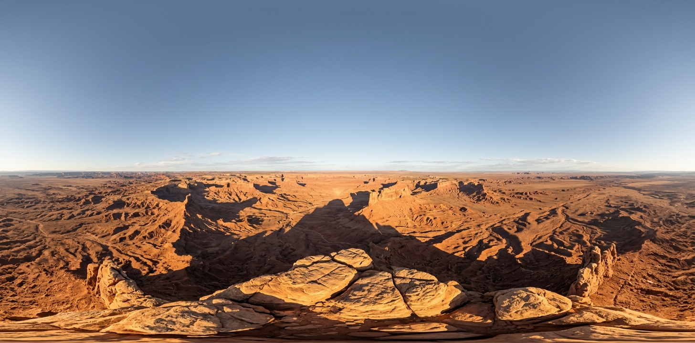

```json
{
  "{
  "图像元数据": {
    "类型": "360度等距柱状全景图",
    "投影方式": "完整球形等距柱状投影",
    "宽高比": "2:1",
    "分辨率": "超高分辨率全景"
  },
  "场景构图": {
    "地点": "纳瓦霍保留地，侵蚀平原",
    "相机位置": "奇石群正上方",
    "相机高度": "高空航拍视角，上帝视角",
    "视野范围": "水平360度，垂直180度",
    "投影行为": "正确的等距柱状畸变，确保无缝球形拼接",
    "天气状况": "晴朗，侧逆光强烈，空气极其通透",
    "景深": "全画幅锐利"
  },
  "视觉元素": {
    "前景": {
      "主体视图": "被阳光染成金橙色的破碎岩石顶部",
      "动态": "静止"
    },
    "中景主体": {
      "地形": "散布的台地、孤峰与深深的侵蚀沟壑",
      "村落": "无",
      "云雾": "地平线上若隐若现的薄云"
    },
    "背景": {
      "景观": "极目远眺下的广阔干旱荒原",
      "天空": "带有些许灰蓝调的纯净天空"
    },
    "环境氛围": {
      "地面半球": "阴影与亮面交错的红褐色大地",
      "整体氛围": "静谧、带有某种地外行星般的异域感"
    }
  },
  "渲染风格": {
    "光照": "强烈的斜向侧光，阴影边缘锐利",
    "调色": "高动态范围调色，突出光影层级",
    "质感质量": {
      "描述": "风化石材的坚硬质感，地表砂砾的细碎细节",
      "痕迹": "无人工痕迹，画面纯净，自然锐化",
      "拼接": "完美的360度无缝拼接"
    }
  },
  "约束条件": {
    "必须保留": ["纯360度全景透视", "极长阴影效果", "地貌纹理清晰"],
    "必须避免": ["奇幻色彩", "插画感", "城市元素", "人物"]
  },
  "负面提示词": ["用户界面", "抬头显示", "文本覆盖", "水印", "现代建筑", "公路", "行人", "奇幻艺术", "插图", "过度处理", "边框", "裁剪视图", "全景接缝断裂"]
}"
}
```

[原文链接](https://www.diysq.com/archives/4568)

---

### 22. 纪念碑谷：史诗般的晚霞孤峰


```json
{
  "{
  "图像元数据": {
    "类型": "360度等距柱状全景图",
    "投影方式": "完整球形等距柱状投影",
    "宽高比": "2:1",
    "分辨率": "超高分辨率全景"
  },
  "场景构图": {
    "地点": "美国，纪念碑谷 (Monument Valley)",
    "相机位置": "荒漠盆地中心",
    "相机高度": "高空航拍视角，上帝视角",
    "视野范围": "水平360度，垂直180度",
    "投影行为": "正确的等距柱状畸变，确保无缝球形拼接",
    "天气状况": "极致的日落奇观，天空中布满被晚霞染红的积云",
    "景深": "远距离全聚焦"
  },
  "视觉元素": {
    "前景": {
      "主体视图": "布满灌木与风蚀波纹的红色沙土地",
      "动态": "静止"
    },
    "中景主体": {
      "地形": "巨大的砂岩孤峰、平顶山与尖塔群",
      "村落": "无",
      "云雾": "无"
    },
    "背景": {
      "景观": "地平线上重叠的远山轮廓",
      "天空": "色彩斑斓的火烧云，极具电影感的晚霞"
    },
    "环境氛围": {
      "地面半球": "暖红色调的干旱地表",
      "整体氛围": "雄壮、苍凉、带有古典西部片的浪漫色彩"
    }
  },
  "渲染风格": {
    "光照": "极低角度的日落侧光，强烈的明暗对比",
    "调色": "浓郁的暖色调，紫色与橙红色的互补配合",
    "质感质量": {
      "描述": "岩石表面的颗粒纹理与云层的厚重感",
      "痕迹": "无人工痕迹，画面纯净，自然锐化",
      "拼接": "完美的360度无缝拼接"
    }
  },
  "约束条件": {
    "必须保留": ["纯360度全景透视", "无人机高空视角", "孤峰群分布", "高度写实摄影感"],
    "必须避免": ["现代建筑", "人物", "游戏UI设计", "绘画质感"]
  },
  "负面提示词": ["用户界面", "抬头显示", "文本覆盖", "水印", "现代设施", "车辆", "行人", "奇幻艺术", "插图", "过度处理", "边框", "裁剪视图", "全景接缝断裂"]
}"
}
```

[原文链接](https://www.diysq.com/archives/4563)

---

### 23. 悉尼港：世界级都市海港全景


```json
{
  "{
  "图像元数据": {
    "类型": "360度等距柱状全景图",
    "投影方式": "完整球形等距柱状投影",
    "宽高比": "2:1",
    "分辨率": "超高分辨率全景"
  },
  "场景构图": {
    "地点": "澳大利亚，悉尼港 (Sydney Harbour)",
    "相机位置": "港湾中心上空",
    "相机高度": "高空航拍视角，上帝视角",
    "视野范围": "水平360度，垂直180度",
    "投影行为": "正确的等距柱状畸变，确保无缝球形拼接",
    "天气状况": "晴朗，海平面上方有厚实的层积云块",
    "景深": "全聚焦摄影，背景摩天大楼清晰可见"
  },
  "视觉元素": {
    "前景": {
      "主体视图": "波光粼粼的深蓝色海港水域",
      "动态": "船只留下的白色浪花与航迹"
    },
    "中景主体": {
      "地形": "悉尼歌剧院帆体、港湾大桥框架、环形码头摩天大楼",
      "村落": "密集的城市核心区建筑群",
      "云雾": "地平线上有低空积云"
    },
    "背景": {
      "景观": "延绵的悉尼港湾海岸线与零星的城市绿地",
      "天空": "明亮清澈的湛蓝天空"
    },
    "环境氛围": {
      "地面半球": "海港与城市天际线的交汇",
      "整体氛围": "充满活力、现代且明亮的国际都市感"
    }
  },
  "渲染风格": {
    "光照": "正午强烈的散射日光，水面反射丰富",
    "调色": "高清晰度的蓝白色调，色彩鲜艳夺目",
    "质感质量": {
      "描述": "金属、玻璃与水体的极致材质区分",
      "痕迹": "无人工痕迹，画面纯净，自然锐化",
      "拼接": "完美的360度无缝拼接"
    }
  },
  "约束条件": {
    "必须保留": ["纯360度全景透视", "海港大桥与歌剧院并存", "写实摄影质感"],
    "必须避免": ["奇幻滤镜", "画意处理", "人物近景", "界面UI"]
  },
  "负面提示词": ["用户界面", "抬头显示", "文本覆盖", "水印", "模糊", "低分辨率", "奇幻艺术", "插图", "过度处理", "边框", "裁剪视图", "全景接缝断裂"]
}"
}
```

[原文链接](https://www.diysq.com/archives/4558)

---

### 24. 亚利桑那州：马蹄湾翡翠之环

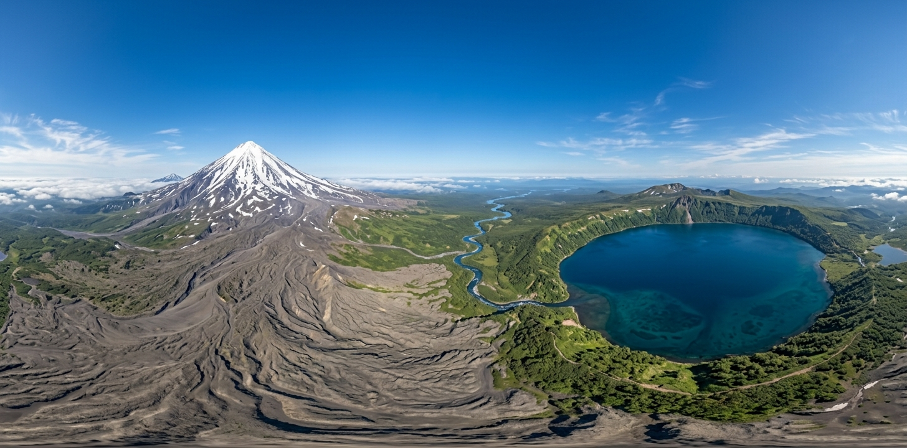

```json
{
  "{
  "图像元数据": {
    "类型": "360度等距柱状全景图",
    "投影方式": "完整球形等距柱状投影",
    "宽高比": "2:1",
    "分辨率": "超高分辨率全景"
  },
  "场景构图": {
    "地点": "亚利桑那州，马蹄湾 (Horseshoe Bend)",
    "相机位置": "峡谷边缘正上方中心",
    "相机高度": "高空航拍视角，上帝视角",
    "视野范围": "水平360度，垂直180度",
    "投影行为": "正确的等距柱状畸变，确保无缝球形拼接",
    "天气状况": "极致晴朗，午后强光，伴有高空卷云",
    "景深": "超大深景深，全幅锐利"
  },
  "视觉元素": {
    "前景": {
      "主体视图": "陡峭的砂岩峭壁边缘，带有风化裂纹和细碎砂石",
      "动态": "静止"
    },
    "中景主体": {
      "地形": "巨大的U形砂岩孤峰，科罗拉多河深切河谷形成的环绕水带",
      "村落": "无",
      "云雾": "无"
    },
    "背景": {
      "景观": "地平线上延绵不绝的平顶山与红色荒漠高原",
      "天空": "纯净的渐变深蓝色天空"
    },
    "环境氛围": {
      "地面半球": "干旱的红褐色沉积岩地貌",
      "整体氛围": "极其震撼的自然景观，宏伟且具有神圣感"
    }
  },
  "渲染风格": {
    "光照": "硬调日光，创造出岩石凹陷处的深黑色阴影",
    "调色": "高对比度自然调色，强调红土与绿水的补色关系",
    "质感质量": {
      "描述": "极致的岩石物理质感，水面具有真实的折射与透明度",
      "痕迹": "无人工痕迹，画面纯净，自然锐化",
      "拼接": "完美的360度无缝拼接"
    }
  },
  "约束条件": {
    "必须保留": ["纯360度全景透视", "无人机高空视角", "U型河道完整闭环", "高度写实摄影感"],
    "必须避免": ["城市建筑", "人物", "电影感色彩过度处理", "非全景比例"]
  },
  "负面提示词": ["用户界面", "抬头显示", "文本覆盖", "水印", "现代建筑", "桥梁", "行人", "奇幻艺术", "插图", "过度处理", "边框", "裁剪视图", "全景接缝断裂"]
}"
}
```

[原文链接](https://www.diysq.com/archives/4553)

---

### 25. 60度绝美海岛全景图：碧海、金沙与绿岛


```json
{
  "{
  "图像元数据": {
    "类型": "360度等距柱状全景图",
    "投影方式": "完整球形等距柱状投影",
    "宽高比": "2:1",
    "分辨率": "超高分辨率全景"
  },
  "场景构图": {
    "地点": "未命名的热带群岛（可能是菲律宾、印度尼西亚或泰国）",
    "相机位置": "位于中央海岛（具有沙滩的那个）前方的海面上空",
    "相机高度": "中高空航拍视角，提供广阔的上帝视角视野",
    "视野范围": "水平360度全景，垂直180度全景",
    "投影行为": "正确的等距柱状畸变，确保无缝球形拼接"
  },
  "视觉元素": {
    "前景": {
      "主体视图": "清澈见底、呈现出多种蓝绿色调的泻湖水，可以清晰地看到海底的珊瑚礁和沙质底部。",
      "动态": "平静的水面上只有微小的涟漪。"
    },
    "中景主体": {
      "地形": "中央是一个郁郁葱葱、由两部分组成的海岛，中间由一条弧形的白色沙滩连接。沙滩上郁郁葱葱，长满椰子树和各种热带植被。岛屿两侧是岩石海岸线。",
      "村落": "没有可见的村落或现代建筑。"
    },
    "背景": {
      "景观": "在远处和两侧，可以看到更多的小岛和岩石露头散落在碧蓝的大海上。",
      "天空": "广阔、蔚蓝的天空，布满柔和、羽毛状的卷云。太阳位于左上角，强烈地照耀着，形成明亮的光晕和反射。"
    },
    "环境氛围": {
      "地面半球": "主要由清澈的泻湖水、中央岛屿和散布的小岛组成。",
      "整体氛围": "宁静、天堂般、原始、度假胜地。"}
  },
  "渲染风格": {
    "光照": "强烈的阳光直接照射，营造出鲜明、生动的色彩和强烈的对比。",
    "调色": "饱和度高，碧蓝色、翠绿色、金黄色和纯白色形成鲜明对比。",
    "质感质量": {
      "描述": "超高分辨率、清晰锐利、高度写实，仿佛身临其境。",
      "痕迹": "无人工痕迹，画面纯净，自然锐化",
      "拼接": "完美的360度无缝拼接"
    }
  },
  "约束条件": {
    "必须保留": [
      "纯360度全景透视",
      "无人机中高空视角",
      "中央海岛（具有沙滩）和泻湖为核心主体",
      "无任何界面元素",
      "高度写实摄影感"
    ],
    "必须避免": [
      "城市或现代建筑",
      "人物",
      "电影感夸张灯光",
      "奇幻或游戏风格",
      "绘画或插画感",
      "非全景的普通照片布局"
    ]
  },
  "负面提示词": [
    "用户界面",
    "抬头显示",
    "文本覆盖",
    "水印",
    "现代建筑",
    "桥梁",
    "行人",
    "奇幻艺术",
    "插图",
    "过度处理",
    "边框",
    "裁剪视图",
    "全景接缝断裂"
  ]
}"
}
```

[原文链接](https://www.diysq.com/archives/4313)

---

### 26. 拉贾安帕特：360度热带群岛航拍全景


```json
{
  "{
  "图像元数据": {
    "类型": "360度等距柱状全景图",
    "投影方式": "完整球形等距柱状投影",
    "宽高比": "2:1",
    "分辨率": "超高分辨率全景"
  },
  "场景构图": {
    "地点": "拉贾安帕特群岛，印度尼西亚",
    "相机位置": "群岛中央上方，俯瞰全景",
    "相机高度": "高空航拍视角，上帝视角",
    "视野范围": "水平360度，垂直180度",
    "投影行为": "正确的等距柱状畸变，确保无缝球形拼接",
    "天气状况": "晴朗，光线充足，伴有飘渺的白云",
    "景深": "极深，所有元素清晰可见"
  },
  "视觉元素": {
    "前景": {
      "主体视图": "环绕视图的喀斯特石灰岩岛屿（覆盖着茂密的热带植被）、清澈见底的绿松石色泻湖和珊瑚礁。",
      "动态": "一艘小游船（左侧）、一艘移动的快艇（右侧）及其尾迹、潜水员（左侧）。"
    },
    "中景主体": {
      "地形": "散布在深蓝色海洋中的众多大小不一的岩石岛屿，由珊瑚礁和沙滩环绕。",
      "村落": "无",
      "云雾": "高空中的飘渺白云，增加了画面的层次感。"
    },
    "背景": {
      "景观": "远处的喀斯特群岛，在水平线上逐渐变小，融入地平线。",
      "天空": "广阔的蓝天，点缀着各种形状的白云。"
    },
    "环境氛围": {
      "地面半球": "深蓝色海洋和浅蓝色珊瑚礁泻湖，展现出丰富的水下地形。",
      "整体氛围": "壮观、宁静、原始、热带天堂。"
    }
  },
  "渲染风格": {
    "光照": "自然日光，来自左上角的明亮太阳，产生清晰的阴影和高光。",
    "调色": "鲜艳的色彩，包括深蓝色的海洋、绿松石色的泻湖、翠绿的岛屿和蓝白相间的天空。",
    "质感质量": {
      "描述": "超高分辨率照片，捕捉了岩石、植被和水面的细微细节。",
      "痕迹": "无人工痕迹，画面纯净，自然锐化。",
      "拼接": "完美的360度无缝拼接，无明显接缝。"
    }
  },
  "约束条件": {
    "必须保留": [
      "纯360度全景透视",
      "无人机高空视角",
      "喀斯特群岛为核心主体",
      "无任何界面元素",
      "高度写实摄影感",
      "绿松石色泻湖和珊瑚礁细节",
      "游船、快艇和潜水员的动态元素"
    ],
    "必须避免": [
      "城市或现代建筑",
      "大量人物（除了几个潜水员）",
      "电影感夸张灯光",
      "奇幻或游戏风格",
      "绘画或插画感",
      "非全景的普通照片布局",
      "可见的无人机操作员"
    ]
  },
  "负面提示词": [
    "用户界面",
    "抬头显示",
    "文本覆盖",
    "水印",
    "现代建筑",
    "桥梁",
    "大量行人",
    "奇幻艺术",
    "插图",
    "过度处理",
    "边框",
    "裁剪视图",
    "全景接缝断裂",
    "人工痕迹"
  ]
}"
}
```

[原文链接](https://www.diysq.com/archives/4308)

---

### 27. 拉贾安帕特喀斯特群岛高空全景

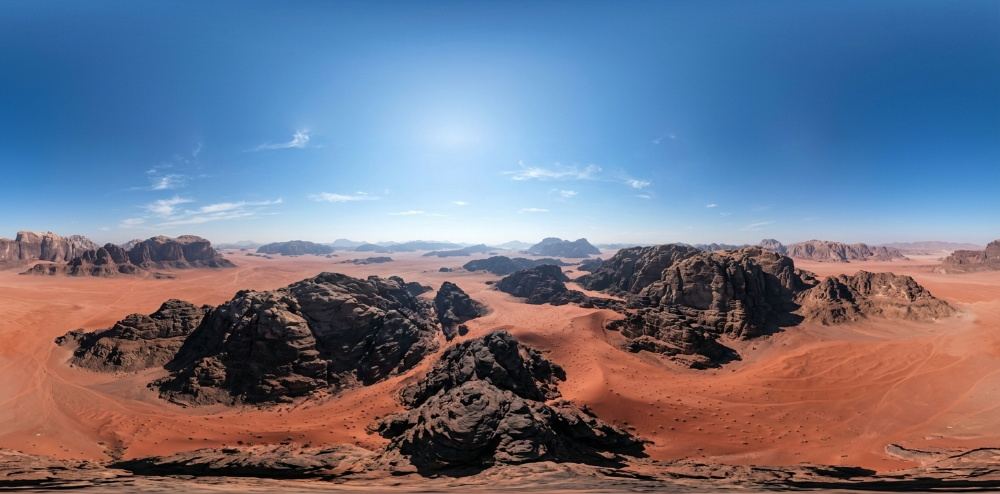

```json
{
  "{
  "图像元数据": {
    "类型": "360度等距柱状全景图",
    "投影方式": "完整球形等距柱状投影",
    "宽高比": "2:1",
    "分辨率": "超高分辨率全景"
  },
  "场景构图": {
    "地点": "拉贾安帕特群岛，印度尼西亚",
    "相机位置": "高空无人机，位于Pianemo（Piaynemo）观景台上方",
    "相机高度": "高空航拍视角，全景俯瞰",
    "视野范围": "水平360度，垂直180度",
    "投影行为": "精确的等距柱状畸变，确保无缝球形拼接",
    "天气状况": "晴空万里，微风，能见度极高",
    "景深": "深景深，全景细节清晰"
  },
  "视觉元素": {
    "前景": {
      "主体视图": "高空全景视角，下方是Pianemo观景台和木质栈道（如果可见），以及周围茂密的热带植被覆盖的喀斯特岛屿边缘。海水清澈见底，可以看到浅滩的沙底和珊瑚礁结构，颜色呈鲜艳的松石绿。",
      "动态": "平静的波纹"
    },
    "中景主体": {
      "地形": "拉贾安帕特标志性的喀斯特石灰岩岛屿群。岛屿呈不规则、锯齿状，覆盖着茂密的深绿色热带雨林。中央和右侧是较大的岛屿群，左侧是一系列较小的岛屿和礁石。岛屿周围的海水在阳光下呈现出丰富的蓝色层次：从浅滩的翡翠绿、松石绿，到深海的深蓝色和靛蓝色。在左侧较大的岛屿内部，有一个受保护的蓝色泻湖（可能是Piaynemo lagoon）。右侧岛屿形成一个马蹄形海湾，包围着深蓝色水域。",
      "村落": "无可见的现代城市，但可能有少数传统的小木船（Bangas）停靠在泻湖内或岛屿边缘（例如，在Piaynemo lagoon内可能有一条小船）。",
      "云雾": "天空中有丰富的、白色的积云（Cumulus clouds），均匀地分布在整个天穹，呈现出等距柱状投影特有的拉伸效果。"
    },
    "背景": {
      "景观": "地平线上，更遥远的喀斯特群岛和岛屿轮廓，延伸到视线尽头，与天空接壤。",
      "天空": "广阔的蓝色天空，布满白色的积云。左上角可见明亮、高高的太阳，在天空中产生强烈的眩光和晕圈（Sunburst effect）。"
    },
    "环境氛围": {
      "地面半球": "完全被清澈、多色调的海水和覆盖植被的岛屿地形所占据。",
      "整体氛围": "壮丽、宁静、热带天堂、探险、发现、自然之美、世界之巅的视角。"
    }
  },
  "渲染风格": {
    "光照": "强烈的自然日光，来自左上方的太阳。阳光在水面上产生闪烁的波纹反射（Glittering water），并强烈照亮岛屿植被。",
    "调色": "饱和度极高的自然色彩：鲜艳的深蓝、松石绿、翡翠绿、深绿（植被）、洁白（云朵）、明亮蓝（天空）。水面颜色层次丰富，过渡自然。",
    "质感质量": {
      "描述": "超高分辨率、清晰锐利、细节丰富。植被的叶片、岩石的纹理、珊瑚礁的结构、水面的波纹都清晰可见。",
      "痕迹": "无人工痕迹，画面纯净，自然锐化",
      "拼接": "完美的360度无缝拼接"
    }
  },
  "约束条件": {
    "必须保留": [
      "纯360度全景透视",
      "无人机高空视角",
      "拉贾安帕特喀斯特群岛为核心主体",
      "无任何界面元素",
      "高度写实摄影感",
      "太阳在天空中的位置和光晕"
    ],
    "必须避免": [
      "城市或现代建筑",
      "人物（除非极小的小木船）",
      "电影感夸张灯光",
      "奇幻或游戏风格",
      "绘画或插画感",
      "非全景的普通照片布局"
    ]
  },
  "负面提示词": [
    "用户界面",
    "抬头显示",
    "文本覆盖",
    "水印",
    "现代建筑",
    "桥梁",
    "行人",
    "奇幻艺术",
    "插图",
    "过度处理",
    "边框",
    "裁剪视图",
    "全景接缝断裂"
  ]
}"
}
```

[原文链接](https://www.diysq.com/archives/4302)

---

### 28. 航拍拉贾安帕特群岛：黎明时分梦幻般的喀斯特海景

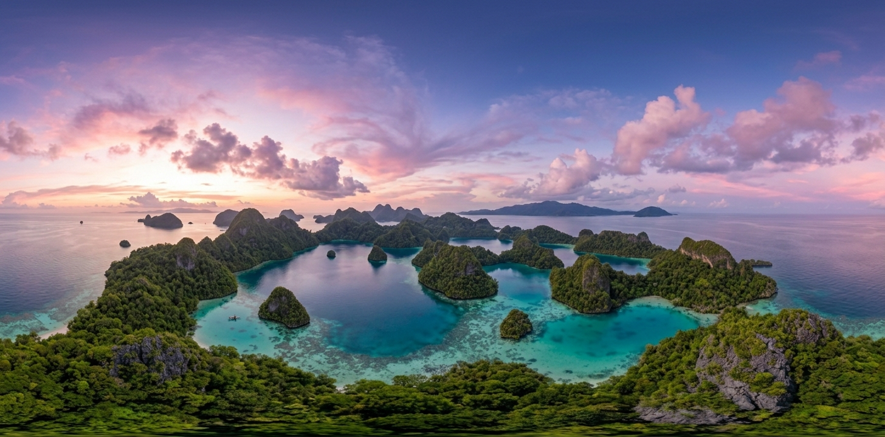

```json
{
  "{
  "图像元数据": {
    "类型": "360度等距柱状全景图",
    "投影方式": "完整球形等距柱状投影",
    "宽高比": "2:1",
    "分辨率": "超高分辨率全景"
  },
  "场景构图": {
    "地点": "拉贾安帕特群岛（Raja Ampat Islands），Piaynemo观景点附近",
    "相机位置": "位于群岛中央的高空航拍视角，上帝视角",
    "相机高度": "高空航拍",
    "视野范围": "水平360度，垂直180度",
    "投影行为": "完美的等距柱状畸变，确保无缝球形拼接",
    "天气状况": "黎明时分，多云，天空清澈但带有粉色和紫色云层",
    "景深": "全景清晰"
  },
  "视觉元素": {
    "前景": {
      "主体视图": "下方是深蓝色海水，环绕着清晰可见的珊瑚礁和浅滩（蒂芙尼蓝到浅绿过渡）",
      "动态": "平静的水面，轻微的波纹反映天空"
    },
    "中景主体": {
      "地形": "散布在深蓝海洋中的喀斯特石灰岩岛屿（Karst islands），被茂密的深绿色热带雨林覆盖",
      "关键岛屿": "包括 Piaynemo 标志性的喀斯特地貌岛屿群，以及更远的几个较大的岛屿（如Batanta岛的一部分）",
      "云雾": "黎明薄雾在远处的岛屿间萦绕"
    },
    "背景": {
      "景观": "地平线上更多的群岛，延伸至无尽的海洋",
      "天空": "广阔的黎明天空，从地平线附近的柔和粉色、紫色、橙色过渡到顶部的深蓝色。积云分布，左侧有一团更浓密的云"
    },
    "环境氛围": {
      "地面半球": "完全覆盖着海洋、珊瑚礁和岛屿，没有地面",
      "整体氛围": "宁静、壮丽、神秘、未被开发的自然奇观"
    }
  },
  "渲染风格": {
    "光照": "自然的黎明柔光，光线主要来自地平线（左侧更亮），在水面上产生柔和的反射，照亮喀斯特岛屿的侧面",
    "调色": "深蓝、蒂芙尼蓝、深绿、粉、紫、橙",
    "质感质量": {
      "描述": "高度写实、细腻的摄影质感，清晰分辨珊瑚礁、树叶和岩石纹理",
      "痕迹": "无人工痕迹，画面纯净，自然锐化",
      "拼接": "完美的360度无缝拼接，地平线和天空连接自然"
    }
  },
  "约束条件": {
    "必须保留": [
      "纯360度全景透视",
      "无人机高空视角",
      "喀斯特群岛为核心主体",
      "无任何界面元素",
      "高度写实摄影感",
      "黎明的粉紫色调天空"
    ],
    "必须避免": [
      "城市或现代建筑",
      "人物",
      "电影感夸张灯光",
      "奇幻或游戏风格",
      "绘画或插画感",
      "非全景的普通照片布局"
    ]
  },
  "负面提示词": [
    "用户界面",
    "抬头显示",
    "文本覆盖",
    "水印",
    "现代建筑",
    "桥梁",
    "行人",
    "奇幻艺术",
    "插图",
    "过度处理",
    "边框",
    "裁剪视图",
    "全景接缝断裂"
  ]
}"
}
```

[原文链接](https://www.diysq.com/archives/4297)

---

### 29. 四王群岛，360度空中全景：遗失的蓝色天堂


```json
{
  "{
  "图像元数据": {
    "类型": "360度等距柱状全景图",
    "投影方式": "完整球形等距柱状投影",
    "宽高比": "2:1",
    "分辨率": "超高分辨率全景",
    "场景": "印度尼西亚拉贾安帕特 (Raja Ampat) 瓦亚格 (Wayag) 岛屿群"
  },
  "场景构图": {
    "相机位置": "高空无人机，上帝视角，俯瞰喀斯特迷宫",
    "视野范围": "水平360度，垂直180度，完美无缝",
    "投影行为": "正确的等距柱状畸变，确保球形拼接无缝，地平线居中",
    "天气状况": "晴朗至多云，光照充足，微风",
    "景深": "全景清晰，无限远"
  },
  "视觉元素": {
    "前景地表半球 (Nadir)": {
      "描述": "郁郁葱郁的热带植被覆盖的喀斯特岩石岛屿的顶部，位于图像底部的弯曲边缘，形成视觉边界。",
      "细节": "清晰可见的石灰岩质地和茂密的绿色树冠。"
    },
    "中景主体 (Main Body)": {
      "地形": "数百个覆盖着茂密绿色热带雨林的石灰岩喀斯特岛屿，形成复杂的、不规则的岛屿迷宫，延伸至地平线。",
      "水体": "水晶般清澈、分层清晰的海洋：从岛屿周围的浅绿松石色和浅绿色（显示沙底和生机勃勃的珊瑚礁），过渡到泻湖的湛蓝色，再到更深处的深蓝色。水面有轻微的波纹。",
      "动态": "在前景左下角的一个湛蓝色泻湖中，清晰可见一艘极小的白色双体船，作为比例尺，凸显群岛的浩瀚。"
    },
    "背景地平线 (Horizon)": {
      "景观": "远处的群岛在地平线上变小，形成连续的、低矮的蓝色山脊线。天空与海洋在地平线上完美交汇。",
      "天空": "广阔的蓝色天空，布满不同类型的积云和卷云，从图像中央（天顶）向四周（地平线）扩散。云层清晰、动态。天空与海洋在地平线上完美连接。"
    }
  },
  "渲染风格": {
    "光照": "自然日光，上午或下午的阳光，光线柔和但清晰，在水面上投下微妙的光影。",
    "调色": "自然、饱和度适中、清晰。强调绿色和蓝色。水体的绿松石色、湛蓝色和深蓝色分明，岛屿的翠绿色生机勃勃，天空的蓝色清澈。",
    "质感质量": {
      "描述": "高度写实主义摄影，极致细节。",
      "痕迹": "无数字伪影，无过度的锐化，无可见的拼接接缝。画面纯净、锐利。",
      "拼接": "完美的360度无缝拼接，地平线水平。"
    }
  },
  "约束条件": {
    "必须保留": [
      "纯360度全景透视",
      "无人机高空上帝视角",
      "复杂的喀斯特岛屿迷宫为主体",
      "清晰分层的水体颜色和珊瑚礁细节",
      "无缝拼接",
      "自然、非电影感光照"
    ],
    "必须避免": [
      "城市或现代建筑",
      "大型船只或港口",
      "人群或明显的人工设施",
      "电影感夸张的灯光或滤镜",
      "任何形式的用户界面元素",
      "全景接缝断裂"
    ]
  },
  "负面提示词": [
    "用户界面",
    "抬头显示",
    "文本覆盖",
    "水印",
    "现代建筑",
    "桥梁",
    "港口",
    "大型游轮",
    "过度的颗粒",
    "裁剪视图",
    "全景接缝断裂",
    "卡通",
    "插图"
  ]
}"
}
```

[原文链接](https://www.diysq.com/archives/4292)

---

### 30. 龙目岛吉利群岛的高空无缝360全景


```json
{
  "{
  "图像元数据": {
    "类型": "360度等距柱状全景图",
    "投影方式": "完整球形等距柱状投影",
    "宽高比": "2:1",
    "分辨率": "超高分辨率全景"
  },
  "场景构图": {
    "地点": "印度尼西亚，龙目岛附近的吉利群岛 (Gili Islands)",
    "相机位置": "位于该地区主要岛屿之一的上空，靠近清澈的珊瑚礁水域",
    "相机高度": "高空无人机全景视角，俯瞰整个群岛",
    "视野范围": "水平360度，垂直180度，完全沉浸式球形视野",
    "投影行为": "完美的等距柱状畸变，确保无缝球形拼接",
    "天气状况": "晴空万里，带有白色蓬松的积云",
    "景深": "深景深，全景范围内所有元素清晰可见"
  },
  "视觉元素": {
    "前景": {
      "主体视图": "近处的清澈海洋，可清晰看到水下错综复杂的珊瑚礁和沙底；海面反射着耀眼的阳光"
    },
    "中景主体": {
      "地形": "众多覆盖着茂密热带植被的石灰岩卡斯特岛屿，点缀在海面上；一艘白色游艇正在左侧岛屿附近航行",
      "村落": "无明显村落或现代建筑，保留了原始自然的群岛风貌",
      "云雾": "无云雾"
    },
    "背景": {
      "景观": "远处的其他岛屿和海平面延展至天际线",
      "天空": "广阔的蓝色天空，布满了形状自然的白色积云"
    },
    "环境氛围": {
      "地面半球": "完全由清澈、层次丰富的海洋和海底珊瑚礁覆盖",
      "整体氛围": "宁静、壮丽、热带乐园般的沉浸感"
    }
  },
  "渲染风格": {
    "光照": "明亮的自然日光，阳光直射，照亮了水和岛屿，海面上投射出耀眼的光斑",
    "调色": "鲜艳且饱和的热带调色，强调清澈的海水和翠绿的植被",
    "质感质量": {
      "描述": "极高，珊瑚礁、植被和水面的纹理清晰可辨",
      "痕迹": "无人工痕迹，画面纯净，自然锐化",
      "拼接": "完美的360度无缝拼接"
    }
  },
  "约束条件": {
    "必须保留": [
      "纯360度全景透视",
      "无人机高空视角",
      "吉利群岛石灰岩岛屿为核心主体",
      "清澈海水和水下珊瑚礁",
      "无任何界面元素",
      "高度写实摄影感"
    ],
    "必须避免": [
      "城市或现代高楼大厦",
      "人群（仅可有船只）",
      "电影感夸张灯光",
      "奇幻或游戏风格",
      "绘画或插画感",
      "非全景的普通照片布局"
    ]
  },
  "负面提示词": [
    "用户界面",
    "抬头显示",
    "文本覆盖",
    "水印",
    "现代建筑",
    "桥梁",
    "行人",
    "奇幻艺术",
    "插图",
    "过度处理",
    "边框",
    "裁剪视图",
    "全景接缝断裂"
  ]
}"
}
```

[原文链接](https://www.diysq.com/archives/4287)

---

### 31. 光影赞歌：塞洛姆主峰的“日照金山”360度落日全景


```json
{
  "{
  "图像元数据": {
    "类型": "360度等距柱状全景图 (360 Equirectangular Panorama)",
    "投影方式": "完整球形等距柱状投影",
    "宽高比": "2:1",
    "分辨率": "极致高清摄影 (8K UHD Quality)"
  },
  "场景构图": {
    "地点": "塞洛姆山脉（Tsey-Loam），高海拔峡谷区",
    "相机位置": "中高空航拍，正对夕阳落下的方向",
    "相机高度": "上帝视角，俯瞰蜿蜒的山路与群峰",
    "视野范围": "水平360度，垂直180度，完美的天地无缝球形衔接",
    "投影行为": "正确的等距柱状畸变，前景公路在天底呈长弧线延伸，地平线居中且平稳",
    "天气状况": "极致通透的晴朗黄昏，带有微弱的云彩",
    "景深": "全景深，捕捉从近处岩石纹理到远方天际线的一切细节"
  },
  "视觉元素": {
    "前景": {
      "主体视图": "下方是深色的高山草甸，多条蜿蜒的发夹弯公路（Serpentine road）在阴影中闪烁着灰白色的光泽。",
      "动态": "大地的寂静感，与天空的光影流动形成对比。"
    },
    "中景主体": {
      "地形": "画面中心左侧是陡峭的尖峰，阳光精准地平射在主峰顶端，呈现出极其浓郁的橘金色（Alpenglow）。",
      "植被": "山脚和谷底被深绿色的森林覆盖，大部分区域已没入冷蓝色的阴影中。",
      "光源": "太阳在地平线上放射出星芒状（Sunstar）的光芒，光线横穿峡谷，产生迷人的容积光（God rays）。"
    },
    "背景": {
      "景观": "群山层峦叠嶂，远方天际线上隐约可见白雪皑皑的巅峰，在余晖下呈现出淡粉色。",
      "天空": "从落日处的亮橙色完美过渡到天顶的深宝石蓝色，散布着丝缕状的卷云。"
    },
    "环境氛围": {
      "地面半球": "冷色调的暗部阴影占据大部分地表，反衬出被阳光点亮的峰顶。",
      "整体氛围": "神圣、辉煌、壮丽，一种令人屏息的大自然时刻。"
    }
  },
  "渲染风格": {
    "光照": "剧烈的侧逆光构图。落日的星芒效果与受光面的橘红影调构成核心视觉点。",
    "调色": "高对比度的冷暖对比（Teal and Orange）。深蓝的阴影与炽热的峰顶光辉形成极强视觉张力。",
    "质感质量": {
      "描述": "岩石的每一道缝隙和树林的绒毛质感清晰可见，动态范围极高。",
      "痕迹": "纯净无暇，无镜头光斑干扰，无全景接缝感。",
      "拼接": "完美的360度无缝球形拼接"
    }
  },
  "约束条件": {
    "必须保留": [
      "日照金山的视觉奇观",
      "落日产生的星芒和射线",
      "360度全视角空间布局",
      "深邃的冷蓝色峡谷与金色峰顶的对比",
      "蜿蜒且具有投影几何感的盘山路"
    ],
    "必须避免": [
      "由于后期过度导致的色彩断层",
      "模糊的边缘细节",
      "现代工业设施或大型车辆",
      "任何导致空间沉浸感中断的拼接线"
    ]
  },
  "负面提示词": [
    "低分辨率",
    "模糊不清",
    "过饱和的假色",
    "电力塔",
    "城市杂乱感",
    "黑边",
    "拼接错位",
    "光线平淡"
  ]
}"
}
```

[原文链接](https://www.diysq.com/archives/4282)

---

### 32. 山河咏叹：塔吉姆峡谷与阿萨河的360度田园诗画

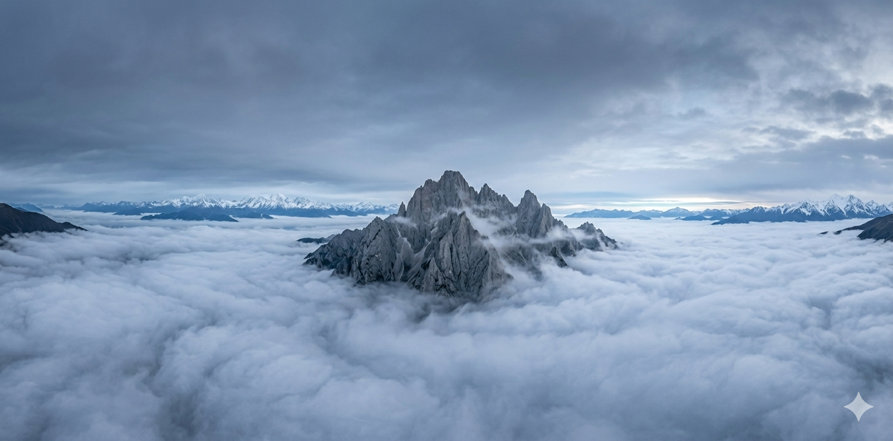

```json
{
  "{
  "图像元数据": {
    "类型": "360度等距柱状全景图 (360 Equirectangular Panorama)",
    "投影方式": "完整球形等距柱状投影",
    "宽高比": "2:1",
    "分辨率": "超高清实拍画质 (Atmospheric Aerial Photography)"
  },
  "场景构图": {
    "地点": "塞洛姆山脉 (Tsey-Loam)，高空视角俯瞰云海",
    "相机位置": "高空无人机，穿梭于云层之上",
    "相机高度": "极高空上帝视角",
    "视野范围": "水平360度，垂直180度，沉浸式空间感",
    "投影行为": "标准全景畸变，前景云雾环绕天底，地平线被群山与云海交替填满",
    "天气状况": "阴天转多云，伴有壮丽的低空云海 (Sea of Clouds)",
    "景深": "极深景深，穿过层层云雾直抵远方雪线"
  },
  "视觉元素": {
    "前景": {
      "主体视图": "下方被浓厚的、棉絮状的白云完全覆盖，云雾在山谷间流动，形成波浪般的纹理，遮挡了大部分地面细节。",
      "动态": "静止的云海奇观，仿佛时间凝固在群山之间。"
    },
    "中景主体": {
      "地形": "中心耸立着尖锐的灰色岩石主峰，山体陡峭，棱角分明，宛如从云海中破浪而出的礁石。",
      "植被": "山腰处隐约可见暗绿色的高山植被与黄褐色的山岩交错。",
      "云雾": "流云在山峰半腰处缠绕，形成丝滑的拉丝质感 (Mist-shrouded peak)。"
    },
    "背景": {
      "景观": "远方地平线上是连绵不断的雪山群，在微弱的晨光或暮色下呈现出清冷的蓝白色调。",
      "天空": "压抑而宏大的阴云天空，色彩从深灰色到浅蓝灰色，地平线处有一抹极淡的微光。"
    },
    "环境氛围": {
      "地面半球": "完全被白色的云海占据，营造出一种漂浮在虚空之中的宁静感。",
      "整体氛围": "清冷、幽静、空灵，充满超凡脱俗的禅意。"
    }
  },
  "渲染风格": {
    "光照": "柔和的散射光，无强烈阴影，强调冷色调的影调平衡 (Cool Tones)。",
    "调色": "低饱和度的蓝色与灰色调，展现出高海拔地区特有的冷冽与通透感。",
    "质感质量": {
      "描述": "云层的体积感极强，岩石表面的缝隙与纹理在冷色调下极具质感。",
      "痕迹": "无噪点，无拼接缝隙，无镜头眩光。",
      "拼接": "完美的360度无缝闭环"
    }
  },
  "约束条件": {
    "必须保留": [
      "360度全景球形视角",
      "大面积真实的低空云海",
      "从云海中突兀而出的尖锐主峰",
      "远景处的微弱雪山线条",
      "冷峻、忧郁的自然氛围"
    ],
    "必须避免": [
      "鲜艳强烈的色彩",
      "明显的太阳直射光",
      "任何现代建筑或道路（道路需被云雾遮挡）",
      "过度的锐化痕迹",
      "人物或设备阴影"
    ]
  },
  "负面提示词": [
    "饱和度过高",
    "温暖光影",
    "现代痕迹",
    "重复的纹理",
    "断层",
    "模糊不清的岩石",
    "过亮的高光",
    "非全景构图"
  ]
}"
}
```

[原文链接](https://www.diysq.com/archives/4276)

---

### 33. 暮色金顶：塞洛姆山脊的360度黄昏全景史诗

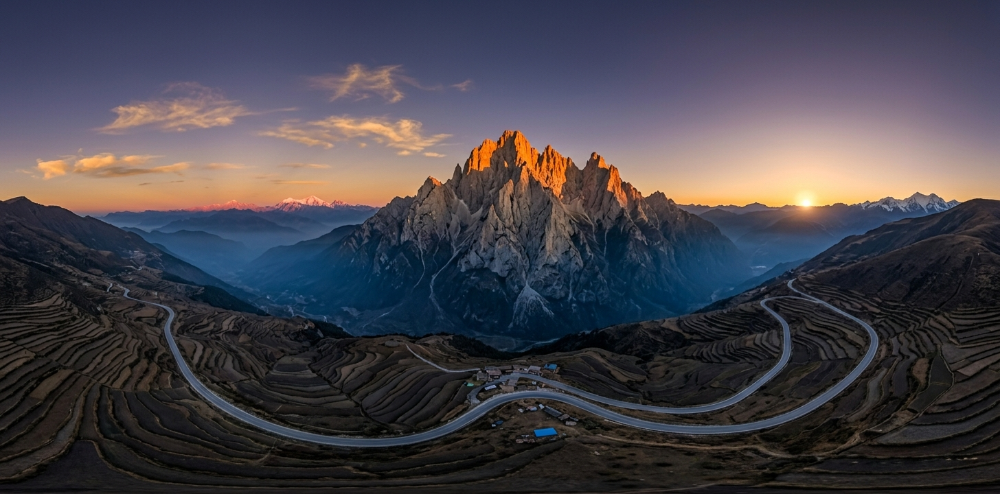

```json
{
  "{
  "图像元数据": {
    "类型": "360度等距柱状全景图 (360 Equirectangular Panorama)",
    "投影方式": "完整球形等距柱状投影",
    "宽高比": "2:1",
    "分辨率": "8K超高清摄影质感"
  },
  "场景构图": {
    "地点": "高海拔岩石山脉 (高加索或类似塞洛姆山脉地貌)",
    "相机位置": "中高空无人机悬停视角",
    "相机高度": "上帝视角 (Aerial Overlook)",
    "视野范围": "水平360度，垂直180度，全方位无死角覆盖",
    "投影行为": "完美的等距柱状畸变，地平线居中对齐，天顶与天底无缝衔接",
    "天气状况": "黄昏时分，薄云，空气通透度极高",
    "景深": "全景深，远近山峦层次清晰"
  },
  "视觉元素": {
    "前景": {
      "主体视图": "画面下方为暗褐色的高山草甸，一条灰色的盘山公路如银色丝带般在山谷间剧烈蜿蜒。道路在全景投影下呈现出优雅的弧形曲线。",
      "动态": "静谧，无车辆，强调大自然的荒凉与宏伟。"
    },
    "中景主体": {
      "地形": "中央屹立着巍峨的尖锐岩石主峰，山体由陡峭的灰岩组成，棱角分明。山脚下是平缓的黄绿色坡地。",
      "村落/建筑": "在道路拐弯处的平缓地带，隐约可见极小规模的人类定居点或营地（蓝色顶棚）。",
      "光影表现": "日照金山效果。夕阳的余晖斜射在主峰最顶端的岩壁上，呈现出明亮的橘金色，与阴影中的深蓝色山体形成强烈对比。"
    },
  "背景": {
    "景观": "远方地平线上群山起伏，最远端的雪峰被夕阳染成淡粉红色。山谷间笼罩着一层薄薄的蓝色暮霭。",
    "天空": "广阔的黄昏天空，由地平线处的暖橙色过渡到天顶的深紫色/墨蓝色，点缀着几缕被晚霞染亮的卷云。"
  },
  "环境氛围": {
    "地面半球": "深色基调的荒野，体现黄昏时分大地的沉寂感。",
    "整体氛围": "庄严、孤寂、壮丽，充满大自然的崇高感 (Sublime)。"
  }
  },
  "渲染风格": {
    "光照": "黄金时刻 (Golden Hour) 侧逆光，强调山体浮雕感。",
    "调色": "冷暖对比色调。天空的深蓝与山尖的明金形成经典互补色。",
    "质感质量": {
      "描述": "极致的岩石纹理细节，无噪点，色彩过渡细腻。",
      "痕迹": "纯净画面，无任何拍摄设备阴影或拼接错位。",
      "拼接": "360度无缝闭环"
    }
  },
  "约束条件": {
    "必须保留": [
      "360度全景等距柱状格式",
      "日照金山的视觉核心",
      "极具形式感的盘山公路",
      "冷蓝色的暮霭与暖金色的山尖对比",
      "写实主义摄影风格"
    ],
    "必须避免": [
      "现代城市景观",
      "过饱和的合成感色彩",
      "科幻或奇幻元素",
      "人物及动物近景",
      "广角镜头拉伸导致的边缘模糊"
    ]
  },
  "负面提示词": [
    "水印",
    "标志",
    "断裂的地平线",
    "拼接痕迹",
    "噪点",
    "曝光过度",
    "虚假的光晕",
    "现代电线杆",
    "围栏",
    "不自然的光影"
  ]
}"
}
```

[原文链接](https://www.diysq.com/archives/4271)

---

### 34. 360度高空无人机视角下雄伟的梯田群山


```json
{
  "{
  "图像元数据": {
    "类型": "360度等距柱状全景图",
    "投影方式": "完整球形等距柱状投影",
    "宽高比": "2:1",
    "分辨率": "超高分辨率全景"
  },
  "场景构图": {
    "地点": "高山河谷地区（例如中国西南部或喜马拉雅山脉）",
    "相机位置": "360度全景无人机",
    "相机高度": "极高的高空航拍视角（上帝视角）",
    "视野范围": "水平360度，垂直180度，完全包围",
    "投影行为": "正确的等距柱状畸变，确保无缝球形拼接，天空在顶部，地面在底部",
    "天气状况": "晴朗，有动态积云",
    "景深": "无限景深，所有元素（前景道路、中景梯田、远景山脉）都锐利清晰"
  },
  "视觉元素": {
    "前景（地面半球底部）": {
      "主体视图": "一条维护良好的铺砌沥青道路，呈极度夸张、扭曲的“U”形环绕，并连接到中景的蜿蜒道路，展示了全景投影的典型畸变。道路两侧是干旱和半干旱的灌木丛和岩石地面。",
      "动态": "无车辆，无行人，保持纯净的自然景观"
    },
    "中景主体": {
      "地形": "一座雄伟、复杂的梯田山脉系统，完全覆盖了中景的大部分区域。梯田由人工修筑，呈现出惊人的同心圆、螺旋状和锯齿状几何图案，随着山体地形起伏，非常详细和庞大。梯田本身表现出绿色（作物）和棕色（土壤/干草）交织的自然调色板。",
      "村落": "一个密集的、历史悠久的村落（石砌建筑和传统屋顶）栖息在梯田山脉的脊线和山坡上，与梯田融为一体。另一个较小的定居点位于更远的山谷深处。右侧山坡上有几座红瓦屋顶的现代建筑。",
      "云雾": "低空积云和地形云（白而蓬松）从左侧山脉上方掠过，部分遮挡了最高的山峰，增加了深度和动感。"
    },
    "背景（天际线及以上）": {
      "景观": "一系列更遥远、更黑暗的常绿森林山脉环绕着山谷，与梯田山脉形成鲜明对比。远处的山脉向地平线延伸，展示出明显的层叠效果。",
      "天空": "深蓝色、纯净的天空，带有精致的卷云和蓬松的积云。太阳位于天空的右上角（或由于全景视角而看起来像在两个位置），投射出清晰的光线和阴影。"
    },
    "环境氛围": {
      "地面半球": "完全覆盖，从最底部扭曲的道路到中景的梯田，没有空白区域。",
      "整体氛围": "史诗般、宏大、偏远、宁静、农业文明与自然的和谐，具有极强的沉浸感。"
    }
  },
  "渲染风格": {
    "光照": "明亮的自然日光，具有明确的方向性（从右/上），产生强烈的阴影和高光，强调梯田的几何结构。左侧山脉有轻微的云阴影。",
    "调色": "自然、饱和、现实的色彩：深蓝色的天空，绿色、金棕色和岩石灰色的梯田和山体，深绿色的森林。",
    "质感质量": {
      "描述": "超高细节、摄影级写实，无噪点或压缩痕迹。",
      "痕迹": "无用户界面、无文本、无水印、无现代车辆或不协调的现代设施（除了少数红顶建筑）。",
      "拼接": "完美的360度无缝拼接，无任何可见接缝。"
    }
  },
  "约束条件": {
    "必须保留": [
      "纯360度全景透视",
      "无人机高空视角",
      "梯田为核心主体",
      "无任何界面元素",
      "高度写实摄影感",
      "前景道路的扭曲畸变"
    ],
    "必须避免": [
      "城市或现代大都市建筑",
      "人物",
      "电影感夸张灯光",
      "奇幻或游戏风格",
      "绘画或插画感",
      "非全景的普通照片布局"
    ]
  },
  "负面提示词": [
    "用户界面",
    "抬头显示",
    "文本覆盖",
    "水印",
    "签名",
    "边界线",
    "裁剪",
    "普通视角",
    "2D照片",
    "现代摩天大楼",
    "大量汽车",
    "行人",
    "奇幻艺术",
    "插图",
    "低分辨率",
    "全景接缝断裂",
    "伪造全景"
  ]
}"
}
```

[原文链接](https://www.diysq.com/archives/4239)

---

### 35. 梦幻云海：黄山奇峰360度航拍全景提示词


```json
{
  "{
  "图像元数据": {
    "类型": "360度等距柱状全景图",
    "投影方式": "完整球形等距柱状投影",
    "宽高比": "2:1",
    "分辨率": "超高分辨率全景"
  },
  "场景构图": {
    "地点": "中国黄山风景区，核心景区高空",
    "相机位置": "360度全景相机，高空悬停",
    "相机高度": "高空航拍视角，上帝视角",
    "视野范围": "水平360度无缝，垂直180度覆盖天顶与天底",
    "投影行为": "精确的等距柱状投影畸变，确保无缝球形拼接，无任何裁剪或接缝",
    "天气状况": "日出时分，强烈的太阳辐射，丰富的云海和动态云雾",
    "景深": "极致深远的景深，前景清晰，远景深邃"
  },
  "视觉元素": {
    "前景": {
      "主体视图": "陡峭的花岗岩奇峰顶部和岩壁纹理，被低角度日出阳光照亮",
      "动态": "云雾在前景山谷间缓慢流动"
    },
    "中景主体": {
      "地形": "密集、垂直高耸的黄山奇峰群，覆盖着扭曲的黄山古松和灌木",
      "村落": "在左侧被光照亮的深谷中，隐藏着一个精细的、由灰瓦白墙组成的传统徽派古村落建筑群，通过古道相连",
      "云雾": "波浪状的云海填满山谷，在左侧被阳光照亮，形成金色光雾；在右侧呈现冷色调和阴影"
    },
    "背景": {
      "景观": "连绵不绝的远山在云海中时隐时现，逐渐消融在远方和阴影中",
      "天空": "广阔的蓝色天空，左侧有耀眼的日出光晕和可见的光柱；右侧天空深邃，带有稀疏的云朵"
    },
    "环境氛围": {
      "地面半球": "深度延伸至脚下的山谷，被云海和阴影覆盖",
      "整体氛围": "庄严、雄伟、梦幻、神秘的日出时刻"
    }
  },
  "渲染风格": {
    "光照": "极具戏剧性的日出光照。左侧是耀眼、温暖的直接日出光晕，伴随强烈的可见光柱；右侧是深邃、冷调的阴影，细节丰富但光线较弱",
    "调色": "金黄色和橙色的日出暖色调与深蓝色、灰色的冷色调形成强烈对比，色彩饱和度高但自然",
    "质感质量": {
      "描述": "超高分辨率、极致细节，岩石和树木纹理清晰锐利，无人工噪声",
      "痕迹": "无任何水印、标志、用户界面元素或文本覆盖，画面绝对纯净",
      "拼接": "完美的360度无缝拼接，无论是水平边缘还是垂直天顶/天底都自然过渡"
    }
  },
  "约束条件": {
    "必须保留": [
      "纯360度全景透视，覆盖完整球形空间",
      "无人机高空航拍视角",
      "黄山花岗岩奇峰和黄山松为核心地形主体",
      "左侧耀眼光晕和可见光柱的戏剧性光影布局",
      "隐藏在光照深谷中的古村落建筑群",
      "动态且丰富的云海景观",
      "高度写实的摄影质感，无水印和界面元素"
    ],
    "必须避免": [
      "城市或现代高楼建筑",
      "行人、车辆或可见的现代设施",
      "奇幻、游戏或科幻风格的非现实元素",
      "绘画、插画或卡通化质感",
      "非全景的普通照片布局或不完整的投影方式",
      "过度饱和或不自然的电影感夸张灯光",
      "任何可见的接缝、断裂或重叠痕迹"
    ]
  },
  "负面提示词": [
    "用户界面",
    "抬头显示",
    "文本覆盖",
    "水印",
    "AirPano标识",
    "现代建筑",
    "桥梁",
    "行人",
    "奇幻艺术",
    "插图",
    "过度处理",
    "边框",
    "裁剪视图",
    "全景接缝断裂",
    "人为噪点",
    "镜头光斑（除非是自然的太阳耀斑）"
  ]
}"
}
```

[原文链接](https://www.diysq.com/archives/4002)

---

### 36. 堪察加火山湖与云海全景：自然的极致壮丽


```json
{
  "{
  "图像元数据": {
    "类型": "超宽幅鸟瞰全景图 (非360度球形)",
    "投影方式": "超宽幅透视投影",
    "宽高比": "约 3:1",
    "分辨率": "超高分辨率全景"
  },
  "场景构图": {
    "地点": "堪察加半岛或类似偏远火山地区",
    "相机位置": "极高空，上帝视角鸟瞰",
    "相机高度": "高空航拍",
    "视野范围": "覆盖数百平方公里，从太平洋沿岸延伸至内陆火山群",
    "投影行为": "最小化广角畸变，保持地貌自然几何",
    "天气状况": "清澈的晴空，伴有低空海雾和高空层积云",
    "景深": "全景深，从前景森林到远景火山均清晰"
  },
  "视觉元素": {
    "前景": {
      "主体视图": "广袤的温带森林和灌木丛地毯",
      "动态": "蜿蜒的河流流向火山口湖"
    },
    "中景主体": {
      "地形": "巨大的火山口湖（蓝色水面，圆形轮廓）及其陡峭的内壁；蜿蜒、银色的河流",
      "村落": "无任何村落或现代建筑",
      "云雾": "大片低空海雾/层云，流向地平面，将森林与远山隔开"
    },
    "背景": {
      "景观": "两座主要的雪山。左侧：一座完美的、孤立的圆锥形雪火山（克柳切夫火山或其姊妹山）；右侧：一座更大、更平缓、白雪皑皑的山脉（或另一座大型火山）。两山之间是广阔的云海",
      "天空": "深蓝色、清澈的天空，带有微妙的阳光光晕"
    },
    "环境氛围": {
      "地面半球": "完全被自然植被覆盖",
      "整体氛围": "壮丽、荒凉、原始、宁静、宏大"
    }
  },
  "渲染风格": {
    "光照": "强烈的顶光，来自场景正上方偏右，形成鲜明的阴影和高光",
    "调色": "深绿色、白色（雪和云）、深蓝色（天空和湖泊）的自然、鲜艳色彩",
    "质感质量": {
      "描述": "超清晰、细腻的纹理，森林的叶片、河流的纹理、云层的层次感和雪山的细节均完美还原",
      "痕迹": "除水印外，画面纯净，无噪点，自然锐化",
      "拼接": "完美的宽幅全景拼接"
    }
  },
  "约束条件": {
    "必须保留": [
      "超宽幅全景透视",
      "无人机极高空上帝视角",
      "完美的圆锥形火山和大型火山口湖为双核心主体",
      "蜿蜒的河流",
      "大片低空海雾",
      "高度写实摄影感",
      "右下角的 'AirPano' 水印"
    ],
    "必须避免": [
      "城市或现代建筑",
      "任何人物或人造交通工具",
      "电影感夸张灯光",
      "奇幻或游戏风格",
      "绘画或插画感",
      "普通非全景照片布局"
    ]
  },
  "负面提示词": [
    "用户界面",
    "抬头显示",
    "文本覆盖（除水印）",
    "现代建筑",
    "桥梁",
    "行人",
    "车辆",
    "奇幻艺术",
    "插图",
    "过度处理",
    "边框",
    "裁剪视图",
    "拼接裂缝"
  ]
}"
}
```

[原文链接](https://www.diysq.com/archives/3997)

---

### 37. 阿尔及利亚塔西里·纳杰尔（Tassili n&#8217;Ajjer）沙漠与石林 360° 全景：壮阔的自然奇观

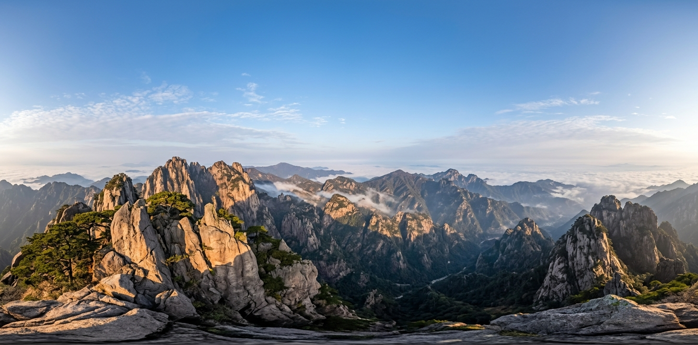

```json
{
  "{
  "图像元数据": {
    "类型": "360度等距柱状全景图",
    "投影方式": "完整球形等距柱状投影",
    "宽高比": "2:1",
    "分辨率": "超高分辨率全景"
  },
  "场景构图": {
    "地点": "阿尔及利亚，撒哈拉沙漠，塔西里·纳杰尔（Tassili n'Ajjer）国家公园",
    "相机位置": "位于一个俯瞰沙漠和石林的高处岩石悬崖边缘",
    "相机高度": "高空航拍视角，上帝视角",
    "视野范围": "水平360度，垂直180度",
    "投影行为": "正确的等距柱状畸变，确保无缝球形拼接",
    "天气状况": "晴空万里，带有羽毛状卷云",
    "景深": "全景清晰，远近皆有细节"
  },
  "视觉元素": {
    "前景": {
      "主体视图": "高空航拍视角，俯瞰由深色、风蚀严重的砂岩构成的陡峭悬崖和岩石迷宫。在左侧悬崖边缘，站立着一个渺小但清晰可见的、身穿蓝色长袍的人影，背对镜头，面向壮观的沙漠景致。岩石表面有丰富的纹理和金色沙子的沉积。",
      "动态": "静止，除了可能存在的微风"
    },
    "中景主体": {
      "地形": "广阔的金色沙丘群，沙丘曲线流畅，波纹清晰。沙丘之间分布着大量高耸、孤立的黑暗石林和岩石尖塔，形成著名的“岩石城市”景观。",
      "云雾": "无雾，天空纯净"
    },
    "背景": {
      "景观": "连绵不绝的金色沙丘海延伸至地平线，地平线有正确的等距柱状弧度。",
      "天空": "广阔的蓝色天空，布满了细腻的羽毛状和卷云纹理。太阳位于右侧，是一个耀眼的、带有光晕的光源，光线强烈。"
    },
    "环境氛围": {
      "地面半球": "完全覆盖沙丘和岩石，无缝连接。",
      "整体氛围": "宏伟、宁静、荒凉且充满探险感。强烈的光线和深邃的阴影增强了质感。"
    }
  },
  "渲染风格": {
    "光照": "强烈的阳光从右侧（或根据具体视角而定）射入，产生清晰锐利的阴影和金色沙子的反光。",
    "调色": "暖色调，主导颜色为深金色、橙色和岩石的深褐色、黑色，与蓝天形成鲜明对比。",
    "质感质量": {
      "描述": "超高分辨率，纹理细节极其丰富。岩石表面的风蚀痕迹、沙丘上的每一个沙纹、以及人影的蓝色长袍纹理都清晰可见。",
      "痕迹": "无人工痕迹，画面纯净，自然锐化",
      "拼接": "完美的360度无缝拼接"
    }
  },
  "约束条件": {
    "必须保留": [
      "纯360度全景透视",
      "无人机高空视角",
      "塔西里·纳杰尔的石林和沙丘为核心主体",
      "左侧悬崖边缘的蓝色长袍人影",
      "无任何界面元素",
      "高度写实摄影感",
      "AirPano水印在左下角（如需要）"
    ],
    "必须避免": [
      "城市或现代建筑",
      "车辆",
      "现代服装（除人影外）",
      "奇幻或游戏风格",
      "绘画或插画感",
      "非全景的普通照片布局"
    ]
  },
  "负面提示词": [
    "用户界面",
    "抬头显示",
    "文本覆盖",
    "水印（除原图外）",
    "现代建筑",
    "车辆",
    "行人",
    "奇幻艺术",
    "插图",
    "过度处理",
    "边框",
    "裁剪视图",
    "全景接缝断裂"
  ]
}"
}
```

[原文链接](https://www.diysq.com/archives/3992)

---

### 38. 极地冰雪日落，360度航拍全景提示词

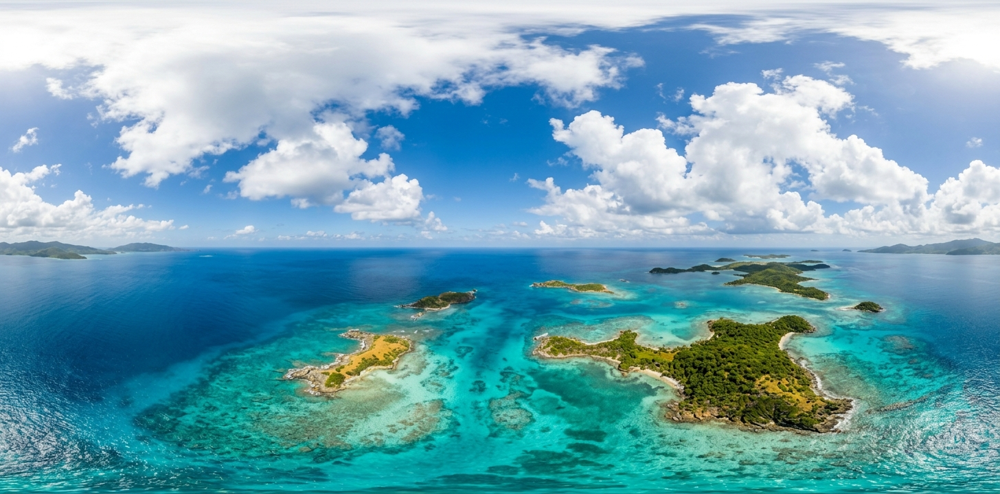

```json
{
  "{
  "图像元数据": {
    "类型": "360度等距柱状全景图",
    "投影方式": "完整球形等距柱状投影",
    "宽高比": "2:1",
    "分辨率": "超高分辨率全景"
  },
  "场景构图": {
    "地点": "极地冰封海湾",
    "相机位置": "高空航拍视角，上帝视角",
    "视野范围": "水平360度，垂直180度",
    "投影行为": "正确的等距柱状畸变，确保无缝球形拼接",
    "天气状况": "晴朗，伴有日落晚霞",
    "景深": "全景清晰"
  },
  "视觉元素": {
    "前景": {
      "主体视图": "冰封的海岸线，雪地，以及海湾中散落的小型浮冰",
      "动态": "平静的深蓝色海水"
    },
    "中景主体": {
      "地形": "白雪覆盖的岛屿和半岛，以及远处层叠的雪山",
      "村落": "无任何建筑",
      "云雾": "天空中飘浮着带有金色晚霞的云朵"
    },
    "背景": {
      "景观": "连绵不绝的冰川和雪山",
      "天空": "深蓝色天空，日落方向呈现金色和橙色晚霞"
    },
    "环境氛围": {
      "地面半球": "完全被冰雪覆盖的陆地和深蓝色海洋",
      "整体氛围": "寒冷、静谧、宏大、壮丽"
    }
  },
  "渲染风格": {
    "光照": "自然日落光，日落方向有强烈的逆光和金色光晕",
    "调色": "冷调（深蓝天空、海水、雪地阴影）与暖调（金色晚霞、日落光晕）的对比",
    "质感质量": {
      "描述": "高度写实摄影感",
      "痕迹": "右下角保留“AirPano”水印",
      "拼接": "完美的360度无缝拼接"
    }
  },
  "约束条件": {
    "必须保留": [
      "纯360度全景透视",
      "无人机高空视角",
      "极地冰雪为核心主体",
      "高度写实摄影感"
    ],
    "必须避免": [
      "城市或现代建筑",
      "人物",
      "电影感夸张灯光",
      "奇幻或游戏风格",
      "绘画或插画感",
      "非全景的普通照片布局"
    ]
  },
  "负面提示词": [
    "用户界面",
    "抬头显示",
    "文本覆盖（除原水印外）",
    "现代建筑",
    "桥梁",
    "行人",
    "奇幻艺术",
    "插图",
    "过度处理",
    "边框",
    "裁剪视图",
    "全景接缝断裂"
  ]
}"
}
```

[原文链接](https://www.diysq.com/archives/3987)

---

### 39. 云端救赎：里约基督像与日照金山全景提示词

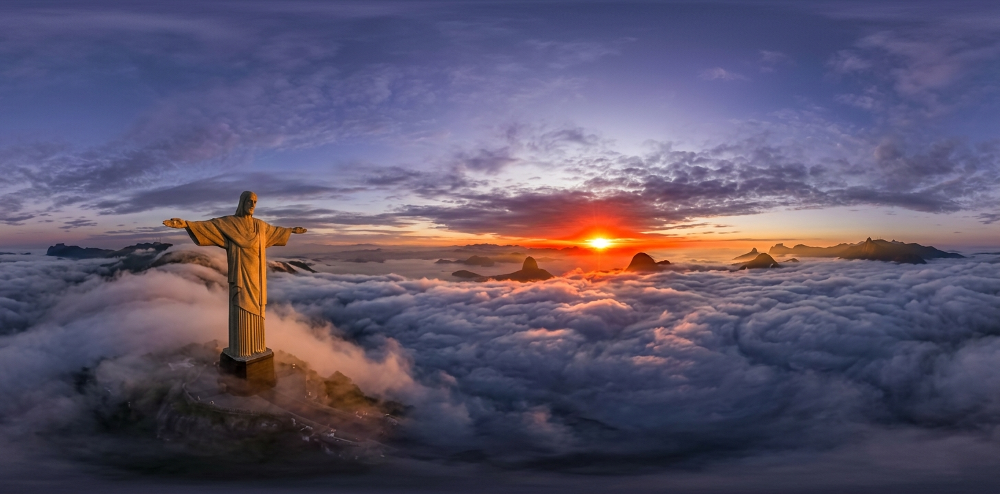

```json
{
  "{
  "图像元数据": {
    "类型": "360度等距柱状全景图",
    "投影方式": "完整球形等距柱状投影",
    "宽高比": "2:1",
    "分辨率": "超高分辨率全景"
  },
  "场景构图": {
    "地点": "巴西里约热内卢驼背山救世基督像上空",
    "相机位置": "无人机位于雕像平视略高位置，穿梭于云层上方",
    "相机高度": "高空航拍视角，云端视角",
    "视野范围": "水平360度，垂直180度",
    "投影行为": "准确的等距柱状畸变，确保全景视角完整无缺",
    "天气状况": "壮丽云海，日出时分，空气带有湿润的雾气感",
    "景深": "全景深，雕像细节与远方日出天际线均保持清晰"
  },
  "视觉元素": {
    "前景": {
      "主体视图": "救世基督像矗立在画面一侧，云雾在雕像基座周围缠绕流动",
      "动态": "云海如波浪般翻涌，具有细腻的动态纹理感"
    },
    "中景主体": {
      "地形": "隐约可见的山脊线从云海中露出，展现出地形的起伏",
      "雕像细节": "雕像表面的石材纹理受到阳光映射，呈现出温暖的色调",
      "云雾": "浓厚的层积云覆盖了整个地表，阳光穿透云层边缘产生发光效果"
    },
    "background": {
      "景观": "远方连绵的山脉在云海中若隐若现，直至无限远的地平线",
      "天空": "日出中心点迸发出强烈的橙红色光芒，向四周扩散为淡蓝色与紫色的霞光"
    },
    "环境氛围": {
      "光影表现": "强烈的日出逆光，云层顶部被染成金红色，阴影处呈现幽深的紫灰色",
      "整体氛围": "神圣、宁静、宏大，带有超现实主义的自然崇拜感"
    }
  },
  "渲染风格": {
    "光照": "真实的日出自然光照，带有明显的丁达尔效应和体积光感",
    "调色": "高动态范围色彩，饱和的橙红色与深邃的冷蓝色对比，色彩过渡自然",
    "质感质量": {
      "描述": "超写实专业全景航拍",
      "细节": "云雾的颗粒感与雕像的质感清晰可见",
      "拼接": "无缝360度物理拼接，无任何视觉断层"
    }
  },
  "约束条件": {
    "必须保留": [
      "纯360度全景透视",
      "救世基督像作为视觉锚点",
      "波澜壮阔的云海日出",
      "无缝的球形投影",
      "高度写实的摄影质感"
    ],
    "必须避免": [
      "任何形式的文字或水印",
      "城市街道细节",
      "现代交通工具",
      "虚假的人工灯光",
      "插画或低模感",
      "断裂的天际线"
    ]
  },
  "负面提示词": [
    "水印",
    "标志",
    "文本覆盖",
    "地面建筑",
    "人群",
    "低分辨率",
    "画面噪点",
    "全景拼接痕迹",
    "过度曝光导致的色彩断层",
    "科幻元素",
    "卡通风格",
    "黑色边框"
  ]
}"
}
```

[原文链接](https://www.diysq.com/archives/3977)

---

### 40. 云巅之上的自然史诗：哈尼梯田日出全景提示词


```json
{
  "{
  "图像元数据": {
    "类型": "360度等距柱状全景图",
    "投影方式": "完整球形等距柱状投影",
    "宽高比": "2:1",
    "分辨率": "超高分辨率全景"
  },
  "场景构图": {
    "地点": "壮丽的哈尼梯田核心景观区上空",
    "相机位置": "无人机位于梯田群正上方进行全景航拍",
    "相机高度": "高空航拍视角，上帝视角",
    "视野范围": "水平360度，垂直180度",
    "投影行为": "正确的等距柱状畸变，确保无缝球形拼接",
    "天气状况": "清晨破晓，带有晨雾，空气通透",
    "景深": "全景深，从近处梯田到远方山脉皆清晰"
  },
  "视觉元素": {
    "前景": {
      "主体视图": "如镜面般的水注梯田从脚下向四周蜿蜒延伸，田埂线条细腻清晰",
      "动态": "水面静谧，反射出天空微弱的晨光"
    },
    "中景主体": {
      "地形": "层层叠叠、连绵不断的阶梯状稻田，覆盖整个山谷，纹理丰富",
      "村落": "隐约可见原始的蘑菇房村落散落在梯田之间",
      "云雾": "柔和的薄雾在梯田间低垂环绕，在阳光照射下呈现半透明质感"
    },
    "背景": {
      "景观": "远方山脉重峦叠嶂，消失在晨霭之中",
      "天空": "日出时分的红霞与清澈蓝天交织，太阳光芒微微露头"
    },
    "环境氛围": {
      "地面半球": "从空中俯瞰布满水的梯田、泥土路径与自然植被",
      "整体氛围": "自然、神圣、壮观且未被现代工业破坏的农耕文明奇观"
    }
  },
  "渲染风格": {
    "光照": "清晨自然光，带有明显的侧逆光效果，光影层次丰富",
    "调色": "真实自然色彩，强调用土黄色、深绿色与反射出的天蓝色",
    "质感质量": {
      "描述": "超写实航拍摄影风格",
      "痕迹": "无人工痕迹，画面纯净，自然锐化",
      "拼接": "完美的360度无缝拼接"
    }
  },
  "约束条件": {
    "必须保留": [
      "纯360度全景透视",
      "无人机高空视角",
      "梯田为核心主体",
      "无任何界面元素",
      "高度写实摄影感"
    ],
    "必须避免": [
      "城市或现代建筑",
      "人物",
      "电影感夸张灯光",
      "奇幻或游戏风格",
      "绘画或插画感",
      "非全景的普通照片布局"
    ]
  },
  "负面提示词": [
    "用户界面",
    "抬头显示",
    "文本覆盖",
    "水印",
    "现代建筑",
    "桥梁",
    "行人",
    "奇幻艺术",
    "插图",
    "过度处理",
    "边框",
    "裁剪视图",
    "全景接缝断裂"
  ]
}"
}
```

[原文链接](https://www.diysq.com/archives/3972)

---

### 41. 上海陆家嘴黄浦江日出 360° 全景航拍

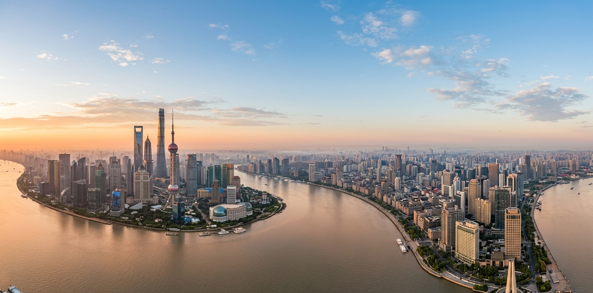

```json
{
  "{
    "图像元数据": {
        "类型": "360度等距柱状全景图",
        "投影方式": "完整球形等距柱状投影",
        "宽高比": "2:1",
        "分辨率": "超高分辨率全景"
    },
    "场景构图": {
        "拍摄地点": "上海陆家嘴黄浦江上空",
        "机位": "无人机位于黄浦江正上方超高空航拍",
        "拍摄高度": "超高空无人机视角",
        "视野范围": "水平360°，垂直180°",
        "投影特性": "正确的等距柱状畸变",
        "天气状况": "日出晴朗天气，空气通透",
        "景深": "无限景深，全景画面全程清晰"
    },
    "视觉元素": {
        "前景": {
            "核心画面": "蜿蜒的黄浦江，江面如镜面反射日出霞光，两岸城市建筑鳞次栉比",
            "细节表现": "江面的反光质感、建筑的轮廓与质感清晰自然"
        },
        "中景": {
            "地形": "陆家嘴核心摩天建筑群，东方明珠、上海中心等地标建筑林立，与黄浦江自然衔接",
            "环境细节": "摩天楼的轮廓、玻璃幕墙的反光真实自然"
        },
        "背景": {
            "远景": "上海城市天际线向远方延伸，逐渐融入晨雾",
            "天空": "日出渐变天空占据上半球，从天际线暖橙到高空淡蓝自然过渡，点缀轻薄流云"
        },
        "环境氛围": {
            "下半球视角": "从超高空俯瞰黄浦江、陆家嘴建筑群与城市天际线",
            "整体气质": "繁华壮阔的国际大都市环境，保留原生城市风貌"
        }
    },
    "渲染风格": {
        "光影": "自然日出低角度侧光，真实光影方向，建筑与江面明暗层次自然",
        "色彩调校": "真实自然色彩，日出暖橙、建筑冷灰与江面暖金平衡，还原实景质感",
        "纹理质感": {
            "描述": "超写实航拍摄影风格",
            "处理细节": "轻微自然锐化，无人工痕迹",
            "拼接要求": "无缝360度全景拼接"
        }
    },
    "约束规则": {
        "必须保留": ["纯360°全景透视", "无人机超高空航拍视角", "上海陆家嘴为核心主体", "无任何UI或界面元素", "高度写实"],
        "严格规避": ["过度夸张的奇幻效果", "人物", "电影感灯光", "插画或绘画感", "单帧构图"]
    },
    "负面提示词": ["界面元素", "抬头显示", "文字叠加", "水印", "人物", "奇幻艺术", "插画", "电影感打光", "过度高动态范围", "过度处理", "画框", "边框", "裁切画面", "全景拼接断层", "人工元素"]
}"
}
```

[原文链接](https://www.diysq.com/archives/3724)

---

### 42. 约旦瓦迪拉姆沙漠峡谷地貌正午 360° 全景航拍


```json
{
  "{
    "图像元数据": {
        "类型": "360度等距柱状全景图",
        "投影方式": "完整球形等距柱状投影",
        "宽高比": "2:1",
        "分辨率": "超高分辨率全景"
    },
    "场景构图": {
        "拍摄地点": "约旦瓦迪拉姆沙漠峡谷地貌上空",
        "机位": "无人机位于沙漠峡谷正上方高空航拍",
        "拍摄高度": "高空无人机视角",
        "视野范围": "水平360°，垂直180°",
        "投影特性": "正确的等距柱状畸变",
        "天气状况": "晴朗天气，空气通透",
        "景深": "无限景深，全景画面全程清晰"
    },
    "视觉元素": {
        "前景": {
            "核心画面": "灰褐色的峡谷岩山，轮廓硬朗，岩壁纹理清晰，与红色沙丘自然衔接",
            "细节表现": "岩山的粗糙质感、沙丘的细腻质感对比鲜明，细节真实"
        },
        "中景": {
            "地形": "广袤的红色沙漠平原，沙丘连绵起伏，向天际线无限延伸",
            "环境细节": "沙丘的流畅曲线、沙粒质感自然真实"
        },
        "背景": {
            "远景": "远方的岩山向天际线延伸，若隐若现",
            "天空": "澄澈的蓝天占据上半球，点缀少量轻薄流云，阳光明亮自然"
        },
        "环境氛围": {
            "下半球视角": "从空中俯瞰沙漠峡谷、沙丘平原与远方天际线",
            "整体气质": "辽阔苍茫的沙漠峡谷环境，无人类开发痕迹"
        }
    },
    "渲染风格": {
        "光影": "正午高角度侧光，真实光影方向，沙丘与岩山明暗层次丰富，对比自然",
        "色彩调校": "真实自然色彩，沙漠红色、岩山灰褐色与天空蓝色平衡，还原实景质感",
        "纹理质感": {
            "描述": "超写实航拍摄影风格",
            "处理细节": "轻微自然锐化，无人工痕迹",
            "拼接要求": "无缝360度全景拼接"
        }
    },
    "约束规则": {
        "必须保留": ["纯360°全景透视", "无人机高空航拍视角", "沙漠峡谷地貌为核心主体", "无任何UI或界面元素", "高度写实"],
        "严格规避": ["城市或人工建筑", "人物", "电影感灯光", "奇幻风格", "插画或绘画感", "单帧构图"]
    },
    "负面提示词": ["界面元素", "抬头显示", "文字叠加", "水印", "建筑", "人物", "奇幻艺术", "插画", "电影感打光", "过度高动态范围", "过度处理", "画框", "边框", "裁切画面", "全景拼接断层", "人工元素"]
}"
}
```

[原文链接](https://www.diysq.com/archives/3718)

---

### 43. 黄山花岗岩峰林云海 360° 全景航拍


```json
{
  "{
    "图像元数据": {
        "类型": "360度等距柱状全景图",
        "投影方式": "完整球形等距柱状投影",
        "宽高比": "2:1",
        "分辨率": "超高分辨率全景"
    },
    "场景构图": {
        "拍摄地点": "黄山花岗岩峰林地貌上空",
        "机位": "无人机位于奇峰正上方高空航拍",
        "拍摄高度": "高空无人机视角",
        "视野范围": "水平360°，垂直180°",
        "投影特性": "正确的等距柱状畸变",
        "天气状况": "晴朗云海天气，空气通透",
        "景深": "无限景深，全景画面全程清晰"
    },
    "视觉元素": {
        "前景": {
            "核心画面": "陡峭的花岗岩峰林，岩壁纹理与节理清晰，日光照射下呈现暖橙与深灰的明暗对比，立体轮廓极致突出",
            "细节表现": "花岗岩岩壁的质感与光影层次清晰自然"
        },
        "中景": {
            "地形": "层叠错落的峰林峡谷，纵深极强，山间萦绕流动云海",
            "植被细节": "山体缝隙生长的黄山松姿态苍劲，与岩石形成自然对比"
        },
        "背景": {
            "远景": "远方层叠的山脉向天际线延伸，逐渐融入云海",
            "天空": "澄澈的蓝天占据上半球，点缀少量轻薄流云，光线明亮自然"
        },
        "环境氛围": {
            "下半球视角": "从空中俯瞰花岗岩峰林、峡谷与远山云海",
            "整体气质": "原始奇峻的山岳地貌环境，无人类开发痕迹"
        }
    },
    "渲染风格": {
        "光影": "自然白日侧光，柔和真实光影，山体明暗层次自然",
        "色彩调校": "真实自然色彩，岩石暖橙、深灰与天空蓝平衡，还原实景质感",
        "纹理质感": {
            "描述": "超写实航拍摄影风格",
            "处理细节": "轻微自然锐化，无人工痕迹",
            "拼接要求": "无缝360度全景拼接"
        }
    },
    "约束规则": {
        "必须保留": ["纯360°全景透视", "无人机高空航拍视角", "黄山奇峰为核心主体", "无任何UI或界面元素", "高度写实"],
        "严格规避": ["城市或人工建筑", "人物", "电影感灯光", "奇幻风格", "插画或绘画感", "单帧构图"]
    },
    "负面提示词": ["界面元素", "抬头显示", "文字叠加", "水印", "建筑", "人物", "奇幻艺术", "插画", "电影感打光", "过度高动态范围", "过度处理", "画框", "边框", "裁切画面", "全景拼接断层", "人工元素"]
}"
}
```

[原文链接](https://www.diysq.com/archives/3713)

---

### 44. 堪察加半岛火山与火山湖 360° 全景航拍

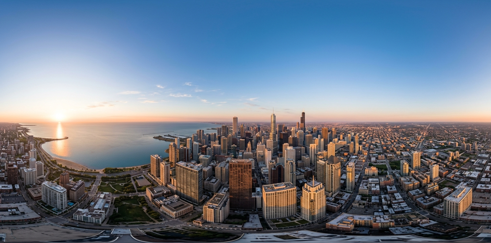

```json
{
  "{
    "图像元数据": {
        "类型": "360度等距柱状全景图",
        "投影方式": "完整球形等距柱状投影",
        "宽高比": "2:1",
        "分辨率": "超高分辨率全景"
    },
    "场景构图": {
        "拍摄地点": "堪察加半岛火山与火山湖上空",
        "机位": "无人机位于火山正上方超高空航拍",
        "拍摄高度": "超高空无人机视角",
        "视野范围": "水平360°，垂直180°",
        "投影特性": "正确的等距柱状畸变",
        "天气状况": "晴朗天气，空气通透",
        "景深": "无限景深，全景画面全程清晰"
    },
    "视觉元素": {
        "前景": {
            "核心画面": "右侧的火山湖，深邃湛蓝，被绿色火山植被环绕，蜿蜒河流从火山脚下流向远方",
            "细节表现": "火山湖的通透质感、植被的层次、河流的蜿蜒曲线清晰自然"
        },
        "中景": {
            "地形": "绿色的火山植被覆盖着火山脚下，与火山湖、河流自然衔接",
            "环境细节": "植被的质感、河流的水体质感真实自然"
        },
        "背景": {
            "远景": "左侧的锥形火山，山顶积雪覆盖，轮廓完美对称，远方云海缭绕",
            "天空": "澄澈的蓝天占据上半球，点缀少量轻薄流云，阳光明亮自然"
        },
        "环境氛围": {
            "下半球视角": "从超高空俯瞰火山湖、河流与锥形火山",
            "整体气质": "原始壮阔的火山地貌环境，无人类开发痕迹"
        }
    },
    "渲染风格": {
        "光影": "自然白日侧光，真实光影方向，火山与湖面明暗层次自然",
        "色彩调校": "真实自然色彩，火山深灰与白色积雪、湖水湛蓝、植被翠绿平衡，还原实景质感",
        "纹理质感": {
            "描述": "超写实航拍摄影风格",
            "处理细节": "轻微自然锐化，无人工痕迹",
            "拼接要求": "无缝360度全景拼接"
        }
    },
    "约束规则": {
        "必须保留": ["纯360°全景透视", "无人机超高空航拍视角", "火山与火山湖为核心主体", "无任何UI或界面元素", "高度写实"],
        "严格规避": ["城市或人工建筑", "人物", "电影感灯光", "奇幻风格", "插画或绘画感", "单帧构图"]
    },
    "负面提示词": ["界面元素", "抬头显示", "文字叠加", "水印", "建筑", "人物", "奇幻艺术", "插画", "电影感打光", "过度高动态范围", "过度处理", "画框", "边框", "裁切画面", "全景拼接断层", "人工元素"]
}"
}
```

[原文链接](https://www.diysq.com/archives/3708)

---

### 45. 阿尔及利亚撒哈拉沙漠峡谷地貌正午 360° 全景航拍

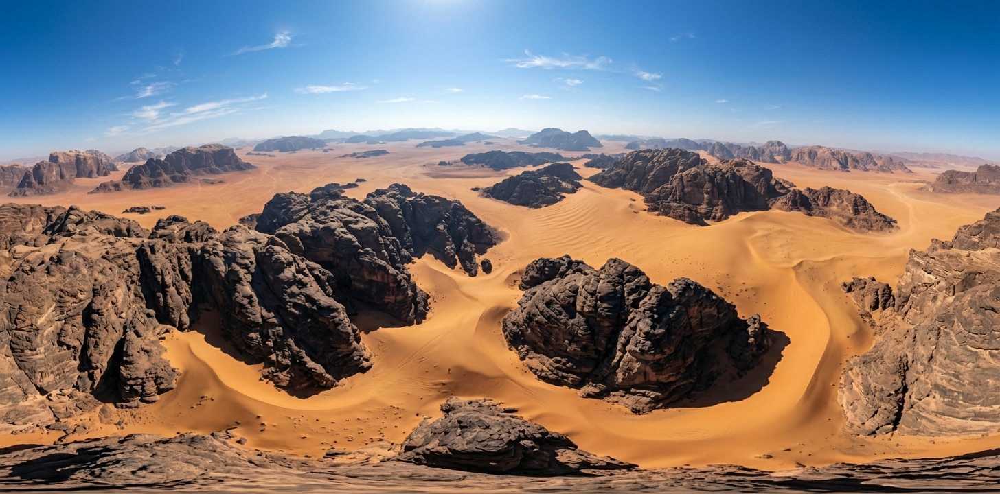

```json
{
  "{
    "图像元数据": {
        "类型": "360度等距柱状全景图",
        "投影方式": "完整球形等距柱状投影",
        "宽高比": "2:1",
        "分辨率": "超高分辨率全景"
    },
    "场景构图": {
        "拍摄地点": "阿尔及利亚撒哈拉沙漠峡谷地貌上空",
        "机位": "无人机位于沙漠峡谷正上方高空航拍",
        "拍摄高度": "高空无人机视角",
        "视野范围": "水平360°，垂直180°",
        "投影特性": "正确的等距柱状畸变",
        "天气状况": "晴朗天气，空气通透",
        "景深": "无限景深，全景画面全程清晰"
    },
    "视觉元素": {
        "前景": {
            "核心画面": "深色的峡谷岩山，轮廓硬朗，岩壁纹理清晰，与金色沙丘自然衔接",
            "细节表现": "岩山的粗糙质感、沙丘的细腻质感对比鲜明，细节真实"
        },
        "中景": {
            "地形": "广袤的金色沙漠平原，沙丘连绵起伏，向天际线无限延伸",
            "环境细节": "沙丘的流畅曲线、沙粒质感自然真实"
        },
        "背景": {
            "远景": "远方的岩山向天际线延伸，若隐若现",
            "天空": "澄澈的蓝天占据上半球，点缀少量轻薄流云，阳光明亮自然"
        },
        "环境氛围": {
            "下半球视角": "从空中俯瞰沙漠峡谷、沙丘平原与远方天际线",
            "整体气质": "辽阔苍茫的沙漠峡谷环境，无人类开发痕迹"
        }
    },
    "渲染风格": {
        "光影": "正午高角度侧光，真实光影方向，沙丘与岩山明暗层次丰富，对比自然",
        "色彩调校": "真实自然色彩，沙漠金色、岩山深灰色与天空蓝色平衡，还原实景质感",
        "纹理质感": {
            "描述": "超写实航拍摄影风格",
            "处理细节": "轻微自然锐化，无人工痕迹",
            "拼接要求": "无缝360度全景拼接"
        }
    },
    "约束规则": {
        "必须保留": ["纯360°全景透视", "无人机高空航拍视角", "沙漠峡谷地貌为核心主体", "无任何UI或界面元素", "高度写实"],
        "严格规避": ["城市或人工建筑", "人物", "电影感灯光", "奇幻风格", "插画或绘画感", "单帧构图"]
    },
    "负面提示词": ["界面元素", "抬头显示", "文字叠加", "水印", "建筑", "人物", "奇幻艺术", "插画", "电影感打光", "过度高动态范围", "过度处理", "画框", "边框", "裁切画面", "全景拼接断层", "人工元素"]
}"
}
```

[原文链接](https://www.diysq.com/archives/3702)

---

### 46. 南极半岛冰雪海湾日出 360° 全景航拍

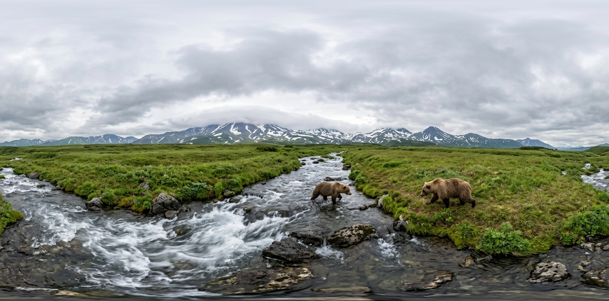

```json
{
  "{
    "图像元数据": {
        "类型": "360度等距柱状全景图",
        "投影方式": "完整球形等距柱状投影",
        "宽高比": "2:1",
        "分辨率": "超高分辨率全景"
    },
    "场景构图": {
        "拍摄地点": "南极半岛冰雪海湾上空",
        "机位": "无人机位于海湾正上方超高空航拍",
        "拍摄高度": "超高空无人机视角",
        "视野范围": "水平360°，垂直180°",
        "投影特性": "正确的等距柱状畸变",
        "天气状况": "日出晴朗天气，空气通透",
        "景深": "无限景深，全景画面全程清晰"
    },
    "视觉元素": {
        "前景": {
            "核心画面": "两侧的冰雪半岛，纯白积雪覆盖崎岖海岸线，与深邃蓝绿色海水形成强烈色彩对比，海面漂浮零星碎冰",
            "细节表现": "冰雪的细腻质感、海水的通透质感、碎冰的轮廓清晰自然"
        },
        "中景": {
            "地形": "开阔的海湾，海水深邃平静，与冰雪半岛自然衔接",
            "环境细节": "海水的光影层次、碎冰的分布真实自然"
        },
        "背景": {
            "远景": "连绵的雪山山脉向天际线延伸，山顶积雪覆盖，轮廓清晰",
            "天空": "日出渐变天空占据上半球，从天际线暖橙到高空澄澈蓝自然过渡，点缀蓬松的白色积云"
        },
        "环境氛围": {
            "下半球视角": "从超高空俯瞰冰雪半岛、海湾与雪山山脉",
            "整体气质": "纯净壮阔的极地冰雪环境，无人类开发痕迹"
        }
    },
    "渲染风格": {
        "光影": "自然日出低角度侧光，真实光影方向，冰雪与海水明暗层次自然",
        "色彩调校": "真实自然色彩，暖金色日出光、白色冰雪与蓝绿色海水平衡，还原实景质感",
        "纹理质感": {
            "描述": "超写实航拍摄影风格",
            "处理细节": "轻微自然锐化，无人工痕迹",
            "拼接要求": "无缝360度全景拼接"
        }
    },
    "约束规则": {
        "必须保留": ["纯360°全景透视", "无人机超高空航拍视角", "南极冰雪海湾为核心主体", "无任何UI或界面元素", "高度写实"],
        "严格规避": ["城市或人工建筑", "人物", "电影感灯光", "奇幻风格", "插画或绘画感", "单帧构图"]
    },
    "负面提示词": ["界面元素", "抬头显示", "文字叠加", "水印", "建筑", "人物", "奇幻艺术", "插画", "电影感打光", "过度高动态范围", "过度处理", "画框", "边框", "裁切画面", "全景拼接断层", "人工元素"]
}"
}
```

[原文链接](https://www.diysq.com/archives/3698)

---

### 47. 约旦瓦迪拉姆沙漠峡谷地貌正午 360° 全景航拍

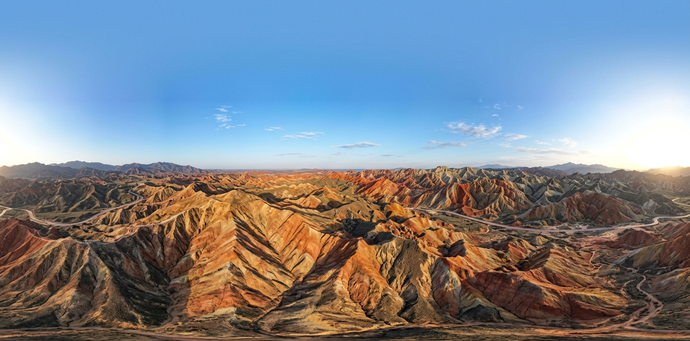

```json
{
  "{
    "图像元数据": {
        "类型": "360度等距柱状全景图",
        "投影方式": "完整球形等距柱状投影",
        "宽高比": "2:1",
        "分辨率": "超高分辨率全景"
    },
    "场景构图": {
        "拍摄地点": "约旦瓦迪拉姆沙漠峡谷地貌上空",
        "机位": "无人机位于沙漠峡谷正上方高空航拍",
        "拍摄高度": "高空无人机视角",
        "视野范围": "水平360°，垂直180°",
        "投影特性": "正确的等距柱状畸变",
        "天气状况": "晴朗天气，空气通透",
        "景深": "无限景深，全景画面全程清晰"
    },
    "视觉元素": {
        "前景": {
            "核心画面": "黑色的峡谷岩山，轮廓硬朗，岩壁纹理清晰，与红色沙丘自然衔接",
            "细节表现": "岩山的粗糙质感、沙丘的细腻质感对比鲜明，细节真实"
        },
        "中景": {
            "地形": "广袤的红色沙漠平原，沙丘连绵起伏，向天际线无限延伸",
            "环境细节": "沙丘的流畅曲线、沙粒质感自然真实"
        },
        "背景": {
            "远景": "远方的岩山向天际线延伸，若隐若现",
            "天空": "澄澈的蓝天占据上半球，点缀少量轻薄流云，阳光明亮自然"
        },
        "环境氛围": {
            "下半球视角": "从空中俯瞰沙漠峡谷、沙丘平原与远方天际线",
            "整体气质": "辽阔苍茫的沙漠峡谷环境，无人类开发痕迹"
        }
    },
    "渲染风格": {
        "光影": "正午高角度侧光，真实光影方向，沙丘与岩山明暗层次丰富，对比自然",
        "色彩调校": "真实自然色彩，沙漠红色、岩山黑灰色与天空蓝色平衡，还原实景质感",
        "纹理质感": {
            "描述": "超写实航拍摄影风格",
            "处理细节": "轻微自然锐化，无人工痕迹",
            "拼接要求": "无缝360度全景拼接"
        }
    },
    "约束规则": {
        "必须保留": ["纯360°全景透视", "无人机高空航拍视角", "沙漠峡谷地貌为核心主体", "无任何UI或界面元素", "高度写实"],
        "严格规避": ["城市或人工建筑", "人物", "电影感灯光", "奇幻风格", "插画或绘画感", "单帧构图"]
    },
    "负面提示词": ["界面元素", "抬头显示", "文字叠加", "水印", "建筑", "人物", "奇幻艺术", "插画", "电影感打光", "过度高动态范围", "过度处理", "画框", "边框", "裁切画面", "全景拼接断层", "人工元素"]
}"
}
```

[原文链接](https://www.diysq.com/archives/3692)

---

### 48. 里约热内卢基督像云海日出 360° 全景航拍


```json
{
  "{
    "图像元数据": {
        "类型": "360度等距柱状全景图",
        "投影方式": "完整球形等距柱状投影",
        "宽高比": "2:1",
        "分辨率": "超高分辨率全景"
    },
    "场景构图": {
        "拍摄地点": "埃塞俄比亚亚的斯亚贝巴上空",
        "机位": "无人机位于城市正上方超高空航拍",
        "拍摄高度": "超高空无人机视角",
        "视野范围": "水平360°，垂直180°",
        "投影特性": "正确的等距柱状畸变",
        "天气状况": "晴朗天气，空气通透",
        "景深": "无限景深，全景画面全程清晰"
    },
    "视觉元素": {
        "前景": {
            "核心画面": "密集的城市建筑群，红褐色屋顶与绿色城市公园形成强烈色彩对比，规整道路与绿地自然衔接",
            "细节表现": "建筑群的轮廓、屋顶质感、公园植被层次清晰自然"
        },
        "中景": {
            "地形": "开阔的城市公园与城市道路，植被郁郁葱葱，道路规整有序",
            "环境细节": "公园的绿意、道路的线条真实自然"
        },
        "背景": {
            "远景": "连绵的高原山峦向天际线延伸，轮廓清晰",
            "天空": "澄澈的蓝天占据上半球，点缀蓬松的白色积云"
        },
        "环境氛围": {
            "下半球视角": "从超高空俯瞰城市建筑群、公园与高原山峦",
            "整体气质": "开阔质朴的高原城市环境，保留原生城市风貌"
        }
    },
    "渲染风格": {
        "光影": "自然白日顺光，真实光影方向，城市与山峦明暗层次自然",
        "色彩调校": "真实自然色彩，红褐色建筑、绿色公园与蓝色天空平衡，还原实景质感",
        "纹理质感": {
            "描述": "超写实航拍摄影风格",
            "处理细节": "轻微自然锐化，无人工痕迹",
            "拼接要求": "无缝360度全景拼接"
        }
    },
    "约束规则": {
        "必须保留": ["纯360°全景透视", "无人机超高空航拍视角", "亚的斯亚贝巴城市风貌为核心主体", "无任何UI或界面元素", "高度写实"],
        "严格规避": ["过度夸张的奇幻效果", "人物", "电影感灯光", "插画或绘画感", "单帧构图"]
    },
    "负面提示词": ["界面元素", "抬头显示", "文字叠加", "水印", "人物", "奇幻艺术", "插画", "电影感打光", "过度高动态范围", "过度处理", "画框", "边框", "裁切画面", "全景拼接断层", "人工元素"]
}"
}
```

[原文链接](https://www.diysq.com/archives/3686)

---

### 49. 云南元阳梯田日出 360° 全景航拍

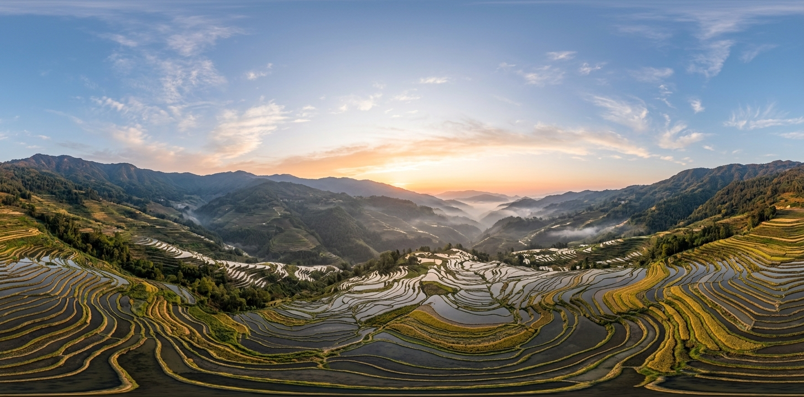

```json
{
  "{
    "图像元数据": {
        "类型": "360度等距柱状全景图",
        "投影方式": "完整球形等距柱状投影",
        "宽高比": "2:1",
        "分辨率": "超高分辨率全景"
    },
    "场景构图": {
        "拍摄地点": "云南元阳梯田上空",
        "机位": "无人机位于梯田正上方超高空航拍",
        "拍摄高度": "超高空无人机视角",
        "视野范围": "水平360°，垂直180°",
        "投影特性": "正确的等距柱状畸变",
        "天气状况": "日出晨雾天气，空气通透",
        "景深": "无限景深，全景画面全程清晰"
    },
    "视觉元素": {
        "前景": {
            "核心画面": "层层叠叠的梯田，田埂线条如大地脉络蜿蜒，灌满水的梯田如镜面反射天光，与金黄植被形成强烈色彩对比",
            "细节表现": "梯田的曲线轮廓、水面反光、植被质感清晰自然"
        },
        "中景": {
            "地形": "连绵的山峦与梯田自然衔接，山间萦绕轻薄晨雾",
            "环境细节": "山峦的起伏纹理、晨雾的朦胧质感真实自然"
        },
        "背景": {
            "远景": "远方的山峦向天际线延伸，逐渐融入晨雾",
            "天空": "日出渐变天空占据上半球，从天际线暖橙到高空淡蓝自然过渡，点缀轻薄流云"
        },
        "环境氛围": {
            "下半球视角": "从超高空俯瞰梯田、山峦与晨雾",
            "整体气质": "静谧治愈的东方田园环境，无大规模人类开发痕迹"
        }
    },
    "渲染风格": {
        "光影": "自然日出低角度侧光，真实光影方向，梯田与山峦明暗层次自然",
        "色彩调校": "真实自然色彩，暖金色植被、镜面反光与天空渐变色调平衡，还原实景质感",
        "纹理质感": {
            "描述": "超写实航拍摄影风格",
            "处理细节": "轻微自然锐化，无人工痕迹",
            "拼接要求": "无缝360度全景拼接"
        }
    },
    "约束规则": {
        "必须保留": ["纯360°全景透视", "无人机超高空航拍视角", "元阳梯田为核心主体", "无任何UI或界面元素", "高度写实"],
        "严格规避": ["城市或密集人工建筑", "人物", "电影感灯光", "奇幻风格", "插画或绘画感", "单帧构图"]
    },
    "负面提示词": ["界面元素", "抬头显示", "文字叠加", "水印", "密集城市建筑", "人物", "奇幻艺术", "插画", "电影感打光", "过度高动态范围", "过度处理", "画框", "边框", "裁切画面", "全景拼接断层", "人工元素"]
}"
}
```

[原文链接](https://www.diysq.com/archives/3680)

---

### 50. 安第斯高原地热池与湖泊 360° 全景航拍


```json
{
  "{
    "图像元数据": {
        "类型": "360度等距柱状全景图",
        "投影方式": "完整球形等距柱状投影",
        "宽高比": "2:1",
        "分辨率": "超高分辨率全景"
    },
    "场景构图": {
        "拍摄地点": "安第斯高原地热池与湖泊上空",
        "机位": "无人机位于高原地热池正上方超高空航拍",
        "拍摄高度": "超高空无人机视角",
        "视野范围": "水平360°，垂直180°",
        "投影特性": "正确的等距柱状畸变",
        "天气状况": "阴天多云天气，空气通透",
        "景深": "无限景深，全景画面全程清晰"
    },
    "视觉元素": {
        "前景": {
            "核心画面": "右侧的地热池群，白色矿物质沉积形成环形轮廓，池内水体深邃黑色，与黄色苔原形成强烈色彩对比；左侧大型高原湖泊，水面平静如镜",
            "细节表现": "地热池的环形轮廓、矿物质质感、湖泊水面质感清晰自然"
        },
        "中景": {
            "地形": "金黄的高原苔原草甸，与地热池、湖泊自然衔接，植被层次丰富",
            "环境细节": "苔原的细腻质感、植被的层次真实自然"
        },
        "背景": {
            "远景": "雪山山脉向天际线延伸，若隐若现",
            "天空": "多云的灰蓝色天空占据上半球，云层厚重，光线均匀柔和"
        },
        "环境氛围": {
            "下半球视角": "从超高空俯瞰地热池群、高原湖泊与雪山山脉",
            "整体气质": "神秘独特的安第斯高原地热环境，无人类开发痕迹"
        }
    },
    "渲染风格": {
        "光影": "阴天均匀柔光，真实光影方向，明暗过渡自然柔和",
        "色彩调校": "真实自然色彩，白色矿物质、黑色池水、黄色苔原与蓝色湖泊平衡，还原实景质感",
        "纹理质感": {
            "描述": "超写实航拍摄影风格",
            "处理细节": "轻微自然锐化，无人工痕迹",
            "拼接要求": "无缝360度全景拼接"
        }
    },
    "约束规则": {
        "必须保留": ["纯360°全景透视", "无人机超高空航拍视角", "地热池与湖泊为核心主体", "无任何UI或界面元素", "高度写实"],
        "严格规避": ["城市或人工建筑", "人物", "电影感灯光", "奇幻风格", "插画或绘画感", "单帧构图"]
    },
    "负面提示词": ["界面元素", "抬头显示", "文字叠加", "水印", "建筑", "人物", "奇幻艺术", "插画", "电影感打光", "过度高动态范围", "过度处理", "画框", "边框", "裁切画面", "全景拼接断层", "人工元素"]
}"
}
```

[原文链接](https://www.diysq.com/archives/3655)

---

<p align='center'>Made with ❤️ by <a href='https://www.diysq.com'>绘梦拾光</a></p>