<div align="center">

</div>
<p align="center">
<b>🌍 GPT Image / DALL·E 360° 全景 AI 提示词合集</b><br/>
<i>精选全景视角提示词 · 涵盖山川、水域、城市、星空等多种场景 · JSON 格式开箱即用</i>
</p>
<div align="center">

| 🖼️ 案例总数 | 📋 JSON 提示词 | 🌐 高清配图 | 📂 分类数 |
|:---:|:---:|:---:|:---:|
| **153** | **132** | **153** | **7** |

</div>
<div align="center">
<details>
<summary><b>📂 快速跳转分类</b></summary>

| | | |
|:---:|:---:|:---:|
| [**🌊 水域** <sup>(58)</sup>](#%F0%9F%8C%8A%20%E6%B0%B4%E5%9F%9F) | [**🏔️ 山川** <sup>(57)</sup>](#%F0%9F%8F%94%EF%B8%8F%20%E5%B1%B1%E5%B7%9D) | [**🎨 其他** <sup>(16)</sup>](#%F0%9F%8E%A8%20%E5%85%B6%E4%BB%96) |
| [**❄️ 雪境** <sup>(7)</sup>](#%E2%9D%84%EF%B8%8F%20%E9%9B%AA%E5%A2%83) | [**🏙️ 城市** <sup>(7)</sup>](#%F0%9F%8F%99%EF%B8%8F%20%E5%9F%8E%E5%B8%82) | [**🌸 春景** <sup>(4)</sup>](#%F0%9F%8C%B8%20%E6%98%A5%E6%99%AF) |
| [**🌲 森林** <sup>(4)</sup>](#%F0%9F%8C%B2%20%E6%A3%AE%E6%9E%97) |  |  |
</details>
</div>
<details>
<summary><b>📖 如何使用这些提示词？</b></summary>

> 💡 所有提示词均为 **JSON 格式**，可直接复制到 GPT Image / DALL·E 等 AI 绘图工具中使用。

```
1. 浏览下方画廊，找到感兴趣的全景场景
2. 点击 "📋 查看提示词" 展开核心参数
3. 点击 "📄 完整 JSON" 链接下载原始提示词文件
4. 复制 JSON 到 AI 绘图工具生成你的 360° 全景作品
```

</details>


<div align="center">
<h2 id="%F0%9F%8C%8A%20%E6%B0%B4%E5%9F%9F"></h2>
</div>
<div align="center">
<a href="images/case004/output.png">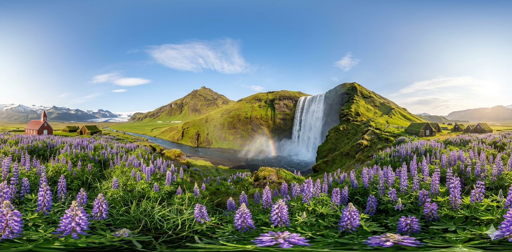</a>
<br/><b>冰岛春日花海瀑布全景提示词</b>
<br/> 
<br/><details><summary>📋 核心提示词</summary>

```json
{
  "{
  "图像元数据": {
    "类型": "360度等距柱状全景图",
    "投影方式": "完整球形https://youpai.diysq.com/2026/04/20260416143811229.png等距柱状投影",
    "宽高比": "2:1",
    "分辨率": "超高分辨率全景"
  },
  "场景构图": {
    "地点": "冰岛Skógafoss瀑布，春季",
    "相机位置": "贴近地面，位于紫色鲁冰花花海中心",
    "相机高度": "约0.5米",
    "视野范围": "水平360度，垂直180度",
    "投影行为": "正确的等距柱状畸变，确保无缝球形拼接",
    "天气状况": "柔和的春日晨光，天空晴朗，有轻薄的卷云",
    "景深": "大景深，前景花卉清晰，远景瀑布和山峦也保持清晰度，但保持层次感"
  },
  "视觉元素": {
    "前景": {
      "主体视图": "水平360度环绕着浓密、盛开的紫色鲁冰花（Lupine）花海，间杂着鲜绿的野草和苔藓。花朵细节极度清晰，露珠在花瓣上闪烁。花海从脚下一直延伸到中景。",
      "动态": "花朵在轻风中微微摇曳，前景偶尔可见一只忙碌的蜜蜂"
    },
    "中景主体": {
      "地形": "宏伟的Skógafoss瀑布（如image_0.png所示）位于场景的正前方（水平0度），其上方是一片广阔的翠绿色高山草甸和陡峭的山崖（如image_0.png）。",
      "村落": "在瀑布左侧和右侧的远方，环绕着花海边缘，点缀着几座经典的冰岛式红顶小教堂和几座传统的草皮房（turf houses），构成了一个宁静的小村落。在瀑布后方的山谷深处，隐约可见蜿蜒的河流。",
      "云雾": "瀑布底部的巨大水雾水幕（如image_0.png），在阳光下形成微弱的彩虹"
    },
    "背景": {
      "景观": "远景是连绵的、覆盖着残雪的雪山和冰川，环绕全景一周。",
      "天空": "广阔、干净的蔚蓝色天空，带有柔和的白色卷云，环绕整个天空半球"
    },
    "环境氛围": {
      "地面半球": "完全被鲁冰花花海、苔藓和岩石地面填满，没有任何人工痕迹",
      "整体氛围": "生机勃勃、宁静、自然、神秘、宏大"
    }
  },
  "渲染风格": {
    "光照": "柔和的金色春日晨光，从右侧（偏东）射入，为花海和瀑布边缘涂上一层暖色。避免强烈的直射光，光线均匀分布。",
    "调色": "鲜艳的紫色（鲁冰花）、翠绿色（草甸和苔藓）、冷白色和蓝色（瀑布和冰川）形成强烈对比，色彩饱和度高但自然，不失真。",
    "质感质量": {
      "描述": "极高精度的写实主义，水珠、花瓣纹理、岩石质感、苔藓细节都极度逼真",
      "痕迹": "无人工痕迹，画面纯净，自然锐化",
      "拼接": "完美的360度无缝拼接"
    }
  },
  "约束条件": {
    "必须保留": [
      "纯360度全景透视",
      "贴地花海视角",
      "Skógafoss瀑布和绿色山脉为核心主体",
      "无任何界面元素",
      "高度写实摄影感",
      "春季氛围（花、绿地、雪山）"
    ],
    "必须避免": [
      "城市或现代建筑",
      "人物",
      "电影感夸张灯光",
      "奇幻或游戏风格",
      "绘画或插画感",
      "非全景的普通照片布局"
    ]
  },
  "负面提示词": [
    "用户界面",
    "抬头显示",
    "文本覆盖",
    "水印",
    "现代建筑",
    "桥梁",
    "行人",
    "奇幻艺术",
    "插图",
    "过度处理",
    "边框",
    "裁剪视图",
    "全景接缝断裂",
    "人工路面"
  ]
}"
}
```

<sub>📄 [下载完整 JSON](prompts/case004.json)</sub>
</details>
</div>

<hr/>
<div align="center">
<a href="images/case007/output.png">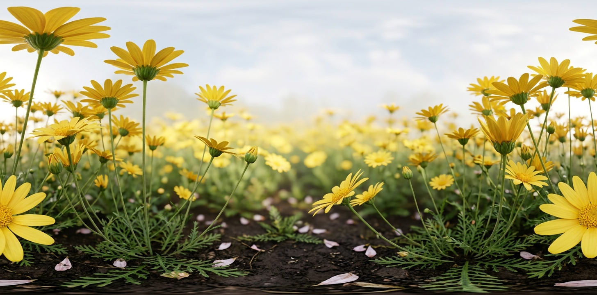</a>
<br/><b>春日雏菊花海超低机位沉浸全景提示词</b>
<br/> 
<br/><details><summary>📋 核心提示词</summary>

```json
{
  "{
  "图像元数据": {
    "类型": "360度等距柱状全景图",
    "投影方式": "完整球形等距柱状投影",
    "宽高比": "2:1",
    "分辨率": "8K 超高分辨率全景"
  },
  "场景构图": {
    "地点": "无尽的春日郊野雏原",
    "相机位置": "极低机位，贴近地面，位于花丛之间",
    "相机高度": "低于花茎顶部",
    "视野范围": "水平360度，垂直180度，完全沉浸",
    "投影行为": "完美的等距柱状畸变，确保无缝球形拼接",
    "天气状况": "清晨薄雾，柔和的漫射日光",
    "景深": "极浅景深（BOKEH），特写清晰，远景逐渐融化"
  },
  "视觉元素": {
    "前景": {
      "主体视图": "正前方（0度视角）几朵金黄色雏菊（Euryops chrysanthemoides）特写，清晰展示参考图片 image_0.png 中的花瓣细节、绿色花萼和纤细茎干。地面散落着参考图片中的羽状叶片和粉色干枯瓣。",
      "动态": "周围360度被特写和近景的雏菊环绕，呈现出多角度的侧影、背面和不同生长阶段的花朵，形成无尽的花丛"
    },
    "中景主体": {
      "地形": "随着视角的旋转，层层叠叠的雏菊花毯向各个方向延伸，逐渐融入梦幻般的黄色色块。",
      "村落": "无",
      "云雾": "空气中弥漫着轻微的晨雾，使远处的黄色花毯呈现出柔和、奶油般的质感（大面积奶油bokeh）。"
    },
    "背景": {
      "景观": "极远处的模糊绿色植被轮廓，完全虚化。",
      "天空": "（垂直180度天顶）柔和、多云的天空，如参考图片 image_0.png 所示，干净且柔和，提供高处的广阔视角。"
    },
    "环境氛围": {
      "地面半球": "（相机底部）湿润的深色泥土和茂密的绿叶，确保画面底部稳定，无脚架痕迹。",
      "整体氛围": "清新、私密、宁静、梦幻、春意盎然，被花海温柔包裹"
    }
  },
  "渲染风格": {
    "光照": "柔和的晨曦，自然的漫射日光，无强烈阴影",
    "调色": "保留参考图片 image_0.png 的柔和、自然的色调：鲜亮的黄色、嫩绿色、柔和的粉白干瓣、深泥土色",
    "质感质量": {
      "描述": "超高写实主义摄影，微距级别的花瓣质感与极浅景深的奶油虚化相结合",
      "痕迹": "无人工痕迹，画面纯净，自然锐化，质感细腻",
      "拼接": "完美的360度无缝拼接，无明显接缝或几何错误"
    }
  },
  "约束条件": {
    "必须保留": [
      "纯360度全景透视",
      "极低机位、贴近地面视角",
      "金黄色雏菊（Euryops chrysanthemoides）为主体",
      "保留 image_0.png 特有的花卉特写和前景叶片细节",
      "极浅的奶油般BOKEH虚化效果",
      "高度写实摄影感"
    ],
    "必须避免": [
      "无人机高空视角",
      "城市或现代建筑",
      "人物",
      "电影感夸张灯光",
      "奇幻或游戏风格",
      "非全景的普通照片布局",
      "梯田景观"
    ]
  },
  "负面提示词": [
    "用户界面",
    "抬头显示",
    "文本覆盖",
    "水印",
    "现代建筑",
    "桥梁",
    "行人",
    "车辆",
    "奇幻艺术",
    "插图",
    "过度处理",
    "边框",
    "裁剪视图",
    "全景接缝断裂",
    "脚架痕迹",
    "硬阴影"
  ]
}"
}
```

<sub>📄 [下载完整 JSON](prompts/case007.json)</sub>
</details>
</div>

<hr/>
<div align="center">
<a href="images/case008/output.png">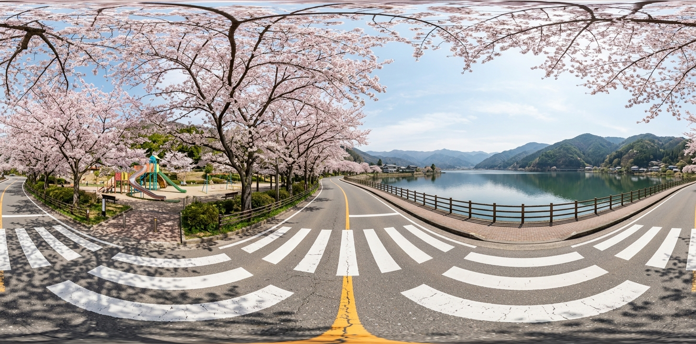</a>
<br/><b>湖畔漫步：1.6米人眼高度360度沉浸全景提示词</b>
<br/> 
<br/><details><summary>📋 核心提示词</summary>

```json
{
  "{
  "图像元数据": {
    "类型": "360度等距柱状全景图",
    "投影方式": "完整球形等距柱状投影",
    "宽高比": "2:1",
    "分辨率": "超高分辨率全景，8K-16K细节"
  },
  "场景构图": {
    "地点": "湖滨樱花大道，紧邻水岸的木质围栏步道",
    "相机位置": "位于柏油路与湖泊边缘的步行区域中心",
    "相机高度": "地面视角，约1.6米人眼高度，模拟真实漫步视角",
    "视野范围": "水平360度，垂直180度",
    "投影行为": "完美的等距柱状畸变，确保道路线条在全景中自然弯曲且无缝衔接",
    "天气状况": "微风，明亮的春日午后，阳光穿透花瓣形成斑驳光影",
    "景深": "中等景深，近处樱花细节锐利，远山呈现自然的空气感虚化"
  },
  "视觉元素": {
    "前景": {
      "主体视图": "路边盛开的樱花树干，树皮纹理清晰，低垂的樱花枝条几乎触及镜头",
      "动态": "地面上有随风滚动落下的樱花瓣，柏油路面有清晰的斑马线纹理"
    },
    "中景主体": {
      "地形": "左侧为带有滑梯的微型社区公园草地，右侧为波光粼粼的开阔湖泊",
      "道路": "平整的灰色柏油马路，带有清晰的黄色中心线和交通指示标志",
      "植被": "修剪整齐的深绿色灌木丛作为路缘，与粉色樱花形成强烈的色彩层次"
    },
    "背景": {
      "景观": "湖泊对岸延绵的青色群山，山脚下零星分布的日式传统民居",
      "天空": "广阔的淡蓝色天空，带有大片如棉絮般的白云"
    },
    "环境氛围": {
      "地面半球": "柏油路面呈现细腻的颗粒感，阳光投射出密集的樱花树影",
      "整体氛围": "静谧、悠闲、具有浓郁的生活气息和旅行感"
    }
  },
  "渲染风格": {
    "光照": "明媚的自然采光，光线从侧上方摄入，在地面形成丰富的明暗对比",
    "调色": "胶片质感，温暖的阳光调性，强调淡粉色、湖蓝色与草绿色的和谐对比",
    "质感质量": {
      "描述": "极致的写实摄影质感，模拟专业单反相机的全幅成像效果",
      "痕迹": "无任何数字噪点，无镜头污垢，画面纯净通透",
      "拼接": "天顶和脚底无任何拉伸断裂，360度无缝环绕"
    }
  },
  "约束条件": {
    "必须保留": [
      "严格的1.6米人眼高度视角",
      "参考图中的斑马线与黄色中心线元素",
      "湖泊与路面平行的构图逻辑",
      "全景透视下的道路延伸感"
    ],
    "必须避免": [
      "无人机俯视感",
      "鱼眼镜头中心过度畸变",
      "模糊的纹理",
      "多余的现代行人或杂乱车辆",
      "任何非自然的人工光源"
    ]
  },
  "负面提示词": [
    "俯视视角",
    "拼接裂缝",
    "模糊不清",
    "数字绘图感",
    "黑边",
    "文字水印",
    "低分辨率",
    "扭曲的建筑",
    "杂乱的电线杆",
    "逻辑错误的阴影"
  ]
}"
}
```

<sub>📄 [下载完整 JSON](prompts/case008.json)</sub>
</details>
</div>

<hr/>
<div align="center">
<a href="images/case009/output.png">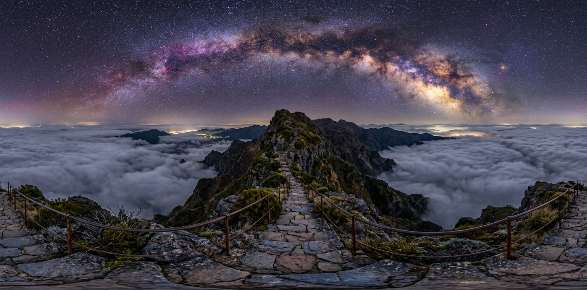</a>
<br/><b>幻境之巅：银河拱门下的云端天梯360°全景提示词</b>
<br/> 
<br/><details><summary>📋 核心提示词</summary>

```json
{
  "{
  "图像元数据": {
    "类型": "360度等距柱状全景图",
    "投影方式": "完整球形等距柱状投影",
    "宽高比": "2:1",
    "分辨率": "超高分辨率全景"
  },
  "场景构图": {
    "地点": "一个被云海包围的、孤独的、陡峭的云端山脊",
    "相机位置": "位于原始石阶小径的中部，视角略高",
    "相机高度": "高空航拍视角，上帝视角，俯瞰山脊和小径",
    "视野范围": "水平360度，垂直180度，完整的球形视野",
    "投影行为": "正确的等距柱状畸变，确保天极（Nadir）和地极（Zenith）无任何接缝或人工痕迹，小径在水平方向上闭合",
    "天气状况": "清澈寒冷的夜，风平浪静，能见度极高，无雨雪，空气纯净",
    "景深": "超全景深，从脚下石板到最远星系皆清晰可见"
  },
  "视觉元素": {
    "前景": {
      "主体视图": "一条由粗糙石块铺成的古老小径，环绕观察者四周，形成一个水平闭合的环形，石板纹理清晰，生锈的金属栏杆和植物点缀其间（保留参考图细节），小径引导视线向天顶和四周延伸",
      "动态": "无，静止"
    },
    "中景主体": {
      "地形": "孤独的山峰和陡峭的山脊，像岛屿一样悬浮在云海之上，山石纹理崎岖，覆盖着稀疏的灌木和苔藓，在参考图基础上扩展到360度环绕",
      "村落": "在全景的远端，通过云层的缝隙，可以看到更丰富的远方城市或村落的微弱灯火点缀",
      "云雾": "翻滚的、无边无际的云海，铺满整个下半球，形成一望无际的云之汪洋，深邃的峡谷被云海填满，环绕整个山脉"
    },
    "背景": {
      "景观": "远方更广阔的、被云海包围的山脊线，扩展至360度，形成一个连续的、环形的山脉网络",
      "天空": "完整的360度深邃夜空。壮丽的银河系（Milky Way）如一个巨大的、绚丽的拱门，横跨天际（扩展其宽度和深度，覆盖更大的天区），带有紫色、粉色和金色的星云细节，天空中布满密集的、清晰的星辰"
    },
    "环境氛围": {
      "地面半球": "（Nadir点）完美的无接缝处理，融合了云海、深邃的峡谷和山脚，给人一种站在极高悬崖边缘眺望深渊和云海的眩晕感",
      "整体氛围": "神秘、神圣、浩瀚无垠、宁静而冷冽，仿佛站在世界尽头的通天之路上"
    }
  },
  "渲染风格": {
    "光照": "深邃的夜景光照，主要来源是壮丽的银河和繁星，微弱的城市远光，光线在石板和金属上产生自然的冷色调反光，保持原始图片的紫色/粉色星空基调",
    "调色": "深紫色、粉色、深蓝和金色的银河与星空，与深棕色、灰色和冷绿色的山石形成对比，云海呈柔和的灰色和白色",
    "质感质量": {
      "描述": "极高细节，电影级写实主义，石材、金属、植物和云层的纹理清晰锐利，无人工痕迹，画面纯净，自然锐化",
      "痕迹": "无人工痕迹，画面纯净，自然锐化，确保无噪点和颗粒感",
      "拼接": "完美的360度无缝拼接，无任何接缝或错位，在全景查看器中低头（Nadir）和抬头（Zenith）均自然过渡"
    }
  },
  "约束条件": {
    "必须保留": [
      "纯360度全景透视",
      "无人机高空视角",
      "石阶小径为核心主体并环绕",
      "壮丽的银河拱门并横跨天际",
      "无任何界面元素",
      "高度写实摄影感"
    ],
    "必须避免": [
      "城市或现代建筑（作为主体）",
      "人物",
      "电影感夸张灯光",
      "奇幻或游戏风格",
      "绘画或插画感",
      "非全景的普通照片布局"
    ]
  },
  "负面提示词": [
    "用户界面",
    "抬头显示",
    "文本覆盖",
    "水印",
    "现代建筑",
    "桥梁",
    "行人",
    "奇幻艺术",
    "插图",
    "过度处理",
    "边框",
    "裁剪视图",
    "全景接缝断裂",
    "天极畸变",
    "地极畸变",
    "噪点",
    "人为拼接痕迹",
    "非全景比例",
    "非球形投影"
  ]
}"
}
```

<sub>📄 [下载完整 JSON](prompts/case009.json)</sub>
</details>
</div>

<hr/>
<div align="center">
<a href="images/case010/output.png">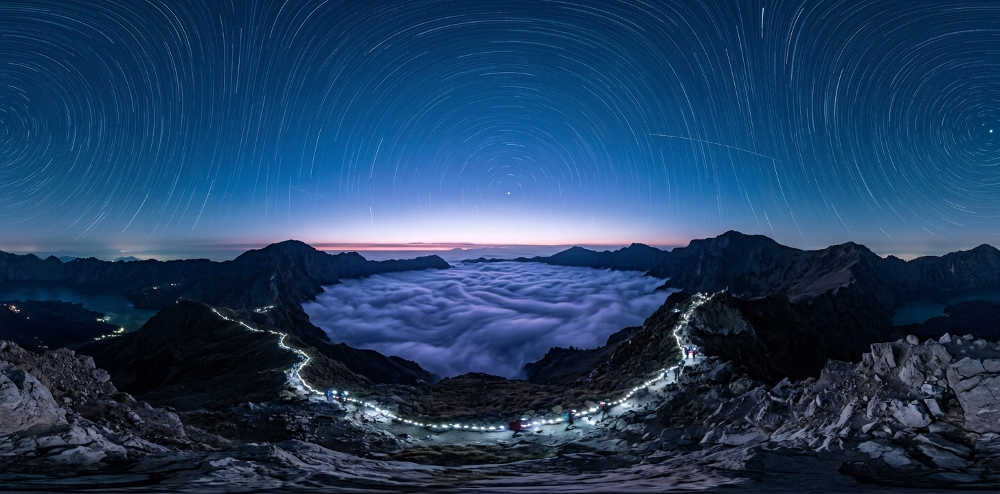</a>
<br/><b>星轨云海下的山巅灯火 360全景提示词</b>
<br/> 
<br/><details><summary>📋 核心提示词</summary>

```json
{
  "{
  "图像元数据": {
    "类型": "360度等距柱状全景图",
    "投影方式": "完整球形等距柱状投影",
    "宽高比": "2:1",
    "分辨率": "8K超高分辨率全景"
  },
  "场景构图": {
    "地点": "偏远高山之巅，俯瞰巨大的火山口或峡谷",
    "相机位置": "位于最高峰的俯瞰点，可360度旋转视角",
    "相机高度": "高空航拍视角，上帝视角",
    "视野范围": "水平360度，垂直180度，完全沉浸式",
    "投影行为": "正确的等距柱状畸变，确保天顶、地底无缝球形拼接",
    "天气状况": "极其清澈的夜空，大气透明度极高",
    "景深": "全景景深，从脚下到天际线皆清晰"
  },
  "视觉元素": {
    "前景": {
      "主体视图": "脚下是陡峭的岩石地面。一条蜿蜒的徒步山径从脚下延伸，小径两旁整齐排列着明亮的 LED 小灯，如同一条发光的珍珠项链，指引向远处的山脊。山径旁有几个人影（使用头灯或手电筒的登山者），人影因长时间曝光而略显模糊，增加了尺度感。",
      "动态": "登山者的轻微移动"
    },
    "中景主体": {
      "地形": "巨大的火山口或峡谷盆地，四周由险峻、黑暗的岩石山峰和峭壁环绕。这些山峰的轮廓清晰，形成壮观的黑色剪影。",
      "村落": "在极远处的火山口底部或另一侧山腰，有几处极其微弱的村落灯光点，点缀在无边的黑暗中。",
      "云雾": "巨大的云海（逆温层）填充了整个火山口或峡谷盆地。云层厚重如波涛，呈现出冷蓝色和紫色调，在星光和微弱的城市天光下显得柔和而深邃。"
    },
    "背景": {
      "景观": "远处的山脉地平线，分界清晰。地平线上方有一条极窄的、微妙的日出前或日落后留下的粉色和橙色暮光带。",
      "天空": "广阔无垠的深蓝色夜空，从地平线的深蓝色过渡到天顶的极深邃蓝色。天空被无数清晰、细长的星轨（长时间曝光形成）所占据，星轨呈现一致的圆弧运动方向。偶尔可见一颗更亮的流星或卫星划过的直线轨迹。全景视角的球形投影使星轨呈现出围绕天极的壮观圆形排列。"
    },
    "环境氛围": {
      "地面半球": "完全由岩石地形、蜿蜒的发光山径和下方的广阔云海占据。",
      "整体氛围": "壮丽、寂静、冷峻、史诗感、人类活动的微小与自然伟大的对比。"
    }
  },
  "渲染风格": {
    "光照": "极低环境光，主要由星光、微弱的暮光和人工LED小径灯光（冷色调）组成。长时间曝光带来的动态和深度。",
    "调色": "冷色调为主：深蓝、天青、紫罗兰、冷白（灯光）、冷灰（岩石）。仅在地平线处有微量的暖色调（粉色、橙色）。",
    "质感质量": {
      "描述": "超高细节，清晰呈现岩石纹理、云海层理和每条星轨。长时间曝光的平滑感与岩石的粗糙感形成对比。",
      "痕迹": "无人工接缝，画面纯净，自然锐化，确保高动态范围",
      "拼接": "完美的360度无缝拼接，无伪影，天顶（Nadir）和地底（Zenith）无拉伸畸变。"
    }
  },
  "约束条件": {
    "必须保留": [
      "完整的360度沉浸式视角",
      "高空俯瞰的上帝视角",
      "核心主体：星轨夜空、云海火山口、发光小径",
      "无任何界面元素和水印",
      "高度写实的长时间曝光摄影感",
      "地平线的暮光分界线",
      "清晰的岩石山峰剪影"
    ],
    "必须避免": [
      "城市景观或大量现代建筑",
      "清晰、静止的人物或面部（必须是模糊或远景）",
      "电影感夸张的饱和度和不真实灯光",
      "奇幻、游戏或科幻元素（如发光植物、魔法）",
      "绘画、插画、矢量或AI生成的非摄影质感",
      "任何遮挡视角的UI、文字或框架",
      "明显的全景接缝"
    ]
  },
  "负面提示词": [
    "用户界面",
    "抬头显示",
    "文本覆盖",
    "水印",
    "现代建筑",
    "桥梁",
    "清晰的人物",
    "面部",
    "奇幻艺术",
    "插图",
    "卡通",
    "电影感过度处理",
    "边框",
    "裁剪视图",
    "全景接缝断裂",
    "镜头光晕",
    "噪点",
    "模糊",
    "畸变过度",
    "日间场景"
  ]
}"
}
```

<sub>📄 [下载完整 JSON](prompts/case010.json)</sub>
</details>
</div>

<hr/>
<div align="center">
<a href="images/case101/output.png">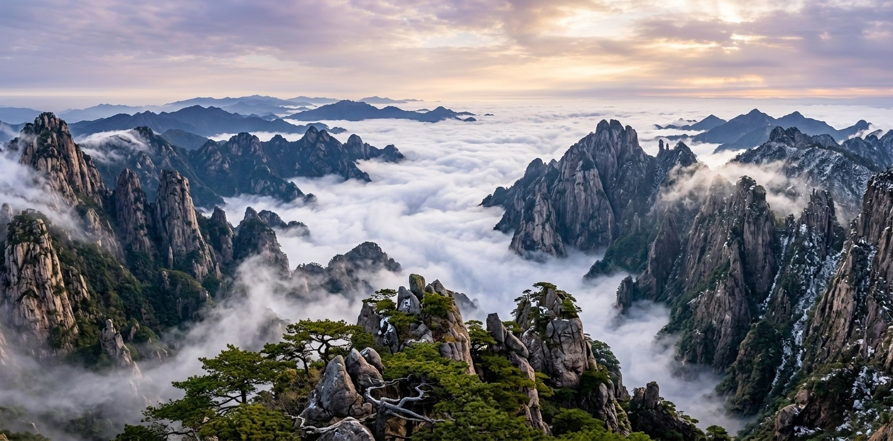</a>
<br/><b>云海松风：黄山奇峰的仙境全景</b>
<br/> 
<br/><details><summary>📋 核心提示词</summary>

```json
{
  "{
  "图像元数据": {
    "类型": "360度等距柱状全景图",
    "投影": "完整球形等距柱状投影",
    "长宽比": "2比1",
    "分辨率": "8K极致清晰"
  },
  "场景构图": {
    "地点": "中国黄山始信峰上空",
    "相机位置": "高空悬停，俯瞰群峰",
    "相机高度": "高空航拍视角",
    "视野范围": "水平360度，垂直180度",
    "透视表现": "奇峰呈放射状环绕，云海在地平线处交汇",
    "天气": "晴时多云，伴有波澜壮阔的云海",
    "景深控制": "近景松树与远景群峰全清晰"
  },
  "视觉元素": {
    "前景": { "主要特征": "怪石嶙峋的巅峰，生长着造型奇特的黄山松，松针清晰可见", "动态": "云雾在峰间缓慢流动" },
    "中景主体": { "地貌": "如刀削斧劈般的石柱群，色彩呈冷灰色与深绿交织", "云效": "厚重的云海填满山谷，如潮水般起伏", "细节": "山脊上的积雪残迹或流动的雾气" },
    "背景": { "远景": "重峦叠嶂的群山剪影，延伸至极远方", "天空": "清晨的淡紫色与金橙色微光，透射过云层" },
    "环境氛围": { "地面半球": "绝美的东方山水写意景观", "氛围感": "空灵、静谧、仙气缭绕" }
  },
  "渲染风格": {
    "光影方案": "柔和的日出侧光，勾勒出山体轮廓，增强立体感",
    "色彩科学": "高雅的灰调、苍翠的绿与圣洁的白云",
    "质感质量": { "描述": "顶级山岳风光摄影，无缝拼接", "细节": "极高的岩石纹理表现力" }
  },
  "核心约束": {
    "必须保留": [ "标志性奇峰怪石", "流动的云海", "挺拔的黄山松", "360度环绕视角" ],
    "严禁出现": [ "索道", "游步道", "人群", "现代建筑", "文字" ]
  },
  "负面提示词": [ "文字", "水印", "现代设施", "缆车", "垃圾桶", "模糊", "低细节", "拼接痕迹" ]
}"
}
```

<sub>📄 [下载完整 JSON](prompts/case101.json)</sub>
</details>
</div>

<hr/>
<div align="center">
<a href="images/case103/output.png">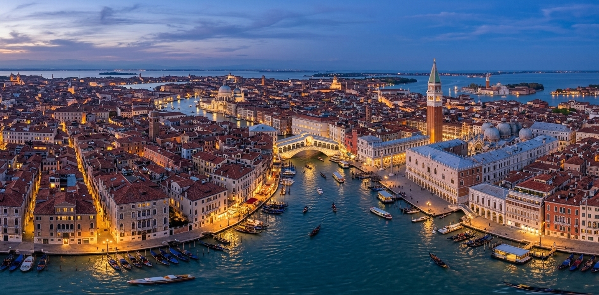</a>
<br/><b>水墨浮城：威尼斯水网的沉浸式历史画卷</b>
<br/> 
<br/><details><summary>📋 核心提示词</summary>

```json
{
  "{
  "图像元数据": {
    "类型": "360度等距柱状全景图",
    "投影": "完整球形等距柱状投影",
    "长宽比": "2比1",
    "分辨率": "8K极致清晰"
  },
  "场景构图": {
    "地点": "撒哈拉沙漠腹地",
    "相机位置": "无人机俯视全景",
    "相机高度": "中空俯瞰",
    "视野范围": "水平360度，垂直180度",
    "透视表现": "沙丘脊线呈螺旋状或放射状延伸",
    "天气": "极端干燥，万里无云",
    "景深控制": "沙纹细节全清晰"
  },
  "视觉元素": {
    "前景": { "主要特征": "细腻如丝绸的沙子表面，布满微小的风蚀波纹", "动态": "完全静态" },
    "中景主体": { "地貌": "层层叠叠的巨型沙丘，带有锋利的明暗交界线", "细节": "沙脊线上的细碎沙尘微粒", "特征": "金黄色与深影区的强烈对比" },
    "背景": { "远景": "连绵不断的沙山直到地平线汇聚点", "天空": "极度纯净的深蓝色穹顶" },
    "环境氛围": { "地面半球": "极简主义的大地艺术", "氛围感": "辽阔、永恒、苍凉" }
  },
  "rendering_style": {
    "光影方案": "夕阳斜射，强侧光刻画立体感，阴影深邃",
    "色彩科学": "高纯度的金色、橙色与深蓝天空的对比",
    "质感质量": { "描述": "极高精细度的沙粒质感，无噪点摄影", "细节": "完美无缝的360度画面" }
  },
  "核心约束": {
    "必须保留": [ "锋利的沙脊线", "极简色彩构图", "360度沉浸感" ],
    "严禁出现": [ "足迹", "车辆", "植物", "人物", "文字" ]
  },
  "负面提示词": [ "文字", "水印", "杂色", "足迹", "绿洲", "模糊", "低画质", "拼接裂缝" ]
}"
}
```

<sub>📄 [下载完整 JSON](prompts/case103.json)</sub>
</details>
</div>

<hr/>
<div align="center">
<a href="images/case104/output.png"></a>
<br/><b>永恒对称：印度泰姬陵与亚穆纳河的圣洁清晨</b>
<br/> 
<br/><details><summary>📋 核心提示词</summary>

```json
{
  "{
  "image_meta": {
    "type": "360度等距柱状全景图",
    "projection": "完整球形等距柱状投影",
    "aspect_ratio": "2:1",
    "resolution": "超高分辨率"
  },
  "scene_composition": {
    "location": "印度阿格拉，泰姬陵（Taj Mahal）正上方",
    "camera_position": "无人机天底俯视兼顾全景",
    "camera_height": "中高空航拍",
    "field_of_view": "360° 水平，180° 垂直",
    "projection_behavior": "极其规整的轴线对称地貌",
    "weather": "日出时分，带有轻微的薄雾",
    "depth_of_field": "全景深"
  },
  "visual_elements": {
    "foreground": { "primary_view": "泰姬陵白色大理石圆顶及其精美纹饰，对称的几何花园网格", "motion": "完全静态" },
    "midground_subjects": { "terrain": "规整的莫卧儿花园与长条形水池", "river": "背后的亚穆纳河，水面平滑如镜", "mist": "河面上蒸腾的轻柔晨雾" },
    "background": { "landscape": "远处阿格拉城市的晨间剪影，森林与雾气交织", "sky": "粉橙色渐变的晨曦天空，色彩温和" },
    "environment": { "ground_hemisphere": "建筑几何与自然河流的和谐统一", "atmosphere": "圣洁、庄严、宁静、典雅" }
  },
  "rendering_style": {
    "lighting": "柔和的侧逆光，为大理石边缘带来圣洁的光辉",
    "color_grading": "暖白色与清新的植物绿，辅以淡粉色的天空调性",
    "texture_quality": { "description": "写实建筑航拍", "artifacts": "无缝全景", "stitching": "完美拼接" }
  },
  "constraints": {
    "must_keep": [ "完美的对称构图", "白色圆顶细节", "亚穆纳河背景", "360°全景透视" ],
    "avoid": [ "大量的游客", "脚手架", "人造电杆", "杂乱的树影" ]
  },
  "negative_prompt": [ "ui", "text", "scaffolding", "crowd", "pollution", "dirty river", "low detail" ]
}"
}
```

<sub>📄 [下载完整 JSON](prompts/case104.json)</sub>
</details>
</div>

<hr/>
<div align="center">
<a href="images/case107/output.png"></a>
<br/><b>千岛迷宫：拉贾安帕特群岛的翡翠珍珠与清澈海域</b>
<br/> 
<br/><details><summary>📋 核心提示词</summary>

```json
{
  "{
  "image_meta": {
    "type": "360度等距柱状全景图",
    "projection": "完整球形等距柱状投影",
    "aspect_ratio": "2:1",
    "resolution": "超高分辨率"
  },
  "scene_composition": {
    "location": "印度尼西亚拉贾安帕特（Raja Ampat）Wayag岛上空",
    "camera_position": "高空俯瞰全景",
    "camera_height": "极高空视角",
    "field_of_view": "360° 水平，180° 垂直",
    "projection_behavior": "圆锥形岛屿在水面上呈星罗棋布分布",
    "weather": "晴朗，云朵在海面投下阴影",
    "depth_of_field": "无限景深"
  },
  "visual_elements": {
    "foreground": { "primary_view": "近处半透明的青绿色海水，可见水底沙洲与珊瑚纹理", "motion": "平静" },
    "midground_subjects": { "terrain": "数百个被深绿色植被覆盖的喀斯特小岛，呈蘑菇状或圆锥状", "river": "无", "mist": "无" },
    "background": { "landscape": "深蓝色的印度洋与远处的岛屿群连接到360度地平线", "sky": "巨大的、带有透视畸变的积云点缀在蔚蓝天空中" },
    "environment": { "ground_hemisphere": "破碎的地貌与纯净海洋的结合", "atmosphere": "原始、热带、宁静" }
  },
  "rendering_style": {
    "lighting": "正午充足的阳光，直射海面，产生极佳的透明度",
    "color_grading": "极高饱和度的青绿色、宝石蓝与森林绿",
    "texture_quality": { "description": "超清晰卫星及无人机摄影", "artifacts": "无缝360拼接", "stitching": "完美" }
  },
  "constraints": {
    "must_keep": [ "特有的圆锥形小岛", "海水的颜色分层", "360°球形视野", "云影效果" ],
    "avoid": [ "大型船只", "现代码头", "浑浊的水质" ]
  },
  "negative_prompt": [ "ui", "text", "big ships", "pollution", "muddy water", "flat lighting" ]
}"
}
```

<sub>📄 [下载完整 JSON](prompts/case107.json)</sub>
</details>
</div>

<hr/>
<div align="center">
<a href="images/case110/output.png"></a>
<br/><b>地狱之喉：汹涌磅礴的伊瓜苏马蹄形大瀑布</b>
<br/> 
<br/><details><summary>📋 核心提示词</summary>

```json
{
  "{
  "image_meta": {
    "type": "360度等距柱状全景图",
    "projection": "完整球形等距柱状投影",
    "aspect_ratio": "2:1",
    "resolution": "超高分辨率全景"
  },
  "scene_composition": {
    "location": "伊瓜苏大瀑布“魔鬼喉咙”正上方",
    "camera_position": "无人机俯冲视角",
    "camera_height": "中高空航拍",
    "field_of_view": "360° 水平，180° 垂直",
    "projection_behavior": "巨大的弧形瀑布环绕视角",
    "weather": "晴朗，伴有巨大的水雾云",
    "depth_of_field": "全清晰"
  },
  "visual_elements": {
    "foreground": { "primary_view": "巨大的马蹄形瀑布群倾泻而下，白色的水流汹涌澎湃", "motion": "水流的高速坠落动感" },
    "midground_subjects": { "terrain": "被森林覆盖的峡谷边缘", "river": "瀑布底部的湍急河流与弥漫的白色水汽", "mist": "巨大的水雾柱升起，遮蔽部分视野" },
    "background": { "landscape": "远处平静的伊瓜苏河与两岸的原始森林延伸至天边", "sky": "湛蓝天空与白色的水雾相互映衬" },
    "environment": { "ground_hemisphere": "水与森林的壮阔交汇", "atmosphere": "震慑人心、充满力量感" }
  },
  "rendering_style": {
    "lighting": "直射阳光在水雾中可能形成彩虹",
    "color_grading": "真实自然，强调水流的白色与植被的深绿",
    "texture_quality": { "description": "动感与清晰度并存的摄影风格", "artifacts": "无缝拼接", "stitching": "无缝360" }
  },
  "constraints": {
    "must_keep": [ "巨大的马蹄形瀑布结构", "弥漫的水雾", "森林背景", "360°全景透视" ],
    "avoid": [ "观光船", "观景桥", "人物", "低画质的水流" ]
  },
  "negative_prompt": [ "ui", "text", "boats", "bridge", "tourists", "static water", "low resolution" ]
}"
}
```

<sub>📄 [下载完整 JSON](prompts/case110.json)</sub>
</details>
</div>

<hr/>
<div align="center">
<a href="images/case112/output.png"></a>
<br/><b>加勒比之光：清澈如镜的青绿色离岛与珊瑚礁</b>
<br/> 
<br/><details><summary>📋 核心提示词</summary>

```json
{
  "{
  "image_meta": {
    "type": "360度等距柱状全景图",
    "projection": "完整球形等距柱状投影",
    "aspect_ratio": "2:1",
    "resolution": "超高分辨率全景"
  },
  "scene_composition": {
    "location": "热带加勒比海群岛上空",
    "camera_position": "高空无人机视角",
    "camera_height": "极高空全景",
    "field_of_view": "360° 水平，180° 垂直",
    "projection_behavior": "海面呈球形延展，岛屿点缀其中",
    "weather": "艳阳高照，微风",
    "depth_of_field": "无限景深"
  },
  "visual_elements": {
    "foreground": { "primary_view": "清澈透亮的青绿色浅滩和珊瑚礁纹理", "motion": "平静水面" },
    "midground_subjects": { "terrain": "几个被茂密绿色植被覆盖的小岛和白沙滩", "river": "无", "mist": "无" },
    "background": { "landscape": "深蓝色的远洋延伸至360度地平线，远处有点点帆船", "sky": "清澈的浅蓝色天空，分布着朵朵白云" },
    "environment": { "ground_hemisphere": "半透明的海水和水底地形", "atmosphere": "纯净、度假感、清新" }
  },
  "rendering_style": {
    "lighting": "明亮、垂直的自然阳光，直射海底",
    "color_grading": "清爽的青绿色、天蓝色与白色的组合",
    "texture_quality": { "description": "超清热带海洋摄影", "artifacts": "无拼接痕迹", "stitching": "完美360全景" }
  },
  "constraints": {
    "must_keep": [ "极清澈的海水颜色", "岛屿环状分布", "360度海平线", "珊瑚礁细节" ],
    "avoid": [ "城市建筑", "垃圾", "暗淡的色彩", "阴天" ]
  },
  "negative_prompt": [ "ui", "text", "cities", "dirty water", "dark colors", "stormy sky" ]
}"
}
```

<sub>📄 [下载完整 JSON](prompts/case112.json)</sub>
</details>
</div>

<hr/>
<div align="center">
<a href="images/case113/output.png"></a>
<br/><b>云巔神迹：巴西里约救世基督像与壮丽云海</b>
<br/> 
<br/><details><summary>📋 核心提示词</summary>

```json
{
  "{
  "image_meta": {
    "type": "360度等距柱状全景图",
    "projection": "完整球形等距柱状投影",
    "aspect_ratio": "2:1",
    "resolution": "超高分辨率全景"
  },
  "scene_composition": {
    "location": "巴西里约热内卢科科瓦多山顶",
    "camera_position": "无人机悬停于基督像侧前方",
    "camera_height": "山顶高度航拍",
    "field_of_view": "360° 水平，180° 垂直",
    "projection_behavior": "宏大的山海空间感",
    "weather": "云雾缭绕，充满氛围感的落日",
    "depth_of_field": "全景深"
  },
  "visual_elements": {
    "foreground": { "primary_view": "巨大的救世基督像矗立在云雾之上，手臂张开", "motion": "动态云流" },
    "midground_subjects": { "terrain": "陡峭的山峰没入厚重的云海中", "river": "远方可见海湾反射的夕阳金光", "mist": "厚重的橙色与紫色雾气缠绕山腰" },
    "background": { "landscape": "远处隐约可见里约的城市灯火与海湾轮廓", "sky": "充满戏剧性的落霞，色彩从深蓝渐变到鲜橙" },
    "environment": { "ground_hemisphere": "神秘的山巅景象", "atmosphere": "神圣、庄严、诗意" }
  },
  "rendering_style": {
    "lighting": "逆光夕阳，为基督像勾勒金边，云海在光照下发亮",
    "color_grading": "暖紫色调，极具电影感和史诗感",
    "texture_quality": { "description": "极致氛围感航拍摄影", "artifacts": "无缝全景", "stitching": "无缝360" }
  },
  "constraints": {
    "must_keep": [ "基督像主体", "云雾缭绕效果", "夕阳海湾背景", "360°空间感" ],
    "avoid": [ "游客", "栏杆", "日间强光", "单薄的云层" ]
  },
  "negative_prompt": [ "ui", "text", "people", "railing", "daylight", "overly bright", "flat clouds" ]
}"
}
```

<sub>📄 [下载完整 JSON](prompts/case113.json)</sub>
</details>
</div>

<hr/>
<div align="center">
<a href="images/case118/output.png"></a>
<br/><b>南极洲冰山与极地海域360度航拍全景</b>
<br/> 
<br/><details><summary>📋 核心提示词</summary>

```json
{
  "{
  "title": "南极洲冰山与极地海域全景",
  "image_meta": {
    "type": "360度等距柱状全景图",
    "projection": "完整球形等距柱状投影",
    "aspect_ratio": "2:1",
    "resolution": "超高分辨率全景"
  },
  "scene_composition": {
    "location": "南极半岛近海浮冰区",
    "camera_position": "无人机在巨大浮冰群上方航拍",
    "camera_height": "中低空航拍视角",
    "field_of_view": "360° 水平，180° 垂直",
    "projection_behavior": "正确的等距柱状畸变",
    "weather": "多云，极地漫反射光",
    "depth_of_field": "无限景深"
  },
  "visual_elements": {
    "foreground": {
      "primary_view": "形态各异的巨型冰山漂浮，水下部分透出迷人的荧光蓝色",
      "motion": "海水微弱的波纹感"
    },
    "midground_subjects": {
      "terrain": "深蓝黑色的寒冷海面，散落着细碎的浮冰快",
      "mountains": "背景是覆盖着永久冰川的黑色火山岩岛屿，云雾缭绕其间"
    },
    "background": {
      "landscape": "无尽的极地海洋与冰雪大陆延伸",
      "sky": "厚重的灰色云层，边缘透出微弱的冷光"
    },
    "environment": {
      "ground_hemisphere": "地球南极冰封世界航拍",
      "atmosphere": "冷冽、孤寂、史诗感"
    }
  },
  "rendering_style": {
    "lighting": "极地柔和散射光，强调冰山的体积与通透度",
    "color_grading": "极致冷色调，纯白、灰蓝、深蓝、荧光蓝",
    "texture_quality": {
      "description": "超写实冰雪与海水质感",
      "stitching": "无缝拼接"
    }
  },
  "constraints": {
    "must_keep": ["冰山荧光蓝", "黑色岩石对比", "360全景"],
    "avoid": ["考察船", "现代设施", "鲜艳暖色"]
  },
  "negative_prompt": ["ui", "watermark", "ship", "bright red", "warm yellow", "people"]
}"
}
```

<sub>📄 [下载完整 JSON](prompts/case118.json)</sub>
</details>
</div>

<hr/>
<div align="center">
<a href="images/case119/output.png"></a>
<br/><b>上海陆家嘴摩天大楼夜景360度全景</b>
<br/> 
<br/><details><summary>📋 核心提示词</summary>

```json
{
  "{
  "title": "上海陆家嘴CBD巅峰夜景全景",
  "image_meta": {
    "type": "360度等距柱状全景图",
    "projection": "完整球形等距柱状投影",
    "aspect_ratio": "2:1",
    "resolution": "超高分辨率全景"
  },
  "scene_composition": {
    "location": "中国上海浦东陆家嘴核心区",
    "camera_position": "无人机位于上海中心大厦旁侧高空",
    "camera_height": "极高层摩天大楼视角",
    "field_of_view": "360° 水平，180° 垂直",
    "projection_behavior": "正确的等距柱状畸变",
    "weather": "清澈夜空，能见度极佳",
    "depth_of_field": "无限景深"
  },
  "visual_elements": {
    "foreground": {
      "primary_view": "上海中心、环球金融中心、金茂大厦近距离环绕，金属与玻璃质感强烈",
      "motion": "地面街道车流形成细长光轨"
    },
    "midground_subjects": {
      "cityscape": "密集的写字楼群灯火辉煌，东方明珠塔在不远处闪烁",
      "river": "深蓝色的黄浦江倒映着两岸斑斓霓虹"
    },
    "background": {
      "landscape": "浦西外滩历史建筑群与无尽的城市远景灯火",
      "sky": "深蓝调夜空，地平线有轻微城市光晕"
    },
    "environment": {
      "ground_hemisphere": "繁华、现代的世界级大都市核心区航拍",
      "atmosphere": "科幻感、繁华、极速"
    }
  },
  "rendering_style": {
    "lighting": "复杂城市人工照明，霓虹与LED灯光交织",
    "color_grading": "现代都市冷蓝调，点缀暖色灯光",
    "texture_quality": {
      "description": "高动态范围夜景摄影",
      "stitching": "无缝360度全景"
    }
  },
  "constraints": {
    "must_keep": ["陆家嘴三大地标", "黄浦江弯曲视角", "夜景氛围"],
    "avoid": ["白昼场景", "模糊噪点", "人物"]
  },
  "negative_prompt": ["ui", "watermark", "daylight", "blurry", "noise", "fog"]
}"
}
```

<sub>📄 [下载完整 JSON](prompts/case119.json)</sub>
</details>
</div>

<hr/>
<div align="center">
<a href="images/case012/output.png"></a>
<br/><b>春日林地全景，花海与晨光的洗礼提示词</b>
<br/> 
<br/><details><summary>📋 核心提示词</summary>

```json
{
  "{
  "图像元数据": {
    "类型": "360度等距柱状全景图",
    "投影方式": "完整球形等距柱状投影 (Monoscopic 360)",
    "宽高比": "2:1",
    "分辨率": "超高分辨率全景，16k以上"
  },
  "场景构图": {
    "地点": "一片广阔、古老的温带森林，完全被春日花海覆盖",
    "相机位置": "低机位，接近地面（地毯视角）",
    "相机高度": "模拟人眼站立或半蹲高度",
    "视野范围": "水平360度，垂直180度（全向）",
    "投影行为": "完美的等距柱状畸变，确保球形全景查看时无缝且无畸变，视野流畅无断裂",
    "天气状况": "清晨，阳光穿透薄雾，空气清新",
    "景深": "极宽，从前景的花朵细节到背景的树林深处都保持清晰，强调空间深度"
  },
  "视觉元素": {
    "前景": {
      "主体视图": "无数密集的蓝紫色小花（类似参考图），从脚下一直延伸出去。前景花朵细节清晰，包括花瓣纹理和露珠。几根粗壮的树干从前景底部向上延伸至天顶，树皮纹理逼真。",
      "动态": "地面花海和树干上布满长长的、平行的阴影（由晨曦投射），随视角旋转而变化透视"
    },
    "中景主体": {
      "地形": "起伏不大的林地，完全覆盖着蓝色和紫色的花朵海洋。无数不同粗细的树干（如白桦、橡树）在360度范围内分布，形成一个完整的森林包围圈。",
      "村落": "无任何建筑迹象",
      "云雾": "淡淡的晨雾弥漫在林间，增强光线的丁达尔效应和空间深度感"
    },
    "背景": {
      "景观": "向四面八方延伸的更深邃的森林，背景树木逐渐模糊在雾气和阴影中。一束强烈、金色的晨曦从某一特定方位（如后方偏上）穿透树梢，在地面和花海上形成斑驳的光点。",
      "天空": "在阳光来源方向，透过树叶的天空是金黄色的；在阴影方向，天空是清晨的冷蓝色。天顶被茂密的树叶冠层覆盖，透过光线，叶脉清晰。"
    },
    "环境氛围": {
      "地面半球": "完全被无穷无尽的花海和树干底座覆盖。地面没有明显的小路，强调自然原始感。",
      "整体氛围": "静谧、宁静、充满生机、梦幻的春日清晨"
    }
  },
  "渲染风格": {
    "光照": "高动态范围（HDR）光照。戏剧性的斑驳光影，丁达尔效应。阳光是金黄色的，阴影部分是冷蓝色的，形成鲜明对比。",
    "调色": "丰富的蓝、紫（花海）、金黄（晨曦）、深褐（树干）、冷绿（阴影叶片）。色彩饱和度高，自然但不夸张。",
    "质感质量": {
      "描述": "超高分辨率、超高写实主义摄影风格。树皮、花瓣、叶片质感逼真。",
      "痕迹": "无人工痕迹，画面纯净，自然锐化，无过度处理感",
      "拼接": "完美的360度无缝拼接，无任何接缝线或明显的拼接点"
    }
  },
  "约束条件": {
    "必须保留": [
      "纯360度全景透视",
      "低机位（地面视角）",
      "无穷无尽的蓝紫色花海为核心主体",
      "戏剧性的斑驳光影和长阴影",
      "高度写实摄影感",
      "无任何界面元素"
    ],
    "必须避免": [
      "现代建筑、电线杆",
      "人物、动物",
      "垃圾、人工痕迹",
      "电影感夸张灯光、梦幻光斑（Bokeh）",
      "奇幻艺术或游戏风格",
      "插图或绘画感",
      "非全景的普通照片布局"
    ]
  },
  "负面提示词": [
    "用户界面",
    "抬头显示",
    "文本覆盖",
    "水印",
    "现代建筑",
    "桥梁",
    "行人",
    "奇幻艺术",
    "插图",
    "过度处理",
    "边框",
    "裁剪视图",
    "全景接缝断裂",
    "过度曝光",
    "低分辨率",
    "人工接缝",
    "镜头光晕过度"
  ]
}"
}
```

<sub>📄 [下载完整 JSON](prompts/case012.json)</sub>
</details>
</div>

<hr/>
<div align="center">
<a href="images/case126/output.png">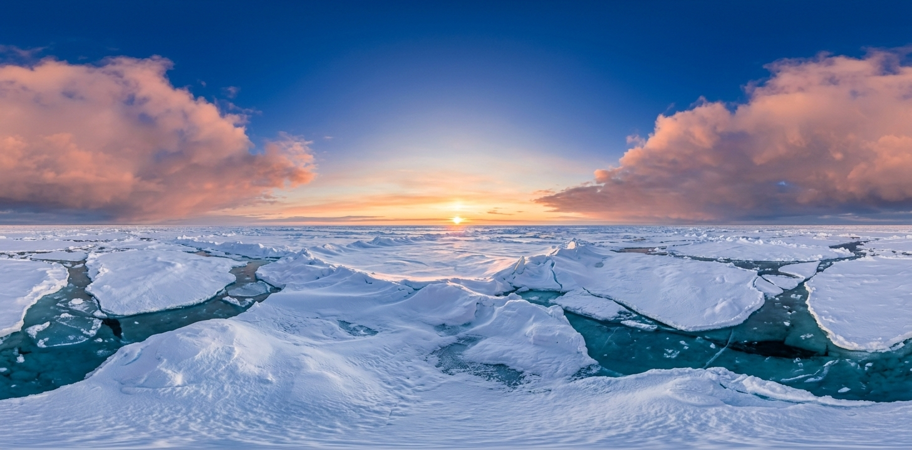</a>
<br/><b>北极冰封海面日出360°全景</b>
<br/> 
<br/><details><summary>📋 核心提示词</summary>

```json
{
  "7. {
  "title": "北极冰原日出冰封海面",
  "image_meta": {
    "type": "360度等距柱状全景图",
    "projection": "完整球形等距柱状投影",
    "aspect_ratio": "2:1",
    "resolution": "超高分辨率全景"
  },
  "scene_composition": {
    "location": "北极圈冰封海面",
    "camera_position": "低空无人机航拍视角",
    "camera_height": "近冰面航拍视角",
    "field_of_view": "360° 水平，180° 垂直",
    "projection_behavior": "正确的等距柱状畸变",
    "weather": "晴朗，日出时分，空气通透",
    "depth_of_field": "无限景深（整个全景清晰）"
  },
  "visual_elements": {
    "foreground": {
      "primary_view": "起伏的冰封海面，冰面呈现雪白色，冰裂缝中透出深邃的蓝绿色海水",
      "motion": "无明显动态，场景静谧"
    },
    "midground_subjects": {
      "terrain": "连绵起伏的海冰丘与冰裂缝，冰面纹理与积雪痕迹清晰",
      "water_body": "冰裂缝中的海水呈现通透的蓝绿色，与白雪形成强烈对比",
      "ice_landforms": "海冰形成的自然曲线与凹陷结构向四周延伸"
    },
    "background": {
      "landscape": "冰封海面向远方无限延伸，与地平线无缝衔接",
      "sky": "日出时分的天空，从地平线的暖橙黄向上过渡到深邃的宝蓝色，两侧有暖粉色的厚重云团"
    },
    "environment": {
      "ground_hemisphere": "从低空俯瞰冰封海面、冰裂缝与日出景观",
      "atmosphere": "寒冷、辽阔、充满极地孤寂感的冰原环境"
    }
  },
  "rendering_style": {
    "lighting": "自然日出暖光，冷暖色调对比强烈，冰面边缘形成金色轮廓光",
    "color_grading": "真实自然色彩，以暖橙、雪白、宝蓝为主",
    "texture_quality": {
      "description": "超写实航拍摄影风格",
      "artifacts": "轻微自然锐化，无人工痕迹",
      "stitching": "无缝360度全景拼接"
    }
  },
  "constraints": {
    "must_keep": [
      "纯360°全景透视",
      "低空航拍视角",
      "冰封海面与日出为核心主体",
      "无任何UI或界面元素",
      "高度写实"
    ],
    "avoid": [
      "城市或人工建筑",
      "人物",
      "电影感灯光",
      "奇幻风格",
      "插画或绘画感",
      "单帧构图"
    ]
  },
  "negative_prompt": [
    "ui",
    "hud",
    "text overlay",
    "watermark",
    "buildings",
    "bridges",
    "people",
    "fantasy art",
    "illustration",
    "cinematic lighting",
    "hdr",
    "overprocessed",
    "frame",
    "border",
    "cropped view",
    "broken panorama seams"
  ]
}"
}
```

<sub>📄 [下载完整 JSON](prompts/case126.json)</sub>
</details>
</div>

<hr/>
<div align="center">
<a href="images/case127/output.png">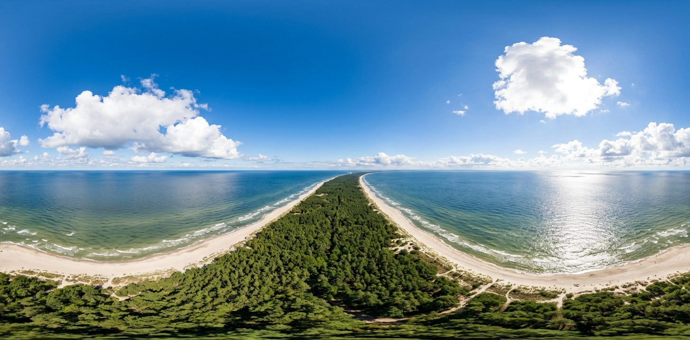</a>
<br/><b>波罗的海狭长海岸森林360°航拍全景</b>
<br/> 
<br/><details><summary>📋 核心提示词</summary>

```json
{
  "6. {
  "title": "波罗的海狭长海岸森林航拍",
  "image_meta": {
    "type": "360度等距柱状全景图",
    "projection": "完整球形等距柱状投影",
    "aspect_ratio": "2:1",
    "resolution": "超高分辨率全景"
  },
  "scene_composition": {
    "location": "波罗的海狭长海岸带",
    "camera_position": "高空无人机航拍视角",
    "camera_height": "高空航拍视角",
    "field_of_view": "360° 水平，180° 垂直",
    "projection_behavior": "正确的等距柱状畸变",
    "weather": "晴朗，空气通透",
    "depth_of_field": "无限景深（整个全景清晰）"
  },
  "visual_elements": {
    "foreground": {
      "primary_view": "狭长的海岸陆地，两侧被海洋环绕，茂密的深绿色森林覆盖陆地",
      "motion": "海浪拍打沙滩形成轻微动态模糊"
    },
    "midground_subjects": {
      "terrain": "米白色的沙滩沿狭长陆地两侧延伸，海浪在沙滩边缘形成白色浪花",
      "water_body": "两侧的海面呈现从浅绿到深蓝的渐变，清晰倒映天空的白云与太阳",
      "vegetation": "茂密的温带森林覆盖陆地核心区域，树冠纹理清晰"
    },
    "background": {
      "landscape": "狭长海岸带向远方无限延伸，与海平线相接",
      "sky": "澄澈的蓝天，大朵蓬松的白云点缀，太阳高悬，阳光在海面形成耀眼反光"
    },
    "environment": {
      "ground_hemisphere": "从高空俯瞰狭长海岸、森林与两侧海洋",
      "atmosphere": "辽阔、清新、充满自然气息的滨海森林环境"
    }
  },
  "rendering_style": {
    "lighting": "自然正午阳光，光线强烈，海面反光清晰",
    "color_grading": "真实自然色彩，以深绿、浅蓝、纯白为主",
    "texture_quality": {
      "description": "超写实航拍摄影风格",
      "artifacts": "轻微自然锐化，无人工痕迹",
      "stitching": "无缝360度全景拼接"
    }
  },
  "constraints": {
    "must_keep": [
      "纯360°全景透视",
      "高空航拍视角",
      "狭长海岸森林为核心主体",
      "无任何UI或界面元素",
      "高度写实"
    ],
    "avoid": [
      "城市或人工建筑",
      "人物",
      "电影感灯光",
      "奇幻风格",
      "插画或绘画感",
      "单帧构图"
    ]
  },
  "negative_prompt": [
    "ui",
    "hud",
    "text overlay",
    "watermark",
    "buildings",
    "bridges",
    "people",
    "fantasy art",
    "illustration",
    "cinematic lighting",
    "hdr",
    "overprocessed",
    "frame",
    "border",
    "cropped view",
    "broken panorama seams"
  ]
}"
}
```

<sub>📄 [下载完整 JSON](prompts/case127.json)</sub>
</details>
</div>

<hr/>
<div align="center">
<a href="images/case136/output.png"></a>
<br/><b>秋日山谷的彩林与蓝湖</b>
<br/> 
</div>

<hr/>
<div align="center">
<a href="images/case141/output.png">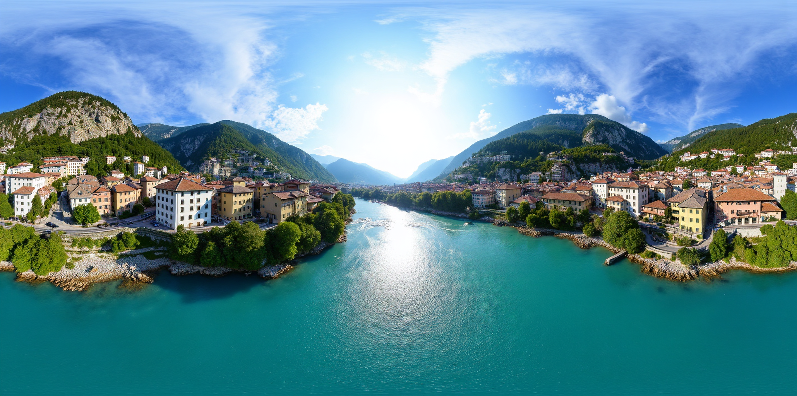</a>
<br/><b>青绿色河流分隔的如画小镇航拍全景</b>
<br/> 
</div>

<hr/>
<div align="center">
<a href="images/case142/output.png"></a>
<br/><b>秋季山谷湖泊全景</b>
<br/> 
</div>

<hr/>
<div align="center">
<a href="images/case143/output.png">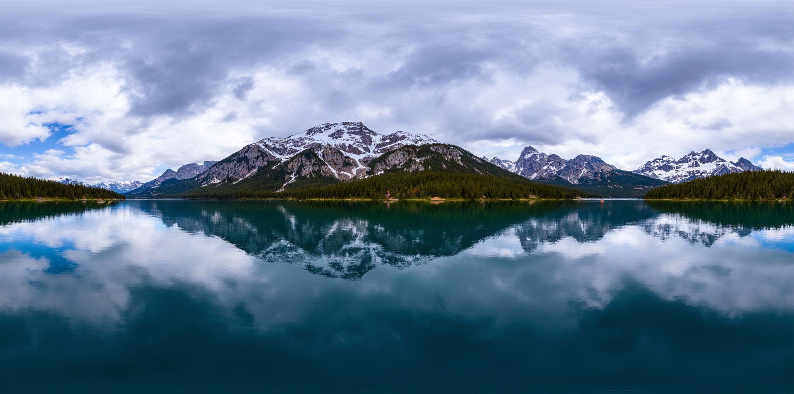</a>
<br/><b>平静湖泊全景，倒映着雪山与多云天空</b>
<br/> 
</div>

<hr/>
<div align="center">
<a href="images/case146/output.png">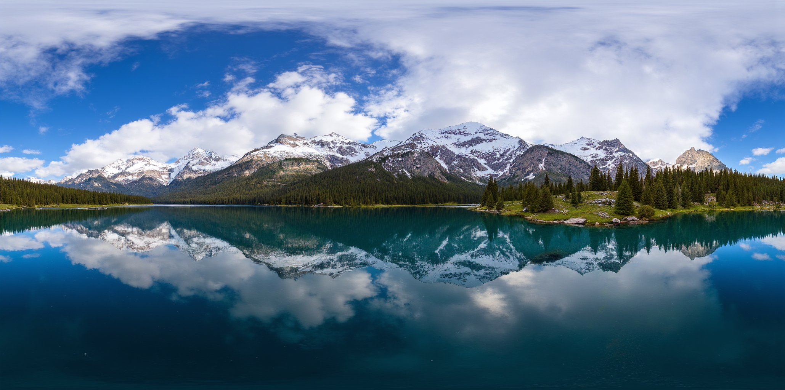</a>
<br/><b>宁静湖泊全景，倒映着雪山与多云蓝天</b>
<br/> 
</div>

<hr/>
<div align="center">
<a href="images/case149/output.png"></a>
<br/><b>青碧河流环绕的山间小镇</b>
<br/> 
</div>

<hr/>
<div align="center">
<a href="images/case152/output.png"></a>
<br/><b>自然风光山水森林湖泊倒影照片</b>
<br/> 
</div>

<hr/>
<div align="center">
<a href="images/case153/output.png"></a>
<br/><b>自然风光雪山湖泊秋色照片</b>
<br/> 
</div>

<hr/>
<div align="center">
<a href="images/case154/output.png">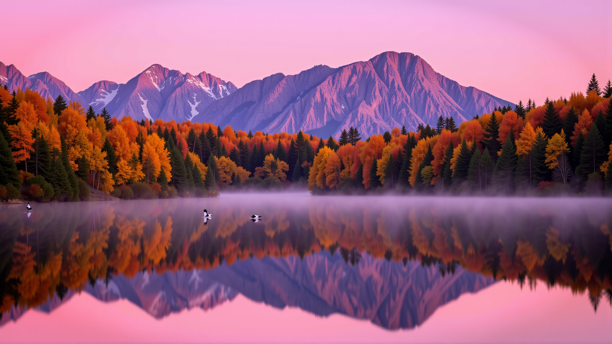</a>
<br/><b>秋季山林湖泊自然风光照片</b>
<br/> 
</div>

<hr/>
<div align="center">
<a href="images/case155/output.png"></a>
<br/><b>秋季富士山湖泊森林风景商业照片</b>
<br/> 
</div>

<hr/>
<div align="center">
<a href="images/case156/output.png"></a>
<br/><b>自然风光雪山森林湖泊倒影商业照片</b>
<br/> 
</div>

<hr/>
<div align="center">
<a href="images/case023/output.png">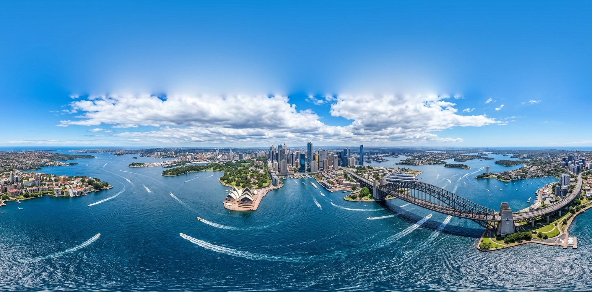</a>
<br/><b>悉尼港：世界级都市海港全景</b>
<br/> 
<br/><details><summary>📋 核心提示词</summary>

```json
{
  "{
  "图像元数据": {
    "类型": "360度等距柱状全景图",
    "投影方式": "完整球形等距柱状投影",
    "宽高比": "2:1",
    "分辨率": "超高分辨率全景"
  },
  "场景构图": {
    "地点": "澳大利亚，悉尼港 (Sydney Harbour)",
    "相机位置": "港湾中心上空",
    "相机高度": "高空航拍视角，上帝视角",
    "视野范围": "水平360度，垂直180度",
    "投影行为": "正确的等距柱状畸变，确保无缝球形拼接",
    "天气状况": "晴朗，海平面上方有厚实的层积云块",
    "景深": "全聚焦摄影，背景摩天大楼清晰可见"
  },
  "视觉元素": {
    "前景": {
      "主体视图": "波光粼粼的深蓝色海港水域",
      "动态": "船只留下的白色浪花与航迹"
    },
    "中景主体": {
      "地形": "悉尼歌剧院帆体、港湾大桥框架、环形码头摩天大楼",
      "村落": "密集的城市核心区建筑群",
      "云雾": "地平线上有低空积云"
    },
    "背景": {
      "景观": "延绵的悉尼港湾海岸线与零星的城市绿地",
      "天空": "明亮清澈的湛蓝天空"
    },
    "环境氛围": {
      "地面半球": "海港与城市天际线的交汇",
      "整体氛围": "充满活力、现代且明亮的国际都市感"
    }
  },
  "渲染风格": {
    "光照": "正午强烈的散射日光，水面反射丰富",
    "调色": "高清晰度的蓝白色调，色彩鲜艳夺目",
    "质感质量": {
      "描述": "金属、玻璃与水体的极致材质区分",
      "痕迹": "无人工痕迹，画面纯净，自然锐化",
      "拼接": "完美的360度无缝拼接"
    }
  },
  "约束条件": {
    "必须保留": ["纯360度全景透视", "海港大桥与歌剧院并存", "写实摄影质感"],
    "必须避免": ["奇幻滤镜", "画意处理", "人物近景", "界面UI"]
  },
  "负面提示词": ["用户界面", "抬头显示", "文本覆盖", "水印", "模糊", "低分辨率", "奇幻艺术", "插图", "过度处理", "边框", "裁剪视图", "全景接缝断裂"]
}"
}
```

<sub>📄 [下载完整 JSON](prompts/case023.json)</sub>
</details>
</div>

<hr/>
<div align="center">
<a href="images/case025/output.png">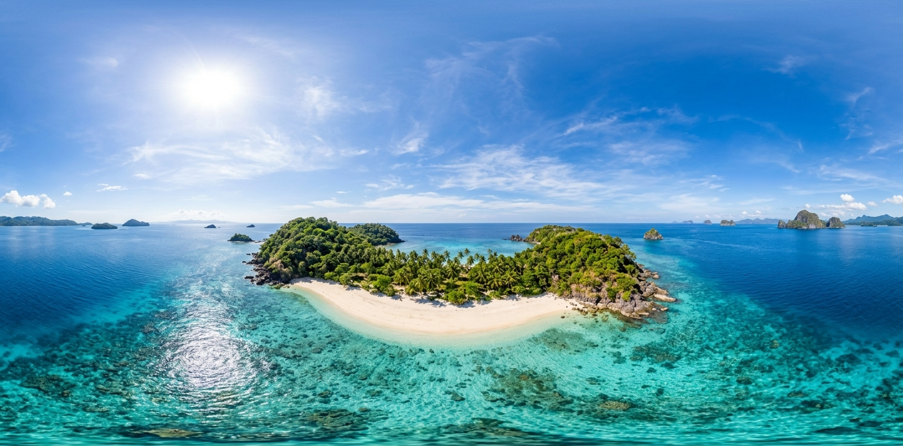</a>
<br/><b>60度绝美海岛全景图：碧海、金沙与绿岛</b>
<br/> 
<br/><details><summary>📋 核心提示词</summary>

```json
{
  "{
  "图像元数据": {
    "类型": "360度等距柱状全景图",
    "投影方式": "完整球形等距柱状投影",
    "宽高比": "2:1",
    "分辨率": "超高分辨率全景"
  },
  "场景构图": {
    "地点": "未命名的热带群岛（可能是菲律宾、印度尼西亚或泰国）",
    "相机位置": "位于中央海岛（具有沙滩的那个）前方的海面上空",
    "相机高度": "中高空航拍视角，提供广阔的上帝视角视野",
    "视野范围": "水平360度全景，垂直180度全景",
    "投影行为": "正确的等距柱状畸变，确保无缝球形拼接"
  },
  "视觉元素": {
    "前景": {
      "主体视图": "清澈见底、呈现出多种蓝绿色调的泻湖水，可以清晰地看到海底的珊瑚礁和沙质底部。",
      "动态": "平静的水面上只有微小的涟漪。"
    },
    "中景主体": {
      "地形": "中央是一个郁郁葱葱、由两部分组成的海岛，中间由一条弧形的白色沙滩连接。沙滩上郁郁葱葱，长满椰子树和各种热带植被。岛屿两侧是岩石海岸线。",
      "村落": "没有可见的村落或现代建筑。"
    },
    "背景": {
      "景观": "在远处和两侧，可以看到更多的小岛和岩石露头散落在碧蓝的大海上。",
      "天空": "广阔、蔚蓝的天空，布满柔和、羽毛状的卷云。太阳位于左上角，强烈地照耀着，形成明亮的光晕和反射。"
    },
    "环境氛围": {
      "地面半球": "主要由清澈的泻湖水、中央岛屿和散布的小岛组成。",
      "整体氛围": "宁静、天堂般、原始、度假胜地。"}
  },
  "渲染风格": {
    "光照": "强烈的阳光直接照射，营造出鲜明、生动的色彩和强烈的对比。",
    "调色": "饱和度高，碧蓝色、翠绿色、金黄色和纯白色形成鲜明对比。",
    "质感质量": {
      "描述": "超高分辨率、清晰锐利、高度写实，仿佛身临其境。",
      "痕迹": "无人工痕迹，画面纯净，自然锐化",
      "拼接": "完美的360度无缝拼接"
    }
  },
  "约束条件": {
    "必须保留": [
      "纯360度全景透视",
      "无人机中高空视角",
      "中央海岛（具有沙滩）和泻湖为核心主体",
      "无任何界面元素",
      "高度写实摄影感"
    ],
    "必须避免": [
      "城市或现代建筑",
      "人物",
      "电影感夸张灯光",
      "奇幻或游戏风格",
      "绘画或插画感",
      "非全景的普通照片布局"
    ]
  },
  "负面提示词": [
    "用户界面",
    "抬头显示",
    "文本覆盖",
    "水印",
    "现代建筑",
    "桥梁",
    "行人",
    "奇幻艺术",
    "插图",
    "过度处理",
    "边框",
    "裁剪视图",
    "全景接缝断裂"
  ]
}"
}
```

<sub>📄 [下载完整 JSON](prompts/case025.json)</sub>
</details>
</div>

<hr/>
<div align="center">
<a href="images/case026/output.png">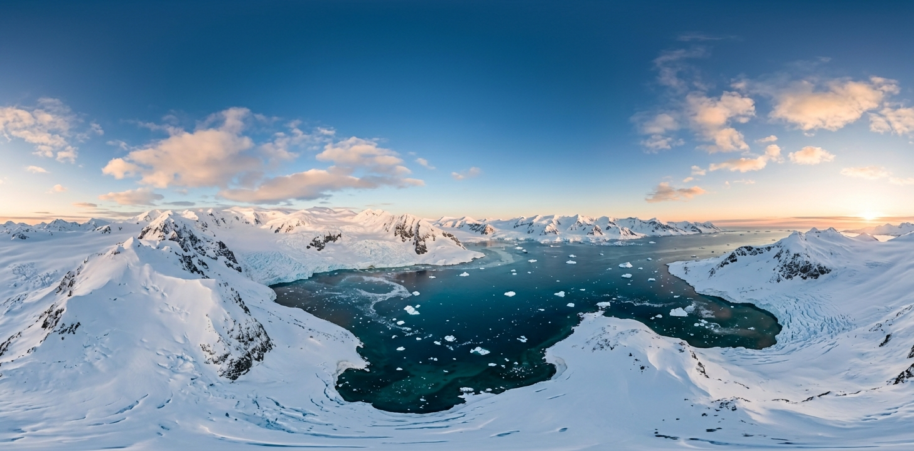</a>
<br/><b>拉贾安帕特：360度热带群岛航拍全景</b>
<br/> 
<br/><details><summary>📋 核心提示词</summary>

```json
{
  "{
  "图像元数据": {
    "类型": "360度等距柱状全景图",
    "投影方式": "完整球形等距柱状投影",
    "宽高比": "2:1",
    "分辨率": "超高分辨率全景"
  },
  "场景构图": {
    "地点": "拉贾安帕特群岛，印度尼西亚",
    "相机位置": "群岛中央上方，俯瞰全景",
    "相机高度": "高空航拍视角，上帝视角",
    "视野范围": "水平360度，垂直180度",
    "投影行为": "正确的等距柱状畸变，确保无缝球形拼接",
    "天气状况": "晴朗，光线充足，伴有飘渺的白云",
    "景深": "极深，所有元素清晰可见"
  },
  "视觉元素": {
    "前景": {
      "主体视图": "环绕视图的喀斯特石灰岩岛屿（覆盖着茂密的热带植被）、清澈见底的绿松石色泻湖和珊瑚礁。",
      "动态": "一艘小游船（左侧）、一艘移动的快艇（右侧）及其尾迹、潜水员（左侧）。"
    },
    "中景主体": {
      "地形": "散布在深蓝色海洋中的众多大小不一的岩石岛屿，由珊瑚礁和沙滩环绕。",
      "村落": "无",
      "云雾": "高空中的飘渺白云，增加了画面的层次感。"
    },
    "背景": {
      "景观": "远处的喀斯特群岛，在水平线上逐渐变小，融入地平线。",
      "天空": "广阔的蓝天，点缀着各种形状的白云。"
    },
    "环境氛围": {
      "地面半球": "深蓝色海洋和浅蓝色珊瑚礁泻湖，展现出丰富的水下地形。",
      "整体氛围": "壮观、宁静、原始、热带天堂。"
    }
  },
  "渲染风格": {
    "光照": "自然日光，来自左上角的明亮太阳，产生清晰的阴影和高光。",
    "调色": "鲜艳的色彩，包括深蓝色的海洋、绿松石色的泻湖、翠绿的岛屿和蓝白相间的天空。",
    "质感质量": {
      "描述": "超高分辨率照片，捕捉了岩石、植被和水面的细微细节。",
      "痕迹": "无人工痕迹，画面纯净，自然锐化。",
      "拼接": "完美的360度无缝拼接，无明显接缝。"
    }
  },
  "约束条件": {
    "必须保留": [
      "纯360度全景透视",
      "无人机高空视角",
      "喀斯特群岛为核心主体",
      "无任何界面元素",
      "高度写实摄影感",
      "绿松石色泻湖和珊瑚礁细节",
      "游船、快艇和潜水员的动态元素"
    ],
    "必须避免": [
      "城市或现代建筑",
      "大量人物（除了几个潜水员）",
      "电影感夸张灯光",
      "奇幻或游戏风格",
      "绘画或插画感",
      "非全景的普通照片布局",
      "可见的无人机操作员"
    ]
  },
  "负面提示词": [
    "用户界面",
    "抬头显示",
    "文本覆盖",
    "水印",
    "现代建筑",
    "桥梁",
    "大量行人",
    "奇幻艺术",
    "插图",
    "过度处理",
    "边框",
    "裁剪视图",
    "全景接缝断裂",
    "人工痕迹"
  ]
}"
}
```

<sub>📄 [下载完整 JSON](prompts/case026.json)</sub>
</details>
</div>

<hr/>
<div align="center">
<a href="images/case027/output.png"></a>
<br/><b>拉贾安帕特喀斯特群岛高空全景</b>
<br/> 
<br/><details><summary>📋 核心提示词</summary>

```json
{
  "{
  "图像元数据": {
    "类型": "360度等距柱状全景图",
    "投影方式": "完整球形等距柱状投影",
    "宽高比": "2:1",
    "分辨率": "超高分辨率全景"
  },
  "场景构图": {
    "地点": "拉贾安帕特群岛，印度尼西亚",
    "相机位置": "高空无人机，位于Pianemo（Piaynemo）观景台上方",
    "相机高度": "高空航拍视角，全景俯瞰",
    "视野范围": "水平360度，垂直180度",
    "投影行为": "精确的等距柱状畸变，确保无缝球形拼接",
    "天气状况": "晴空万里，微风，能见度极高",
    "景深": "深景深，全景细节清晰"
  },
  "视觉元素": {
    "前景": {
      "主体视图": "高空全景视角，下方是Pianemo观景台和木质栈道（如果可见），以及周围茂密的热带植被覆盖的喀斯特岛屿边缘。海水清澈见底，可以看到浅滩的沙底和珊瑚礁结构，颜色呈鲜艳的松石绿。",
      "动态": "平静的波纹"
    },
    "中景主体": {
      "地形": "拉贾安帕特标志性的喀斯特石灰岩岛屿群。岛屿呈不规则、锯齿状，覆盖着茂密的深绿色热带雨林。中央和右侧是较大的岛屿群，左侧是一系列较小的岛屿和礁石。岛屿周围的海水在阳光下呈现出丰富的蓝色层次：从浅滩的翡翠绿、松石绿，到深海的深蓝色和靛蓝色。在左侧较大的岛屿内部，有一个受保护的蓝色泻湖（可能是Piaynemo lagoon）。右侧岛屿形成一个马蹄形海湾，包围着深蓝色水域。",
      "村落": "无可见的现代城市，但可能有少数传统的小木船（Bangas）停靠在泻湖内或岛屿边缘（例如，在Piaynemo lagoon内可能有一条小船）。",
      "云雾": "天空中有丰富的、白色的积云（Cumulus clouds），均匀地分布在整个天穹，呈现出等距柱状投影特有的拉伸效果。"
    },
    "背景": {
      "景观": "地平线上，更遥远的喀斯特群岛和岛屿轮廓，延伸到视线尽头，与天空接壤。",
      "天空": "广阔的蓝色天空，布满白色的积云。左上角可见明亮、高高的太阳，在天空中产生强烈的眩光和晕圈（Sunburst effect）。"
    },
    "环境氛围": {
      "地面半球": "完全被清澈、多色调的海水和覆盖植被的岛屿地形所占据。",
      "整体氛围": "壮丽、宁静、热带天堂、探险、发现、自然之美、世界之巅的视角。"
    }
  },
  "渲染风格": {
    "光照": "强烈的自然日光，来自左上方的太阳。阳光在水面上产生闪烁的波纹反射（Glittering water），并强烈照亮岛屿植被。",
    "调色": "饱和度极高的自然色彩：鲜艳的深蓝、松石绿、翡翠绿、深绿（植被）、洁白（云朵）、明亮蓝（天空）。水面颜色层次丰富，过渡自然。",
    "质感质量": {
      "描述": "超高分辨率、清晰锐利、细节丰富。植被的叶片、岩石的纹理、珊瑚礁的结构、水面的波纹都清晰可见。",
      "痕迹": "无人工痕迹，画面纯净，自然锐化",
      "拼接": "完美的360度无缝拼接"
    }
  },
  "约束条件": {
    "必须保留": [
      "纯360度全景透视",
      "无人机高空视角",
      "拉贾安帕特喀斯特群岛为核心主体",
      "无任何界面元素",
      "高度写实摄影感",
      "太阳在天空中的位置和光晕"
    ],
    "必须避免": [
      "城市或现代建筑",
      "人物（除非极小的小木船）",
      "电影感夸张灯光",
      "奇幻或游戏风格",
      "绘画或插画感",
      "非全景的普通照片布局"
    ]
  },
  "负面提示词": [
    "用户界面",
    "抬头显示",
    "文本覆盖",
    "水印",
    "现代建筑",
    "桥梁",
    "行人",
    "奇幻艺术",
    "插图",
    "过度处理",
    "边框",
    "裁剪视图",
    "全景接缝断裂"
  ]
}"
}
```

<sub>📄 [下载完整 JSON](prompts/case027.json)</sub>
</details>
</div>

<hr/>
<div align="center">
<a href="images/case028/output.png"></a>
<br/><b>航拍拉贾安帕特群岛：黎明时分梦幻般的喀斯特海景</b>
<br/> 
<br/><details><summary>📋 核心提示词</summary>

```json
{
  "{
  "图像元数据": {
    "类型": "360度等距柱状全景图",
    "投影方式": "完整球形等距柱状投影",
    "宽高比": "2:1",
    "分辨率": "超高分辨率全景"
  },
  "场景构图": {
    "地点": "拉贾安帕特群岛（Raja Ampat Islands），Piaynemo观景点附近",
    "相机位置": "位于群岛中央的高空航拍视角，上帝视角",
    "相机高度": "高空航拍",
    "视野范围": "水平360度，垂直180度",
    "投影行为": "完美的等距柱状畸变，确保无缝球形拼接",
    "天气状况": "黎明时分，多云，天空清澈但带有粉色和紫色云层",
    "景深": "全景清晰"
  },
  "视觉元素": {
    "前景": {
      "主体视图": "下方是深蓝色海水，环绕着清晰可见的珊瑚礁和浅滩（蒂芙尼蓝到浅绿过渡）",
      "动态": "平静的水面，轻微的波纹反映天空"
    },
    "中景主体": {
      "地形": "散布在深蓝海洋中的喀斯特石灰岩岛屿（Karst islands），被茂密的深绿色热带雨林覆盖",
      "关键岛屿": "包括 Piaynemo 标志性的喀斯特地貌岛屿群，以及更远的几个较大的岛屿（如Batanta岛的一部分）",
      "云雾": "黎明薄雾在远处的岛屿间萦绕"
    },
    "背景": {
      "景观": "地平线上更多的群岛，延伸至无尽的海洋",
      "天空": "广阔的黎明天空，从地平线附近的柔和粉色、紫色、橙色过渡到顶部的深蓝色。积云分布，左侧有一团更浓密的云"
    },
    "环境氛围": {
      "地面半球": "完全覆盖着海洋、珊瑚礁和岛屿，没有地面",
      "整体氛围": "宁静、壮丽、神秘、未被开发的自然奇观"
    }
  },
  "渲染风格": {
    "光照": "自然的黎明柔光，光线主要来自地平线（左侧更亮），在水面上产生柔和的反射，照亮喀斯特岛屿的侧面",
    "调色": "深蓝、蒂芙尼蓝、深绿、粉、紫、橙",
    "质感质量": {
      "描述": "高度写实、细腻的摄影质感，清晰分辨珊瑚礁、树叶和岩石纹理",
      "痕迹": "无人工痕迹，画面纯净，自然锐化",
      "拼接": "完美的360度无缝拼接，地平线和天空连接自然"
    }
  },
  "约束条件": {
    "必须保留": [
      "纯360度全景透视",
      "无人机高空视角",
      "喀斯特群岛为核心主体",
      "无任何界面元素",
      "高度写实摄影感",
      "黎明的粉紫色调天空"
    ],
    "必须避免": [
      "城市或现代建筑",
      "人物",
      "电影感夸张灯光",
      "奇幻或游戏风格",
      "绘画或插画感",
      "非全景的普通照片布局"
    ]
  },
  "负面提示词": [
    "用户界面",
    "抬头显示",
    "文本覆盖",
    "水印",
    "现代建筑",
    "桥梁",
    "行人",
    "奇幻艺术",
    "插图",
    "过度处理",
    "边框",
    "裁剪视图",
    "全景接缝断裂"
  ]
}"
}
```

<sub>📄 [下载完整 JSON](prompts/case028.json)</sub>
</details>
</div>

<hr/>
<div align="center">
<a href="images/case029/output.png"></a>
<br/><b>四王群岛，360度空中全景：遗失的蓝色天堂</b>
<br/> 
<br/><details><summary>📋 核心提示词</summary>

```json
{
  "{
  "图像元数据": {
    "类型": "360度等距柱状全景图",
    "投影方式": "完整球形等距柱状投影",
    "宽高比": "2:1",
    "分辨率": "超高分辨率全景",
    "场景": "印度尼西亚拉贾安帕特 (Raja Ampat) 瓦亚格 (Wayag) 岛屿群"
  },
  "场景构图": {
    "相机位置": "高空无人机，上帝视角，俯瞰喀斯特迷宫",
    "视野范围": "水平360度，垂直180度，完美无缝",
    "投影行为": "正确的等距柱状畸变，确保球形拼接无缝，地平线居中",
    "天气状况": "晴朗至多云，光照充足，微风",
    "景深": "全景清晰，无限远"
  },
  "视觉元素": {
    "前景地表半球 (Nadir)": {
      "描述": "郁郁葱郁的热带植被覆盖的喀斯特岩石岛屿的顶部，位于图像底部的弯曲边缘，形成视觉边界。",
      "细节": "清晰可见的石灰岩质地和茂密的绿色树冠。"
    },
    "中景主体 (Main Body)": {
      "地形": "数百个覆盖着茂密绿色热带雨林的石灰岩喀斯特岛屿，形成复杂的、不规则的岛屿迷宫，延伸至地平线。",
      "水体": "水晶般清澈、分层清晰的海洋：从岛屿周围的浅绿松石色和浅绿色（显示沙底和生机勃勃的珊瑚礁），过渡到泻湖的湛蓝色，再到更深处的深蓝色。水面有轻微的波纹。",
      "动态": "在前景左下角的一个湛蓝色泻湖中，清晰可见一艘极小的白色双体船，作为比例尺，凸显群岛的浩瀚。"
    },
    "背景地平线 (Horizon)": {
      "景观": "远处的群岛在地平线上变小，形成连续的、低矮的蓝色山脊线。天空与海洋在地平线上完美交汇。",
      "天空": "广阔的蓝色天空，布满不同类型的积云和卷云，从图像中央（天顶）向四周（地平线）扩散。云层清晰、动态。天空与海洋在地平线上完美连接。"
    }
  },
  "渲染风格": {
    "光照": "自然日光，上午或下午的阳光，光线柔和但清晰，在水面上投下微妙的光影。",
    "调色": "自然、饱和度适中、清晰。强调绿色和蓝色。水体的绿松石色、湛蓝色和深蓝色分明，岛屿的翠绿色生机勃勃，天空的蓝色清澈。",
    "质感质量": {
      "描述": "高度写实主义摄影，极致细节。",
      "痕迹": "无数字伪影，无过度的锐化，无可见的拼接接缝。画面纯净、锐利。",
      "拼接": "完美的360度无缝拼接，地平线水平。"
    }
  },
  "约束条件": {
    "必须保留": [
      "纯360度全景透视",
      "无人机高空上帝视角",
      "复杂的喀斯特岛屿迷宫为主体",
      "清晰分层的水体颜色和珊瑚礁细节",
      "无缝拼接",
      "自然、非电影感光照"
    ],
    "必须避免": [
      "城市或现代建筑",
      "大型船只或港口",
      "人群或明显的人工设施",
      "电影感夸张的灯光或滤镜",
      "任何形式的用户界面元素",
      "全景接缝断裂"
    ]
  },
  "负面提示词": [
    "用户界面",
    "抬头显示",
    "文本覆盖",
    "水印",
    "现代建筑",
    "桥梁",
    "港口",
    "大型游轮",
    "过度的颗粒",
    "裁剪视图",
    "全景接缝断裂",
    "卡通",
    "插图"
  ]
}"
}
```

<sub>📄 [下载完整 JSON](prompts/case029.json)</sub>
</details>
</div>

<hr/>
<div align="center">
<a href="images/case030/output.png">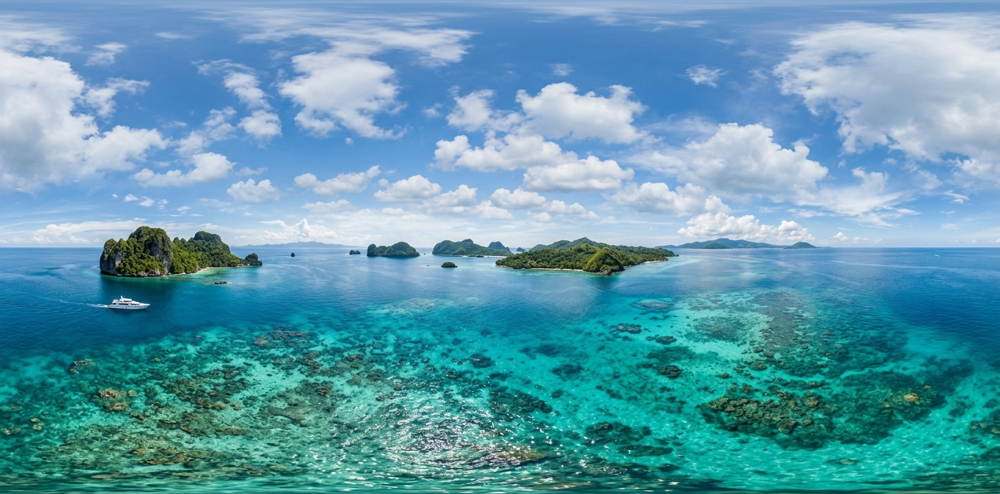</a>
<br/><b>龙目岛吉利群岛的高空无缝360全景</b>
<br/> 
<br/><details><summary>📋 核心提示词</summary>

```json
{
  "{
  "图像元数据": {
    "类型": "360度等距柱状全景图",
    "投影方式": "完整球形等距柱状投影",
    "宽高比": "2:1",
    "分辨率": "超高分辨率全景"
  },
  "场景构图": {
    "地点": "印度尼西亚，龙目岛附近的吉利群岛 (Gili Islands)",
    "相机位置": "位于该地区主要岛屿之一的上空，靠近清澈的珊瑚礁水域",
    "相机高度": "高空无人机全景视角，俯瞰整个群岛",
    "视野范围": "水平360度，垂直180度，完全沉浸式球形视野",
    "投影行为": "完美的等距柱状畸变，确保无缝球形拼接",
    "天气状况": "晴空万里，带有白色蓬松的积云",
    "景深": "深景深，全景范围内所有元素清晰可见"
  },
  "视觉元素": {
    "前景": {
      "主体视图": "近处的清澈海洋，可清晰看到水下错综复杂的珊瑚礁和沙底；海面反射着耀眼的阳光"
    },
    "中景主体": {
      "地形": "众多覆盖着茂密热带植被的石灰岩卡斯特岛屿，点缀在海面上；一艘白色游艇正在左侧岛屿附近航行",
      "村落": "无明显村落或现代建筑，保留了原始自然的群岛风貌",
      "云雾": "无云雾"
    },
    "背景": {
      "景观": "远处的其他岛屿和海平面延展至天际线",
      "天空": "广阔的蓝色天空，布满了形状自然的白色积云"
    },
    "环境氛围": {
      "地面半球": "完全由清澈、层次丰富的海洋和海底珊瑚礁覆盖",
      "整体氛围": "宁静、壮丽、热带乐园般的沉浸感"
    }
  },
  "渲染风格": {
    "光照": "明亮的自然日光，阳光直射，照亮了水和岛屿，海面上投射出耀眼的光斑",
    "调色": "鲜艳且饱和的热带调色，强调清澈的海水和翠绿的植被",
    "质感质量": {
      "描述": "极高，珊瑚礁、植被和水面的纹理清晰可辨",
      "痕迹": "无人工痕迹，画面纯净，自然锐化",
      "拼接": "完美的360度无缝拼接"
    }
  },
  "约束条件": {
    "必须保留": [
      "纯360度全景透视",
      "无人机高空视角",
      "吉利群岛石灰岩岛屿为核心主体",
      "清澈海水和水下珊瑚礁",
      "无任何界面元素",
      "高度写实摄影感"
    ],
    "必须避免": [
      "城市或现代高楼大厦",
      "人群（仅可有船只）",
      "电影感夸张灯光",
      "奇幻或游戏风格",
      "绘画或插画感",
      "非全景的普通照片布局"
    ]
  },
  "负面提示词": [
    "用户界面",
    "抬头显示",
    "文本覆盖",
    "水印",
    "现代建筑",
    "桥梁",
    "行人",
    "奇幻艺术",
    "插图",
    "过度处理",
    "边框",
    "裁剪视图",
    "全景接缝断裂"
  ]
}"
}
```

<sub>📄 [下载完整 JSON](prompts/case030.json)</sub>
</details>
</div>

<hr/>
<div align="center">
<a href="images/case035/output.png"></a>
<br/><b>梦幻云海：黄山奇峰360度航拍全景提示词</b>
<br/> 
<br/><details><summary>📋 核心提示词</summary>

```json
{
  "{
  "图像元数据": {
    "类型": "360度等距柱状全景图",
    "投影方式": "完整球形等距柱状投影",
    "宽高比": "2:1",
    "分辨率": "超高分辨率全景"
  },
  "场景构图": {
    "地点": "中国黄山风景区，核心景区高空",
    "相机位置": "360度全景相机，高空悬停",
    "相机高度": "高空航拍视角，上帝视角",
    "视野范围": "水平360度无缝，垂直180度覆盖天顶与天底",
    "投影行为": "精确的等距柱状投影畸变，确保无缝球形拼接，无任何裁剪或接缝",
    "天气状况": "日出时分，强烈的太阳辐射，丰富的云海和动态云雾",
    "景深": "极致深远的景深，前景清晰，远景深邃"
  },
  "视觉元素": {
    "前景": {
      "主体视图": "陡峭的花岗岩奇峰顶部和岩壁纹理，被低角度日出阳光照亮",
      "动态": "云雾在前景山谷间缓慢流动"
    },
    "中景主体": {
      "地形": "密集、垂直高耸的黄山奇峰群，覆盖着扭曲的黄山古松和灌木",
      "村落": "在左侧被光照亮的深谷中，隐藏着一个精细的、由灰瓦白墙组成的传统徽派古村落建筑群，通过古道相连",
      "云雾": "波浪状的云海填满山谷，在左侧被阳光照亮，形成金色光雾；在右侧呈现冷色调和阴影"
    },
    "背景": {
      "景观": "连绵不绝的远山在云海中时隐时现，逐渐消融在远方和阴影中",
      "天空": "广阔的蓝色天空，左侧有耀眼的日出光晕和可见的光柱；右侧天空深邃，带有稀疏的云朵"
    },
    "环境氛围": {
      "地面半球": "深度延伸至脚下的山谷，被云海和阴影覆盖",
      "整体氛围": "庄严、雄伟、梦幻、神秘的日出时刻"
    }
  },
  "渲染风格": {
    "光照": "极具戏剧性的日出光照。左侧是耀眼、温暖的直接日出光晕，伴随强烈的可见光柱；右侧是深邃、冷调的阴影，细节丰富但光线较弱",
    "调色": "金黄色和橙色的日出暖色调与深蓝色、灰色的冷色调形成强烈对比，色彩饱和度高但自然",
    "质感质量": {
      "描述": "超高分辨率、极致细节，岩石和树木纹理清晰锐利，无人工噪声",
      "痕迹": "无任何水印、标志、用户界面元素或文本覆盖，画面绝对纯净",
      "拼接": "完美的360度无缝拼接，无论是水平边缘还是垂直天顶/天底都自然过渡"
    }
  },
  "约束条件": {
    "必须保留": [
      "纯360度全景透视，覆盖完整球形空间",
      "无人机高空航拍视角",
      "黄山花岗岩奇峰和黄山松为核心地形主体",
      "左侧耀眼光晕和可见光柱的戏剧性光影布局",
      "隐藏在光照深谷中的古村落建筑群",
      "动态且丰富的云海景观",
      "高度写实的摄影质感，无水印和界面元素"
    ],
    "必须避免": [
      "城市或现代高楼建筑",
      "行人、车辆或可见的现代设施",
      "奇幻、游戏或科幻风格的非现实元素",
      "绘画、插画或卡通化质感",
      "非全景的普通照片布局或不完整的投影方式",
      "过度饱和或不自然的电影感夸张灯光",
      "任何可见的接缝、断裂或重叠痕迹"
    ]
  },
  "负面提示词": [
    "用户界面",
    "抬头显示",
    "文本覆盖",
    "水印",
    "AirPano标识",
    "现代建筑",
    "桥梁",
    "行人",
    "奇幻艺术",
    "插图",
    "过度处理",
    "边框",
    "裁剪视图",
    "全景接缝断裂",
    "人为噪点",
    "镜头光斑（除非是自然的太阳耀斑）"
  ]
}"
}
```

<sub>📄 [下载完整 JSON](prompts/case035.json)</sub>
</details>
</div>

<hr/>
<div align="center">
<a href="images/case041/output.png"></a>
<br/><b>上海陆家嘴黄浦江日出 360° 全景航拍</b>
<br/> 
<br/><details><summary>📋 核心提示词</summary>

```json
{
  "{
    "图像元数据": {
        "类型": "360度等距柱状全景图",
        "投影方式": "完整球形等距柱状投影",
        "宽高比": "2:1",
        "分辨率": "超高分辨率全景"
    },
    "场景构图": {
        "拍摄地点": "上海陆家嘴黄浦江上空",
        "机位": "无人机位于黄浦江正上方超高空航拍",
        "拍摄高度": "超高空无人机视角",
        "视野范围": "水平360°，垂直180°",
        "投影特性": "正确的等距柱状畸变",
        "天气状况": "日出晴朗天气，空气通透",
        "景深": "无限景深，全景画面全程清晰"
    },
    "视觉元素": {
        "前景": {
            "核心画面": "蜿蜒的黄浦江，江面如镜面反射日出霞光，两岸城市建筑鳞次栉比",
            "细节表现": "江面的反光质感、建筑的轮廓与质感清晰自然"
        },
        "中景": {
            "地形": "陆家嘴核心摩天建筑群，东方明珠、上海中心等地标建筑林立，与黄浦江自然衔接",
            "环境细节": "摩天楼的轮廓、玻璃幕墙的反光真实自然"
        },
        "背景": {
            "远景": "上海城市天际线向远方延伸，逐渐融入晨雾",
            "天空": "日出渐变天空占据上半球，从天际线暖橙到高空淡蓝自然过渡，点缀轻薄流云"
        },
        "环境氛围": {
            "下半球视角": "从超高空俯瞰黄浦江、陆家嘴建筑群与城市天际线",
            "整体气质": "繁华壮阔的国际大都市环境，保留原生城市风貌"
        }
    },
    "渲染风格": {
        "光影": "自然日出低角度侧光，真实光影方向，建筑与江面明暗层次自然",
        "色彩调校": "真实自然色彩，日出暖橙、建筑冷灰与江面暖金平衡，还原实景质感",
        "纹理质感": {
            "描述": "超写实航拍摄影风格",
            "处理细节": "轻微自然锐化，无人工痕迹",
            "拼接要求": "无缝360度全景拼接"
        }
    },
    "约束规则": {
        "必须保留": ["纯360°全景透视", "无人机超高空航拍视角", "上海陆家嘴为核心主体", "无任何UI或界面元素", "高度写实"],
        "严格规避": ["过度夸张的奇幻效果", "人物", "电影感灯光", "插画或绘画感", "单帧构图"]
    },
    "负面提示词": ["界面元素", "抬头显示", "文字叠加", "水印", "人物", "奇幻艺术", "插画", "电影感打光", "过度高动态范围", "过度处理", "画框", "边框", "裁切画面", "全景拼接断层", "人工元素"]
}"
}
```

<sub>📄 [下载完整 JSON](prompts/case041.json)</sub>
</details>
</div>

<hr/>
<div align="center">
<a href="images/case043/output.png">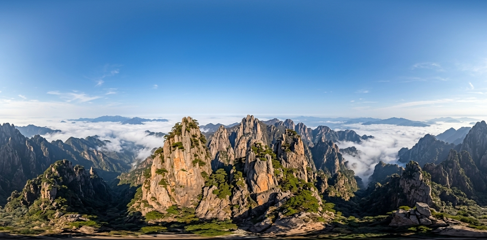</a>
<br/><b>黄山花岗岩峰林云海 360° 全景航拍</b>
<br/> 
<br/><details><summary>📋 核心提示词</summary>

```json
{
  "{
    "图像元数据": {
        "类型": "360度等距柱状全景图",
        "投影方式": "完整球形等距柱状投影",
        "宽高比": "2:1",
        "分辨率": "超高分辨率全景"
    },
    "场景构图": {
        "拍摄地点": "黄山花岗岩峰林地貌上空",
        "机位": "无人机位于奇峰正上方高空航拍",
        "拍摄高度": "高空无人机视角",
        "视野范围": "水平360°，垂直180°",
        "投影特性": "正确的等距柱状畸变",
        "天气状况": "晴朗云海天气，空气通透",
        "景深": "无限景深，全景画面全程清晰"
    },
    "视觉元素": {
        "前景": {
            "核心画面": "陡峭的花岗岩峰林，岩壁纹理与节理清晰，日光照射下呈现暖橙与深灰的明暗对比，立体轮廓极致突出",
            "细节表现": "花岗岩岩壁的质感与光影层次清晰自然"
        },
        "中景": {
            "地形": "层叠错落的峰林峡谷，纵深极强，山间萦绕流动云海",
            "植被细节": "山体缝隙生长的黄山松姿态苍劲，与岩石形成自然对比"
        },
        "背景": {
            "远景": "远方层叠的山脉向天际线延伸，逐渐融入云海",
            "天空": "澄澈的蓝天占据上半球，点缀少量轻薄流云，光线明亮自然"
        },
        "环境氛围": {
            "下半球视角": "从空中俯瞰花岗岩峰林、峡谷与远山云海",
            "整体气质": "原始奇峻的山岳地貌环境，无人类开发痕迹"
        }
    },
    "渲染风格": {
        "光影": "自然白日侧光，柔和真实光影，山体明暗层次自然",
        "色彩调校": "真实自然色彩，岩石暖橙、深灰与天空蓝平衡，还原实景质感",
        "纹理质感": {
            "描述": "超写实航拍摄影风格",
            "处理细节": "轻微自然锐化，无人工痕迹",
            "拼接要求": "无缝360度全景拼接"
        }
    },
    "约束规则": {
        "必须保留": ["纯360°全景透视", "无人机高空航拍视角", "黄山奇峰为核心主体", "无任何UI或界面元素", "高度写实"],
        "严格规避": ["城市或人工建筑", "人物", "电影感灯光", "奇幻风格", "插画或绘画感", "单帧构图"]
    },
    "负面提示词": ["界面元素", "抬头显示", "文字叠加", "水印", "建筑", "人物", "奇幻艺术", "插画", "电影感打光", "过度高动态范围", "过度处理", "画框", "边框", "裁切画面", "全景拼接断层", "人工元素"]
}"
}
```

<sub>📄 [下载完整 JSON](prompts/case043.json)</sub>
</details>
</div>

<hr/>
<div align="center">
<a href="images/case046/output.png"></a>
<br/><b>南极半岛冰雪海湾日出 360° 全景航拍</b>
<br/> 
<br/><details><summary>📋 核心提示词</summary>

```json
{
  "{
    "图像元数据": {
        "类型": "360度等距柱状全景图",
        "投影方式": "完整球形等距柱状投影",
        "宽高比": "2:1",
        "分辨率": "超高分辨率全景"
    },
    "场景构图": {
        "拍摄地点": "南极半岛冰雪海湾上空",
        "机位": "无人机位于海湾正上方超高空航拍",
        "拍摄高度": "超高空无人机视角",
        "视野范围": "水平360°，垂直180°",
        "投影特性": "正确的等距柱状畸变",
        "天气状况": "日出晴朗天气，空气通透",
        "景深": "无限景深，全景画面全程清晰"
    },
    "视觉元素": {
        "前景": {
            "核心画面": "两侧的冰雪半岛，纯白积雪覆盖崎岖海岸线，与深邃蓝绿色海水形成强烈色彩对比，海面漂浮零星碎冰",
            "细节表现": "冰雪的细腻质感、海水的通透质感、碎冰的轮廓清晰自然"
        },
        "中景": {
            "地形": "开阔的海湾，海水深邃平静，与冰雪半岛自然衔接",
            "环境细节": "海水的光影层次、碎冰的分布真实自然"
        },
        "背景": {
            "远景": "连绵的雪山山脉向天际线延伸，山顶积雪覆盖，轮廓清晰",
            "天空": "日出渐变天空占据上半球，从天际线暖橙到高空澄澈蓝自然过渡，点缀蓬松的白色积云"
        },
        "环境氛围": {
            "下半球视角": "从超高空俯瞰冰雪半岛、海湾与雪山山脉",
            "整体气质": "纯净壮阔的极地冰雪环境，无人类开发痕迹"
        }
    },
    "渲染风格": {
        "光影": "自然日出低角度侧光，真实光影方向，冰雪与海水明暗层次自然",
        "色彩调校": "真实自然色彩，暖金色日出光、白色冰雪与蓝绿色海水平衡，还原实景质感",
        "纹理质感": {
            "描述": "超写实航拍摄影风格",
            "处理细节": "轻微自然锐化，无人工痕迹",
            "拼接要求": "无缝360度全景拼接"
        }
    },
    "约束规则": {
        "必须保留": ["纯360°全景透视", "无人机超高空航拍视角", "南极冰雪海湾为核心主体", "无任何UI或界面元素", "高度写实"],
        "严格规避": ["城市或人工建筑", "人物", "电影感灯光", "奇幻风格", "插画或绘画感", "单帧构图"]
    },
    "负面提示词": ["界面元素", "抬头显示", "文字叠加", "水印", "建筑", "人物", "奇幻艺术", "插画", "电影感打光", "过度高动态范围", "过度处理", "画框", "边框", "裁切画面", "全景拼接断层", "人工元素"]
}"
}
```

<sub>📄 [下载完整 JSON](prompts/case046.json)</sub>
</details>
</div>

<hr/>
<div align="center">
<a href="images/case048/output.png">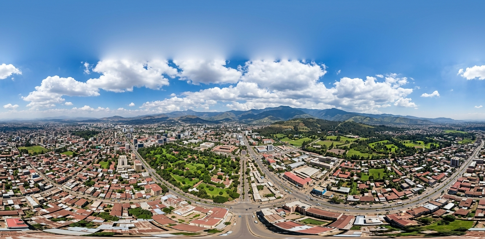</a>
<br/><b>里约热内卢基督像云海日出 360° 全景航拍</b>
<br/> 
<br/><details><summary>📋 核心提示词</summary>

```json
{
  "{
    "图像元数据": {
        "类型": "360度等距柱状全景图",
        "投影方式": "完整球形等距柱状投影",
        "宽高比": "2:1",
        "分辨率": "超高分辨率全景"
    },
    "场景构图": {
        "拍摄地点": "埃塞俄比亚亚的斯亚贝巴上空",
        "机位": "无人机位于城市正上方超高空航拍",
        "拍摄高度": "超高空无人机视角",
        "视野范围": "水平360°，垂直180°",
        "投影特性": "正确的等距柱状畸变",
        "天气状况": "晴朗天气，空气通透",
        "景深": "无限景深，全景画面全程清晰"
    },
    "视觉元素": {
        "前景": {
            "核心画面": "密集的城市建筑群，红褐色屋顶与绿色城市公园形成强烈色彩对比，规整道路与绿地自然衔接",
            "细节表现": "建筑群的轮廓、屋顶质感、公园植被层次清晰自然"
        },
        "中景": {
            "地形": "开阔的城市公园与城市道路，植被郁郁葱葱，道路规整有序",
            "环境细节": "公园的绿意、道路的线条真实自然"
        },
        "背景": {
            "远景": "连绵的高原山峦向天际线延伸，轮廓清晰",
            "天空": "澄澈的蓝天占据上半球，点缀蓬松的白色积云"
        },
        "环境氛围": {
            "下半球视角": "从超高空俯瞰城市建筑群、公园与高原山峦",
            "整体气质": "开阔质朴的高原城市环境，保留原生城市风貌"
        }
    },
    "渲染风格": {
        "光影": "自然白日顺光，真实光影方向，城市与山峦明暗层次自然",
        "色彩调校": "真实自然色彩，红褐色建筑、绿色公园与蓝色天空平衡，还原实景质感",
        "纹理质感": {
            "描述": "超写实航拍摄影风格",
            "处理细节": "轻微自然锐化，无人工痕迹",
            "拼接要求": "无缝360度全景拼接"
        }
    },
    "约束规则": {
        "必须保留": ["纯360°全景透视", "无人机超高空航拍视角", "亚的斯亚贝巴城市风貌为核心主体", "无任何UI或界面元素", "高度写实"],
        "严格规避": ["过度夸张的奇幻效果", "人物", "电影感灯光", "插画或绘画感", "单帧构图"]
    },
    "负面提示词": ["界面元素", "抬头显示", "文字叠加", "水印", "人物", "奇幻艺术", "插画", "电影感打光", "过度高动态范围", "过度处理", "画框", "边框", "裁切画面", "全景拼接断层", "人工元素"]
}"
}
```

<sub>📄 [下载完整 JSON](prompts/case048.json)</sub>
</details>
</div>

<hr/>
<div align="center">
<a href="images/case056/output.png"></a>
<br/><b>冰岛高地苔原秋季彩林与湖泊 360° 全景航拍</b>
<br/> 
<br/><details><summary>📋 核心提示词</summary>

```json
{
  "{
    "图像元数据": {
        "类型": "360度等距柱状全景图",
        "投影方式": "完整球形等距柱状投影",
        "宽高比": "2:1",
        "分辨率": "超高分辨率全景"
    },
    "场景构图": {
        "拍摄地点": "冰岛高地苔原秋季彩林与湖泊上空",
        "机位": "无人机位于苔原湖泊正上方超高空航拍",
        "拍摄高度": "超高空无人机视角",
        "视野范围": "水平360°，垂直180°",
        "投影特性": "正确的等距柱状畸变",
        "天气状况": "多云天气，空气通透",
        "景深": "无限景深，全景画面全程清晰"
    },
    "视觉元素": {
        "前景": {
            "核心画面": "广袤的秋季苔原彩林，植被呈现金黄、橙红、深绿的渐变色彩，层次丰富，散落的小型湖泊点缀其间",
            "细节表现": "秋季植被的色彩层次与质感自然真实，湖泊轮廓清晰"
        },
        "中景": {
            "地形": "中心的大型蓝色湖泊，被秋季苔原环绕，水面平静，反射天空光影",
            "水体": "湖泊水面澄澈，与苔原形成鲜明色彩对比"
        },
        "背景": {
            "远景": "连绵的山脉向天际线延伸，被云雾半遮半掩",
            "天空": "多云的灰蓝色天空占据上半球，云层厚重，光线均匀柔和"
        },
        "环境氛围": {
            "下半球视角": "从超高空俯瞰秋季苔原、湖泊群与云雾山脉",
            "整体气质": "辽阔苍茫的极地秋季苔原环境，无人类开发痕迹"
        }
    },
    "渲染风格": {
        "光影": "自然白日柔光，真实光影方向，突出秋季色彩层次",
        "色彩调校": "真实自然色彩，浓郁的秋季暖色调与湖泊蓝调平衡，还原实景质感",
        "纹理质感": {
            "描述": "超写实航拍摄影风格",
            "处理细节": "轻微自然锐化，无人工痕迹",
            "拼接要求": "无缝360度全景拼接"
        }
    },
    "约束规则": {
        "必须保留": ["纯360°全景透视", "无人机超高空航拍视角", "秋季苔原湖泊为核心主体", "无任何UI或界面元素", "高度写实"],
        "严格规避": ["城市或人工建筑", "人物", "电影感灯光", "奇幻风格", "插画或绘画感", "单帧构图"]
    },
    "负面提示词": ["界面元素", "抬头显示", "文字叠加", "水印", "建筑", "人物", "奇幻艺术", "插画", "电影感打光", "过度高动态范围", "过度处理", "画框", "边框", "裁切画面", "全景拼接断层", "人工元素"]
}"
}
```

<sub>📄 [下载完整 JSON](prompts/case056.json)</sub>
</details>
</div>

<hr/>
<div align="center">
<a href="images/case058/output.png"></a>
<br/><b>加勒比海群岛珊瑚礁海域 360° 全景航拍</b>
<br/> 
<br/><details><summary>📋 核心提示词</summary>

```json
{
  "{
    "图像元数据": {
        "类型": "360度等距柱状全景图",
        "投影方式": "完整球形等距柱状投影",
        "宽高比": "2:1",
        "分辨率": "超高分辨率全景"
    },
    "场景构图": {
        "拍摄地点": "加勒比海群岛珊瑚礁海域上空",
        "机位": "无人机位于群岛海域正上方超高空航拍",
        "拍摄高度": "超高空无人机视角",
        "视野范围": "水平360°，垂直180°",
        "投影特性": "正确的等距柱状畸变",
        "天气状况": "晴朗天气，空气通透",
        "景深": "无限景深，全景画面全程清晰"
    },
    "视觉元素": {
        "前景": {
            "核心画面": "大面积澄澈热带海洋，海水呈现从深海藏蓝到浅海绿松石色的自然渐变，水下珊瑚礁轮廓清晰可见，海面波光粼粼",
            "细节表现": "海水通透度高，海面光影与色彩过渡自然，水下珊瑚礁纹理清晰"
        },
        "中景": {
            "地形": "破碎的热带群岛，岛屿轮廓崎岖，覆盖热带绿色植被与少量裸露黄褐色土地，与珊瑚礁浅海自然衔接",
            "植被细节": "海岛覆盖的热带植被层次清晰，郁郁葱葱，与海洋自然融合"
        },
        "背景": {
            "远景": "广阔的海洋向天际线无限延伸，群岛轮廓逐渐柔和",
            "天空": "澄澈的蓝天占据上半球，点缀大量蓬松的白色积云，光线明亮自然"
        },
        "环境氛围": {
            "下半球视角": "从超高空俯瞰热带海洋、珊瑚礁群岛与远海天际线",
            "整体气质": "纯净治愈的热带海洋群岛环境，无大规模人类开发痕迹"
        }
    },
    "渲染风格": {
        "光影": "自然白日顺光，真实光影方向，海面与岛屿明暗层次自然",
        "色彩调校": "真实自然色彩，海洋蓝调、植被绿与天空蓝平衡，还原实景质感",
        "纹理质感": {
            "描述": "超写实航拍摄影风格",
            "处理细节": "轻微自然锐化，无人工痕迹",
            "拼接要求": "无缝360度全景拼接"
        }
    },
    "约束规则": {
        "必须保留": ["纯360°全景透视", "无人机超高空航拍视角", "热带群岛珊瑚礁海域为核心主体", "无任何UI或界面元素", "高度写实"],
        "严格规避": ["城市或密集人工建筑", "人物", "电影感灯光", "奇幻风格", "插画或绘画感", "单帧构图"]
    },
    "负面提示词": ["界面元素", "抬头显示", "文字叠加", "水印", "密集城市建筑", "人物", "奇幻艺术", "插画", "电影感打光", "过度高动态范围", "过度处理", "画框", "边框", "裁切画面", "全景拼接断层", "人工元素"]
}"
}
```

<sub>📄 [下载完整 JSON](prompts/case058.json)</sub>
</details>
</div>

<hr/>
<div align="center">
<a href="images/case059/output.png">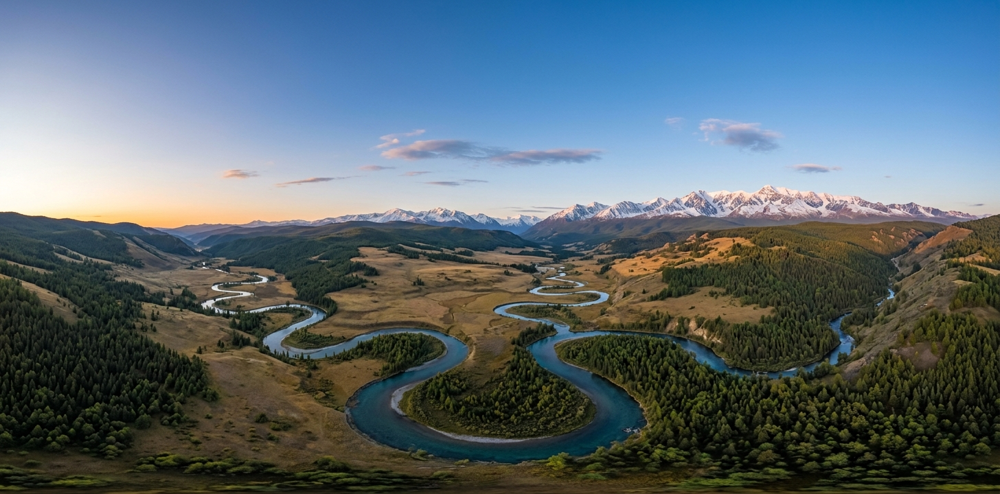</a>
<br/><b>阿尔泰山区曲流河与雪山日出 360° 全景航拍</b>
<br/> 
<br/><details><summary>📋 核心提示词</summary>

```json
{
  "{
    "图像元数据": {
        "类型": "360度等距柱状全景图",
        "投影方式": "完整球形等距柱状投影",
        "宽高比": "2:1",
        "分辨率": "超高分辨率全景"
    },
    "场景构图": {
        "拍摄地点": "阿尔泰山区曲流河与雪山上空",
        "机位": "无人机位于河谷正上方超高空航拍",
        "拍摄高度": "超高空无人机视角",
        "视野范围": "水平360°，垂直180°",
        "投影特性": "正确的等距柱状畸变",
        "天气状况": "日出晴朗天气，空气通透",
        "景深": "无限景深，全景画面全程清晰"
    },
    "视觉元素": {
        "前景": {
            "核心画面": "蜿蜒的蓝绿色曲流河，河道在河谷草甸与森林间自然穿梭，形成优美蛇形轮廓，河水澄澈通透",
            "细节表现": "曲流河的蜿蜒曲线、水体质感、草甸与森林的纹理层次清晰自然"
        },
        "中景": {
            "地形": "广袤的河谷草甸与森林，草甸呈现暖金色，森林深绿茂密，与河道自然衔接",
            "环境细节": "草甸的细腻质感、森林的层叠结构真实自然"
        },
        "背景": {
            "远景": "连绵的雪山山脉向天际线延伸，山顶积雪覆盖，轮廓清晰",
            "天空": "日出渐变蓝天占据上半球，从天际线暖橙到高空澄澈蓝自然过渡，点缀少量轻薄流云"
        },
        "环境氛围": {
            "下半球视角": "从超高空俯瞰曲流河、河谷草甸与雪山山脉",
            "整体气质": "辽阔静谧的阿尔泰山地自然环境，无人类开发痕迹"
        }
    },
    "渲染风格": {
        "光影": "自然日出低角度侧光，真实光影方向，山体与河道明暗层次自然",
        "色彩调校": "真实自然色彩，暖金色草甸、蓝绿色河水与雪山冷色调平衡，还原实景质感",
        "纹理质感": {
            "描述": "超写实航拍摄影风格",
            "处理细节": "轻微自然锐化，无人工痕迹",
            "拼接要求": "无缝360度全景拼接"
        }
    },
    "约束规则": {
        "必须保留": ["纯360°全景透视", "无人机超高空航拍视角", "曲流河与雪山为核心主体", "无任何UI或界面元素", "高度写实"],
        "严格规避": ["城市或人工建筑", "人物", "电影感灯光", "奇幻风格", "插画或绘画感", "单帧构图"]
    },
    "负面提示词": ["界面元素", "抬头显示", "文字叠加", "水印", "建筑", "人物", "奇幻艺术", "插画", "电影感打光", "过度高动态范围", "过度处理", "画框", "边框", "裁切画面", "全景拼接断层", "人工元素"]
}"
}
```

<sub>📄 [下载完整 JSON](prompts/case059.json)</sub>
</details>
</div>

<hr/>
<div align="center">
<a href="images/case060/output.png">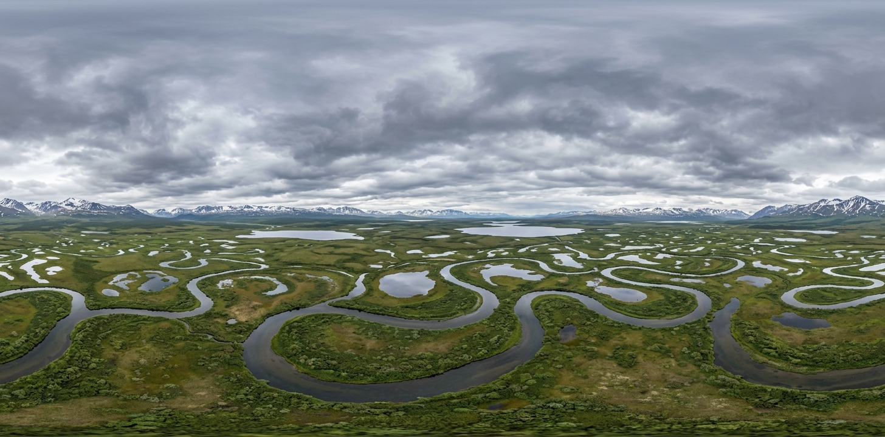</a>
<br/><b>西伯利亚苔原湿地曲流河 360° 全景航拍</b>
<br/> 
<br/><details><summary>📋 核心提示词</summary>

```json
{
  "{
    "图像元数据": {
        "类型": "360度等距柱状全景图",
        "投影方式": "完整球形等距柱状投影",
        "宽高比": "2:1",
        "分辨率": "超高分辨率全景"
    },
    "场景构图": {
        "拍摄地点": "西伯利亚苔原湿地曲流河上空",
        "机位": "无人机位于苔原湿地正上方超高空航拍",
        "拍摄高度": "超高空无人机视角",
        "视野范围": "水平360°，垂直180°",
        "投影特性": "正确的等距柱状畸变",
        "天气状况": "阴天多云天气，空气通透",
        "景深": "无限景深，全景画面全程清晰"
    },
    "视觉元素": {
        "前景": {
            "核心画面": "广袤的绿色苔原湿地，低矮茂密的植被层次丰富，蜿蜒的蛇形曲流河贯穿画面，河道自然弯曲形成牛轭湖轮廓，河水澄澈深邃",
            "细节表现": "曲流河的蜿蜒曲线、苔原植被的纹理、水体的质感清晰自然"
        },
        "中景": {
            "地形": "苔原湿地中散落的小型湖泊，与曲流河自然衔接；远处的大型高原湖泊，水面平静，反射天空光影",
            "环境细节": "湿地植被的层次、水面的质感自然真实，与苔原环境完美融合"
        },
        "背景": {
            "远景": "积雪覆盖的极地山脉向天际线延伸，在云层下若隐若现",
            "天空": "阴天多云的天空占据上半球，云层层次丰富，光线均匀柔和"
        },
        "环境氛围": {
            "下半球视角": "从超高空俯瞰苔原湿地、曲流河与远方雪山湖泊",
            "整体气质": "辽阔静谧的极地苔原原始生态环境，无人类开发痕迹"
        }
    },
    "渲染风格": {
        "光影": "阴天均匀柔光，真实光影方向，明暗过渡自然柔和，无强烈硬阴影",
        "色彩调校": "真实自然色彩，苔原绿色层次丰富，与水体、远山冷色调平衡，还原实景质感",
        "纹理质感": {
            "描述": "超写实极地生态航拍摄影风格",
            "处理细节": "轻微自然锐化，无人工痕迹",
            "拼接要求": "无缝360度全景拼接"
        }
    },
    "约束规则": {
        "必须保留": ["纯360°全景透视", "无人机超高空航拍视角", "苔原湿地曲流河为核心主体", "无任何UI或界面元素", "高度写实"],
        "严格规避": ["城市或人工建筑", "人物", "电影感灯光", "奇幻风格", "插画或绘画感", "单帧构图"]
    },
    "负面提示词": ["界面元素", "抬头显示", "文字叠加", "水印", "建筑", "人物", "奇幻艺术", "插画", "电影感打光", "过度高动态范围", "过度处理", "画框", "边框", "裁切画面", "全景拼接断层", "人工元素"]
}"
}
```

<sub>📄 [下载完整 JSON](prompts/case060.json)</sub>
</details>
</div>

<hr/>
<div align="center">
<a href="images/case061/output.png">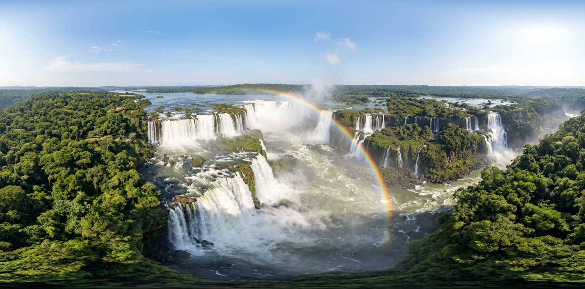</a>
<br/><b>伊瓜苏大瀑布群彩虹奇观 360° 全景航拍</b>
<br/> 
<br/><details><summary>📋 核心提示词</summary>

```json
{
  "{
    "图像元数据": {
        "类型": "360度等距柱状全景图",
        "投影方式": "完整球形等距柱状投影",
        "宽高比": "2:1",
        "分辨率": "超高分辨率全景"
    },
    "场景构图": {
        "拍摄地点": "伊瓜苏大瀑布群上空",
        "机位": "无人机位于瀑布群正上方高空航拍",
        "拍摄高度": "高空无人机视角",
        "视野范围": "水平360°，垂直180°",
        "投影特性": "正确的等距柱状畸变",
        "天气状况": "清晨晴朗天气，空气通透",
        "景深": "无限景深，全景画面全程清晰"
    },
    "视觉元素": {
        "前景": {
            "核心画面": "多段巨型瀑布群，宽阔水流从悬崖倾泻而下，形成大量升腾的白色水雾，阳光下水雾中形成一道完整的弧形彩虹，色彩清晰柔和",
            "细节表现": "水流的动态感、水雾的通透感、彩虹的色彩渐变自然真实"
        },
        "中景": {
            "地形": "瀑布两侧是茂密的亚热带热带雨林，植被郁郁葱葱，层次丰富；瀑布下方的河道水流湍急，水雾在水面上方弥漫",
            "环境细节": "雨林植被的质感、水流的动态纹理自然真实，与瀑布群自然融合"
        },
        "背景": {
            "远景": "连绵的雨林与瀑布群向天际线延伸，轮廓柔和自然",
            "天空": "清晨澄澈蓝天占据上半球，点缀少量轻薄流云，阳光明亮柔和"
        },
        "环境氛围": {
            "下半球视角": "从空中俯瞰瀑布群、水雾彩虹与热带雨林",
            "整体气质": "磅礴鲜活的世界级自然奇观环境，无人类开发痕迹"
        }
    },
    "渲染风格": {
        "光影": "自然清晨顺光，真实光影方向，瀑布明暗层次自然，彩虹光影效果真实",
        "色彩调校": "真实自然色彩，瀑布白色、雨林绿色、彩虹渐变色与天空蓝色平衡，还原实景质感",
        "纹理质感": {
            "描述": "超写实自然奇观航拍摄影风格",
            "处理细节": "轻微自然锐化，无人工痕迹",
            "拼接要求": "无缝360度全景拼接"
        }
    },
    "约束规则": {
        "必须保留": ["纯360°全景透视", "无人机高空航拍视角", "伊瓜苏瀑布群与彩虹奇观为核心主体", "无任何UI或界面元素", "高度写实"],
        "严格规避": ["城市或人工建筑", "人物", "电影感灯光", "奇幻风格", "插画或绘画感", "单帧构图"]
    },
    "负面提示词": ["界面元素", "抬头显示", "文字叠加", "水印", "建筑", "人物", "奇幻艺术", "插画", "电影感打光", "过度高动态范围", "过度处理", "画框", "边框", "裁切画面", "全景拼接断层", "人工元素", "彩虹失真"]
}"
}
```

<sub>📄 [下载完整 JSON](prompts/case061.json)</sub>
</details>
</div>

<hr/>
<div align="center">
<a href="images/case065/output.png">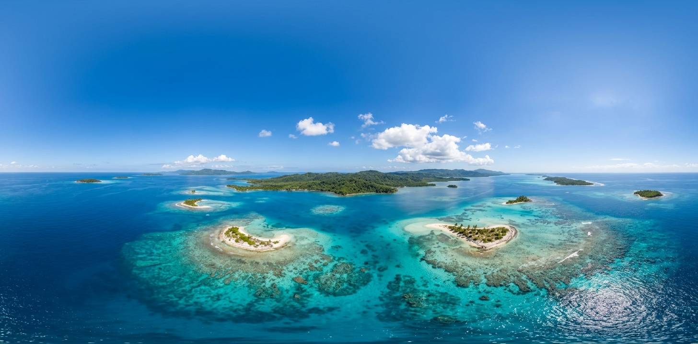</a>
<br/><b>加勒比海热带珊瑚礁群岛 360° 全景航拍</b>
<br/> 
<br/><details><summary>📋 核心提示词</summary>

```json
{
  "{
    "图像元数据": {
        "类型": "360度等距柱状全景图",
        "投影方式": "完整球形等距柱状投影",
        "宽高比": "2:1",
        "分辨率": "超高分辨率全景"
    },
    "场景构图": {
        "拍摄地点": "加勒比海热带珊瑚礁群岛海域上空",
        "机位": "无人机位于群岛海域正上方超高空航拍",
        "拍摄高度": "超高空无人机视角",
        "视野范围": "水平360°，垂直180°",
        "投影特性": "正确的等距柱状畸变",
        "天气状况": "晴朗天气，空气通透",
        "景深": "无限景深，全景画面全程清晰"
    },
    "视觉元素": {
        "前景": {
            "核心画面": "大面积澄澈热带海洋，海水呈现从深海藏蓝到浅海绿松石色的自然渐变，水下珊瑚礁轮廓清晰可见，海面波光粼粼",
            "细节表现": "海水通透度高，海面光影与色彩过渡自然，水下珊瑚礁纹理清晰"
        },
        "中景": {
            "地形": "月牙形的沙洲小岛，岛屿覆盖少量热带植被，被浅海珊瑚礁环绕；远处覆盖茂密热带植被的大型主岛，右侧点缀小型海岛",
            "植被细节": "海岛覆盖的热带植被层次清晰，郁郁葱葱，与海洋自然衔接"
        },
        "背景": {
            "远景": "广阔的海洋向天际线无限延伸，海岛轮廓逐渐柔和",
            "天空": "澄澈的蓝天占据上半球，点缀少量蓬松的白色积云，光线明亮自然"
        },
        "环境氛围": {
            "下半球视角": "从超高空俯瞰热带海洋、珊瑚礁群岛与远海天际线",
            "整体气质": "纯净治愈的热带海洋群岛环境，无大规模人类开发痕迹"
        }
    },
    "渲染风格": {
        "光影": "自然白日顺光，真实光影方向，海面与海岛明暗层次自然",
        "色彩调校": "真实自然色彩，海洋蓝调、植被绿与天空蓝平衡，还原实景质感",
        "纹理质感": {
            "描述": "超写实航拍摄影风格",
            "处理细节": "轻微自然锐化，无人工痕迹",
            "拼接要求": "无缝360度全景拼接"
        }
    },
    "约束规则": {
        "必须保留": ["纯360°全景透视", "无人机超高空航拍视角", "热带群岛珊瑚礁海域为核心主体", "无任何UI或界面元素", "高度写实"],
        "严格规避": ["城市或密集人工建筑", "人物", "电影感灯光", "奇幻风格", "插画或绘画感", "单帧构图"]
    },
    "负面提示词": ["界面元素", "抬头显示", "文字叠加", "水印", "密集城市建筑", "人物", "奇幻艺术", "插画", "电影感打光", "过度高动态范围", "过度处理", "画框", "边框", "裁切画面", "全景拼接断层", "人工元素"]
}"
}
```

<sub>📄 [下载完整 JSON](prompts/case065.json)</sub>
</details>
</div>

<hr/>
<div align="center">
<a href="images/case066/output.png"></a>
<br/><b>堪察加荒野溪流棕熊栖息地 360° 全景航拍</b>
<br/> 
<br/><details><summary>📋 核心提示词</summary>

```json
{
  "{
    "图像元数据": {
        "类型": "360度等距柱状全景图",
        "投影方式": "完整球形等距柱状投影",
        "宽高比": "2:1",
        "分辨率": "超高分辨率全景"
    },
    "场景构图": {
        "拍摄地点": "堪察加半岛荒野棕熊栖息地上空",
        "机位": "无人机位于溪流草甸正上方低空航拍",
        "拍摄高度": "低空无人机视角",
        "视野范围": "水平360°，垂直180°",
        "投影特性": "正确的等距柱状畸变",
        "天气状况": "阴天多云天气，空气通透",
        "景深": "无限景深，全景画面全程清晰"
    },
    "视觉元素": {
        "前景": {
            "核心画面": "湍急的山间溪流，溪水在岩石间奔涌形成白色水花，溪流蜿蜒贯穿画面，水体质感自然真实",
            "细节表现": "溪水的流动感、水花的动态模糊、岩石的纹理细节清晰自然"
        },
        "中景": {
            "地形": "溪流中央的苔原草甸，两只野生棕熊自然分布，一只在溪水中涉水，一只在草甸岸边行走，棕熊毛发质感与动作姿态真实自然；溪流两侧是广袤的绿色苔原草甸，植被层次丰富",
            "环境细节": "棕熊的细节清晰不突兀，与环境自然融合，草甸植被的质感与层次真实"
        },
        "背景": {
            "远景": "积雪覆盖的火山山脉向天际线延伸，在云层下若隐若现",
            "天空": "阴天多云的灰白色天空占据上半球，云层层次丰富，光线均匀柔和"
        },
        "环境氛围": {
            "下半球视角": "从空中俯瞰山间溪流、苔原草甸与棕熊栖息地",
            "整体气质": "野性壮阔的原始荒野生态环境，无人类开发痕迹"
        }
    },
    "渲染风格": {
        "光影": "阴天均匀柔光，真实光影方向，明暗过渡自然，无强烈硬阴影",
        "色彩调校": "真实自然色彩，草甸绿色、溪水深色调与远山冷色调平衡，还原实景质感",
        "纹理质感": {
            "描述": "超写实生态航拍摄影风格",
            "处理细节": "轻微自然锐化，无人工痕迹",
            "拼接要求": "无缝360度全景拼接"
        }
    },
    "约束规则": {
        "必须保留": ["纯360°全景透视", "无人机低空航拍视角", "棕熊与荒野栖息地为核心主体", "无任何UI或界面元素", "高度写实"],
        "严格规避": ["城市或人工建筑", "人物", "电影感灯光", "奇幻风格", "插画或绘画感", "单帧构图", "人工干预痕迹"]
    },
    "负面提示词": ["界面元素", "抬头显示", "文字叠加", "水印", "建筑", "人物", "奇幻艺术", "插画", "电影感打光", "过度高动态范围", "过度处理", "画框", "边框", "裁切画面", "全景拼接断层", "人工元素", "动物园场景"]
}"
}
```

<sub>📄 [下载完整 JSON](prompts/case066.json)</sub>
</details>
</div>

<hr/>
<div align="center">
<a href="images/case068/output.png">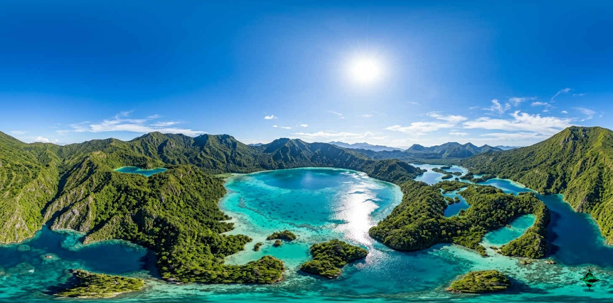</a>
<br/><b>印尼四王岛热带群岛珊瑚礁海域 360° 全景航拍</b>
<br/> 
<br/><details><summary>📋 核心提示词</summary>

```json
{
  "{
    "图像元数据": {
        "类型": "360度等距柱状全景图",
        "投影方式": "完整球形等距柱状投影",
        "宽高比": "2:1",
        "分辨率": "超高分辨率全景"
    },
    "场景构图": {
        "拍摄地点": "印尼四王岛热带群岛珊瑚礁海域上空",
        "机位": "无人机位于群岛海域正上方高空航拍",
        "拍摄高度": "高空无人机视角",
        "视野范围": "水平360°，垂直180°",
        "投影特性": "正确的等距柱状畸变",
        "天气状况": "晴朗天气，空气通透",
        "景深": "无限景深，全景画面全程清晰"
    },
    "视觉元素": {
        "前景": {
            "核心画面": "大面积澄澈热带海洋，海水呈现深蓝到浅绿松石色的自然渐变，水下珊瑚礁轮廓可见，散落着小型热带岛屿",
            "细节表现": "海水通透度高，海面光影与色彩过渡自然"
        },
        "中景": {
            "地形": "被茂密热带雨林覆盖的大型群岛，岛屿轮廓崎岖，海湾与潟湖交错分布，海面萦绕少量轻薄云雾",
            "植被细节": "岛屿覆盖的雨林植被层次清晰，郁郁葱葱"
        },
        "背景": {
            "远景": "广阔的海洋向天际线无限延伸",
            "天空": "澄澈的蓝天占据上半球，点缀少量蓬松白云，阳光在海面形成明亮反光带"
        },
        "环境氛围": {
            "下半球视角": "从空中俯瞰热带海洋、群岛与珊瑚礁地形",
            "整体气质": "原始纯净的热带海洋群岛环境，无人类开发痕迹"
        }
    },
    "渲染风格": {
        "光影": "自然白日顺光，真实光影方向，海面与岛屿明暗层次自然",
        "色彩调校": "真实自然色彩，海洋蓝调、植被绿与天空蓝平衡，还原实景质感",
        "纹理质感": {
            "描述": "超写实航拍摄影风格",
            "处理细节": "轻微自然锐化，无人工痕迹",
            "拼接要求": "无缝360度全景拼接"
        }
    },
    "约束规则": {
        "必须保留": ["纯360°全景透视", "无人机高空航拍视角", "热带群岛海域为核心主体", "无任何UI或界面元素", "高度写实"],
        "严格规避": ["城市或人工建筑", "人物", "电影感灯光", "奇幻风格", "插画或绘画感", "单帧构图"]
    },
    "负面提示词": ["界面元素", "抬头显示", "文字叠加", "水印", "建筑", "人物", "奇幻艺术", "插画", "电影感打光", "过度高动态范围", "过度处理", "画框", "边框", "裁切画面", "全景拼接断层", "人工元素"]
}
"
}
```

<sub>📄 [下载完整 JSON](prompts/case068.json)</sub>
</details>
</div>

<hr/>
<div align="center">
<a href="images/case069/output.png">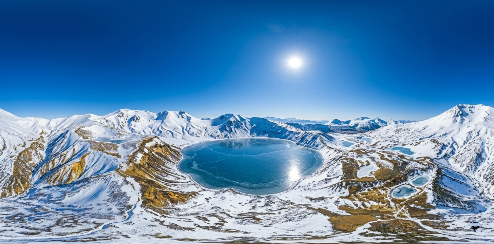</a>
<br/><b>南极极地雪原冰湖荒原 360° 全景航拍</b>
<br/> 
<br/><details><summary>📋 核心提示词</summary>

```json
{
  "{
    "图像元数据": {
        "类型": "360度等距柱状全景图",
        "投影方式": "完整球形等距柱状投影",
        "宽高比": "2:1",
        "分辨率": "超高分辨率全景"
    },
    "场景构图": {
        "拍摄地点": "南极极地雪原冰湖荒地上空",
        "机位": "无人机位于雪原冰湖正上方高空航拍",
        "拍摄高度": "高空无人机视角",
        "视野范围": "水平360°，垂直180°",
        "投影特性": "正确的等距柱状畸变",
        "天气状况": "晴朗极寒天气，空气通透",
        "景深": "无限景深，全景画面全程清晰"
    },
    "视觉元素": {
        "前景": {
            "核心画面": "大面积白雪覆盖的荒原山地，雪层下的黄色土地纹理自然，蜿蜒的冰湖嵌入雪原，冰面呈现澄澈蓝色",
            "细节表现": "雪层的质感与光影层次清晰，冰面通透度自然"
        },
        "中景": {
            "地形": "层叠的雪原丘陵，沟壑纵横交错，远方的雪山山脉轮廓清晰",
            "水体": "冰湖自然蜿蜒，与雪原形成鲜明色彩对比"
        },
        "背景": {
            "远景": "远方的雪山山脉向天际线延伸，融入极地晴空",
            "天空": "澄澈的极地蓝天占据上半球，明亮的太阳，无云的纯净晴空"
        },
        "环境氛围": {
            "下半球视角": "从空中俯瞰雪原冰湖、丘陵与雪山地形",
            "整体气质": "极寒辽阔的极地雪原环境，无人类开发痕迹"
        }
    },
    "渲染风格": {
        "光影": "自然白日顺光，高对比度真实光影，雪原明暗层次自然",
        "色彩调校": "真实自然色彩，雪白色、冰蓝色与土地暖黄色平衡，还原实景质感",
        "纹理质感": {
            "描述": "超写实航拍摄影风格",
            "处理细节": "轻微自然锐化，无人工痕迹",
            "拼接要求": "无缝360度全景拼接"
        }
    },
    "约束规则": {
        "必须保留": ["纯360°全景透视", "无人机高空航拍视角", "雪原冰湖为核心主体", "无任何UI或界面元素", "高度写实"],
        "严格规避": ["城市或人工建筑", "人物", "电影感灯光", "奇幻风格", "插画或绘画感", "单帧构图"]
    },
    "负面提示词": ["界面元素", "抬头显示", "文字叠加", "水印", "建筑", "人物", "奇幻艺术", "插画", "电影感打光", "过度高动态范围", "过度处理", "画框", "边框", "裁切画面", "全景拼接断层", "人工元素"]
}"
}
```

<sub>📄 [下载完整 JSON](prompts/case069.json)</sub>
</details>
</div>

<hr/>
<div align="center">
<a href="images/case076/output.png">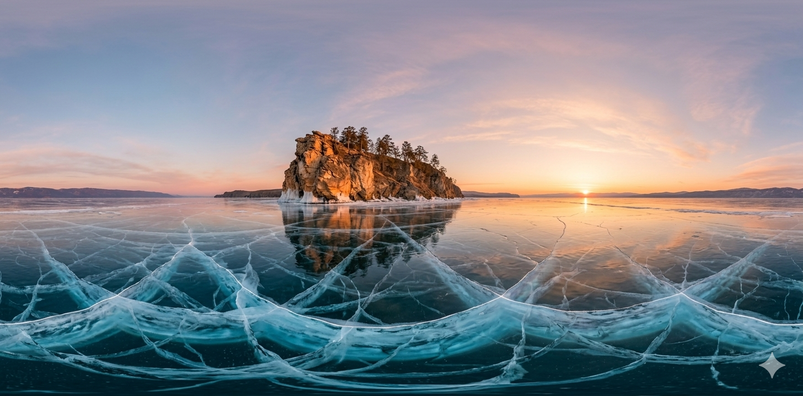</a>
<br/><b>冰镜岩岛：贝加尔湖冰裂镜面的日落盛景</b>
<br/> 
<br/><details><summary>📋 核心提示词</summary>

```json
{
  "{
  "图像元数据": {
    "类型": "360度等距柱状全景图",
    "投影": "完整球形等距柱状投影",
    "长宽比": "2比1",
    "分辨率": "8K极致清晰"
  },
  "场景构图": {
    "地点": "俄罗斯贝加尔湖奥利洪岛附近镜面冰面",
    "相机位置": "冰面上方低空悬停",
    "相机高度": "模拟沉浸式低空航拍视角",
    "视野范围": "水平360度，垂直180度",
    "透视表现": "蛛网般冰裂纹路在冰面上无限延伸，湖心岩岛居于画面中景，冰面完美倒映天空与岩岛，地平线平滑无缝衔接",
    "天气": "晴朗少云，空气通透度极高",
    "景深控制": "近景冰裂纹理、中景岩岛倒影与远景湖面天际线全清晰"
  },
  "视觉元素": {
    "前景": { "主要特征": "镜面冰面的蛛网般冰裂纹理，澄澈冰体的蓝青渐变质感，冰面的完美镜面倒影", "动态": "完全静态" },
    "中景主体": { "地貌": "广袤的镜面冰封湖面，湖心矗立的岩石岛屿", "细节": "冰面完美倒映的岩岛与日落霞光，冰裂纹路的亮白色高光，岩岛岩壁的金橙色暖光质感，冰体的澄澈通透感", "特征": "澄澈的蓝青色冰面、暖金橙色的岩壁、冰面的完美倒影与日落暖霞光的梦幻组合" },
    "背景": { "远景": "冰封湖面延伸至远方的湖岸线", "天空": "从暖橙色到淡蓝色渐变的日落天空，落日悬于海平面上方，带有轻薄的白色云霞" },
    "环境氛围": { "地面半球": "西伯利亚的冰封幻境圣境", "氛围感": "梦幻、孤寂、纯净、壮阔" }
  },
  "渲染风格": {
    "光影方案": "冬日日落的低角度斜射暖光，给岩壁镀上暖调轮廓光，强调冰面的镜面倒影质感与冰裂纹路的高光层次，突出冰体的通透感",
    "色彩科学": "高通透度的蓝青色冰面、暖金橙色的岩壁、暖橙色的日落霞光与淡蓝色的天空形成极致的冷暖对比，色彩还原精准梦幻",
    "质感质量": { "描述": "极高清的冰封镜面湖泊风光航拍", "细节": "完美的360度全视角无缝拼接，无畸变，倒影清晰无断层" }
  },
  "核心约束": {
    "必须保留": [ "冰面蛛网般的冰裂纹理", "冰面的完美镜面倒影", "冰体的蓝青通透感", "日落的暖调氛围感", "全景环绕的冰封湖面空间感" ],
    "严禁出现": [ "文字", "水印", "人工建筑", "游客", "车辆", "冰面杂物", "低对比度", "倒影模糊" ]
  },
  "负面提示词": [ "文字", "水印", "模糊", "低画质", "暗沉色调", "拼接裂缝", "畸变", "人工设施", "杂物", "倒影失真", "过曝" ]
}"
}
```

<sub>📄 [下载完整 JSON](prompts/case076.json)</sub>
</details>
</div>

<hr/>
<div align="center">
<a href="images/case077/output.png">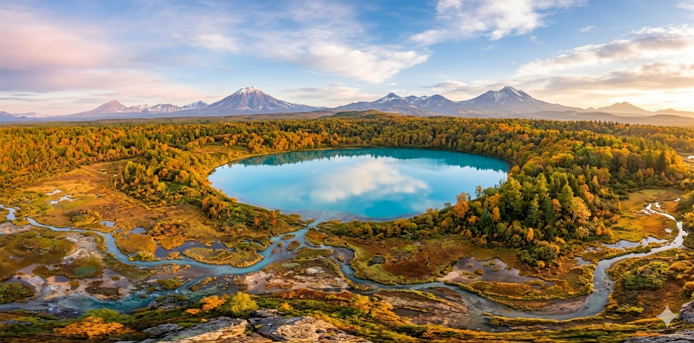</a>
<br/><b>蓝湖秋境：堪察加地热蓝湖的秋日盛景</b>
<br/> 
<br/><details><summary>📋 核心提示词</summary>

```json
{
  "{
  "图像元数据": {
    "类型": "360度等距柱状全景图",
    "投影": "完整球形等距柱状投影",
    "长宽比": "2比1",
    "分辨率": "8K极致清晰"
  },
  "场景构图": {
    "地点": "俄罗斯堪察加半岛地热蓝湖湿地",
    "相机位置": "蓝湖上空中低空悬停",
    "相机高度": "模拟沉浸式低空航拍视角",
    "视野范围": "水平360度，垂直180度",
    "透视表现": "地热蓝湖居于画面中景，彩林湿地环绕湖面，地平线平滑无缝衔接",
    "天气": "多云晴好，空气通透度高",
    "景深控制": "近景蓝湖纹理、中景彩林层次与远景山脉天际线全清晰"
  },
  "视觉元素": {
    "前景": { "主要特征": "湿地的多彩植被肌理，金橙色的秋日灌木，蜿蜒的地热溪流", "动态": "完全静态" },
    "中景主体": { "地貌": "澄澈的地热蓝湖，环绕湖面的秋日彩林湿地", "细节": "蓝湖的蒂芙尼蓝澄澈水面，湖面的天光倒影，彩林的金橙黄绿渐变色彩，湿地的斑驳植被纹理", "特征": "极致纯净的蒂芙尼蓝湖面、金橙色的秋日彩林与深邃棕褐色阴影的冷暖组合" },
    "背景": { "远景": "连绵的火山山脉延伸至天际线", "天空": "蓝白相间的多云天空，云层缝隙透出日出晨光" },
    "环境氛围": { "地面半球": "地球尽头的秋日蓝湖秘境", "氛围感": "治愈、梦幻、鲜活、静谧" }
  },
  "渲染风格": {
    "光影方案": "秋日日出的低角度斜射暖光，给彩林镀上暖调轮廓光，强调蓝湖水面的澄澈反光质感与彩林的鲜活色彩，突出画面的治愈氛围感",
    "色彩科学": "高饱和度的蒂芙尼蓝湖面、金橙色的秋日彩林、翠绿色的植被与蓝白色的天空形成极致的冷暖对比，色彩还原自然鲜活",
    "质感质量": { "描述": "极高清的地热蓝湖秋日风光航拍", "细节": "完美的360度全视角无缝拼接，无畸变" }
  },
  "核心约束": {
    "必须保留": [ "蓝湖的弧形水岸轮廓与澄澈蒂芙尼蓝色", "秋日彩林的金橙暖调", "湖面的天光倒影", "全景环绕的湿地空间感" ],
    "严禁出现": [ "文字", "水印", "人工建筑", "游客", "车辆", "围栏", "低对比度", "色彩失真" ]
  },
  "负面提示词": [ "文字", "水印", "模糊", "低画质", "暗沉色调", "拼接裂缝", "畸变", "人工设施", "杂物", "色彩失真", "过曝" ]
}
}
```

<sub>📄 [下载完整 JSON](prompts/case077.json)</sub>
</details>
</div>

<hr/>
<div align="center">
<a href="images/case079/output.png">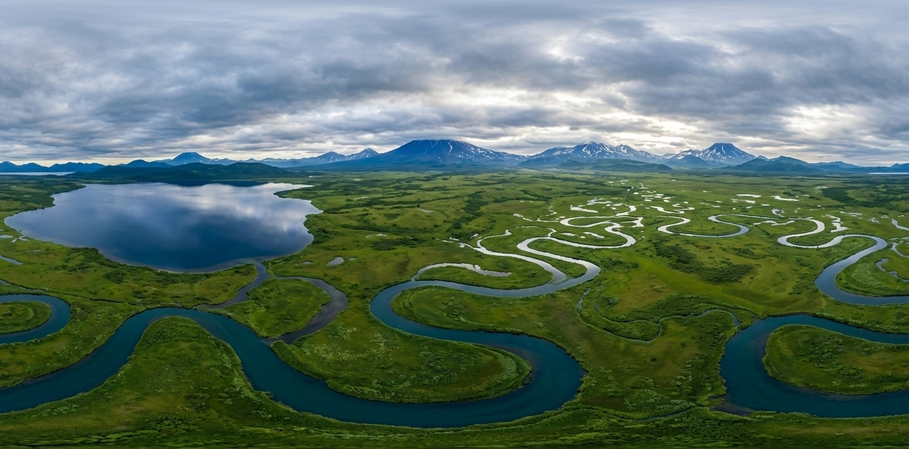</a>
<br/><b>绿野九曲：堪察加原始湿地的河曲湖境盛景</b>
<br/> 
<br/><details><summary>📋 核心提示词</summary>

```json
{
  "{
  "图像元数据": {
    "类型": "360度等距柱状全景图",
    "投影": "完整球形等距柱状投影",
    "长宽比": "2比1",
    "分辨率": "8K极致清晰"
  },
  "场景构图": {
    "地点": "俄罗斯堪察加半岛克罗诺基自然保护区湿地",
    "相机位置": "湿地上空中高空悬停",
    "相机高度": "模拟广域高空航拍视角",
    "视野范围": "水平360度，垂直180度",
    "透视表现": "蜿蜒河曲在湿地上无限延伸，火山湖居于画面左侧，地平线平滑无缝衔接",
    "天气": "多云阴天，云层缝隙透出晨光，空气湿度高",
    "景深控制": "近景河曲纹理、中景湿地层次与远景火山山脉天际线全清晰"
  },
  "视觉元素": {
    "前景": { "主要特征": "蜿蜒河曲的蛇形轮廓，翠绿湿地的细腻植被肌理，河流的深邃水面", "动态": "完全静态" },
    "中景主体": { "地貌": "广袤的原始湿地，九曲回肠的蜿蜒河流，大型火山湖", "细节": "河曲的蜿蜒流动线条，湿地的翠绿苔原植被，火山湖的深邃藏蓝色水面，河流与湖泊的水岸轮廓", "特征": "鲜活的翠绿色湿地、深邃藏蓝色河湖与远方黛蓝色火山山脉的层次组合" },
    "背景": { "远景": "层叠的火山山脉延伸至天际线，山顶覆盖积雪", "天空": "厚重的灰白色云层，云层缝隙透出柔和的晨光" },
    "环境氛围": { "地面半球": "地球尽头的原始绿野秘境", "氛围感": "静谧、治愈、鲜活、壮阔" }
  },
  "渲染风格": {
    "光影方案": "多云天气的柔和散射光，云层缝隙透出的晨光勾勒远方山脉轮廓，强调湿地植被的鲜活色彩与河湖水面的通透质感，突出画面的空间纵深感",
    "色彩科学": "高饱和度的翠绿色湿地、深邃藏蓝色河湖、黛蓝色火山山脉与灰白色云层形成柔和又丰富的色彩层次，色彩还原自然鲜活",
    "质感质量": { "描述": "极高清的原始湿地风光航拍", "细节": "完美的360度全视角无缝拼接，无畸变" }
  },
  "核心约束": {
    "必须保留": [ "河曲蜿蜒的蛇形轮廓", "湿地的翠绿鲜活质感", "河湖的深邃水面层次", "全景环绕的湿地辽阔空间感" ],
    "严禁出现": [ "文字", "水印", "人工建筑", "车辆", "游客", "围栏", "低对比度", "色彩失真" ]
  },
  "负面提示词": [ "文字", "水印", "模糊", "低画质", "暗沉色调", "拼接裂缝", "畸变", "人工设施", "杂物", "色彩失真", "过曝" ]
}"
}
```

<sub>📄 [下载完整 JSON](prompts/case079.json)</sub>
</details>
</div>

<hr/>
<div align="center">
<a href="images/case084/output.png"></a>
<br/><b>冰裂岩岛：贝加尔湖碎冰蓝冰的凛冬奇景</b>
<br/> 
<br/><details><summary>📋 核心提示词</summary>

```json
{
  "{
  "图像元数据": {
    "类型": "360度等距柱状全景图",
    "投影": "完整球形等距柱状投影",
    "长宽比": "2比1",
    "分辨率": "8K极致清晰"
  },
  "场景构图": {
    "地点": "俄罗斯贝加尔湖奥尔洪岛附近冰封湖面",
    "相机位置": "冰面上方低空悬停",
    "相机高度": "模拟沉浸式低空航拍视角",
    "视野范围": "水平360度，垂直180度",
    "透视表现": "蓝冰碎块向远方无限延伸，湖心岩岛居于画面中景，地平线平滑无缝衔接",
    "天气": "万里无云，空气通透度极高",
    "景深控制": "近景蓝冰纹理、中景岩岛层次与远景湖面天际线全清晰"
  },
  "视觉元素": {
    "前景": { "主要特征": "棱角分明的蓝冰碎块，冰体的冰裂纹理，澄澈冰体的蓝青渐变质感", "动态": "完全静态" },
    "中景主体": { "地貌": "广袤的冰封湖面，湖心矗立的岩石岛屿", "细节": "岩岛岩壁的粗糙纹理，岩壁底部的冰挂与积雪，蓝冰碎块的明暗层次", "特征": "澄澈的蓝青色冰体、暖金棕色的岩壁与深邃藏蓝色冰面阴影的极致冷暖组合" },
    "背景": { "远景": "冰封湖面延伸至远方的湖岸线", "天空": "极致澄澈的湛蓝色晴空，正午太阳悬于天空中" },
    "环境氛围": { "地面半球": "西伯利亚的凛冬冰封圣境", "氛围感": "凛冽、孤寂、壮阔、纯净" }
  },
  "渲染风格": {
    "光影方案": "冬日晴空正午的顶光照明，精准穿透蓝冰凸显冰体通透质感，强调岩壁的暖调立体轮廓，突出冰面的明暗层次",
    "色彩科学": "高通透度的蓝青色冰体、暖金棕色的岩壁、深邃藏蓝色阴影与湛蓝色晴空形成极致的冷暖对比，色彩还原精准饱和",
    "质感质量": { "描述": "极高清的冰封湖泊风光航拍", "细节": "完美的360度全视角无缝拼接，无畸变" }
  },
  "核心约束": {
    "必须保留": [ "蓝冰碎块的棱角肌理与冰裂纹理", "湖心岩岛的立体轮廓", "冰体的蓝青渐变通透感", "全景环绕的冰封湖面空间感" ],
    "严禁出现": [ "文字", "水印", "人工建筑", "游客", "车辆", "冰面杂物", "低对比度", "冰体色彩失真" ]
  },
  "负面提示词": [ "文字", "水印", "模糊", "低画质", "暗沉色调", "拼接裂缝", "畸变", "人工设施", "杂物", "色彩失真", "过曝" ]
}"
}
```

<sub>📄 [下载完整 JSON](prompts/case084.json)</sub>
</details>
</div>

<hr/>
<div align="center">
<a href="images/case091/output.png"></a>
<br/><b>极地冰境：南极半岛的冰雪海湾日落盛景</b>
<br/> 
<br/><details><summary>📋 核心提示词</summary>

```json
{
  "{
  "图像元数据": {
    "类型": "360度等距柱状全景图",
    "投影": "完整球形等距柱状投影",
    "长宽比": "2比1",
    "分辨率": "8K极致清晰"
  },
  "场景构图": {
    "地点": "南极半岛丹科岛附近冰雪海湾",
    "相机位置": "海湾上空中低空悬停",
    "相机高度": "模拟沉浸式低空航拍视角",
    "视野范围": "水平360度，垂直180度",
    "透视表现": "冰雪半岛呈弧形环抱南大洋内海，地平线平滑无缝衔接",
    "天气": "晴朗少云，空气通透度极高",
    "景深控制": "近景冰雪海岸、中景海面浮冰与远景冰盖雪山全清晰"
  },
  "视觉元素": {
    "前景": { "主要特征": "冰雪覆盖的火山岩海岸质感，裸露的深色岩石与纯白冰雪的反差，海岸边的细碎浮冰", "动态": "完全静态" },
    "中景主体": { "地貌": "弧形冰雪覆盖的南极半岛，山脊覆盖着厚实的纯白冰雪", "细节": "内海散落的白色浮冰，航行的极地探险邮轮，海水从近岸浅蓝到远海藏蓝的渐变层次", "特征": "圣洁的纯白冰雪与暖金色日光、深邃藏蓝色海水的极致冷暖组合" },
    "背景": { "远景": "连绵的南极冰盖雪山延伸至海天交界处", "天空": "淡蓝色与暖橙色交织的日落云霞，落日悬于海平面上方" },
    "环境氛围": { "地面半球": "世界尽头的纯净冰境", "氛围感": "孤寂、壮阔、圣洁、静谧" }
  },
  "渲染风格": {
    "光影方案": "极地日落低角度斜射暖光，勾勒冰雪山脊的柔和轮廓，强调冰雪的细腻奶油质感与海水的通透度，突出暖光与冷冰的碰撞感",
    "色彩科学": "暖金色的日光、纯白的冰雪、深邃藏蓝色的海水与淡蓝色的天空形成极致的冷暖对比，云霞的橙粉渐变柔和过渡",
    "质感质量": { "描述": "极高清的极地冰海风光航拍", "细节": "完美的360度全视角无缝拼接，无畸变" }
  },
  "核心约束": {
    "必须保留": [ "冰雪半岛的弧形轮廓", "冰雪与海水的冷暖色彩反差", "全景环绕的冰海空间感", "海面浮冰与邮轮的点缀" ],
    "严禁出现": [ "文字", "水印", "人工建筑", "游客", "垃圾杂物", "低对比度", "冰雪脏污" ]
  },
  "负面提示词": [ "文字", "水印", "模糊", "低画质", "暗沉色调", "拼接裂缝", "畸变", "人工设施", "杂物", "冰雪脏污", "过曝" ]
}"
}
```

<sub>📄 [下载完整 JSON](prompts/case091.json)</sub>
</details>
</div>

<hr/>
<div align="center">
<a href="images/case093/output.png"></a>
<br/><b>云巅之上：北美雪山云海的日出盛景</b>
<br/> 
<br/><details><summary>📋 核心提示词</summary>

```json
{
  "{
  "图像元数据": {
    "类型": "360度等距柱状全景图",
    "投影": "完整球形等距柱状投影",
    "长宽比": "2比1",
    "分辨率": "8K极致清晰"
  },
  "场景构图": {
    "地点": "美国华盛顿州雷尼尔山国家公园高山山脊",
    "相机位置": "云海之上的山脊中段悬停",
    "相机高度": "模拟云端高空航拍视角",
    "视野范围": "水平360度，垂直180度",
    "透视表现": "连绵山峦呈波浪状向远方延伸，云海填满山谷，地平线平滑无缝衔接",
    "天气": "晴好，云海稳定无大风，空气通透度高",
    "景深控制": "近景山脊纹理、中景云海层次与远景雪山主峰全清晰"
  },
  "视觉元素": {
    "前景": { "主要特征": "裸露的岩石山脊质感，山脊上的残雪与高山矮植被", "动态": "完全静态" },
    "中景主体": { "地貌": "连绵的喀斯喀特山脉山峦，山谷间填满翻涌的奶白色云海", "细节": "山脊上的斑驳残雪，山谷间隐约露出的深绿色针叶林，云海的波浪状流动纹理", "特征": "圣洁的奶白色云海与暖金色晨光、深绿色山林的层次组合" },
    "背景": { "远景": "标志性的锥形雷尼尔雪山主峰矗立在云海之上", "天空": "淡蓝色与金粉色交织的日出霞光，带有放射状的高空卷云" },
    "环境氛围": { "地面半球": "云巅之上的群山秘境", "氛围感": "壮阔、圣洁、超脱、磅礴" }
  },
  "渲染风格": {
    "光影方案": "日出破晓的低角度斜射暖光，勾勒山脊与雪山的轮廓，强调云海的蓬松质感与明暗层次，突出晨光的穿透感",
    "色彩科学": "暖金色的晨光、奶白色的云海、深绿色的山林与淡蓝色的天空形成柔和又强烈的层次对比，阴影区的灰蓝色调增强空间深度",
    "质感质量": { "描述": "极高清的高山云海风光航拍", "细节": "完美的360度全视角无缝拼接，无畸变" }
  },
  "核心约束": {
    "必须保留": [ "山脊与云海的软硬线条对比", "云海的蓬松流动感", "远方雪山主峰的标志性轮廓", "全景环绕的云巅空间感" ],
    "严禁出现": [ "文字", "水印", "人工建筑", "索道", "游客", "电线", "低对比度" ]
  },
  "负面提示词": [ "文字", "水印", "模糊", "低画质", "暗沉色调", "拼接裂缝", "畸变", "人工设施", "杂物", "过曝" ]
}"
}
```

<sub>📄 [下载完整 JSON](prompts/case093.json)</sub>
</details>
</div>

<hr/>
<div align="center">
<a href="images/case094/output.png"></a>
<br/><b>蓝海秘境：加勒比热带海岛的日落金辉</b>
<br/> 
<br/><details><summary>📋 核心提示词</summary>

```json
{
  "{
  "图像元数据": {
    "类型": "360度等距柱状全景图",
    "投影": "完整球形等距柱状投影",
    "长宽比": "2比1",
    "分辨率": "8K极致清晰"
  },
  "场景构图": {
    "地点": "加勒比海小安的列斯群岛热带海湾",
    "相机位置": "海湾上空中低空悬停",
    "相机高度": "模拟沉浸式低空航拍视角",
    "视野范围": "水平360度，垂直180度",
    "透视表现": "海湾呈月牙形环抱澄澈内海，地平线平滑无缝衔接",
    "天气": "晴朗少云，空气通透度极高",
    "景深控制": "近景海岸岩石、中景海面帆船与远景海天交界全清晰"
  },
  "视觉元素": {
    "前景": { "主要特征": "海岸浅滩的蓝绿渐变海水，水下珊瑚礁朦胧纹理，粗糙火山岩海岸质感", "动态": "完全静态" },
    "中景主体": { "地貌": "月牙形海湾环抱的热带海岛，覆盖浓密深绿色热带植被", "细节": "内海停泊的白色帆船游艇，海面落日形成的金色光路，海水从近岸浅绿到远海深蓝的渐变层次", "特征": "治愈的蓝绿色系与暖金色日光的冷暖组合" },
    "背景": { "远景": "零星散落的无人小岛延伸至海天交界处", "天空": "暖橙色与淡蓝色交织的日落云霞，落日悬于海平面上方" },
    "环境氛围": { "地面半球": "被蓝海环抱的热带秘境", "氛围感": "松弛、治愈、静谧、壮阔" }
  },
  "渲染风格": {
    "光影方案": "低角度日落斜射暖光，强调海水的通透质感与植被的立体层次，突出海面金色光路的纵深感",
    "色彩科学": "高通透度的蓝绿海水色、暖金色日光与深邃藏蓝色远海形成冷暖对比，云霞的橙粉渐变柔和过渡",
    "质感质量": { "描述": "极高清的热带海洋风光航拍", "细节": "完美的360度全视角无缝拼接，无畸变" }
  },
  "核心约束": {
    "必须保留": [ "月牙形海湾的曲线轮廓", "海面落日的金色光路", "全景环绕的海岛包裹感", "海水的蓝绿渐变层次" ],
    "严禁出现": [ "文字", "水印", "游客", "人工建筑", "船只杂物", "低对比度" ]
  },
  "负面提示词": [ "文字", "水印", "模糊", "低画质", "暗沉色调", "拼接裂缝", "畸变", "人工建筑", "垃圾杂物" ]
}"
}
```

<sub>📄 [下载完整 JSON](prompts/case094.json)</sub>
</details>
</div>

<hr/>
<div align="center">
<a href="images/case097/output.png">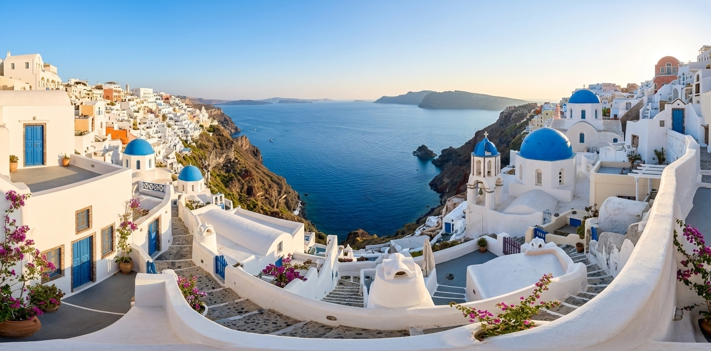</a>
<br/><b>爱琴海之吻：圣托里尼的蓝白浪漫全景</b>
<br/> 
<br/><details><summary>📋 核心提示词</summary>

```json
{
  "{
  "图像元数据": {
    "类型": "360度等距柱状全景图",
    "投影": "完整球形等距柱状投影",
    "长宽比": "2比1",
    "分辨率": "8K极致清晰"
  },
  "场景构图": {
    "地点": "希腊圣托里尼伊亚小镇悬崖",
    "相机位置": "露台高点全景",
    "相机高度": "模拟人眼站立高度",
    "视野范围": "水平360度，垂直180度",
    "透视表现": "白色建筑群环绕视角，蓝色海面占据下半幅",
    "天气": "晴朗，空气极度通透",
    "景深控制": "建筑细节与远方海平线全清晰"
  },
  "视觉元素": {
    "前景": { "主要特征": "洁白的建筑墙面与粉红色的三角梅，带有精致的石阶", "动态": "静谧" },
    "中景主体": { "地貌": "标志性的蓝色圆顶教堂，错落的白色洞穴屋", "细节": "木质的蓝色门窗，盛开的花卉", "环境": "陡峭的深褐色火山悬崖" },
    "背景": { "远景": "湛蓝的爱琴海中心，隐约可见的火山岛", "天空": "明亮的淡蓝色天空，地平线带有柔和的霞光" },
    "环境氛围": { "地面半球": "极具艺术感的垂直建筑景观", "氛围感": "浪漫、清新、宁静" }
  },
  "渲染风格": {
    "光影方案": "温暖的午后阳光，形成明亮的亮面与深邃的蓝色阴影",
    "色彩科学": "纯白色、爱琴海蓝与鲜艳花卉色彩的强烈碰撞",
    "质感质量": { "描述": "极高像素的精品旅游摄影", "细节": "墙面质感与波纹的极致还原" }
  },
  "核心约束": {
    "必须保留": [ "蓝顶教堂", "纯白建筑群", "深蓝大海", "360度全景透视" ],
    "严禁出现": [ "遮阳伞", "人群", "现代电线", "拼接痕迹", "文字" ]
  },
  "负面提示词": [ "文字", "水印", "杂乱物件", "人群", "汽车", "模糊", "低细节", "色彩暗淡" ]
}"
}
```

<sub>📄 [下载完整 JSON](prompts/case097.json)</sub>
</details>
</div>

<hr/>
<div align="center">
<a href="images/case099/output.png">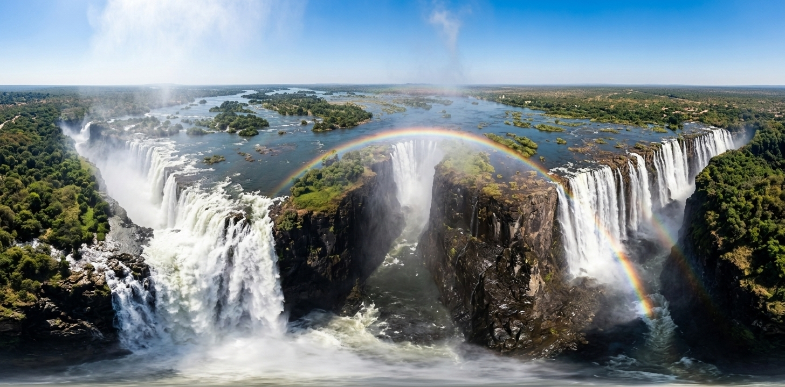</a>
<br/><b>雷鸣之烟：维多利亚大瀑布的垂直震撼</b>
<br/> 
<br/><details><summary>📋 核心提示词</summary>

```json
{
  "{
  "图像元数据": {
    "类型": "360度等距柱状全景图",
    "投影": "完整球形等距柱状投影",
    "长宽比": "2比1",
    "分辨率": "8K极致清晰"
  },
  "场景构图": {
    "地点": "赞比亚与津巴布韦交界维多利亚瀑布",
    "相机位置": "悬停于大裂谷正上方边缘",
    "相机高度": "中高空俯瞰",
    "视野范围": "水平360度，垂直180度",
    "透视表现": "巨大的直线型断崖横贯视野，峡谷深邃",
    "天气": "晴朗，伴有巨大的上升水雾",
    "景深控制": "全清晰，重点表现水滴与雾气"
  },
  "视觉元素": {
    "前景": { "主要特征": "断崖边缘倾泻而下的巨大水帘，呈现纯白色", "动态": "急速坠落的水流与飞溅的浪花" },
    "中景主体": { "地貌": "深邃的黑色玄武岩峡谷，岩石湿润发亮", "元素": "横跨峡谷的完整彩虹，色彩绚丽", "水文": "上方平静的赞比西河散布着绿色的岛屿" },
    "背景": { "远景": "非洲茂密的丛林与延伸的地平线", "天空": "明亮湛蓝的天空" },
    "环境氛围": { "地面半球": "充满力量感的水利奇观", "氛围感": "惊心动魄、雄伟、壮阔" }
  },
  "渲染风格": {
    "光影方案": "明亮的自然光，通过水雾产生散射和彩虹特效",
    "色彩科学": "深绿的丛林、黑色的岩石与洁白的水幕",
    "质感质量": { "描述": "极高像素的动态景观摄影", "细节": "水雾的半透明质感表现" }
  },
  "核心约束": {
    "必须保留": [ "长达公里的连续瀑布带", "升腾的巨型雾柱", "清晰的彩虹", "全景透视" ],
    "严禁出现": [ "大桥", "直升机", "人类痕迹", "拼接错位" ]
  },
  "负面提示词": [ "文字", "水印", "桥梁", "船只", "建筑物", "低饱和度", "模糊" ]
}"
}
```

<sub>📄 [下载完整 JSON](prompts/case099.json)</sub>
</details>
</div>

<hr/>
<br/><hr/><br/>
<div align="center">
<h2 id="%F0%9F%8F%94%EF%B8%8F%20%E5%B1%B1%E5%B7%9D"></h2>
</div>
<div align="center">
<a href="images/case001/output.png">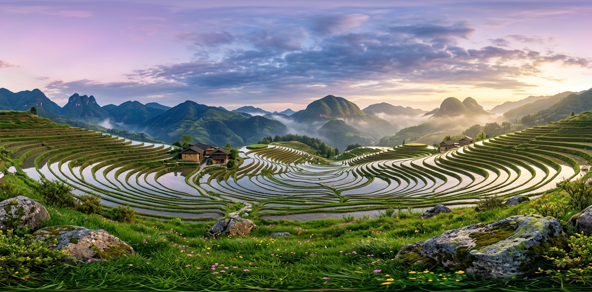</a>
<br/><b>春日梯田大地颂歌·360全景提示词</b>
<br/> 
<br/><details><summary>📋 核心提示词</summary>

```json
{
  "{
  "图像元 metadata": {
    "类型": "360度等距柱状全景图",
    "投影方式": "完整球形等距柱状投影",
    "宽高比": "2:1",
    "分辨率": "超高分辨率全景"
  },
  "场景构图": {
    "地点": "中国南方山区梯田，春季",
    "相机位置": "地面（模拟无人机视角）",
    "相机高度": "中等高度，高空俯瞰",
    "视野范围": "水平360度，垂直180度",
    "投影行为": "正确的等距柱状畸变，确保无缝球形拼接",
    "天气状况": "清晨或黄昏，柔和的云层，无雨",
    "景深": "全景清晰，从前景到背景均有细节"
  },
  "视觉元素": {
    "前景": {
      "主体视图": "360度围绕，地面是翠绿的新草，点缀着嫩黄和粉色的小野花，几块巨大的、质感粗糙的岩石（如image_0.png所示，覆盖着苔藓）分布在四周，作为自然的框架。低矮的春季灌木郁郁葱葱。",
      "动态": "微风吹拂新草和野花"
    },
    "中景主体": {
      "地形": "宏大的层层梯田，如镜面般平滑，灌满了春水，水面完美地反射着天空的色彩（粉紫色、金色、深蓝）。梯田的田埂被新绿的植被覆盖。几个古朴的夯土和木质民居点缀在梯田之间。",
      "村落": "一个安静的小村庄，石板路穿梭其间",
      "云雾": "山间有轻薄的、如丝般的春雾漂浮"
    },
    "背景": {
      "景观": "连绵不绝的远山轮廓，被春天的植被覆盖，呈现出深邃的绿色和蓝色。远山如 image_0.png 般的尖峰和圆顶，被柔和的光线照亮。",
      "天空": "日落（或日出）的黄金时刻，天空呈现出柔和的粉紫色、淡金色和深蓝色的渐变，云层细腻而有层次（参考 image_0.png 的天空质感）。"
    },
    "环境氛围": {
      "地面半球": "完整的360度梯田和地形分布",
      "整体氛围": "生机勃勃、宁静、自然、宏大、水墨画般的写实感"
    }
  },
  "渲染风格": {
    "光照": "柔和的侧逆光（日落/日出方向），暖色调，光线穿过云雾",
    "调色": "自然、饱满、春天的色彩（嫩绿、水蓝、粉紫、淡黄），参考image_0.png的暖色调和紫色调",
    "质感质量": {
      "描述": "超高清晰度写实摄影，细腻的岩石纹理、水面反射、植被细节",
      "痕迹": "无人工痕迹，画面纯净，自然锐化，颗粒感细腻",
      "拼接": "完美的360度无缝拼接，无任何接缝或畸变断裂"
    }
  },
  "约束条件": {
    "必须保留": [
      "纯360度全景透视",
      "无人机高空视角",
      "梯田为核心主体",
      "无任何界面元素",
      "高度写实摄影感",
      "岩石和植被细节"
    ],
    "必须避免": [
      "城市或现代建筑",
      "人物",
      "电影感夸张灯光",
      "奇幻或游戏风格",
      "绘画或插画感",
      "非全景的普通照片布局",
      "任何形式的水印或UI"
    ]
  },
  "负面提示词": [
    "用户界面",
    "抬头显示",
    "文本覆盖",
    "水印",
    "现代建筑",
    "桥梁",
    "行人",
    "汽车",
    "奇幻艺术",
    "插图",
    "过度处理",
    "边框",
    "裁剪视图",
    "全景接缝断裂",
    "低分辨率",
    "模糊",
    "人工痕迹"
  ]
}"
}
```

<sub>📄 [下载完整 JSON](prompts/case001.json)</sub>
</details>
</div>

<hr/>
<div align="center">
<a href="images/case002/output.png">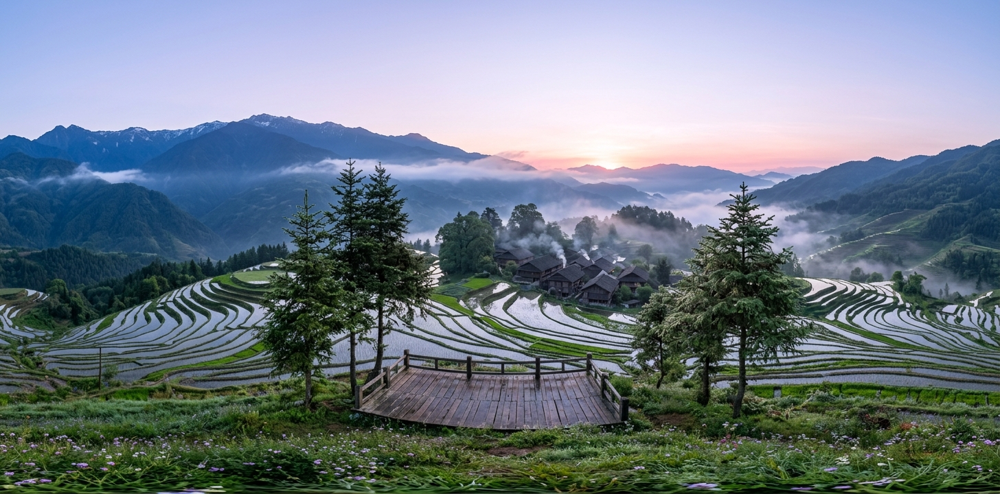</a>
<br/><b>万物复苏云巅梯田春色沉浸式空间全景提示词</b>
<br/> 
<br/><details><summary>📋 核心提示词</summary>

```json
{
  "{
  "图像元数据": {
    "类型": "360度等距柱状全景图",
    "投影方式": "完整球形等距柱状投影",
    "宽高比": "2:1",
    "分辨率": "超高分辨率8K全景"
  },
  "场景构图": {
    "地点": "高山云雾梯田带",
    "相机位置": "地面观景平台视角",
    "相机高度": "约1.7米人眼高度",
    "视野范围": "水平360度，垂直180度",
    "投影行为": "正确的等距柱状畸变，确保无缝球形拼接",
    "天气状况": "清晨，微风，伴有流动的薄雾",
    "景深": "全景深，确保从近景到远山细节清晰"
  },
  "视觉元素": {
    "前景": {
      "主体视图": "几株挺拔的翠绿高山冷杉，枝条悬挂着透明露珠，脚下是点缀着浅紫色野花的嫩绿草地",
      "动态": "露珠在微光下闪烁，薄雾轻拂草尖"
    },
    "中景主体": {
      "地形": "层层叠叠的灌水梯田，如银带般环绕山腰，倒映着天空色彩",
      "村落": "远方若隐若现的古朴木质吊脚楼，屋顶升起淡淡炊烟",
      "云雾": "如白纱般的半透明山雾，穿梭在梯田与林间"
    },
    "背景": {
      "景观": "连绵起伏的黛青色远山，山顶残雪正在消融",
      "天空": "清晨的淡紫色至浅蓝色的渐变天空，天际线处透出温润的橘粉色晨光"
    },
    "环境氛围": {
      "地面半球": "丰富多样的植被纹理，湿润的泥土路径，自然的生态细节",
      "整体氛围": "宁静、生机勃勃、空灵、治愈系自然奇观"
    }
  },
  "渲染风格": {
    "光照": "柔和的清晨自然光，带有丁达尔效应，侧逆光勾勒植物轮廓",
    "调色": "清新自然色调，以嫩绿、水蓝、藕粉为主，高动态范围渲染",
    "质感质量": {
      "描述": "国家地理摄影级别，超清纹理，极高像素密度",
      "痕迹": "无人工痕迹，画面纯净，自然锐化",
      "拼接": "完美的360度无缝拼接，顶部与底部极点无拉伸畸变"
    }
  },
  "约束条件": {
    "必须保留": [
      "纯360度全景透视",
      "高度写实的摄影质感",
      "梯田与古树的几何秩序感",
      "无任何界面元素",
      "自然的空气透视感"
    ],
    "必须避免": [
      "城市或现代建筑",
      "人物与车辆",
      "电影感夸张人造灯光",
      "奇幻或饱和度过高的风格",
      "绘画、插画或3D模型感",
      "非全景的普通扁平照片布局"
    ]
  },
  "负面提示词": [
    "用户界面",
    "文本覆盖",
    "水印",
    "标志",
    "现代电线杆",
    "柏油马路",
    "行人",
    "卡通",
    "CG渲染感",
    "过度锐化",
    "边框",
    "全景接缝断裂",
    "顶部拉伸黑洞",
    "底部极点模糊"
  ]
}"
}
```

<sub>📄 [下载完整 JSON](prompts/case002.json)</sub>
</details>
</div>

<hr/>
<div align="center">
<a href="images/case005/output.png">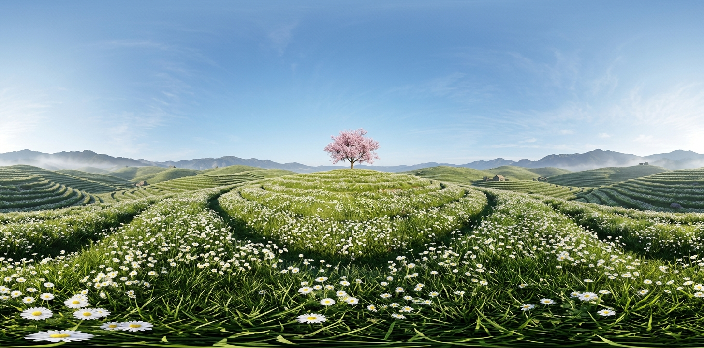</a>
<br/><b>梦幻春日大地：繁花梯田与孤傲樱树 360 全景提示词</b>
<br/> 
<br/><details><summary>📋 核心提示词</summary>

```json
{
  "{
  "图像元数据": {
    "类型": "360度等距柱状全景图",
    "投影方式": "完整球形（Equirectangular）等距柱状投影",
    "宽高比": "2:1 (例如：8192x4096)",
    "分辨率": "超高分辨率 8K 全景"
  },
  "场景构图": {
    "地点": "一个广阔、超现实的春日山丘地带，灵感源自 image_0.png",
    "相机位置": "贴近地面（靠近野花丛），位于梯田拼布的中心",
    "相机高度": "低角度（约 0.5 米），强调野花和地面的延伸感",
    "视野范围": "水平 360 度，垂直 180 度，完整球形覆盖",
    "投影行为": "完美的等距柱状畸变，确保无缝球形拼接",
    "天气状况": "清晨，晴朗，淡蓝色天空，带有稀薄的卷云",
    "景深": "超大景深，从脚下到远山都清晰可见"
  },
  "视觉元素": {
    "前景": {
      "主体视图": "近距离的、极其逼真的白色野花和草叶丛（如 image_0.png 所示），触手可及。野花和绿草形成复杂的、有机的拼布图案，围绕相机360度延展。能清晰辨别花朵细节。",
      "动态": "极微风，野花和草叶微微摇曳"
    },
    "中景主体": {
      "地形": "起伏不平的山丘，完全被由白色野花和嫩绿新草交替构成的复杂梯田拼布图案覆盖。这些拼布图案以一种有机的、流动的、类似于迷宫的方式环绕整个中景。远处山丘之巅矗立着那棵盛开的、孤傲的粉色樱树（如 image_0.png 所示），作为核心视觉焦点。",
      "村落": "在极远处的梯田间，隐约可见几处古朴、自然的石质或木质村屋，融入自然风景中",
      "云雾": "极轻薄的晨雾，缭绕在远山基部"
    },
    "背景": {
      "景观": "连绵不绝的、同样覆盖着拼布花海梯田的远山，直至地平线。远山顶端也可见其他极少的樱树和自然植被点缀。",
      "天空": "完整的、纯净的淡蓝色天穹，带有轻薄、自然的卷云纹理。在垂直180度方向上均匀分布。"
    },
    "环境氛围": {
      "地面半球": "完全被精细的野花和草地梯田覆盖，360度无缝连续。",
      "整体氛围": "极度宁静、清新、充满生命力、超现实的春日神圣感"
    }
  },
  "渲染风格": {
    "光照": "自然、温和的清晨日光，强调纹理和色彩",
    "调色": "自然、鲜艳但不失真的色彩。白色花海纯净，绿草嫩绿，樱树粉嫩。整体色调清新、明亮。",
    "质感质量": {
      "描述": "超写实电影级摄影感，极致的细节（能看清花瓣、草叶脉络）。",
      "痕迹": "绝对没有水印、文本覆盖、界面元素或人工痕迹。画面纯净，自然锐化。",
      "拼接": "完美的360度无缝拼接，无任何接缝或畸变断裂"
    }
  },
  "约束条件": {
    "必须保留": [
      "纯360度球形全景透视",
      "低角度、贴近地面的视角",
      "起伏的花海/绿草拼布梯田为核心主体",
      "那一棵盛开的粉色孤傲樱树作为核心焦点",
      "无任何界面元素（UI/HUD）",
      "高度写实摄影感（无可感知的3D模型感）"
    ],
    "必须避免": [
      "城市或现代建筑",
      "大量人物或动物（隐约可见的极远村落除外）",
      "电影感夸张灯光或人工光晕",
      "奇幻或游戏风格的过度渲染",
      "绘画或插画感",
      "非全景的、裁剪的或普通照片布局",
      "任何可见的拼接接缝"
    ]
  },
  "负面提示词": [
    "用户界面",
    "抬头显示",
    "文本覆盖",
    "水印",
    "现代建筑",
    "桥梁",
    "行人",
    "奇幻艺术",
    "插图",
    "过度处理",
    "边框",
    "裁剪视图",
    "全景接缝断裂",
    "低分辨率",
    "模糊前景"
  ]
}"
}
```

<sub>📄 [下载完整 JSON](prompts/case005.json)</sub>
</details>
</div>

<hr/>
<div align="center">
<a href="images/case006/output.png"></a>
<br/><b>金山玉幕·360度春天雪山日落梯田奇观全景提示词</b>
<br/> 
<br/><details><summary>📋 核心提示词</summary>

```json
{
  "{
  "图像元数据": {
    "类型": "360度等距柱状全景图",
    "投影方式": "完整球形等距柱状投影",
    "宽高比": "2:1",
    "分辨率": "超高分辨率全景"
  },
  "场景构图": {
    "地点": "阿尔卑斯之光下的春日藏区高山谷地梯田",
    "相机位置": "无人机高空俯瞰",
    "相机高度": "中高空 (约200米)，俯瞰梯田和村落",
    "视野范围": "水平360度，垂直180度",
    "投影行为": "正确的等距柱状畸变，确保无缝球形拼接",
    "天气状况": "清澈的日落黄昏，Alpenglow现象",
    "景深": "全景清晰，远近细节丰富"
  },
  "视觉元素": {
    "前景": {
      "主体视图": "层层叠叠的春季梯田，田埂上残存春雪",
      "动态": "梯田内新绿秧苗随微风轻摇，溪水潺潺"
    },
    "中景主体": {
      "地形": "宏伟的岩石山峰 (参考 image_0.png 形态)，被Alpenglow完全点亮为金色/橙色",
      "村落": "一个古朴的藏族村落 (碉楼和经幡)，与自然融合",
      "云雾": "山间点缀着淡淡的、被染成粉紫色的低云"
    },
    "背景": {
      "景观": "连绵的雪山群，以及环绕谷地的茂密春季果园 (开满桃花和李花)",
      "天空": "参考 image_0.png，绚丽的紫色与橙色渐变，层积云被染成暖色"
    },
    "环境氛围": {
      "地面半球": "完美的等距柱状纹理，呈现大地的几何图案",
      "整体氛围": "神圣、宁静、复苏、震撼"
    }
  },
  "渲染风格": {
    "光照": "强烈的阿尔卑斯之光 (Alpenglow)，日落余晖将山顶染成金红，梯田水面反光",
    "调色": "金黄色、橙色、紫色 (天空)、嫩绿色 (新绿)、冷白色 (残雪) 的和谐对比",
    "质感质量": {
      "描述": "超高清晰度，极致纹理细节 (岩石、泥土、植物、织物)",
      "痕迹": "无人工痕迹，画面纯净，自然锐化",
      "拼接": "完美的360度无缝拼接，无明显接缝"
    }
  },
  "约束条件": {
    "必须保留": [
      "纯360度全景透视",
      "无人机高空视角俯瞰",
      "梯田为核心主体",
      "无任何界面元素",
      "高度写实摄影感",
      "山峰被Alpenglow点亮为金色",
      "春季新绿与残雪的对比"
    ],
    "必须避免": [
      "城市或现代建筑",
      "现代交通工具",
      "行人 (除非是极小的环境点缀)",
      "电影感夸张灯光",
      "奇幻或游戏风格",
      "绘画或插画感",
      "非全景的普通照片布局"
    ]
  },
  "负面提示词": [
    "用户界面",
    "抬头显示",
    "文本覆盖",
    "水印",
    "现代建筑",
    "桥梁",
    "行人",
    "奇幻艺术",
    "插图",
    "过度处理",
    "边框",
    "裁剪视图",
    "全景接缝断裂",
    "非全景",
    "插画感",
    "卡通",
    "低分辨率",
    "现代道路"
  ]
}"
}
```

<sub>📄 [下载完整 JSON](prompts/case006.json)</sub>
</details>
</div>

<hr/>
<div align="center">
<a href="images/case100/output.png">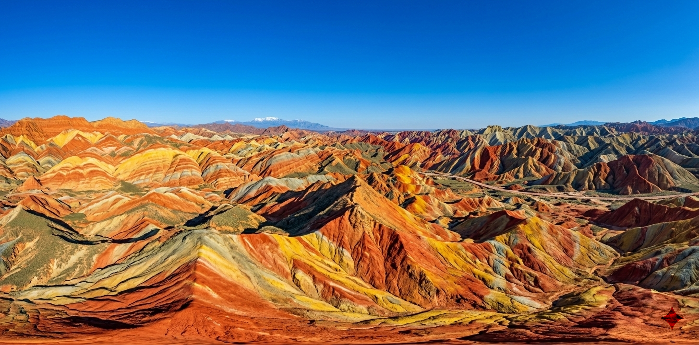</a>
<br/><b>大地调色盘：张掖丹霞的斑斓地质史诗</b>
<br/> 
<br/><details><summary>📋 核心提示词</summary>

```json
{
  "{
  "图像元数据": {
    "类型": "360度等距柱状全景图",
    "投影": "完整球形等距柱状投影",
    "长宽比": "2比1",
    "分辨率": "8K极致清晰"
  },
  "场景构图": {
    "地点": "中国张掖七彩丹霞地质公园",
    "相机位置": "垂直俯瞰结合远眺",
    "相机高度": "高空航拍",
    "视野范围": "水平360度，垂直180度",
    "透视表现": "彩色的山丘如波浪般向地平线翻滚",
    "天气": "雨后初晴，色彩因水分而显得格外鲜艳",
    "景深控制": "全景深，纹理极其锐利"
  },
  "视觉元素": {
    "前景": { "主要特征": "近处细腻的彩色岩层褶皱，纹理如丝绸般顺滑", "动态": "完全静态" },
    "中景主体": { "地貌": "层层叠叠的彩色丘陵，红、黄、橙色彩带交错排列", "特征": "干涸的山脊线勾勒出大地的骨架", "细节": "风蚀形成的独特岩石造型" },
    "背景": { "远景": "远处的祁连山雪顶若隐若现", "天空": "极度纯净的深蓝色，与地面的艳丽形成反差" },
    "environment": { "地面半球": "绚丽夺目的干旱地质奇观", "氛围感": "壮丽、震撼、如诗如画" }
  },
  "渲染风格": {
    "光影方案": "低角度斜射光，增强岩层的凹凸立体感与色彩饱和度",
    "色彩科学": "极致的暖色调（红、橙）与冷色调天空的强烈对比",
    "质感质量": { "描述": "超高清地质摄影，细节丰富", "细节": "完美的360度无缝过渡" }
  },
  "核心约束": {
    "必须保留": [ "鲜明的色彩分层", "波浪状山丘纹理", "纯净的蓝天", "全景包围感" ],
    "严禁出现": [ "观景台", "护栏", "旅游大巴", "游客", "文字" ]
  },
  "负面提示词": [ "文字", "水印", "建筑物", "公路", "护栏", "低对比度", "模糊", "拼接断裂" ]
}"
}
```

<sub>📄 [下载完整 JSON](prompts/case100.json)</sub>
</details>
</div>

<hr/>
<div align="center">
<a href="images/case102/output.png">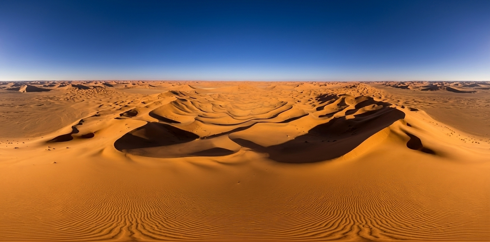</a>
<br/><b>金色脊线：撒哈拉沙漠的极简光影史诗</b>
<br/> 
<br/><details><summary>📋 核心提示词</summary>

```json
{
  "{
  "图像元数据": {
    "类型": "360度等距柱状全景图",
    "投影": "完整球形等距柱状投影",
    "长宽比": "2比1",
    "分辨率": "8K极致清晰"
  },
  "场景构图": {
    "地点": "撒哈拉沙漠腹地",
    "相机位置": "无人机俯视全景",
    "相机高度": "中空俯瞰",
    "视野范围": "水平360度，垂直180度",
    "透视表现": "沙丘脊线呈螺旋状或放射状延伸",
    "天气": "极端干燥，万里无云",
    "景深控制": "沙纹细节全清晰"
  },
  "视觉元素": {
    "前景": { "主要特征": "细腻如丝绸的沙子表面，布满微小的风蚀波纹", "动态": "完全静态" },
    "中景主体": { "地貌": "层层叠叠的巨型沙丘，带有锋利的明暗交界线", "细节": "沙脊线上的细碎沙尘微粒", "特征": "金黄色与深影区的强烈对比" },
    "背景": { "远景": "连绵不断的沙山直到地平线汇聚点", "天空": "极度纯净的深蓝色穹顶" },
    "环境氛围": { "地面半球": "极简主义的大地艺术", "氛围感": "辽阔、永恒、苍凉" }
  },
  "rendering_style": {
    "光影方案": "夕阳斜射，强侧光刻画立体感，阴影深邃",
    "色彩科学": "高纯度的金色、橙色与深蓝天空的对比",
    "质感质量": { "描述": "极高精细度的沙粒质感，无噪点摄影", "细节": "完美无缝的360度画面" }
  },
  "核心约束": {
    "必须保留": [ "锋利的沙脊线", "极简色彩构图", "360度沉浸感" ],
    "严禁出现": [ "足迹", "车辆", "植物", "人物", "文字" ]
  },
  "负面提示词": [ "文字", "水印", "杂色", "足迹", "绿洲", "模糊", "低画质", "拼接裂缝" ]
}"
}
```

<sub>📄 [下载完整 JSON](prompts/case102.json)</sub>
</details>
</div>

<hr/>
<div align="center">
<a href="images/case106/output.png"></a>
<br/><b>沙海幻境：纳米布沙漠红色沙丘与罕见平流云海</b>
<br/> 
<br/><details><summary>📋 核心提示词</summary>

```json
{
  "{
  "image_meta": {
    "type": "360度等距柱状全景图",
    "projection": "完整球形等距柱状投影",
    "aspect_ratio": "2:1",
    "resolution": "超高清"
  },
  "scene_composition": {
    "location": "纳米比亚，纳米布-诺克卢福国家公园",
    "camera_position": "无人机跨越云层与沙丘交界处",
    "camera_height": "中高空视角",
    "field_of_view": "360° 水平，180° 垂直",
    "projection_behavior": "沙丘脊线如曲线般在画面中穿梭",
    "weather": "独特的平流雾景观，上方晴空万里",
    "depth_of_field": "全清晰"
  },
  "visual_elements": {
    "foreground": { "primary_view": "极其陡峭且锋利的红色沙丘边缘，阴影面呈深紫色", "motion": "云层带有丝滑的流动感" },
    "midground_subjects": { "terrain": "被白色浓雾填满的沙漠谷地，呈现出“云海漫岛”的视觉感", "river": "无", "mist": "厚重、洁白且平整的低空云团" },
    "background": { "landscape": "红色的沙丘如浪潮般向远方起伏，直至消失在云海尽头", "sky": "深蓝色的高空，阳光明媚，无杂云" },
    "environment": { "ground_hemisphere": "极简主义色彩对比", "atmosphere": "奇幻、超现实、极致优雅" }
  },
  "rendering_style": {
    "lighting": "斜侧阳光，将沙丘一分为二，明暗对比强烈",
    "color_grading": "鲜艳的铁锈红与纯粹的白色、深蓝色",
    "texture_quality": { "description": "细腻的沙粒纹理与丝滑云雾的质感对比", "artifacts": "无缝360拼接", "stitching": "完美" }
  },
  "constraints": {
    "must_keep": [ "红沙与白云的对比", "锋利的沙脊线", "360°沉浸视角" ],
    "avoid": [ "足迹", "灌木", "杂乱的云彩" ]
  },
  "negative_prompt": [ "ui", "text", "footprints", "bushes", "gray clouds", "messy horizon" ]
}"
}
```

<sub>📄 [下载完整 JSON](prompts/case106.json)</sub>
</details>
</div>

<hr/>
<div align="center">
<a href="images/case108/output.png"></a>
<br/><b>永恒丰碑：吉萨大金字塔群与撒哈拉沙漠的落日余晖</b>
<br/> 
<br/><details><summary>📋 核心提示词</summary>

```json
{
  "{
  "image_meta": {
    "type": "360度等距柱状全景图",
    "projection": "完整球形等距柱状投影",
    "aspect_ratio": "2:1",
    "resolution": "8K超高分辨率"
  },
  "scene_composition": {
    "location": "埃及吉萨大金字塔群正上方",
    "camera_position": "高空无人机视角",
    "camera_height": "中高空全景",
    "field_of_view": "360° 水平，180° 垂直",
    "projection_behavior": "金字塔呈三角几何分布，地平线极其宽广",
    "weather": "晴朗，伴有极轻微的沙尘形成的丁达尔效应",
    "depth_of_field": "无限景深"
  },
  "visual_elements": {
    "foreground": { "primary_view": "三座巨大的石质金字塔，石块纹理清晰，侧面阴影深邃", "motion": "完全静态" },
    "midground_subjects": { "terrain": "波浪状的金色沙丘，散布着考古遗迹的断壁残垣", "river": "远方模糊的尼罗河绿洲带", "mist": "低空轻微的热浪升腾感" },
    "background": { "landscape": "开罗城市的建筑轮廓在地平线上若隐若现", "sky": "湛蓝到浅金色的日落渐变天空，带有稀疏的条状云" },
    "environment": { "ground_hemisphere": "古老文明与永恒荒漠的交织", "atmosphere": "庄严、宏大、神秘" }
  },
  "rendering_style": {
    "lighting": "低角度金色夕阳，侧光强调了金字塔的几何刻面",
    "color_grading": "暖黄色、古铜色与天空深蓝色的高对比调性",
    "texture_quality": { "description": "超写实国家地理级别航拍", "artifacts": "无缝360拼接", "stitching": "完美无痕" }
  },
  "constraints": {
    "must_keep": [ "三座主要金字塔的完整布局", "明显的长阴影", "360度全景透视", "沙漠与天空的比例" ],
    "avoid": [ "过度拥挤的游客", "现代电塔", "模糊的石块纹理" ]
  },
  "negative_prompt": [ "ui", "text", "watermark", "modern cars", "tourists", "blurry pyramids", "broken horizon" ]
}"
}
```

<sub>📄 [下载完整 JSON](prompts/case108.json)</sub>
</details>
</div>

<hr/>
<div align="center">
<a href="images/case109/output.png"></a>
<br/><b>地球脉动：堪察加半岛深秋火山与色彩斑斓的苔原</b>
<br/> 
<br/><details><summary>📋 核心提示词</summary>

```json
{
  "{
  "image_meta": {
    "type": "360度等距柱状全景图",
    "projection": "完整球形等距柱状投影",
    "aspect_ratio": "2:1",
    "resolution": "超高分辨率全景"
  },
  "scene_composition": {
    "location": "俄罗斯堪察加半岛火山谷",
    "camera_position": "无人机飞越地热区域",
    "camera_height": "中高空视角",
    "field_of_view": "360° 水平，180° 垂直",
    "projection_behavior": "极其复杂的地理纹理延展",
    "weather": "多云转晴，光线多变",
    "depth_of_field": "全景深"
  },
  "visual_elements": {
    "foreground": { "primary_view": "深秋季节色彩绚丽的苔原，呈现出深红、亮黄和苔藓绿", "motion": "静态" },
    "midground_subjects": { "terrain": "蜿蜒的硫磺色河流、火山湖和冒着蒸汽的地热喷泉", "river": "如血管般交错的地热河道", "mist": "地面升起的白色地热蒸汽" },
    "background": { "landscape": "背景是矗立的黑色火山锥和积雪的山峰，云层低垂", "sky": "蓝天在厚重的云层中显现，充满戏剧性" },
    "environment": { "ground_hemisphere": "原始、蛮荒、色彩浓郁的地表", "atmosphere": "狂野、原始、大地母亲的脉动" }
  },
  "rendering_style": {
    "lighting": "柔和且具有层次感的阴天散射光，局部有阳光洒下",
    "color_grading": "极度浓郁的深红、土色调与河水的淡蓝色对比",
    "texture_quality": { "description": "电影级野外景观摄影", "artifacts": "无缝拼接", "stitching": "完美无暇" }
  },
  "constraints": {
    "must_keep": [ "红色苔原植被", "蜿蜒的地热河道", "远处的火山峰", "360°宏大视角" ],
    "avoid": [ "任何人类痕迹", "飞机影子", "过度的色彩滤镜" ]
  },
  "negative_prompt": [ "ui", "text", "human traces", "roads", "tents", "drone shadow", "fake colors" ]
}"
}
```

<sub>📄 [下载完整 JSON](prompts/case109.json)</sub>
</details>
</div>

<hr/>
<div align="center">
<a href="images/case111/output.png"></a>
<br/><b>极寒巅峰：瑞士阿尔卑斯山脉的银色冰雪荒原</b>
<br/> 
<br/><details><summary>📋 核心提示词</summary>

```json
{
  "{
  "image_meta": {
    "type": "360度等距柱状全景图",
    "projection": "完整球形等距柱状投影",
    "aspect_ratio": "2:1",
    "resolution": "超高分辨率全景"
  },
  "scene_composition": {
    "location": "阿尔卑斯山脉少女峰地区上空",
    "camera_position": "无人机飞越雪峰与冰川",
    "camera_height": "极高空视角",
    "field_of_view": "360° 水平，180° 垂直",
    "projection_behavior": "险峻的山峰环绕，地平线高低起伏",
    "weather": "寒冷清澈，伴有丝滑的拉伸卷云",
    "depth_of_field": "全景深"
  },
  "visual_elements": {
    "foreground": { "primary_view": "被积雪覆盖的陡峭山脊，冰川的褶皱和裂隙细节可见", "motion": "静态" },
    "midground_subjects": { "terrain": "连绵不绝的终年雪山和白茫茫的雪原", "river": "冰川形成的固定流向感", "mist": "稀薄的极寒雾气" },
    "background": { "landscape": "远方无数雪峰构成的地平线，与深蓝色天空交接", "sky": "呈现极高海拔特征的深蓝色天空，带有放射状云彩" },
    "environment": { "ground_hemisphere": "纯净无暇的冰雪世界", "atmosphere": "寒冷、孤独、神圣不可侵犯" }
  },
  "rendering_style": {
    "lighting": "强烈的极地日光，造成冰雪面极高的对比度",
    "color_grading": "清冷的蓝白色调，对比分明的冷色系",
    "texture_quality": { "description": "高精度写实山脉摄影", "artifacts": "无缝360拼接", "stitching": "完美无暇" }
  },
  "constraints": {
    "must_keep": [ "险峻的山脊线", "冰川细节", "高空视角", "360°环绕感" ],
    "avoid": [ "绿色植被", "小木屋", "滑雪者", "过曝的雪面" ]
  },
  "negative_prompt": [ "ui", "text", "grass", "trees", "houses", "skiers", "overexposed white" ]
}"
}
```

<sub>📄 [下载完整 JSON](prompts/case111.json)</sub>
</details>
</div>

<hr/>
<div align="center">
<a href="images/case115/output.png"></a>
<br/><b>阿杰尔高原岩林与沙丘360度全景</b>
<br/> 
<br/><details><summary>📋 核心提示词</summary>

```json
{
  "{
  "title": "阿尔及利亚阿杰尔高原地质全景",
  "image_meta": {
    "type": "360度等距柱状全景图",
    "projection": "完整球形等距柱状投影",
    "aspect_ratio": "2:1",
    "resolution": "超高分辨率全景"
  },
  "scene_composition": {
    "location": "阿尔及利亚阿杰尔高原",
    "camera_position": "无人机位于巨大风蚀岩群上方",
    "camera_height": "高空俯瞰视角",
    "field_of_view": "360° 水平，180° 垂直",
    "projection_behavior": "正确的等距柱状畸变",
    "weather": "晴朗干燥，空气通透",
    "depth_of_field": "无限景深"
  },
  "visual_elements": {
    "foreground": {
      "primary_view": "大片橙黄色沙丘与形态奇特的黑色风蚀砂岩立柱交错，阴影深邃",
      "motion": "静止"
    },
    "midground_subjects": {
      "terrain": "‘石林’景观散布在沙海中，展现亿万年风化痕迹",
      "details": "岩石表面的蜂窝状孔洞与沙面涟漪清晰可见"
    },
    "background": {
      "landscape": "广阔的高原平台向地平线无限延伸，地质结构奇崛",
      "sky": "浅蓝色天空，少量拉伸状白云"
    },
    "environment": {
      "ground_hemisphere": "原始、古老、带有异星气息的荒漠岩林",
      "atmosphere": "神秘、古老、地质美学"
    }
  },
  "rendering_style": {
    "lighting": "午后侧光，产生极具立体感的长阴影",
    "color_grading": "强烈的橙沙与黑岩对比，自然饱和度",
    "texture_quality": {
      "description": "超高细节地质航拍",
      "stitching": "无缝360度全景"
    }
  },
  "constraints": {
    "must_keep": ["黑色岩山与沙丘结合", "360全景透视", "高度写实"],
    "avoid": ["植被", "现代建筑", "车辆", "人物"]
  },
  "negative_prompt": ["ui", "watermark", "greenery", "cars", "buildings", "tent"]
}"
}
```

<sub>📄 [下载完整 JSON](prompts/case115.json)</sub>
</details>
</div>

<hr/>
<div align="center">
<a href="images/case117/output.png"></a>
<br/><b>撒哈拉线性沙丘日落360度航拍全景</b>
<br/> 
<br/><details><summary>📋 核心提示词</summary>

```json
{
  "{
  "title": "撒哈拉线性沙丘日落全景",
  "image_meta": {
    "type": "360度等距柱状全景图",
    "projection": "完整球形等距柱状投影",
    "aspect_ratio": "2:1",
    "resolution": "超高分辨率全景"
  },
  "scene_composition": {
    "location": "摩洛哥梅尔祖加沙丘群",
    "camera_position": "无人机位于最高沙脊线正上方",
    "camera_height": "高空航拍视角",
    "field_of_view": "360° 水平，180° 垂直",
    "projection_behavior": "正确的等距柱状畸变",
    "weather": "极度干燥晴朗，金色日落",
    "depth_of_field": "无限景深"
  },
  "visual_elements": {
    "foreground": {
      "primary_view": "优美的S型沙脊线如刀刻般清晰，沙面呈现细腻的流沙质感",
      "motion": "静止"
    },
    "midground_subjects": {
      "terrain": "起伏的黄金沙丘波浪，明暗分界线极其优美",
      "details": "背光面呈深咖啡色，向光面呈明亮的橙黄色"
    },
    "background": {
      "landscape": "远方是平坦的荒漠戈壁，地平线消失在暮色中",
      "sky": "巨大的金色落日位于地平线上方，天空色彩纯净渐变"
    },
    "environment": {
      "ground_hemisphere": "纯净、简约的自然地理艺术",
      "atmosphere": "温暖、辽阔、极致纯净"
    }
  },
  "rendering_style": {
    "lighting": "极致侧光，勾勒出沙丘的流线型轮廓",
    "color_grading": "高饱和度的黄金色调，纯净度极高",
    "texture_quality": {
      "description": "超高精细沙粒纹理",
      "stitching": "无缝拼接"
    }
  },
  "constraints": {
    "must_keep": ["完美的S型沙脊线", "落日圆轮", "360投影"],
    "avoid": ["脚印", "骆驼", "植被", "垃圾"]
  },
  "negative_prompt": ["ui", "watermark", "footprints", "camels", "tents", "plants"]
}"
}
```

<sub>📄 [下载完整 JSON](prompts/case117.json)</sub>
</details>
</div>

<hr/>
<div align="center">
<a href="images/case120/output.png"></a>
<br/><b>张掖七彩丹霞地貌360度航拍全景</b>
<br/> 
<br/><details><summary>📋 核心提示词</summary>

```json
{
  "{
  "title": "张掖七彩丹霞地质奇观全景",
  "image_meta": {
    "type": "360度等距柱状全景图",
    "projection": "完整球形等距柱状投影",
    "aspect_ratio": "2:1",
    "resolution": "超高分辨率全景"
  },
  "scene_composition": {
    "location": "中国甘肃张掖丹霞地质公园",
    "camera_position": "无人机悬停于彩丘带正上方",
    "camera_height": "中高空航拍视角",
    "field_of_view": "360° 水平，180° 垂直",
    "projection_behavior": "正确的等距柱状畸变",
    "weather": "多云转晴，柔和散射光",
    "depth_of_field": "整个场景清晰"
  },
  "visual_elements": {
    "foreground": {
      "primary_view": "色彩斑斓的岩层丘陵，红、黄、橙、白条纹交替，质感如丝绸",
      "motion": "无"
    },
    "midground_subjects": {
      "terrain": "波浪状起伏的彩丘群，地表几乎无植被，展现纯粹矿物色",
      "details": "岩层褶皱细节极其丰富，阴影随山势起伏"
    },
    "background": {
      "landscape": "连绵不绝的红色砂岩山脉向远方延伸",
      "sky": "浅蓝色天空，云影投射在山峦上"
    },
    "environment": {
      "ground_hemisphere": "宛如上帝调色盘的自然地质奇迹",
      "atmosphere": "惊艳、超写实、色彩浓郁"
    }
  },
  "rendering_style": {
    "lighting": "柔和散射光，避免强光反射以保留色彩细节",
    "color_grading": "自然高对比度色彩，强调红色与橙色调",
    "texture_quality": {
      "description": "极高精度岩土纹理",
      "stitching": "无缝360度全景"
    }
  },
  "constraints": {
    "must_keep": ["彩色条纹岩层", "丹霞地貌特征", "无UI"],
    "avoid": ["旅游栈道", "游客", "围栏", "树木"]
  },
  "negative_prompt": ["ui", "watermark", "tourists", "stairs", "fence", "trees", "buildings"]
}"
}
```

<sub>📄 [下载完整 JSON](prompts/case120.json)</sub>
</details>
</div>

<hr/>
<div align="center">
<a href="images/case121/output.png"></a>
<br/><b>普托拉纳平原玄武岩峡谷秋色全景</b>
<br/> 
<br/><details><summary>📋 核心提示词</summary>

```json
{
  "{
  "title": "普托拉纳平原峡谷秋色全景",
  "image_meta": {
    "type": "360度等距柱状全景图",
    "projection": "完整球形等距柱状投影",
    "aspect_ratio": "2:1",
    "resolution": "超高分辨率全景"
  },
  "scene_composition": {
    "location": "俄罗斯普托拉纳平原峡谷",
    "camera_position": "无人机位于峡谷拐角处上空",
    "camera_height": "高空俯瞰",
    "field_of_view": "360° 水平，180° 垂直",
    "projection_behavior": "正确的等距柱状畸变",
    "weather": "秋季晴空，空气极度通透",
    "depth_of_field": "无限景深"
  },
  "visual_elements": {
    "foreground": {
      "primary_view": "陡峭的阶梯状岩壁，岩石层理分明，顶部覆盖金色的落叶松",
      "motion": "静止"
    },
    "midground_subjects": {
      "terrain": "深邃的V型峡谷切割地表，谷底可见蜿蜒的细小河流",
      "vegetation": "漫山遍野的金黄色原始森林，色彩浓烈"
    },
    "background": {
      "landscape": "平坦的高原面延伸至天际，地壳裂缝视觉震撼",
      "sky": "清澈深蓝色天空，无云"
    },
    "environment": {
      "ground_hemisphere": "原始地壳变动形成的巨型玄武岩台地",
      "atmosphere": "壮阔、苍茫、地学奇观"
    }
  },
  "rendering_style": {
    "lighting": "高角度顶光偏侧，强化岩石的阶梯结构与深度",
    "color_grading": "高饱和的金黄色与冷灰色岩石对比",
    "texture_quality": {
      "description": "超写实航拍摄影",
      "stitching": "无缝拼接"
    }
  },
  "constraints": {
    "must_keep": ["阶梯状岩层", "金色秋季森林", "360全景"],
    "avoid": ["夏季绿植", "雪景", "道路", "车辆"]
  },
  "negative_prompt": ["ui", "watermark", "greenery", "snow", "road", "cars"]
}"
}
```

<sub>📄 [下载完整 JSON](prompts/case121.json)</sub>
</details>
</div>

<hr/>
<div align="center">
<a href="images/case123/output.png"></a>
<br/><b>撒哈拉U型沙丘盆地360度航拍全景</b>
<br/> 
<br/><details><summary>📋 核心提示词</summary>

```json
{
  "{
  "title": "撒哈拉核心区U型沙丘盆地全景",
  "image_meta": {
    "type": "360度等距柱状全景图",
    "projection": "完整球形等距柱状投影",
    "aspect_ratio": "2:1",
    "resolution": "超高分辨率全景"
  },
  "scene_composition": {
    "location": "阿尔及利亚撒哈拉核心区",
    "camera_position": "无人机位于巨大沙丘盆地正上方",
    "camera_height": "中高空航拍视角",
    "field_of_view": "360° 水平，180° 垂直",
    "projection_behavior": "正确的等距柱状畸变",
    "weather": "日落前夕，空气通透",
    "depth_of_field": "无限景深（整个全景清晰）"
  },
  "visual_elements": {
    "foreground": {
      "primary_view": "底部宽大的U型沙丘盆地，深色阴影勾勒出沙丘的陡峭边缘，沙纹细腻",
      "motion": "静止"
    },
    "midground_subjects": {
      "terrain": "金黄色的连绵沙丘与深褐色的岩石基底交错分布",
      "details": "沙脊线笔直清晰，迎风坡与背风坡明暗对比极致"
    },
    "background": {
      "landscape": "地平线在远方微微弯曲，无尽沙漠向天边延伸",
      "sky": "夕阳位于视觉中心，天空呈现淡蓝色至明亮的金黄色过渡"
    },
    "environment": {
      "ground_hemisphere": "荒凉宏大的沙漠腹地俯视图",
      "atmosphere": "静谧、苍凉、宏伟"
    }
  },
  "rendering_style": {
    "lighting": "低角度夕阳斜射，长阴影增强地貌立体感",
    "color_grading": "暖橙色调与深色阴影形成强烈对比",
    "texture_quality": {
      "description": "写实风光摄影风格",
      "artifacts": "无人工痕迹",
      "stitching": "无缝360度全景拼接"
    }
  },
  "constraints": {
    "must_keep": ["纯360°全景透视", "沙丘阴影对比", "高度写实"],
    "avoid": ["植被", "水源", "人工建筑", "人物"]
  },
  "negative_prompt": ["ui", "watermark", "people", "buildings", "vegetation", "distorted horizon"]
}"
}
```

<sub>📄 [下载完整 JSON](prompts/case123.json)</sub>
</details>
</div>

<hr/>
<div align="center">
<a href="images/case129/output.png">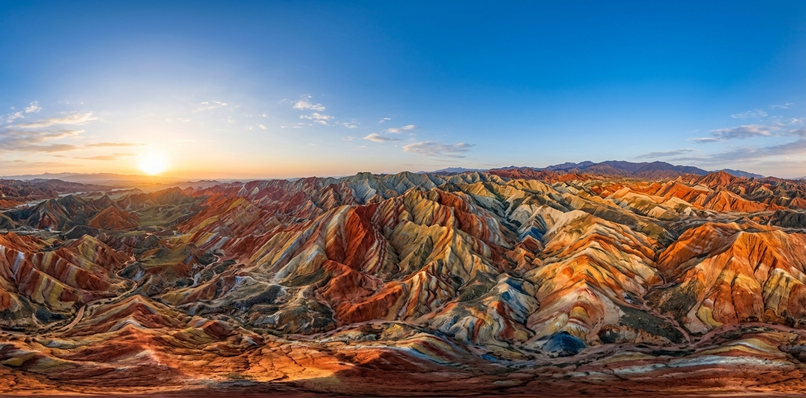</a>
<br/><b>张掖七彩丹霞360°日出全景</b>
<br/> 
<br/><details><summary>📋 核心提示词</summary>

```json
{
  "4. {
  "title": "张掖七彩丹霞地貌全景",
  "image_meta": {
    "type": "360度等距柱状全景图",
    "projection": "完整球形等距柱状投影",
    "aspect_ratio": "2:1",
    "resolution": "超高分辨率全景"
  },
  "scene_composition": {
    "location": "中国甘肃张掖七彩丹霞地质公园",
    "camera_position": "高空无人机航拍视角",
    "camera_height": "高空航拍视角",
    "field_of_view": "360° 水平，180° 垂直",
    "projection_behavior": "正确的等距柱状畸变",
    "weather": "晴朗，日出/日落时分，空气通透",
    "depth_of_field": "无限景深（整个全景清晰）"
  },
  "visual_elements": {
    "foreground": {
      "primary_view": "色彩斑斓的丹霞层理山体，红、橙、黄、白、青彩色岩层纹理清晰",
      "motion": "无明显动态，场景静谧"
    },
    "midground_subjects": {
      "terrain": "起伏剧烈的丹霞峡谷与丘陵，岩层呈现清晰的水平层理结构",
      "landforms": "连绵的彩色丹霞山体向四周延伸，沟壑纵横",
      "valley": "丹霞峡谷底部的平缓地带清晰可见"
    },
    "background": {
      "landscape": "丹霞地貌群向远方延伸，与远山轮廓相接",
      "sky": "澄澈的蓝天，日出/日落的太阳在左侧散发柔和光线，少量薄云点缀"
    },
    "environment": {
      "ground_hemisphere": "从高空俯瞰彩色丹霞山体、峡谷与层理地貌",
      "atmosphere": "壮丽、奇幻、充满地质美感的丹霞地貌环境"
    }
  },
  "rendering_style": {
    "lighting": "自然日出/日落侧光，强化岩层纹理与色彩层次",
    "color_grading": "真实自然色彩，以赤红、明黄、浅蓝为主",
    "texture_quality": {
      "description": "超写实航拍摄影风格",
      "artifacts": "轻微自然锐化，无人工痕迹",
      "stitching": "无缝360度全景拼接"
    }
  },
  "constraints": {
    "must_keep": [
      "纯360°全景透视",
      "高空航拍视角",
      "七彩丹霞地貌为核心主体",
      "无任何UI或界面元素",
      "高度写实"
    ],
    "avoid": [
      "城市或人工建筑",
      "人物",
      "电影感灯光",
      "奇幻风格",
      "插画或绘画感",
      "单帧构图"
    ]
  },
  "negative_prompt": [
    "ui",
    "hud",
    "text overlay",
    "watermark",
    "buildings",
    "bridges",
    "people",
    "fantasy art",
    "illustration",
    "cinematic lighting",
    "hdr",
    "overprocessed",
    "frame",
    "border",
    "cropped view",
    "broken panorama seams"
  ]
}"
}
```

<sub>📄 [下载完整 JSON](prompts/case129.json)</sub>
</details>
</div>

<hr/>
<div align="center">
<a href="images/case130/output.png">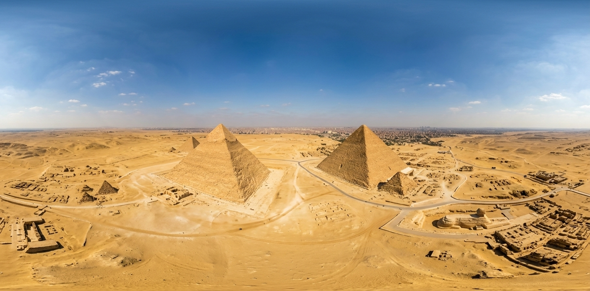</a>
<br/><b>埃及吉萨金字塔群沙漠航拍</b>
<br/> 
<br/><details><summary>📋 核心提示词</summary>

```json
{
  "3. {
  "title": "埃及吉萨金字塔群沙漠航拍",
  "image_meta": {
    "type": "360度等距柱状全景图",
    "projection": "完整球形等距柱状投影",
    "aspect_ratio": "2:1",
    "resolution": "超高分辨率全景"
  },
  "scene_composition": {
    "location": "埃及吉萨金字塔群",
    "camera_position": "高空无人机航拍视角",
    "camera_height": "高空航拍视角",
    "field_of_view": "360° 水平，180° 垂直",
    "projection_behavior": "正确的等距柱状畸变",
    "weather": "晴朗，空气通透",
    "depth_of_field": "无限景深（整个全景清晰）"
  },
  "visual_elements": {
    "foreground": {
      "primary_view": "胡夫金字塔与哈夫拉金字塔，砂岩纹理与风化痕迹清晰可见",
      "motion": "无明显动态，场景静谧"
    },
    "midground_subjects": {
      "terrain": "金黄色的撒哈拉沙漠，沙面平整，有轻微的车辙痕迹",
      "structures": "金字塔附属神庙与小型金字塔遗址沿沙漠分布",
      "city": "远处开罗城市建筑群的轮廓清晰可见"
    },
    "background": {
      "landscape": "沙漠向远方无限延伸，与城市天际线相接",
      "sky": "澄澈的浅蓝色天空，点缀着少量轻薄的白色云絮"
    },
    "environment": {
      "ground_hemisphere": "从高空俯瞰金字塔群、沙漠与远处城市",
      "atmosphere": "古老、神秘、充满历史厚重感的沙漠遗址环境"
    }
  },
  "rendering_style": {
    "lighting": "自然正午阳光，阴影清晰锐利",
    "color_grading": "真实自然色彩，以土黄、浅蓝、赭石为主",
    "texture_quality": {
      "description": "超写实航拍摄影风格",
      "artifacts": "轻微自然锐化，无人工痕迹",
      "stitching": "无缝360度全景拼接"
    }
  },
  "constraints": {
    "must_keep": [
      "纯360°全景透视",
      "高空航拍视角",
      "吉萨金字塔群为核心主体",
      "无任何UI或界面元素",
      "高度写实"
    ],
    "avoid": [
      "现代密集建筑",
      "人物",
      "电影感灯光",
      "奇幻风格",
      "插画或绘画感",
      "单帧构图"
    ]
  },
  "negative_prompt": [
    "ui",
    "hud",
    "text overlay",
    "watermark",
    "buildings",
    "bridges",
    "people",
    "fantasy art",
    "illustration",
    "cinematic lighting",
    "hdr",
    "overprocessed",
    "frame",
    "border",
    "cropped view",
    "broken panorama seams"
  ]
}"
}
```

<sub>📄 [下载完整 JSON](prompts/case130.json)</sub>
</details>
</div>

<hr/>
<div align="center">
<a href="images/case131/output.png">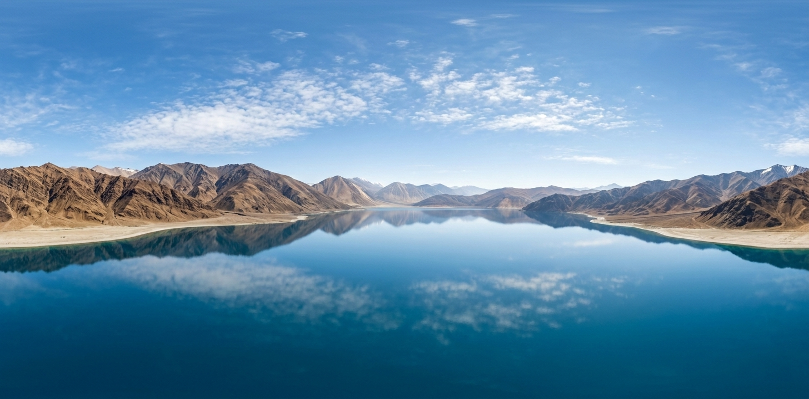</a>
<br/><b>高原镜面湖泊与山脉</b>
<br/> 
<br/><details><summary>📋 核心提示词</summary>

```json
{
  "2. {
  "title": "高原镜面湖泊与山脉",
  "image_meta": {
    "type": "360度等距柱状全景图",
    "projection": "完整球形等距柱状投影",
    "aspect_ratio": "2:1",
    "resolution": "超高分辨率全景"
  },
  "scene_composition": {
    "location": "高原内陆镜面湖泊",
    "camera_position": "高空无人机航拍视角",
    "camera_height": "高空航拍视角",
    "field_of_view": "360° 水平，180° 垂直",
    "projection_behavior": "正确的等距柱状畸变",
    "weather": "晴朗，空气通透，无风",
    "depth_of_field": "无限景深（整个全景清晰）"
  },
  "visual_elements": {
    "foreground": {
      "primary_view": "镜面般平静的湖水，完美反射天空的白云与远处的山脉",
      "motion": "无明显动态，水面极致平静"
    },
    "midground_subjects": {
      "terrain": "褐色层理结构的陡峭山体，岩壁纹理清晰",
      "lake_shore": "浅白色的湖岸线沿山脚延伸",
      "mountains": "连绵的高原山脉环绕湖泊，层次分明"
    },
    "background": {
      "landscape": "远山在薄雾中若隐若现，延伸至地平线",
      "sky": "澄澈的蓝天，点缀着细碎的白色絮状云"
    },
    "environment": {
      "ground_hemisphere": "从高空俯瞰镜面湖泊、山脉与天空倒影",
      "atmosphere": "宁静、辽阔、纯净的高原湖泊环境"
    }
  },
  "rendering_style": {
    "lighting": "自然正午阳光，光线均匀柔和",
    "color_grading": "真实自然色彩，以深蓝、赭石、纯白为主",
    "texture_quality": {
      "description": "超写实航拍摄影风格",
      "artifacts": "轻微自然锐化，无人工痕迹",
      "stitching": "无缝360度全景拼接"
    }
  },
  "constraints": {
    "must_keep": [
      "纯360°全景透视",
      "高空航拍视角",
      "镜面湖泊与山脉为核心主体",
      "无任何UI或界面元素",
      "高度写实"
    ],
    "avoid": [
      "城市或人工建筑",
      "人物",
      "电影感灯光",
      "奇幻风格",
      "插画或绘画感",
      "单帧构图"
    ]
  },
  "negative_prompt": [
    "ui",
    "hud",
    "text overlay",
    "watermark",
    "buildings",
    "bridges",
    "people",
    "fantasy art",
    "illustration",
    "cinematic lighting",
    "hdr",
    "overprocessed",
    "frame",
    "border",
    "cropped view",
    "broken panorama seams"
  ]
}"
}
```

<sub>📄 [下载完整 JSON](prompts/case131.json)</sub>
</details>
</div>

<hr/>
<div align="center">
<a href="images/case132/output.png">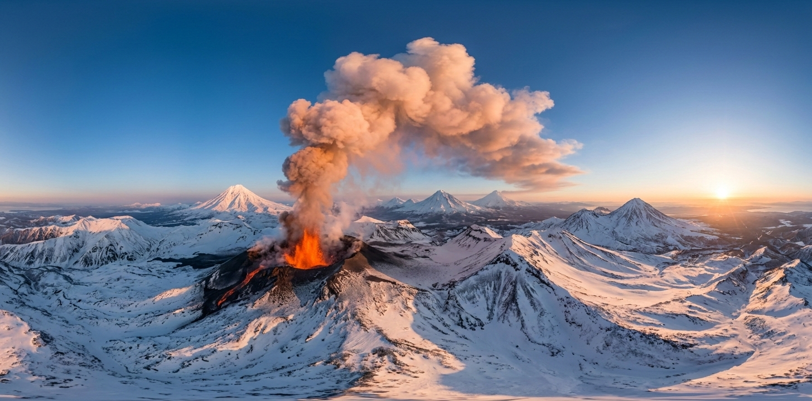</a>
<br/><b>堪察加火山喷发雪景</b>
<br/> 
<br/><details><summary>📋 核心提示词</summary>

```json
{
  "1. {
  "title": "堪察加火山喷发雪景",
  "image_meta": {
    "type": "360度等距柱状全景图",
    "projection": "完整球形等距柱状投影",
    "aspect_ratio": "2:1",
    "resolution": "超高分辨率全景"
  },
  "scene_composition": {
    "location": "俄罗斯堪察加半岛火山群",
    "camera_position": "高空无人机航拍视角",
    "camera_height": "高空航拍视角",
    "field_of_view": "360° 水平，180° 垂直",
    "projection_behavior": "正确的等距柱状畸变",
    "weather": "晴朗，日出/日落时分，空气通透",
    "depth_of_field": "无限景深（整个全景清晰）"
  },
  "visual_elements": {
    "foreground": {
      "primary_view": "正在喷发的火山口，橙红色岩浆翻涌，火山灰与蒸汽向上升腾",
      "motion": "岩浆流动、火山灰飘散形成自然动态模糊"
    },
    "midground_subjects": {
      "terrain": "积雪覆盖的火山山体，黑色火山岩与白雪形成强烈对比",
      "plume": "巨型火山灰云团在火山口上方形成，被阳光染成暖粉色",
      "mountains": "远处多座积雪火山沿地平线排列"
    },
    "background": {
      "landscape": "火山群向远方延伸，与地平线无缝衔接",
      "sky": "澄澈的深蓝色天空，日出/日落的太阳在右侧地平线散发暖光"
    },
    "environment": {
      "ground_hemisphere": "从高空俯瞰喷发火山、积雪山体与火山灰云",
      "atmosphere": "壮丽、震撼、充满原始地质力量的火山环境"
    }
  },
  "rendering_style": {
    "lighting": "自然日出/日落暖光，冷暖色调对比强烈",
    "color_grading": "真实自然色彩，以橙红、雪白、深蓝为主",
    "texture_quality": {
      "description": "超写实航拍摄影风格",
      "artifacts": "轻微自然锐化，无人工痕迹",
      "stitching": "无缝360度全景拼接"
    }
  },
  "constraints": {
    "must_keep": [
      "纯360°全景透视",
      "高空航拍视角",
      "火山喷发与雪景为核心主体",
      "无任何UI或界面元素",
      "高度写实"
    ],
    "avoid": [
      "城市或人工建筑",
      "人物",
      "电影感灯光",
      "奇幻风格",
      "插画或绘画感",
      "单帧构图"
    ]
  },
  "negative_prompt": [
    "ui",
    "hud",
    "text overlay",
    "watermark",
    "buildings",
    "bridges",
    "people",
    "fantasy art",
    "illustration",
    "cinematic lighting",
    "hdr",
    "overprocessed",
    "frame",
    "border",
    "cropped view",
    "broken panorama seams"
  ]
}"
}
```

<sub>📄 [下载完整 JSON](prompts/case132.json)</sub>
</details>
</div>

<hr/>
<div align="center">
<a href="images/case140/output.png"></a>
<br/><b>约书亚树沙漠的日落颂歌</b>
<br/> 
</div>

<hr/>
<div align="center">
<a href="images/case147/output.png"></a>
<br/><b>日落时的沙漠全景</b>
<br/> 
</div>

<hr/>
<div align="center">
<a href="images/case015/output.png">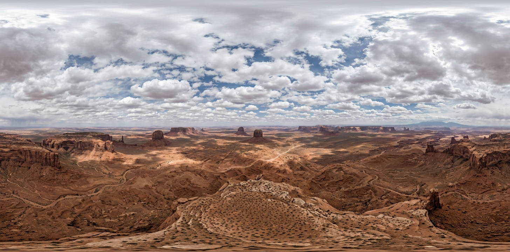</a>
<br/><b>高原俯视：红土地质的宏大指纹</b>
<br/> 
<br/><details><summary>📋 核心提示词</summary>

```json
{
  "{
  "图像元数据": {
    "类型": "360度等距柱状全景图",
    "投影方式": "完整球形等距柱状投影",
    "宽高比": "2:1",
    "分辨率": "超高分辨率全景"
  },
  "场景构图": {
    "地点": "美国西部高原，纪念碑谷俯瞰视角",
    "相机位置": "云层下方中心位置",
    "相机高度": "高空航拍视角，上帝视角",
    "视野范围": "水平360度，垂直180度",
    "投影行为": "正确的等距柱状畸变，确保无缝球形拼接",
    "天气状况": "晴到多云，伴有明显的云影斑块",
    "景深": "全聚焦无限远"
  },
  "视觉元素": {
    "前景": {
      "主体视图": "近处台地顶端的微观岩石地表细节",
      "动态": "静止"
    },
    "中景主体": {
      "地形": "散布的巨型台地群与网状分布的干枯河床",
      "村落": "无",
      "云雾": "地平线尽头有稀疏的云气"
    },
    "背景": {
      "景观": "向四面八方无限延展的红褐色荒漠",
      "天空": "带积云的开阔天空"
    },
    "环境氛围": {
      "地面半球": "丰富多变的光影地貌",
      "整体氛围": "极其辽阔、震撼、带有宏观宇宙观察视角"
    }
  },
  "渲染风格": {
    "光照": "带有云块遮挡的自然光，光斑明显",
    "调色": "自然、写实、以土色调为主，高动态范围",
    "质感质量": {
      "描述": "地质层的真实触感，空气的通透度表现",
      "痕迹": "无人工痕迹，画面纯净，自然锐化",
      "拼接": "完美的360度无缝拼接"
    }
  },
  "约束条件": {
    "必须保留": ["纯360度全景透视", "高空垂直向下视角", "地表脉络清晰"],
    "必须避免": ["人造公路", "旅游设施", "人物", "非写实感"]
  },
  "负面提示词": ["用户界面", "抬头显示", "文本覆盖", "水印", "现代建筑", "电线", "行人", "奇幻艺术", "插图", "过度处理", "边框", "裁剪视图", "全景接缝断裂"]
}"
}
```

<sub>📄 [下载完整 JSON](prompts/case015.json)</sub>
</details>
</div>

<hr/>
<div align="center">
<a href="images/case151/output.png"></a>
<br/><b>自然风景山脉森林湖泊倒影商业照片</b>
<br/> 
</div>

<hr/>
<div align="center">
<a href="images/case018/output.png">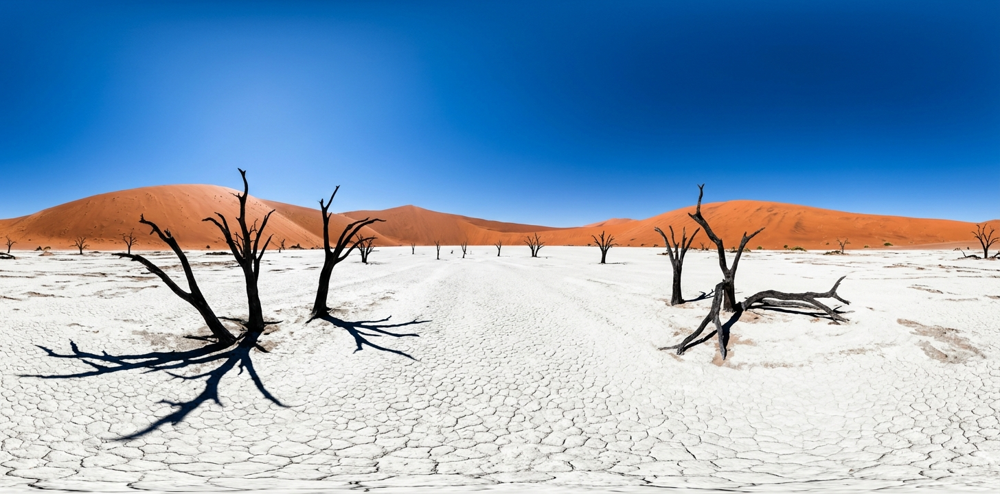</a>
<br/><b>死亡谷：红沙丘与千年枯木</b>
<br/> 
<br/><details><summary>📋 核心提示词</summary>

```json
{
  "{
  "图像元数据": {
    "类型": "360度等距柱状全景图",
    "投影方式": "完整球形等距柱状投影",
    "宽高比": "2:1",
    "分辨率": "超高分辨率全景"
  },
  "场景构图": {
    "地点": "纳米比亚，死亡谷 (Deadvlei)",
    "相机位置": "盐盆中心枯树林",
    "相机高度": "高空航拍视角，上帝视角",
    "视野范围": "水平360度，垂直180度",
    "投影行为": "正确的等距柱状畸变，确保无缝球形拼接",
    "天气状况": "万里无云，极度干燥晴朗",
    "景深": "前后景全幅清晰"
  },
  "视觉元素": {
    "前景": {
      "主体视图": "干裂洁白的盐碱地面与炭黑色的枯死老树",
      "动态": "静止"
    },
    "中景主体": {
      "地形": "巨大的橙红色沙丘环绕四周",
      "村落": "无",
      "云雾": "无"
    },
    "背景": {
      "景观": "纯净的地平线与沙丘边界",
      "天空": "深蓝、饱和、无云的纯净天空"
    },
    "环境氛围": {
      "地面半球": "白、黑、红三色的极简地表",
      "整体氛围": "凝固的时间感，超现实主义，永恒感"
    }
  },
  "渲染风格": {
    "光照": "强烈的顶侧光，阴影厚重深邃",
    "调色": "极高饱和度调色，色彩纯度极高",
    "质感质量": {
      "描述": "炭化木材的粗糙感与沙粒的流动感",
      "痕迹": "无人工痕迹，画面纯净，自然锐化",
      "拼接": "完美的360度无缝拼接"
    }
  },
  "约束条件": {
    "必须保留": ["纯360度全景透视", "黑色枯树主体", "红沙白地对比"],
    "必须避免": ["人物", "游客", "现代设备", "画意滤镜"]
  },
  "负面提示词": ["用户界面", "抬头显示", "文本覆盖", "水印", "现代建筑", "车辆", "行人", "奇幻艺术", "插图", "过度处理", "边框", "裁剪视图", "全景接缝断裂"]
}"
}
```

<sub>📄 [下载完整 JSON](prompts/case018.json)</sub>
</details>
</div>

<hr/>
<div align="center">
<a href="images/case021/output.png"></a>
<br/><b>纳瓦霍高原：光影雕琢的迷宫</b>
<br/> 
<br/><details><summary>📋 核心提示词</summary>

```json
{
  "{
  "图像元数据": {
    "类型": "360度等距柱状全景图",
    "投影方式": "完整球形等距柱状投影",
    "宽高比": "2:1",
    "分辨率": "超高分辨率全景"
  },
  "场景构图": {
    "地点": "纳瓦霍保留地，侵蚀平原",
    "相机位置": "奇石群正上方",
    "相机高度": "高空航拍视角，上帝视角",
    "视野范围": "水平360度，垂直180度",
    "投影行为": "正确的等距柱状畸变，确保无缝球形拼接",
    "天气状况": "晴朗，侧逆光强烈，空气极其通透",
    "景深": "全画幅锐利"
  },
  "视觉元素": {
    "前景": {
      "主体视图": "被阳光染成金橙色的破碎岩石顶部",
      "动态": "静止"
    },
    "中景主体": {
      "地形": "散布的台地、孤峰与深深的侵蚀沟壑",
      "村落": "无",
      "云雾": "地平线上若隐若现的薄云"
    },
    "背景": {
      "景观": "极目远眺下的广阔干旱荒原",
      "天空": "带有些许灰蓝调的纯净天空"
    },
    "环境氛围": {
      "地面半球": "阴影与亮面交错的红褐色大地",
      "整体氛围": "静谧、带有某种地外行星般的异域感"
    }
  },
  "渲染风格": {
    "光照": "强烈的斜向侧光，阴影边缘锐利",
    "调色": "高动态范围调色，突出光影层级",
    "质感质量": {
      "描述": "风化石材的坚硬质感，地表砂砾的细碎细节",
      "痕迹": "无人工痕迹，画面纯净，自然锐化",
      "拼接": "完美的360度无缝拼接"
    }
  },
  "约束条件": {
    "必须保留": ["纯360度全景透视", "极长阴影效果", "地貌纹理清晰"],
    "必须避免": ["奇幻色彩", "插画感", "城市元素", "人物"]
  },
  "负面提示词": ["用户界面", "抬头显示", "文本覆盖", "水印", "现代建筑", "公路", "行人", "奇幻艺术", "插图", "过度处理", "边框", "裁剪视图", "全景接缝断裂"]
}"
}
```

<sub>📄 [下载完整 JSON](prompts/case021.json)</sub>
</details>
</div>

<hr/>
<div align="center">
<a href="images/case032/output.png"></a>
<br/><b>山河咏叹：塔吉姆峡谷与阿萨河的360度田园诗画</b>
<br/> 
<br/><details><summary>📋 核心提示词</summary>

```json
{
  "{
  "图像元数据": {
    "类型": "360度等距柱状全景图 (360 Equirectangular Panorama)",
    "投影方式": "完整球形等距柱状投影",
    "宽高比": "2:1",
    "分辨率": "超高清实拍画质 (Atmospheric Aerial Photography)"
  },
  "场景构图": {
    "地点": "塞洛姆山脉 (Tsey-Loam)，高空视角俯瞰云海",
    "相机位置": "高空无人机，穿梭于云层之上",
    "相机高度": "极高空上帝视角",
    "视野范围": "水平360度，垂直180度，沉浸式空间感",
    "投影行为": "标准全景畸变，前景云雾环绕天底，地平线被群山与云海交替填满",
    "天气状况": "阴天转多云，伴有壮丽的低空云海 (Sea of Clouds)",
    "景深": "极深景深，穿过层层云雾直抵远方雪线"
  },
  "视觉元素": {
    "前景": {
      "主体视图": "下方被浓厚的、棉絮状的白云完全覆盖，云雾在山谷间流动，形成波浪般的纹理，遮挡了大部分地面细节。",
      "动态": "静止的云海奇观，仿佛时间凝固在群山之间。"
    },
    "中景主体": {
      "地形": "中心耸立着尖锐的灰色岩石主峰，山体陡峭，棱角分明，宛如从云海中破浪而出的礁石。",
      "植被": "山腰处隐约可见暗绿色的高山植被与黄褐色的山岩交错。",
      "云雾": "流云在山峰半腰处缠绕，形成丝滑的拉丝质感 (Mist-shrouded peak)。"
    },
    "背景": {
      "景观": "远方地平线上是连绵不断的雪山群，在微弱的晨光或暮色下呈现出清冷的蓝白色调。",
      "天空": "压抑而宏大的阴云天空，色彩从深灰色到浅蓝灰色，地平线处有一抹极淡的微光。"
    },
    "环境氛围": {
      "地面半球": "完全被白色的云海占据，营造出一种漂浮在虚空之中的宁静感。",
      "整体氛围": "清冷、幽静、空灵，充满超凡脱俗的禅意。"
    }
  },
  "渲染风格": {
    "光照": "柔和的散射光，无强烈阴影，强调冷色调的影调平衡 (Cool Tones)。",
    "调色": "低饱和度的蓝色与灰色调，展现出高海拔地区特有的冷冽与通透感。",
    "质感质量": {
      "描述": "云层的体积感极强，岩石表面的缝隙与纹理在冷色调下极具质感。",
      "痕迹": "无噪点，无拼接缝隙，无镜头眩光。",
      "拼接": "完美的360度无缝闭环"
    }
  },
  "约束条件": {
    "必须保留": [
      "360度全景球形视角",
      "大面积真实的低空云海",
      "从云海中突兀而出的尖锐主峰",
      "远景处的微弱雪山线条",
      "冷峻、忧郁的自然氛围"
    ],
    "必须避免": [
      "鲜艳强烈的色彩",
      "明显的太阳直射光",
      "任何现代建筑或道路（道路需被云雾遮挡）",
      "过度的锐化痕迹",
      "人物或设备阴影"
    ]
  },
  "负面提示词": [
    "饱和度过高",
    "温暖光影",
    "现代痕迹",
    "重复的纹理",
    "断层",
    "模糊不清的岩石",
    "过亮的高光",
    "非全景构图"
  ]
}"
}
```

<sub>📄 [下载完整 JSON](prompts/case032.json)</sub>
</details>
</div>

<hr/>
<div align="center">
<a href="images/case034/output.png"></a>
<br/><b>360度高空无人机视角下雄伟的梯田群山</b>
<br/> 
<br/><details><summary>📋 核心提示词</summary>

```json
{
  "{
  "图像元数据": {
    "类型": "360度等距柱状全景图",
    "投影方式": "完整球形等距柱状投影",
    "宽高比": "2:1",
    "分辨率": "超高分辨率全景"
  },
  "场景构图": {
    "地点": "高山河谷地区（例如中国西南部或喜马拉雅山脉）",
    "相机位置": "360度全景无人机",
    "相机高度": "极高的高空航拍视角（上帝视角）",
    "视野范围": "水平360度，垂直180度，完全包围",
    "投影行为": "正确的等距柱状畸变，确保无缝球形拼接，天空在顶部，地面在底部",
    "天气状况": "晴朗，有动态积云",
    "景深": "无限景深，所有元素（前景道路、中景梯田、远景山脉）都锐利清晰"
  },
  "视觉元素": {
    "前景（地面半球底部）": {
      "主体视图": "一条维护良好的铺砌沥青道路，呈极度夸张、扭曲的“U”形环绕，并连接到中景的蜿蜒道路，展示了全景投影的典型畸变。道路两侧是干旱和半干旱的灌木丛和岩石地面。",
      "动态": "无车辆，无行人，保持纯净的自然景观"
    },
    "中景主体": {
      "地形": "一座雄伟、复杂的梯田山脉系统，完全覆盖了中景的大部分区域。梯田由人工修筑，呈现出惊人的同心圆、螺旋状和锯齿状几何图案，随着山体地形起伏，非常详细和庞大。梯田本身表现出绿色（作物）和棕色（土壤/干草）交织的自然调色板。",
      "村落": "一个密集的、历史悠久的村落（石砌建筑和传统屋顶）栖息在梯田山脉的脊线和山坡上，与梯田融为一体。另一个较小的定居点位于更远的山谷深处。右侧山坡上有几座红瓦屋顶的现代建筑。",
      "云雾": "低空积云和地形云（白而蓬松）从左侧山脉上方掠过，部分遮挡了最高的山峰，增加了深度和动感。"
    },
    "背景（天际线及以上）": {
      "景观": "一系列更遥远、更黑暗的常绿森林山脉环绕着山谷，与梯田山脉形成鲜明对比。远处的山脉向地平线延伸，展示出明显的层叠效果。",
      "天空": "深蓝色、纯净的天空，带有精致的卷云和蓬松的积云。太阳位于天空的右上角（或由于全景视角而看起来像在两个位置），投射出清晰的光线和阴影。"
    },
    "环境氛围": {
      "地面半球": "完全覆盖，从最底部扭曲的道路到中景的梯田，没有空白区域。",
      "整体氛围": "史诗般、宏大、偏远、宁静、农业文明与自然的和谐，具有极强的沉浸感。"
    }
  },
  "渲染风格": {
    "光照": "明亮的自然日光，具有明确的方向性（从右/上），产生强烈的阴影和高光，强调梯田的几何结构。左侧山脉有轻微的云阴影。",
    "调色": "自然、饱和、现实的色彩：深蓝色的天空，绿色、金棕色和岩石灰色的梯田和山体，深绿色的森林。",
    "质感质量": {
      "描述": "超高细节、摄影级写实，无噪点或压缩痕迹。",
      "痕迹": "无用户界面、无文本、无水印、无现代车辆或不协调的现代设施（除了少数红顶建筑）。",
      "拼接": "完美的360度无缝拼接，无任何可见接缝。"
    }
  },
  "约束条件": {
    "必须保留": [
      "纯360度全景透视",
      "无人机高空视角",
      "梯田为核心主体",
      "无任何界面元素",
      "高度写实摄影感",
      "前景道路的扭曲畸变"
    ],
    "必须避免": [
      "城市或现代大都市建筑",
      "人物",
      "电影感夸张灯光",
      "奇幻或游戏风格",
      "绘画或插画感",
      "非全景的普通照片布局"
    ]
  },
  "负面提示词": [
    "用户界面",
    "抬头显示",
    "文本覆盖",
    "水印",
    "签名",
    "边界线",
    "裁剪",
    "普通视角",
    "2D照片",
    "现代摩天大楼",
    "大量汽车",
    "行人",
    "奇幻艺术",
    "插图",
    "低分辨率",
    "全景接缝断裂",
    "伪造全景"
  ]
}"
}
```

<sub>📄 [下载完整 JSON](prompts/case034.json)</sub>
</details>
</div>

<hr/>
<div align="center">
<a href="images/case036/output.png">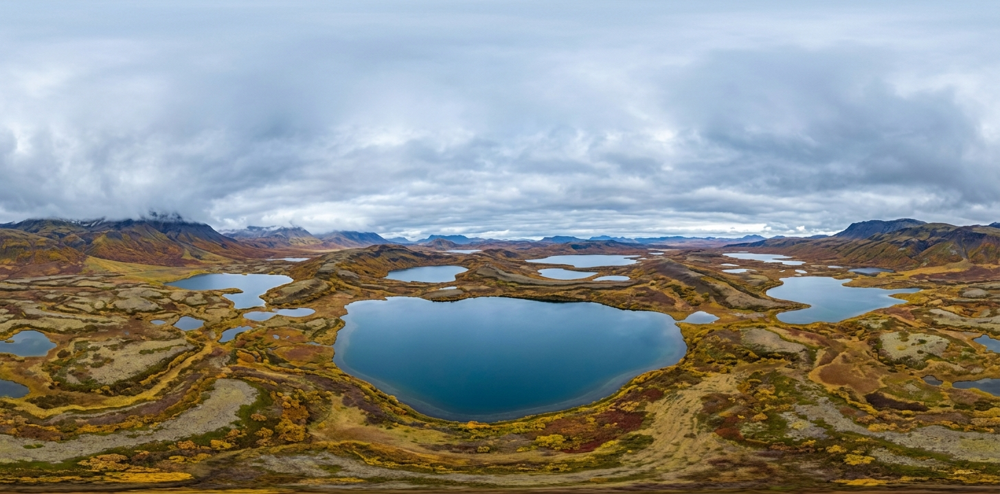</a>
<br/><b>堪察加火山湖与云海全景：自然的极致壮丽</b>
<br/> 
<br/><details><summary>📋 核心提示词</summary>

```json
{
  "{
  "图像元数据": {
    "类型": "超宽幅鸟瞰全景图 (非360度球形)",
    "投影方式": "超宽幅透视投影",
    "宽高比": "约 3:1",
    "分辨率": "超高分辨率全景"
  },
  "场景构图": {
    "地点": "堪察加半岛或类似偏远火山地区",
    "相机位置": "极高空，上帝视角鸟瞰",
    "相机高度": "高空航拍",
    "视野范围": "覆盖数百平方公里，从太平洋沿岸延伸至内陆火山群",
    "投影行为": "最小化广角畸变，保持地貌自然几何",
    "天气状况": "清澈的晴空，伴有低空海雾和高空层积云",
    "景深": "全景深，从前景森林到远景火山均清晰"
  },
  "视觉元素": {
    "前景": {
      "主体视图": "广袤的温带森林和灌木丛地毯",
      "动态": "蜿蜒的河流流向火山口湖"
    },
    "中景主体": {
      "地形": "巨大的火山口湖（蓝色水面，圆形轮廓）及其陡峭的内壁；蜿蜒、银色的河流",
      "村落": "无任何村落或现代建筑",
      "云雾": "大片低空海雾/层云，流向地平面，将森林与远山隔开"
    },
    "背景": {
      "景观": "两座主要的雪山。左侧：一座完美的、孤立的圆锥形雪火山（克柳切夫火山或其姊妹山）；右侧：一座更大、更平缓、白雪皑皑的山脉（或另一座大型火山）。两山之间是广阔的云海",
      "天空": "深蓝色、清澈的天空，带有微妙的阳光光晕"
    },
    "环境氛围": {
      "地面半球": "完全被自然植被覆盖",
      "整体氛围": "壮丽、荒凉、原始、宁静、宏大"
    }
  },
  "渲染风格": {
    "光照": "强烈的顶光，来自场景正上方偏右，形成鲜明的阴影和高光",
    "调色": "深绿色、白色（雪和云）、深蓝色（天空和湖泊）的自然、鲜艳色彩",
    "质感质量": {
      "描述": "超清晰、细腻的纹理，森林的叶片、河流的纹理、云层的层次感和雪山的细节均完美还原",
      "痕迹": "除水印外，画面纯净，无噪点，自然锐化",
      "拼接": "完美的宽幅全景拼接"
    }
  },
  "约束条件": {
    "必须保留": [
      "超宽幅全景透视",
      "无人机极高空上帝视角",
      "完美的圆锥形火山和大型火山口湖为双核心主体",
      "蜿蜒的河流",
      "大片低空海雾",
      "高度写实摄影感",
      "右下角的 'AirPano' 水印"
    ],
    "必须避免": [
      "城市或现代建筑",
      "任何人物或人造交通工具",
      "电影感夸张灯光",
      "奇幻或游戏风格",
      "绘画或插画感",
      "普通非全景照片布局"
    ]
  },
  "负面提示词": [
    "用户界面",
    "抬头显示",
    "文本覆盖（除水印）",
    "现代建筑",
    "桥梁",
    "行人",
    "车辆",
    "奇幻艺术",
    "插图",
    "过度处理",
    "边框",
    "裁剪视图",
    "拼接裂缝"
  ]
}"
}
```

<sub>📄 [下载完整 JSON](prompts/case036.json)</sub>
</details>
</div>

<hr/>
<div align="center">
<a href="images/case037/output.png"></a>
<br/><b>阿尔及利亚塔西里·纳杰尔（Tassili nAjjer）沙漠与石林 360° 全景：壮阔的自然奇观</b>
<br/> 
<br/><details><summary>📋 核心提示词</summary>

```json
{
  "{
  "图像元数据": {
    "类型": "360度等距柱状全景图",
    "投影方式": "完整球形等距柱状投影",
    "宽高比": "2:1",
    "分辨率": "超高分辨率全景"
  },
  "场景构图": {
    "地点": "阿尔及利亚，撒哈拉沙漠，塔西里·纳杰尔（Tassili n'Ajjer）国家公园",
    "相机位置": "位于一个俯瞰沙漠和石林的高处岩石悬崖边缘",
    "相机高度": "高空航拍视角，上帝视角",
    "视野范围": "水平360度，垂直180度",
    "投影行为": "正确的等距柱状畸变，确保无缝球形拼接",
    "天气状况": "晴空万里，带有羽毛状卷云",
    "景深": "全景清晰，远近皆有细节"
  },
  "视觉元素": {
    "前景": {
      "主体视图": "高空航拍视角，俯瞰由深色、风蚀严重的砂岩构成的陡峭悬崖和岩石迷宫。在左侧悬崖边缘，站立着一个渺小但清晰可见的、身穿蓝色长袍的人影，背对镜头，面向壮观的沙漠景致。岩石表面有丰富的纹理和金色沙子的沉积。",
      "动态": "静止，除了可能存在的微风"
    },
    "中景主体": {
      "地形": "广阔的金色沙丘群，沙丘曲线流畅，波纹清晰。沙丘之间分布着大量高耸、孤立的黑暗石林和岩石尖塔，形成著名的“岩石城市”景观。",
      "云雾": "无雾，天空纯净"
    },
    "背景": {
      "景观": "连绵不绝的金色沙丘海延伸至地平线，地平线有正确的等距柱状弧度。",
      "天空": "广阔的蓝色天空，布满了细腻的羽毛状和卷云纹理。太阳位于右侧，是一个耀眼的、带有光晕的光源，光线强烈。"
    },
    "环境氛围": {
      "地面半球": "完全覆盖沙丘和岩石，无缝连接。",
      "整体氛围": "宏伟、宁静、荒凉且充满探险感。强烈的光线和深邃的阴影增强了质感。"
    }
  },
  "渲染风格": {
    "光照": "强烈的阳光从右侧（或根据具体视角而定）射入，产生清晰锐利的阴影和金色沙子的反光。",
    "调色": "暖色调，主导颜色为深金色、橙色和岩石的深褐色、黑色，与蓝天形成鲜明对比。",
    "质感质量": {
      "描述": "超高分辨率，纹理细节极其丰富。岩石表面的风蚀痕迹、沙丘上的每一个沙纹、以及人影的蓝色长袍纹理都清晰可见。",
      "痕迹": "无人工痕迹，画面纯净，自然锐化",
      "拼接": "完美的360度无缝拼接"
    }
  },
  "约束条件": {
    "必须保留": [
      "纯360度全景透视",
      "无人机高空视角",
      "塔西里·纳杰尔的石林和沙丘为核心主体",
      "左侧悬崖边缘的蓝色长袍人影",
      "无任何界面元素",
      "高度写实摄影感",
      "AirPano水印在左下角（如需要）"
    ],
    "必须避免": [
      "城市或现代建筑",
      "车辆",
      "现代服装（除人影外）",
      "奇幻或游戏风格",
      "绘画或插画感",
      "非全景的普通照片布局"
    ]
  },
  "负面提示词": [
    "用户界面",
    "抬头显示",
    "文本覆盖",
    "水印（除原图外）",
    "现代建筑",
    "车辆",
    "行人",
    "奇幻艺术",
    "插图",
    "过度处理",
    "边框",
    "裁剪视图",
    "全景接缝断裂"
  ]
}"
}
```

<sub>📄 [下载完整 JSON](prompts/case037.json)</sub>
</details>
</div>

<hr/>
<div align="center">
<a href="images/case040/output.png">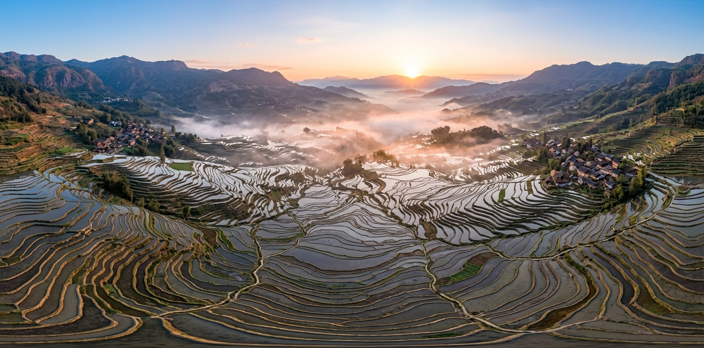</a>
<br/><b>云巅之上的自然史诗：哈尼梯田日出全景提示词</b>
<br/> 
<br/><details><summary>📋 核心提示词</summary>

```json
{
  "{
  "图像元数据": {
    "类型": "360度等距柱状全景图",
    "投影方式": "完整球形等距柱状投影",
    "宽高比": "2:1",
    "分辨率": "超高分辨率全景"
  },
  "场景构图": {
    "地点": "壮丽的哈尼梯田核心景观区上空",
    "相机位置": "无人机位于梯田群正上方进行全景航拍",
    "相机高度": "高空航拍视角，上帝视角",
    "视野范围": "水平360度，垂直180度",
    "投影行为": "正确的等距柱状畸变，确保无缝球形拼接",
    "天气状况": "清晨破晓，带有晨雾，空气通透",
    "景深": "全景深，从近处梯田到远方山脉皆清晰"
  },
  "视觉元素": {
    "前景": {
      "主体视图": "如镜面般的水注梯田从脚下向四周蜿蜒延伸，田埂线条细腻清晰",
      "动态": "水面静谧，反射出天空微弱的晨光"
    },
    "中景主体": {
      "地形": "层层叠叠、连绵不断的阶梯状稻田，覆盖整个山谷，纹理丰富",
      "村落": "隐约可见原始的蘑菇房村落散落在梯田之间",
      "云雾": "柔和的薄雾在梯田间低垂环绕，在阳光照射下呈现半透明质感"
    },
    "背景": {
      "景观": "远方山脉重峦叠嶂，消失在晨霭之中",
      "天空": "日出时分的红霞与清澈蓝天交织，太阳光芒微微露头"
    },
    "环境氛围": {
      "地面半球": "从空中俯瞰布满水的梯田、泥土路径与自然植被",
      "整体氛围": "自然、神圣、壮观且未被现代工业破坏的农耕文明奇观"
    }
  },
  "渲染风格": {
    "光照": "清晨自然光，带有明显的侧逆光效果，光影层次丰富",
    "调色": "真实自然色彩，强调用土黄色、深绿色与反射出的天蓝色",
    "质感质量": {
      "描述": "超写实航拍摄影风格",
      "痕迹": "无人工痕迹，画面纯净，自然锐化",
      "拼接": "完美的360度无缝拼接"
    }
  },
  "约束条件": {
    "必须保留": [
      "纯360度全景透视",
      "无人机高空视角",
      "梯田为核心主体",
      "无任何界面元素",
      "高度写实摄影感"
    ],
    "必须避免": [
      "城市或现代建筑",
      "人物",
      "电影感夸张灯光",
      "奇幻或游戏风格",
      "绘画或插画感",
      "非全景的普通照片布局"
    ]
  },
  "负面提示词": [
    "用户界面",
    "抬头显示",
    "文本覆盖",
    "水印",
    "现代建筑",
    "桥梁",
    "行人",
    "奇幻艺术",
    "插图",
    "过度处理",
    "边框",
    "裁剪视图",
    "全景接缝断裂"
  ]
}"
}
```

<sub>📄 [下载完整 JSON](prompts/case040.json)</sub>
</details>
</div>

<hr/>
<div align="center">
<a href="images/case042/output.png">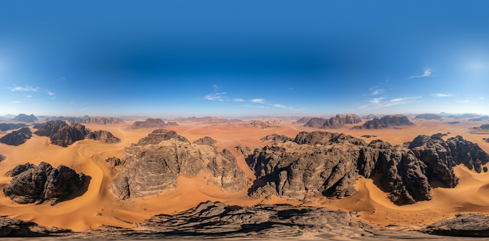</a>
<br/><b>约旦瓦迪拉姆沙漠峡谷地貌正午 360° 全景航拍</b>
<br/> 
<br/><details><summary>📋 核心提示词</summary>

```json
{
  "{
    "图像元数据": {
        "类型": "360度等距柱状全景图",
        "投影方式": "完整球形等距柱状投影",
        "宽高比": "2:1",
        "分辨率": "超高分辨率全景"
    },
    "场景构图": {
        "拍摄地点": "约旦瓦迪拉姆沙漠峡谷地貌上空",
        "机位": "无人机位于沙漠峡谷正上方高空航拍",
        "拍摄高度": "高空无人机视角",
        "视野范围": "水平360°，垂直180°",
        "投影特性": "正确的等距柱状畸变",
        "天气状况": "晴朗天气，空气通透",
        "景深": "无限景深，全景画面全程清晰"
    },
    "视觉元素": {
        "前景": {
            "核心画面": "灰褐色的峡谷岩山，轮廓硬朗，岩壁纹理清晰，与红色沙丘自然衔接",
            "细节表现": "岩山的粗糙质感、沙丘的细腻质感对比鲜明，细节真实"
        },
        "中景": {
            "地形": "广袤的红色沙漠平原，沙丘连绵起伏，向天际线无限延伸",
            "环境细节": "沙丘的流畅曲线、沙粒质感自然真实"
        },
        "背景": {
            "远景": "远方的岩山向天际线延伸，若隐若现",
            "天空": "澄澈的蓝天占据上半球，点缀少量轻薄流云，阳光明亮自然"
        },
        "环境氛围": {
            "下半球视角": "从空中俯瞰沙漠峡谷、沙丘平原与远方天际线",
            "整体气质": "辽阔苍茫的沙漠峡谷环境，无人类开发痕迹"
        }
    },
    "渲染风格": {
        "光影": "正午高角度侧光，真实光影方向，沙丘与岩山明暗层次丰富，对比自然",
        "色彩调校": "真实自然色彩，沙漠红色、岩山灰褐色与天空蓝色平衡，还原实景质感",
        "纹理质感": {
            "描述": "超写实航拍摄影风格",
            "处理细节": "轻微自然锐化，无人工痕迹",
            "拼接要求": "无缝360度全景拼接"
        }
    },
    "约束规则": {
        "必须保留": ["纯360°全景透视", "无人机高空航拍视角", "沙漠峡谷地貌为核心主体", "无任何UI或界面元素", "高度写实"],
        "严格规避": ["城市或人工建筑", "人物", "电影感灯光", "奇幻风格", "插画或绘画感", "单帧构图"]
    },
    "负面提示词": ["界面元素", "抬头显示", "文字叠加", "水印", "建筑", "人物", "奇幻艺术", "插画", "电影感打光", "过度高动态范围", "过度处理", "画框", "边框", "裁切画面", "全景拼接断层", "人工元素"]
}"
}
```

<sub>📄 [下载完整 JSON](prompts/case042.json)</sub>
</details>
</div>

<hr/>
<div align="center">
<a href="images/case044/output.png"></a>
<br/><b>堪察加半岛火山与火山湖 360° 全景航拍</b>
<br/> 
<br/><details><summary>📋 核心提示词</summary>

```json
{
  "{
    "图像元数据": {
        "类型": "360度等距柱状全景图",
        "投影方式": "完整球形等距柱状投影",
        "宽高比": "2:1",
        "分辨率": "超高分辨率全景"
    },
    "场景构图": {
        "拍摄地点": "堪察加半岛火山与火山湖上空",
        "机位": "无人机位于火山正上方超高空航拍",
        "拍摄高度": "超高空无人机视角",
        "视野范围": "水平360°，垂直180°",
        "投影特性": "正确的等距柱状畸变",
        "天气状况": "晴朗天气，空气通透",
        "景深": "无限景深，全景画面全程清晰"
    },
    "视觉元素": {
        "前景": {
            "核心画面": "右侧的火山湖，深邃湛蓝，被绿色火山植被环绕，蜿蜒河流从火山脚下流向远方",
            "细节表现": "火山湖的通透质感、植被的层次、河流的蜿蜒曲线清晰自然"
        },
        "中景": {
            "地形": "绿色的火山植被覆盖着火山脚下，与火山湖、河流自然衔接",
            "环境细节": "植被的质感、河流的水体质感真实自然"
        },
        "背景": {
            "远景": "左侧的锥形火山，山顶积雪覆盖，轮廓完美对称，远方云海缭绕",
            "天空": "澄澈的蓝天占据上半球，点缀少量轻薄流云，阳光明亮自然"
        },
        "环境氛围": {
            "下半球视角": "从超高空俯瞰火山湖、河流与锥形火山",
            "整体气质": "原始壮阔的火山地貌环境，无人类开发痕迹"
        }
    },
    "渲染风格": {
        "光影": "自然白日侧光，真实光影方向，火山与湖面明暗层次自然",
        "色彩调校": "真实自然色彩，火山深灰与白色积雪、湖水湛蓝、植被翠绿平衡，还原实景质感",
        "纹理质感": {
            "描述": "超写实航拍摄影风格",
            "处理细节": "轻微自然锐化，无人工痕迹",
            "拼接要求": "无缝360度全景拼接"
        }
    },
    "约束规则": {
        "必须保留": ["纯360°全景透视", "无人机超高空航拍视角", "火山与火山湖为核心主体", "无任何UI或界面元素", "高度写实"],
        "严格规避": ["城市或人工建筑", "人物", "电影感灯光", "奇幻风格", "插画或绘画感", "单帧构图"]
    },
    "负面提示词": ["界面元素", "抬头显示", "文字叠加", "水印", "建筑", "人物", "奇幻艺术", "插画", "电影感打光", "过度高动态范围", "过度处理", "画框", "边框", "裁切画面", "全景拼接断层", "人工元素"]
}"
}
```

<sub>📄 [下载完整 JSON](prompts/case044.json)</sub>
</details>
</div>

<hr/>
<div align="center">
<a href="images/case045/output.png"></a>
<br/><b>阿尔及利亚撒哈拉沙漠峡谷地貌正午 360° 全景航拍</b>
<br/> 
<br/><details><summary>📋 核心提示词</summary>

```json
{
  "{
    "图像元数据": {
        "类型": "360度等距柱状全景图",
        "投影方式": "完整球形等距柱状投影",
        "宽高比": "2:1",
        "分辨率": "超高分辨率全景"
    },
    "场景构图": {
        "拍摄地点": "阿尔及利亚撒哈拉沙漠峡谷地貌上空",
        "机位": "无人机位于沙漠峡谷正上方高空航拍",
        "拍摄高度": "高空无人机视角",
        "视野范围": "水平360°，垂直180°",
        "投影特性": "正确的等距柱状畸变",
        "天气状况": "晴朗天气，空气通透",
        "景深": "无限景深，全景画面全程清晰"
    },
    "视觉元素": {
        "前景": {
            "核心画面": "深色的峡谷岩山，轮廓硬朗，岩壁纹理清晰，与金色沙丘自然衔接",
            "细节表现": "岩山的粗糙质感、沙丘的细腻质感对比鲜明，细节真实"
        },
        "中景": {
            "地形": "广袤的金色沙漠平原，沙丘连绵起伏，向天际线无限延伸",
            "环境细节": "沙丘的流畅曲线、沙粒质感自然真实"
        },
        "背景": {
            "远景": "远方的岩山向天际线延伸，若隐若现",
            "天空": "澄澈的蓝天占据上半球，点缀少量轻薄流云，阳光明亮自然"
        },
        "环境氛围": {
            "下半球视角": "从空中俯瞰沙漠峡谷、沙丘平原与远方天际线",
            "整体气质": "辽阔苍茫的沙漠峡谷环境，无人类开发痕迹"
        }
    },
    "渲染风格": {
        "光影": "正午高角度侧光，真实光影方向，沙丘与岩山明暗层次丰富，对比自然",
        "色彩调校": "真实自然色彩，沙漠金色、岩山深灰色与天空蓝色平衡，还原实景质感",
        "纹理质感": {
            "描述": "超写实航拍摄影风格",
            "处理细节": "轻微自然锐化，无人工痕迹",
            "拼接要求": "无缝360度全景拼接"
        }
    },
    "约束规则": {
        "必须保留": ["纯360°全景透视", "无人机高空航拍视角", "沙漠峡谷地貌为核心主体", "无任何UI或界面元素", "高度写实"],
        "严格规避": ["城市或人工建筑", "人物", "电影感灯光", "奇幻风格", "插画或绘画感", "单帧构图"]
    },
    "负面提示词": ["界面元素", "抬头显示", "文字叠加", "水印", "建筑", "人物", "奇幻艺术", "插画", "电影感打光", "过度高动态范围", "过度处理", "画框", "边框", "裁切画面", "全景拼接断层", "人工元素"]
}"
}
```

<sub>📄 [下载完整 JSON](prompts/case045.json)</sub>
</details>
</div>

<hr/>
<div align="center">
<a href="images/case047/output.png"></a>
<br/><b>约旦瓦迪拉姆沙漠峡谷地貌正午 360° 全景航拍</b>
<br/> 
<br/><details><summary>📋 核心提示词</summary>

```json
{
  "{
    "图像元数据": {
        "类型": "360度等距柱状全景图",
        "投影方式": "完整球形等距柱状投影",
        "宽高比": "2:1",
        "分辨率": "超高分辨率全景"
    },
    "场景构图": {
        "拍摄地点": "约旦瓦迪拉姆沙漠峡谷地貌上空",
        "机位": "无人机位于沙漠峡谷正上方高空航拍",
        "拍摄高度": "高空无人机视角",
        "视野范围": "水平360°，垂直180°",
        "投影特性": "正确的等距柱状畸变",
        "天气状况": "晴朗天气，空气通透",
        "景深": "无限景深，全景画面全程清晰"
    },
    "视觉元素": {
        "前景": {
            "核心画面": "黑色的峡谷岩山，轮廓硬朗，岩壁纹理清晰，与红色沙丘自然衔接",
            "细节表现": "岩山的粗糙质感、沙丘的细腻质感对比鲜明，细节真实"
        },
        "中景": {
            "地形": "广袤的红色沙漠平原，沙丘连绵起伏，向天际线无限延伸",
            "环境细节": "沙丘的流畅曲线、沙粒质感自然真实"
        },
        "背景": {
            "远景": "远方的岩山向天际线延伸，若隐若现",
            "天空": "澄澈的蓝天占据上半球，点缀少量轻薄流云，阳光明亮自然"
        },
        "环境氛围": {
            "下半球视角": "从空中俯瞰沙漠峡谷、沙丘平原与远方天际线",
            "整体气质": "辽阔苍茫的沙漠峡谷环境，无人类开发痕迹"
        }
    },
    "渲染风格": {
        "光影": "正午高角度侧光，真实光影方向，沙丘与岩山明暗层次丰富，对比自然",
        "色彩调校": "真实自然色彩，沙漠红色、岩山黑灰色与天空蓝色平衡，还原实景质感",
        "纹理质感": {
            "描述": "超写实航拍摄影风格",
            "处理细节": "轻微自然锐化，无人工痕迹",
            "拼接要求": "无缝360度全景拼接"
        }
    },
    "约束规则": {
        "必须保留": ["纯360°全景透视", "无人机高空航拍视角", "沙漠峡谷地貌为核心主体", "无任何UI或界面元素", "高度写实"],
        "严格规避": ["城市或人工建筑", "人物", "电影感灯光", "奇幻风格", "插画或绘画感", "单帧构图"]
    },
    "负面提示词": ["界面元素", "抬头显示", "文字叠加", "水印", "建筑", "人物", "奇幻艺术", "插画", "电影感打光", "过度高动态范围", "过度处理", "画框", "边框", "裁切画面", "全景拼接断层", "人工元素"]
}"
}
```

<sub>📄 [下载完整 JSON](prompts/case047.json)</sub>
</details>
</div>

<hr/>
<div align="center">
<a href="images/case049/output.png"></a>
<br/><b>云南元阳梯田日出 360° 全景航拍</b>
<br/> 
<br/><details><summary>📋 核心提示词</summary>

```json
{
  "{
    "图像元数据": {
        "类型": "360度等距柱状全景图",
        "投影方式": "完整球形等距柱状投影",
        "宽高比": "2:1",
        "分辨率": "超高分辨率全景"
    },
    "场景构图": {
        "拍摄地点": "云南元阳梯田上空",
        "机位": "无人机位于梯田正上方超高空航拍",
        "拍摄高度": "超高空无人机视角",
        "视野范围": "水平360°，垂直180°",
        "投影特性": "正确的等距柱状畸变",
        "天气状况": "日出晨雾天气，空气通透",
        "景深": "无限景深，全景画面全程清晰"
    },
    "视觉元素": {
        "前景": {
            "核心画面": "层层叠叠的梯田，田埂线条如大地脉络蜿蜒，灌满水的梯田如镜面反射天光，与金黄植被形成强烈色彩对比",
            "细节表现": "梯田的曲线轮廓、水面反光、植被质感清晰自然"
        },
        "中景": {
            "地形": "连绵的山峦与梯田自然衔接，山间萦绕轻薄晨雾",
            "环境细节": "山峦的起伏纹理、晨雾的朦胧质感真实自然"
        },
        "背景": {
            "远景": "远方的山峦向天际线延伸，逐渐融入晨雾",
            "天空": "日出渐变天空占据上半球，从天际线暖橙到高空淡蓝自然过渡，点缀轻薄流云"
        },
        "环境氛围": {
            "下半球视角": "从超高空俯瞰梯田、山峦与晨雾",
            "整体气质": "静谧治愈的东方田园环境，无大规模人类开发痕迹"
        }
    },
    "渲染风格": {
        "光影": "自然日出低角度侧光，真实光影方向，梯田与山峦明暗层次自然",
        "色彩调校": "真实自然色彩，暖金色植被、镜面反光与天空渐变色调平衡，还原实景质感",
        "纹理质感": {
            "描述": "超写实航拍摄影风格",
            "处理细节": "轻微自然锐化，无人工痕迹",
            "拼接要求": "无缝360度全景拼接"
        }
    },
    "约束规则": {
        "必须保留": ["纯360°全景透视", "无人机超高空航拍视角", "元阳梯田为核心主体", "无任何UI或界面元素", "高度写实"],
        "严格规避": ["城市或密集人工建筑", "人物", "电影感灯光", "奇幻风格", "插画或绘画感", "单帧构图"]
    },
    "负面提示词": ["界面元素", "抬头显示", "文字叠加", "水印", "密集城市建筑", "人物", "奇幻艺术", "插画", "电影感打光", "过度高动态范围", "过度处理", "画框", "边框", "裁切画面", "全景拼接断层", "人工元素"]
}"
}
```

<sub>📄 [下载完整 JSON](prompts/case049.json)</sub>
</details>
</div>

<hr/>
<div align="center">
<a href="images/case050/output.png">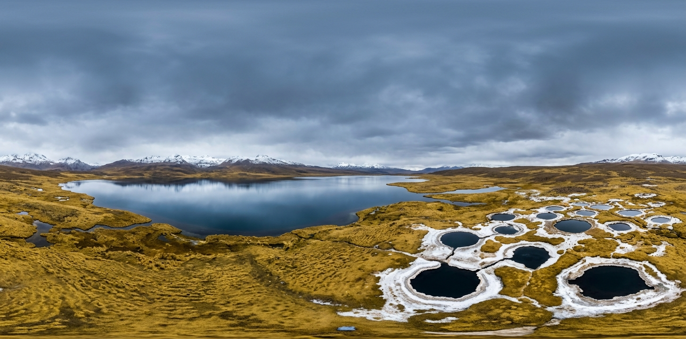</a>
<br/><b>安第斯高原地热池与湖泊 360° 全景航拍</b>
<br/> 
<br/><details><summary>📋 核心提示词</summary>

```json
{
  "{
    "图像元数据": {
        "类型": "360度等距柱状全景图",
        "投影方式": "完整球形等距柱状投影",
        "宽高比": "2:1",
        "分辨率": "超高分辨率全景"
    },
    "场景构图": {
        "拍摄地点": "安第斯高原地热池与湖泊上空",
        "机位": "无人机位于高原地热池正上方超高空航拍",
        "拍摄高度": "超高空无人机视角",
        "视野范围": "水平360°，垂直180°",
        "投影特性": "正确的等距柱状畸变",
        "天气状况": "阴天多云天气，空气通透",
        "景深": "无限景深，全景画面全程清晰"
    },
    "视觉元素": {
        "前景": {
            "核心画面": "右侧的地热池群，白色矿物质沉积形成环形轮廓，池内水体深邃黑色，与黄色苔原形成强烈色彩对比；左侧大型高原湖泊，水面平静如镜",
            "细节表现": "地热池的环形轮廓、矿物质质感、湖泊水面质感清晰自然"
        },
        "中景": {
            "地形": "金黄的高原苔原草甸，与地热池、湖泊自然衔接，植被层次丰富",
            "环境细节": "苔原的细腻质感、植被的层次真实自然"
        },
        "背景": {
            "远景": "雪山山脉向天际线延伸，若隐若现",
            "天空": "多云的灰蓝色天空占据上半球，云层厚重，光线均匀柔和"
        },
        "环境氛围": {
            "下半球视角": "从超高空俯瞰地热池群、高原湖泊与雪山山脉",
            "整体气质": "神秘独特的安第斯高原地热环境，无人类开发痕迹"
        }
    },
    "渲染风格": {
        "光影": "阴天均匀柔光，真实光影方向，明暗过渡自然柔和",
        "色彩调校": "真实自然色彩，白色矿物质、黑色池水、黄色苔原与蓝色湖泊平衡，还原实景质感",
        "纹理质感": {
            "描述": "超写实航拍摄影风格",
            "处理细节": "轻微自然锐化，无人工痕迹",
            "拼接要求": "无缝360度全景拼接"
        }
    },
    "约束规则": {
        "必须保留": ["纯360°全景透视", "无人机超高空航拍视角", "地热池与湖泊为核心主体", "无任何UI或界面元素", "高度写实"],
        "严格规避": ["城市或人工建筑", "人物", "电影感灯光", "奇幻风格", "插画或绘画感", "单帧构图"]
    },
    "负面提示词": ["界面元素", "抬头显示", "文字叠加", "水印", "建筑", "人物", "奇幻艺术", "插画", "电影感打光", "过度高动态范围", "过度处理", "画框", "边框", "裁切画面", "全景拼接断层", "人工元素"]
}"
}
```

<sub>📄 [下载完整 JSON](prompts/case050.json)</sub>
</details>
</div>

<hr/>
<div align="center">
<a href="images/case051/output.png">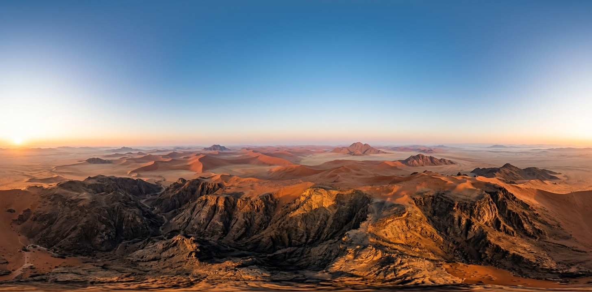</a>
<br/><b>纳米布沙漠峡谷地貌日出 360° 全景航拍</b>
<br/> 
<br/><details><summary>📋 核心提示词</summary>

```json
{
  "{
    "图像元数据": {
        "类型": "360度等距柱状全景图",
        "投影方式": "完整球形等距柱状投影",
        "宽高比": "2:1",
        "分辨率": "超高分辨率全景"
    },
    "场景构图": {
        "拍摄地点": "纳米布沙漠峡谷地貌上空",
        "机位": "无人机位于沙漠峡谷正上方高空航拍",
        "拍摄高度": "高空无人机视角",
        "视野范围": "水平360°，垂直180°",
        "投影特性": "正确的等距柱状畸变",
        "天气状况": "日出晴朗天气，空气通透",
        "景深": "无限景深，全景画面全程清晰"
    },
    "视觉元素": {
        "前景": {
            "核心画面": "黑色的峡谷岩山，轮廓硬朗，岩壁纹理清晰，在日出暖光下形成强烈明暗对比，与红色沙丘自然衔接",
            "细节表现": "岩山的粗糙质感、沙丘的细腻质感对比鲜明，细节真实"
        },
        "中景": {
            "地形": "广袤的红色沙漠平原，沙丘连绵起伏，向天际线无限延伸",
            "环境细节": "沙丘的流畅曲线、沙粒质感自然真实"
        },
        "背景": {
            "远景": "远方的岩山向天际线延伸，若隐若现，晨雾轻薄",
            "天空": "日出渐变蓝天占据上半球，从天际线暖橙到高空澄澈蓝自然过渡"
        },
        "环境氛围": {
            "下半球视角": "从空中俯瞰沙漠峡谷、沙丘平原与远方天际线",
            "整体气质": "辽阔苍茫的沙漠峡谷环境，无人类开发痕迹"
        }
    },
    "渲染风格": {
        "光影": "日出低角度侧光，真实光影方向，沙丘与岩山明暗层次丰富，对比自然",
        "色彩调校": "真实自然色彩，沙漠红色、岩山黑灰色与天空蓝色平衡，还原实景质感",
        "纹理质感": {
            "描述": "超写实航拍摄影风格",
            "处理细节": "轻微自然锐化，无人工痕迹",
            "拼接要求": "无缝360度全景拼接"
        }
    },
    "约束规则": {
        "必须保留": ["纯360°全景透视", "无人机高空航拍视角", "沙漠峡谷地貌为核心主体", "无任何UI或界面元素", "高度写实"],
        "严格规避": ["城市或人工建筑", "人物", "电影感灯光", "奇幻风格", "插画或绘画感", "单帧构图"]
    },
    "负面提示词": ["界面元素", "抬头显示", "文字叠加", "水印", "建筑", "人物", "奇幻艺术", "插画", "电影感打光", "过度高动态范围", "过度处理", "画框", "边框", "裁切画面", "全景拼接断层", "人工元素"]
}"
}
```

<sub>📄 [下载完整 JSON](prompts/case051.json)</sub>
</details>
</div>

<hr/>
<div align="center">
<a href="images/case052/output.png">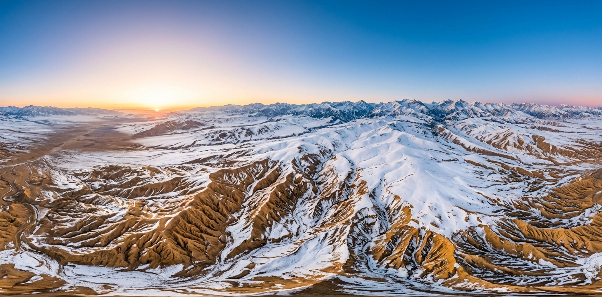</a>
<br/><b>天山山脉戈壁雪原日出 360° 全景航拍</b>
<br/> 
<br/><details><summary>📋 核心提示词</summary>

```json
{
  "{
    "图像元数据": {
        "类型": "360度等距柱状全景图",
        "投影方式": "完整球形等距柱状投影",
        "宽高比": "2:1",
        "分辨率": "超高分辨率全景"
    },
    "场景构图": {
        "拍摄地点": "天山山脉戈壁雪原上空",
        "机位": "无人机位于戈壁雪原正上方超高空航拍",
        "拍摄高度": "超高空无人机视角",
        "视野范围": "水平360°，垂直180°",
        "投影特性": "正确的等距柱状畸变",
        "天气状况": "日出晴朗天气，空气通透",
        "景深": "无限景深，全景画面全程清晰"
    },
    "视觉元素": {
        "前景": {
            "核心画面": "广袤的戈壁雪原，地面呈现暖金色沟壑纹理与白色积雪的强烈对比，光影层次丰富",
            "细节表现": "戈壁沟壑的流畅曲线、积雪的细腻质感自然真实"
        },
        "中景": {
            "地形": "连绵的雪原向天际线延伸，与戈壁自然衔接",
            "环境细节": "雪原的质感、光影层次清晰自然"
        },
        "背景": {
            "远景": "连绵的雪山山脉向天际线延伸，山顶积雪覆盖，轮廓清晰",
            "天空": "日出渐变蓝天占据上半球，从天际线暖橙到高空澄澈蓝自然过渡"
        },
        "环境氛围": {
            "下半球视角": "从超高空俯瞰戈壁雪原、沟壑与雪山山脉",
            "整体气质": "辽阔苍茫的天山戈壁环境，无人类开发痕迹"
        }
    },
    "渲染风格": {
        "光影": "自然日出低角度侧光，真实光影方向，戈壁与雪山明暗层次自然",
        "色彩调校": "真实自然色彩，暖金色戈壁、白色积雪与雪山冷色调平衡，还原实景质感",
        "纹理质感": {
            "描述": "超写实航拍摄影风格",
            "处理细节": "轻微自然锐化，无人工痕迹",
            "拼接要求": "无缝360度全景拼接"
        }
    },
    "约束规则": {
        "必须保留": ["纯360°全景透视", "无人机超高空航拍视角", "戈壁雪原与雪山为核心主体", "无任何UI或界面元素", "高度写实"],
        "严格规避": ["城市或人工建筑", "人物", "电影感灯光", "奇幻风格", "插画或绘画感", "单帧构图"]
    },
    "负面提示词": ["界面元素", "抬头显示", "文字叠加", "水印", "建筑", "人物", "奇幻艺术", "插画", "电影感打光", "过度高动态范围", "过度处理", "画框", "边框", "裁切画面", "全景拼接断层", "人工元素"]
}"
}
```

<sub>📄 [下载完整 JSON](prompts/case052.json)</sub>
</details>
</div>

<hr/>
<div align="center">
<a href="images/case053/output.png">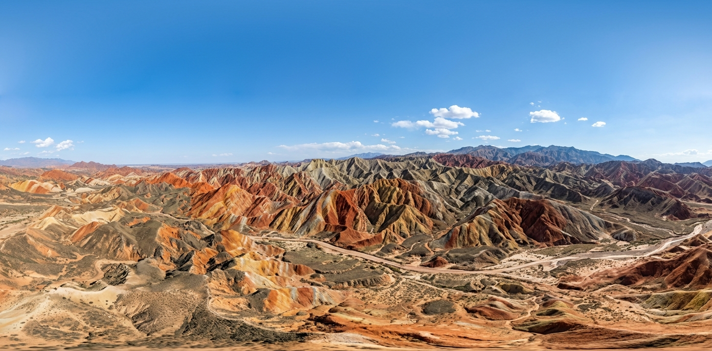</a>
<br/><b>张掖七彩丹霞彩色丘陵正午 360° 全景航拍</b>
<br/> 
<br/><details><summary>📋 核心提示词</summary>

```json
{
  "{
    "图像元数据": {
        "类型": "360度等距柱状全景图",
        "投影方式": "完整球形等距柱状投影",
        "宽高比": "2:1",
        "分辨率": "超高分辨率全景"
    },
    "场景构图": {
        "拍摄地点": "张掖七彩丹霞彩色丘陵地貌上空",
        "机位": "无人机位于彩色山体正上方高空航拍",
        "拍摄高度": "高空无人机视角",
        "视野范围": "水平360°，垂直180°",
        "投影特性": "正确的等距柱状畸变",
        "天气状况": "晴朗天气，空气通透",
        "景深": "无限景深，全景画面全程清晰"
    },
    "视觉元素": {
        "前景": {
            "核心画面": "大面积彩色丘陵山体，岩层呈现红、橙、黄、棕、灰的自然渐变色彩，层理纹理清晰，沟壑纵横交错",
            "细节表现": "彩色岩层的质感与色彩过渡自然真实"
        },
        "中景": {
            "地形": "广阔的荒漠戈壁平原，蜿蜒的干枯河道，远方层叠的彩色山峦",
            "环境细节": "干旱地貌的纹理与光影层次清晰"
        },
        "背景": {
            "远景": "远方的山脉向天际线延伸，轮廓清晰",
            "天空": "澄澈的蓝天占据上半球，点缀少量稀疏的白色云朵"
        },
        "环境氛围": {
            "下半球视角": "从空中俯瞰彩色丘陵、荒漠平原与远山地形",
            "整体气质": "原始壮阔的干旱丹霞地貌环境，无人类开发痕迹"
        }
    },
    "渲染风格": {
        "光影": "自然白日顶光，真实光影方向，突出岩层色彩层次",
        "色彩调校": "高还原度自然色彩，彩色岩层的丰富色调平衡自然，还原实景质感",
        "纹理质感": {
            "描述": "超写实航拍摄影风格",
            "处理细节": "轻微自然锐化，无人工痕迹",
            "拼接要求": "无缝360度全景拼接"
        }
    },
    "约束规则": {
        "必须保留": ["纯360°全景透视", "无人机高空航拍视角", "彩色丘陵山体为核心主体", "无任何UI或界面元素", "高度写实"],
        "严格规避": ["城市或人工建筑", "人物", "电影感灯光", "奇幻风格", "插画或绘画感", "单帧构图"]
    },
    "负面提示词": ["界面元素", "抬头显示", "文字叠加", "水印", "建筑", "人物", "奇幻艺术", "插画", "电影感打光", "过度高动态范围", "过度处理", "画框", "边框", "裁切画面", "全景拼接断层", "人工元素"]
}"
}
```

<sub>📄 [下载完整 JSON](prompts/case053.json)</sub>
</details>
</div>

<hr/>
<div align="center">
<a href="images/case054/output.png">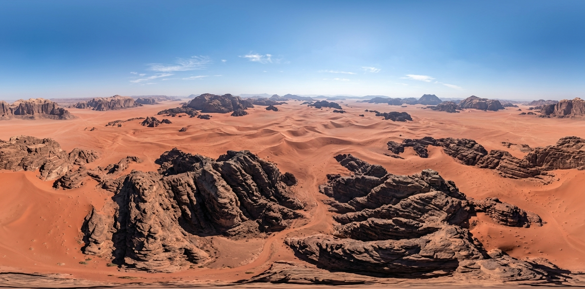</a>
<br/><b>约旦瓦迪拉姆沙漠峡谷地貌 360° 全景航拍</b>
<br/> 
<br/><details><summary>📋 核心提示词</summary>

```json
{
  "{
    "图像元数据": {
        "类型": "360度等距柱状全景图",
        "投影方式": "完整球形等距柱状投影",
        "宽高比": "2:1",
        "分辨率": "超高分辨率全景"
    },
    "场景构图": {
        "拍摄地点": "约旦瓦迪拉姆沙漠峡谷地貌上空",
        "机位": "无人机位于沙漠峡谷正上方高空航拍",
        "拍摄高度": "高空无人机视角",
        "视野范围": "水平360°，垂直180°",
        "投影特性": "正确的等距柱状畸变",
        "天气状况": "晴朗天气，空气通透",
        "景深": "无限景深，全景画面全程清晰"
    },
    "视觉元素": {
        "前景": {
            "核心画面": "黑色的峡谷岩山，轮廓硬朗，岩壁纹理清晰，与红色沙丘自然衔接",
            "细节表现": "岩山的粗糙质感、沙丘的细腻质感对比鲜明，细节真实"
        },
        "中景": {
            "地形": "广袤的红色沙漠平原，沙丘连绵起伏，向天际线无限延伸",
            "环境细节": "沙丘的流畅曲线、沙粒质感自然真实"
        },
        "背景": {
            "远景": "远方的岩山向天际线延伸，若隐若现",
            "天空": "澄澈的蓝天占据上半球，点缀少量轻薄流云，光线明亮自然"
        },
        "环境氛围": {
            "下半球视角": "从空中俯瞰沙漠峡谷、沙丘平原与远方天际线",
            "整体气质": "辽阔苍茫的沙漠峡谷环境，无人类开发痕迹"
        }
    },
    "渲染风格": {
        "光影": "正午高角度侧光，真实光影方向，沙丘与岩山明暗层次丰富，对比自然",
        "色彩调校": "真实自然色彩，沙漠红色、岩山黑灰色与天空蓝色平衡，还原实景质感",
        "纹理质感": {
            "描述": "超写实航拍摄影风格",
            "处理细节": "轻微自然锐化，无人工痕迹",
            "拼接要求": "无缝360度全景拼接"
        }
    },
    "约束规则": {
        "必须保留": ["纯360°全景透视", "无人机高空航拍视角", "沙漠峡谷地貌为核心主体", "无任何UI或界面元素", "高度写实"],
        "严格规避": ["城市或人工建筑", "人物", "电影感灯光", "奇幻风格", "插画或绘画感", "单帧构图"]
    },
    "负面提示词": ["界面元素", "抬头显示", "文字叠加", "水印", "建筑", "人物", "奇幻艺术", "插画", "电影感打光", "过度高动态范围", "过度处理", "画框", "边框", "裁切画面", "全景拼接断层", "人工元素"]
}"
}
```

<sub>📄 [下载完整 JSON](prompts/case054.json)</sub>
</details>
</div>

<hr/>
<div align="center">
<a href="images/case055/output.png">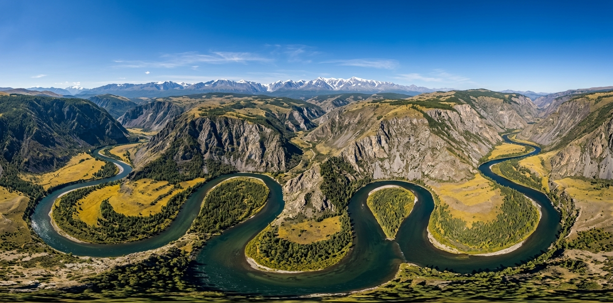</a>
<br/><b>阿尔泰山区蛇形曲流河峡谷 360° 全景航拍》</b>
<br/> 
<br/><details><summary>📋 核心提示词</summary>

```json
{
  "{
    "图像元数据": {
        "类型": "360度等距柱状全景图",
        "投影方式": "完整球形等距柱状投影",
        "宽高比": "2:1",
        "分辨率": "超高分辨率全景"
    },
    "场景构图": {
        "拍摄地点": "阿尔泰山区蛇形曲流河峡谷上空",
        "机位": "无人机位于峡谷正上方超高空航拍",
        "拍摄高度": "超高空无人机视角",
        "视野范围": "水平360°，垂直180°",
        "投影特性": "正确的等距柱状畸变",
        "天气状况": "晴朗天气，空气通透",
        "景深": "无限景深，全景画面全程清晰"
    },
    "视觉元素": {
        "前景": {
            "核心画面": "极致蜿蜒的绿色曲流河，河道在峡谷间形成多个牛轭湖轮廓，河水澄澈深邃",
            "细节表现": "曲流河的蛇形曲线、水体质感、草甸与森林的纹理层次清晰自然"
        },
        "中景": {
            "地形": "峡谷两侧陡峭的岩石山体，轮廓硬朗，与河道自然衔接；两侧是金黄草甸与深绿森林",
            "环境细节": "岩石的粗糙质感、草甸的细腻质感对比鲜明，细节真实"
        },
        "背景": {
            "远景": "雪山山脉向天际线延伸，若隐若现",
            "天空": "澄澈的蓝天占据上半球，点缀少量轻薄流云，阳光明亮自然"
        },
        "环境氛围": {
            "下半球视角": "从超高空俯瞰蛇形曲流河、峡谷山体与雪山山脉",
            "整体气质": "壮阔野性的峡谷自然环境，无人类开发痕迹"
        }
    },
    "渲染风格": {
        "光影": "自然白日侧光，真实光影方向，山体与河道明暗层次自然",
        "色彩调校": "真实自然色彩，深绿色河道、暖金色草甸与岩石灰褐色平衡，还原实景质感",
        "纹理质感": {
            "描述": "超写实航拍摄影风格",
            "处理细节": "轻微自然锐化，无人工痕迹",
            "拼接要求": "无缝360度全景拼接"
        }
    },
    "约束规则": {
        "必须保留": ["纯360°全景透视", "无人机超高空航拍视角", "蛇形曲流河峡谷为核心主体", "无任何UI或界面元素", "高度写实"],
        "严格规避": ["城市或人工建筑", "人物", "电影感灯光", "奇幻风格", "插画或绘画感", "单帧构图"]
    },
    "负面提示词": ["界面元素", "抬头显示", "文字叠加", "水印", "建筑", "人物", "奇幻艺术", "插画", "电影感打光", "过度高动态范围", "过度处理", "画框", "边框", "裁切画面", "全景拼接断层", "人工元素"]
}"
}
```

<sub>📄 [下载完整 JSON](prompts/case055.json)</sub>
</details>
</div>

<hr/>
<div align="center">
<a href="images/case062/output.png">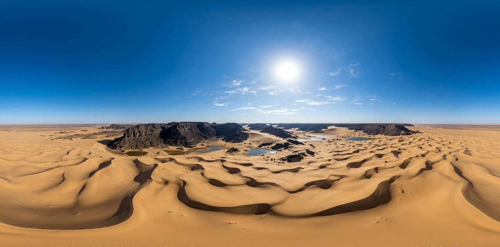</a>
<br/><b>撒哈拉沙漠沙丘戈壁地貌 360° 全景航拍</b>
<br/> 
<br/><details><summary>📋 核心提示词</summary>

```json
{
  "{
    "图像元数据": {
        "类型": "360度等距柱状全景图",
        "投影方式": "完整球形等距柱状投影",
        "宽高比": "2:1",
        "分辨率": "超高分辨率全景"
    },
    "场景构图": {
        "拍摄地点": "撒哈拉沙漠沙丘戈壁地貌上空",
        "机位": "无人机位于沙漠正上方超高空航拍",
        "拍摄高度": "超高空无人机视角",
        "视野范围": "水平360°，垂直180°",
        "投影特性": "正确的等距柱状畸变",
        "天气状况": "正午晴朗天气，空气通透",
        "景深": "无限景深，全景画面全程清晰"
    },
    "视觉元素": {
        "前景": {
            "核心画面": "连绵起伏的金色沙丘，沙丘曲线流畅自然，正午阳光照射下形成明暗交错的丰富光影，沙粒质感细腻真实",
            "细节表现": "沙丘的立体轮廓、沙粒纹理、光影层次清晰自然"
        },
        "中景": {
            "地形": "黑色的戈壁岩山，岩壁陡峭坚硬，纹理清晰；山间点缀小型水洼，与沙丘自然衔接",
            "环境细节": "岩山的粗糙质感、沙丘的细腻质感对比鲜明，细节真实"
        },
        "背景": {
            "远景": "沙漠平原向天际线无限延伸，与地平线自然融合",
            "天空": "澄澈的蓝天占据上半球，明亮的正午太阳，点缀少量轻薄流云"
        },
        "环境氛围": {
            "下半球视角": "从超高空俯瞰沙漠沙丘、戈壁岩山与远方天际线",
            "整体气质": "辽阔苍茫的沙漠戈壁环境，无人类开发痕迹"
        }
    },
    "渲染风格": {
        "光影": "正午高角度侧光，真实光影方向，沙丘明暗层次丰富，对比自然",
        "色彩调校": "真实自然色彩，沙丘金色、岩山黑灰色与天空蓝色平衡，还原实景质感",
        "纹理质感": {
            "描述": "超写实沙漠航拍摄影风格",
            "处理细节": "轻微自然锐化，无人工痕迹",
            "拼接要求": "无缝360度全景拼接"
        }
    },
    "约束规则": {
        "必须保留": ["纯360°全景透视", "无人机超高空航拍视角", "沙漠沙丘戈壁地貌为核心主体", "无任何UI或界面元素", "高度写实"],
        "严格规避": ["城市或人工建筑", "人物", "电影感灯光", "奇幻风格", "插画或绘画感", "单帧构图"]
    },
    "负面提示词": ["界面元素", "抬头显示", "文字叠加", "水印", "建筑", "人物", "奇幻艺术", "插画", "电影感打光", "过度高动态范围", "过度处理", "画框", "边框", "裁切画面", "全景拼接断层", "人工元素"]
}"
}
```

<sub>📄 [下载完整 JSON](prompts/case062.json)</sub>
</details>
</div>

<hr/>
<div align="center">
<a href="images/case067/output.png"></a>
<br/><b>张掖七彩丹霞彩色丘陵日出 360° 全景航拍</b>
<br/> 
<br/><details><summary>📋 核心提示词</summary>

```json
{
  "{
    "图像元数据": {
        "类型": "360度等距柱状全景图",
        "投影方式": "完整球形等距柱状投影",
        "宽高比": "2:1",
        "分辨率": "超高分辨率全景"
    },
    "场景构图": {
        "拍摄地点": "张掖七彩丹霞彩色丘陵地貌上空",
        "机位": "无人机位于彩色山体正上方高空航拍",
        "拍摄高度": "高空无人机视角",
        "视野范围": "水平360°，垂直180°",
        "投影特性": "正确的等距柱状畸变",
        "天气状况": "日出晴朗天气，空气通透",
        "景深": "无限景深，全景画面全程清晰"
    },
    "视觉元素": {
        "前景": {
            "核心画面": "大面积层理分明的彩色丘陵山体，日出暖光照射下，岩层呈现红、橙、黄、棕、灰的自然渐变色彩，沟壑纵横交错，地质纹理清晰立体",
            "细节表现": "彩色岩层的质感与明暗层次自然真实，地质结构完整清晰"
        },
        "中景": {
            "地形": "层叠错落的丹霞山峦向远方延伸，山间蜿蜒的公路自然嵌入地貌，山体层理与光影层次清晰",
            "环境细节": "干旱地貌的纹理与日出侧光下的明暗过渡自然"
        },
        "背景": {
            "远景": "远方的丹霞山脉向天际线无限延伸，轮廓柔和自然",
            "天空": "澄澈的渐变蓝天占据上半球，日出太阳明亮，点缀少量轻薄流云"
        },
        "环境氛围": {
            "下半球视角": "从空中俯瞰彩色丘陵、层叠山峦与远方天际线",
            "整体气质": "壮阔瑰丽的丹霞地貌环境，保留原生地质风貌，无过度人工改造痕迹"
        }
    },
    "渲染风格": {
        "光影": "自然日出低角度侧光，真实光影方向，极致突出岩层立体层次",
        "色彩调校": "高还原度自然色彩，彩色岩层的丰富色调冷暖平衡，还原实景质感",
        "纹理质感": {
            "描述": "超写实航拍摄影风格",
            "处理细节": "轻微自然锐化，无人工痕迹",
            "拼接要求": "无缝360度全景拼接"
        }
    },
    "约束规则": {
        "必须保留": ["纯360°全景透视", "无人机高空航拍视角", "彩色丘陵山体为核心主体", "无任何UI或界面元素", "高度写实"],
        "严格规避": ["城市密集建筑", "人物", "电影感灯光", "奇幻风格", "插画或绘画感", "单帧构图"]
    },
    "负面提示词": ["界面元素", "抬头显示", "文字叠加", "水印", "密集城市建筑", "人物", "奇幻艺术", "插画", "电影感打光", "过度高动态范围", "过度处理", "画框", "边框", "裁切画面", "全景拼接断层", "人工元素"]
}"
}
```

<sub>📄 [下载完整 JSON](prompts/case067.json)</sub>
</details>
</div>

<hr/>
<div align="center">
<a href="images/case070/output.png">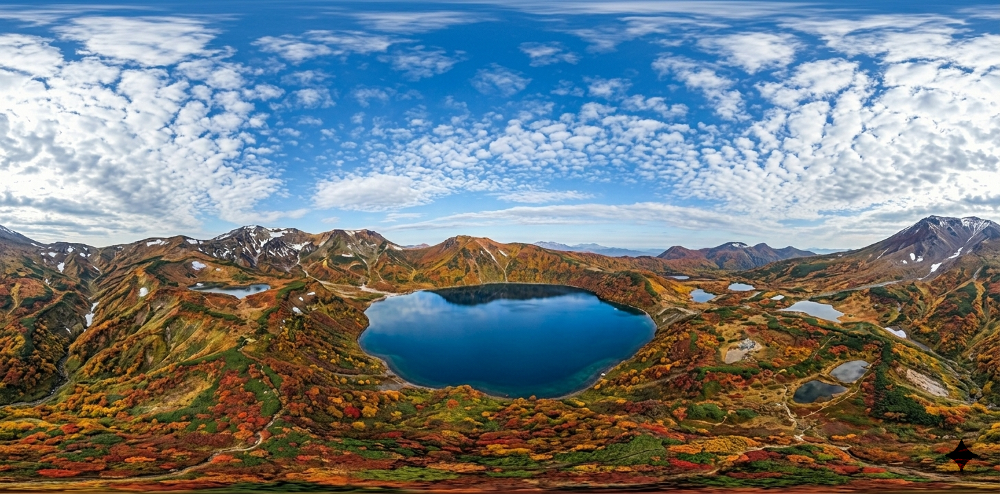</a>
<br/><b>北海道秋季火山湖群 360° 全景航拍</b>
<br/> 
<br/><details><summary>📋 核心提示词</summary>

```json
{
  "{
    "图像元数据": {
        "类型": "360度等距柱状全景图",
        "投影方式": "完整球形等距柱状投影",
        "宽高比": "2:1",
        "分辨率": "超高分辨率全景"
    },
    "场景构图": {
        "拍摄地点": "北海道大雪山系秋季火山湖群上空",
        "机位": "无人机位于火山湖正上方高空航拍",
        "拍摄高度": "高空无人机视角",
        "视野范围": "水平360°，垂直180°",
        "投影特性": "正确的等距柱状畸变",
        "天气状况": "多云晴朗天气，空气通透",
        "景深": "无限景深，全景画面全程清晰"
    },
    "视觉元素": {
        "前景": {
            "核心画面": "大面积秋季山地，植被呈现红、橙、黄、绿的渐变秋色，沟壑与山地纹理清晰，散落小型高山湖泊",
            "细节表现": "秋季植被的色彩层次与质感自然真实"
        },
        "中景": {
            "地形": "中心的深蓝色火山口湖，被层叠山峦环绕，山体有积雪残留，山坡覆盖原生植被",
            "水体": "火山湖水面澄澈，反射天空光影，周边山地与湖泊自然衔接"
        },
        "背景": {
            "远景": "连绵的雪山山脉向天际线延伸，轮廓清晰",
            "天空": "澄澈的蓝天占据上半球，布满蓬松自然的白色云朵"
        },
        "环境氛围": {
            "下半球视角": "从空中俯瞰秋季山地、火山湖与雪山地形",
            "整体气质": "原始绚烂的秋季高山火山地貌环境，无人类开发痕迹"
        }
    },
    "渲染风格": {
        "光影": "自然白日侧光，真实光影方向，突出秋季色彩层次",
        "色彩调校": "真实自然色彩，浓郁的秋季暖色调与湖水蓝调平衡，还原实景质感",
        "纹理质感": {
            "描述": "超写实航拍摄影风格",
            "处理细节": "轻微自然锐化，无人工痕迹",
            "拼接要求": "无缝360度全景拼接"
        }
    },
    "约束规则": {
        "必须保留": ["纯360°全景透视", "无人机高空航拍视角", "秋季火山湖山地为核心主体", "无任何UI或界面元素", "高度写实"],
        "严格规避": ["城市或人工建筑", "人物", "电影感灯光", "奇幻风格", "插画或绘画感", "单帧构图"]
    },
    "负面提示词": ["界面元素", "抬头显示", "文字叠加", "水印", "建筑", "人物", "奇幻艺术", "插画", "电影感打光", "过度高动态范围", "过度处理", "画框", "边框", "裁切画面", "全景拼接断层", "人工元素"]
}"
}
```

<sub>📄 [下载完整 JSON](prompts/case070.json)</sub>
</details>
</div>

<hr/>
<div align="center">
<a href="images/case071/output.png">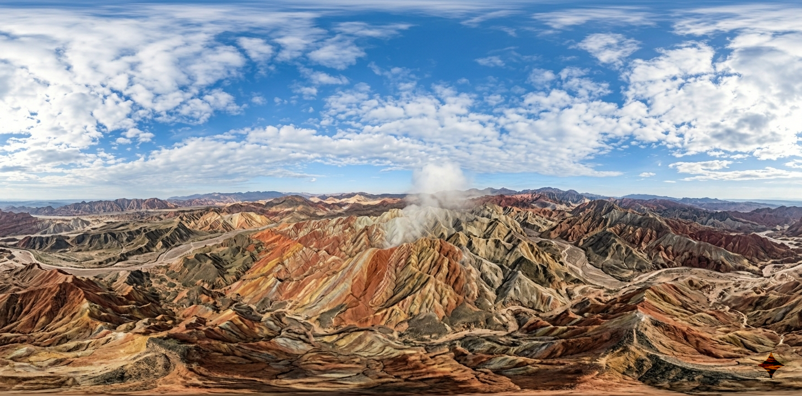</a>
<br/><b>张掖七彩丹霞彩色丘陵侧光 360° 全景航拍</b>
<br/> 
<br/><details><summary>📋 核心提示词</summary>

```json
{
  "{
    "图像元数据": {
        "类型": "360度等距柱状全景图",
        "投影方式": "完整球形等距柱状投影",
        "宽高比": "2:1",
        "分辨率": "超高分辨率全景"
    },
    "场景构图": {
        "拍摄地点": "张掖七彩丹霞彩色丘陵地貌上空",
        "机位": "无人机位于彩色山体正上方高空航拍",
        "拍摄高度": "高空无人机视角",
        "视野范围": "水平360°，垂直180°",
        "投影特性": "正确的等距柱状畸变",
        "天气状况": "清晨晴朗天气，空气通透",
        "景深": "无限景深，全景画面全程清晰"
    },
    "视觉元素": {
        "前景": {
            "核心画面": "大面积彩色丘陵山体，侧光照射下岩层呈现红、橙、黄、棕、灰的立体渐变色彩，层理纹理清晰，沟壑纵横交错",
            "细节表现": "彩色岩层的质感与明暗层次自然真实，地质结构清晰"
        },
        "中景": {
            "地形": "广阔的荒漠戈壁平原，蜿蜒的干枯河道，远方层叠的彩色山峦",
            "环境细节": "干旱地貌的纹理与侧光下的明暗层次清晰"
        },
        "背景": {
            "远景": "远方的山脉向天际线延伸，轮廓清晰",
            "天空": "澄澈的蓝天占据上半球，点缀少量稀疏的白色云朵"
        },
        "环境氛围": {
            "下半球视角": "从空中俯瞰彩色丘陵、荒漠平原与远山地形",
            "整体气质": "原始壮阔的干旱丹霞地貌环境，无人类开发痕迹"
        }
    },
    "渲染风格": {
        "光影": "自然清晨侧光，真实光影方向，极致突出岩层立体层次",
        "色彩调校": "高还原度自然色彩，彩色岩层的丰富色调冷暖平衡，还原实景质感",
        "纹理质感": {
            "描述": "超写实航拍摄影风格",
            "处理细节": "轻微自然锐化，无人工痕迹",
            "拼接要求": "无缝360度全景拼接"
        }
    },
    "约束规则": {
        "必须保留": ["纯360°全景透视", "无人机高空航拍视角", "彩色丘陵山体为核心主体", "无任何UI或界面元素", "高度写实"],
        "严格规避": ["城市或人工建筑", "人物", "电影感灯光", "奇幻风格", "插画或绘画感", "单帧构图"]
    },
    "负面提示词": ["界面元素", "抬头显示", "文字叠加", "水印", "建筑", "人物", "奇幻艺术", "插画", "电影感打光", "过度高动态范围", "过度处理", "画框", "边框", "裁切画面", "全景拼接断层", "人工元素"]
}"
}
```

<sub>📄 [下载完整 JSON](prompts/case071.json)</sub>
</details>
</div>

<hr/>
<div align="center">
<a href="images/case072/output.png">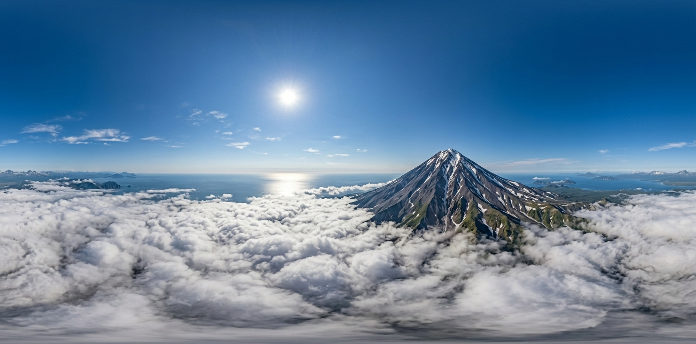</a>
<br/><b>堪察加锥形火山云海日出 360° 全景航拍</b>
<br/> 
<br/><details><summary>📋 核心提示词</summary>

```json
{
  "{
    "图像元数据": {
        "类型": "360度等距柱状全景图",
        "投影方式": "完整球形等距柱状投影",
        "宽高比": "2:1",
        "分辨率": "超高分辨率全景"
    },
    "场景构图": {
        "拍摄地点": "堪察加半岛锥形火山云海之上高空",
        "机位": "无人机位于云海之上、火山山体侧方高空航拍",
        "拍摄高度": "超高空无人机视角，高于云海平面",
        "视野范围": "水平360°，垂直180°",
        "投影特性": "正确的等距柱状畸变",
        "天气状况": "晴朗天气，空气通透",
        "景深": "无限景深，全景画面全程清晰"
    },
    "视觉元素": {
        "前景": {
            "核心画面": "大面积翻涌的白色云海，云层纹理细腻，光影层次丰富，呈现自然的流动感",
            "细节表现": "云海的蓬松质感与明暗过渡自然"
        },
        "中景": {
            "地形": "标志性锥形火山山体矗立云海中，山体有积雪残留与绿色植被覆盖，山体轮廓与纹理清晰",
            "水体": "远方的海面，阳光在海面形成明亮的反光带，海岸线轮廓清晰"
        },
        "背景": {
            "远景": "远方的海岸线与零星岛屿向天际线延伸",
            "天空": "澄澈的蓝天占据上半球，明亮的正午太阳，点缀少量稀疏云朵"
        },
        "环境氛围": {
            "下半球视角": "从高空俯瞰云海、火山山体与远方海面地形",
            "整体气质": "壮阔的火山云海高空环境，无人类开发痕迹"
        }
    },
    "渲染风格": {
        "光影": "自然正午顺光，高对比度真实光影，云海与山体明暗层次自然",
        "色彩调校": "真实自然色彩，云海白、天空蓝与山体绿灰调平衡，还原实景质感",
        "纹理质感": {
            "描述": "超写实航拍摄影风格",
            "处理细节": "轻微自然锐化，无人工痕迹",
            "拼接要求": "无缝360度全景拼接"
        }
    },
    "约束规则": {
        "必须保留": ["纯360°全景透视", "无人机云海之上高空航拍视角", "锥形火山为核心主体", "无任何UI或界面元素", "高度写实"],
        "严格规避": ["城市或人工建筑", "人物", "电影感灯光", "奇幻风格", "插画或绘画感", "单帧构图"]
    },
    "负面提示词": ["界面元素", "抬头显示", "文字叠加", "水印", "建筑", "人物", "奇幻艺术", "插画", "电影感打光", "过度高动态范围", "过度处理", "画框", "边框", "裁切画面", "全景拼接断层", "人工元素"]
}"
}
```

<sub>📄 [下载完整 JSON](prompts/case072.json)</sub>
</details>
</div>

<hr/>
<div align="center">
<a href="images/case080/output.png">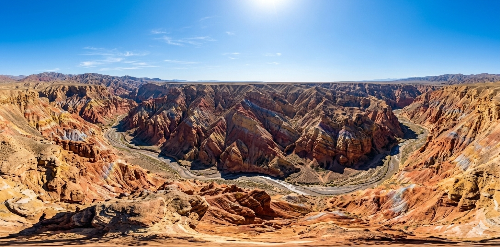</a>
<br/><b>彩谷秘境：阿尔泰五彩河谷的丹霞峡谷盛景</b>
<br/> 
<br/><details><summary>📋 核心提示词</summary>

```json
{
  "{
  "图像元数据": {
    "类型": "360度等距柱状全景图",
    "投影": "完整球形等距柱状投影",
    "长宽比": "2比1",
    "分辨率": "8K极致清晰"
  },
  "场景构图": {
    "地点": "中国新疆阿勒泰五彩河谷丹霞峡谷",
    "相机位置": "峡谷上空中高空悬停",
    "相机高度": "模拟广域高空航拍视角",
    "视野范围": "水平360度，垂直180度",
    "透视表现": "彩色峡谷呈弧形向远方延伸，两侧岩壁环抱山谷，地平线平滑无缝衔接",
    "天气": "晴朗少云，空气通透度极高",
    "景深控制": "近景岩壁纹理、中景峡谷层次与远景山峦天际线全清晰"
  },
  "视觉元素": {
    "前景": { "主要特征": "峡谷岩壁的多彩岩层纹理，黄、橙、红、褐、蓝相间的矿化层理，粗糙的砂岩质感", "动态": "完全静态" },
    "中景主体": { "地貌": "U型彩色丹霞峡谷，两侧环抱的多彩岩壁，谷底蜿蜒的河谷", "细节": "岩壁的倾斜侵蚀线条，岩层的多彩渐变层次，山谷的明暗阴影深度，谷底的细碎植被", "特征": "黄、橙、红、蓝的多彩岩壁与深邃暗色调山谷阴影的极致对比" },
    "背景": { "远景": "连绵的山峦延伸至远方的天际线", "天空": "澄澈的湛蓝色晴空，正午太阳悬于天空中，带有极轻薄的高空卷云" },
    "环境氛围": { "地面半球": "地质时光雕刻的大地彩谷", "氛围感": "奇幻、壮阔、磅礴、震撼" }
  },
  "渲染风格": {
    "光影方案": "晴空正午的顶侧光照明，精准打亮岩壁肌理凸显多彩层次，强调峡谷的立体空间深度，突出岩壁的粗糙质感",
    "色彩科学": "高饱和度的黄、橙、红、蓝多彩岩层，与深邃暗色调阴影、湛蓝色晴空形成饱满的色彩对比，色彩还原精准",
    "质感质量": { "描述": "极高清的丹霞峡谷风光航拍", "细节": "完美的360度全视角无缝拼接，无畸变" }
  },
  "核心约束": {
    "必须保留": [ "峡谷岩壁的多彩层理纹理", "峡谷的立体环抱空间感", "多彩岩层的饱和色彩", "全景环绕的峡谷纵深感" ],
    "严禁出现": [ "文字", "水印", "人工建筑", "游客", "车辆", "栈道", "低对比度", "色彩失真" ]
  },
  "负面提示词": [ "文字", "水印", "模糊", "低画质", "暗沉色调", "拼接裂缝", "畸变", "人工设施", "杂物", "色彩失真", "过曝" ]
}"
}
```

<sub>📄 [下载完整 JSON](prompts/case080.json)</sub>
</details>
</div>

<hr/>
<div align="center">
<a href="images/case081/output.png">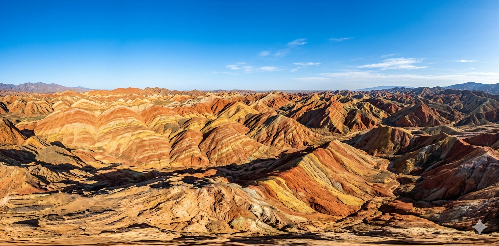</a>
<br/><b>彩丘神迹：张掖丹霞地貌的红层丘陵盛景</b>
<br/> 
<br/><details><summary>📋 核心提示词</summary>

```json
{
  "{
  "图像元数据": {
    "类型": "360度等距柱状全景图",
    "投影": "完整球形等距柱状投影",
    "长宽比": "2比1",
    "分辨率": "8K极致清晰"
  },
  "场景构图": {
    "地点": "中国甘肃张掖七彩丹霞景区",
    "相机位置": "彩丘上空中低空悬停",
    "相机高度": "模拟沉浸式低空航拍视角",
    "视野范围": "水平360度，垂直180度",
    "透视表现": "彩色丘陵呈波浪状向远方无限延伸，地平线平滑无缝衔接",
    "天气": "晴朗少云，空气通透度极高",
    "景深控制": "近景岩层纹理、中景彩丘层次与远景山峦天际线全清晰"
  },
  "视觉元素": {
    "前景": { "主要特征": "彩色丘陵的细腻岩层纹理，红、橙、黄、褐相间的水平层理，粗糙的砂岩质感", "动态": "完全静态" },
    "中景主体": { "地貌": "连绵起伏的彩色丘陵丹霞地貌", "细节": "岩层的水平层理线条，丘陵起伏的明暗阴影层次，多彩矿化岩层的色彩渐变", "特征": "红、橙、黄、褐的暖调多彩岩层与深邃棕红色阴影的层次组合" },
    "背景": { "远景": "连绵的彩色丘陵延伸至远方的山脉天际线", "天空": "澄澈的湛蓝色晴空，带有极轻薄的白色卷云" },
    "环境氛围": { "地面半球": "地质时光雕刻的大地调色盘", "氛围感": "奇幻、壮阔、磅礴、震撼" }
  },
  "渲染风格": {
    "光影方案": "晴空上午的侧光照明，精准打亮岩层肌理凸显色彩层次，强调丘陵的立体起伏轮廓，突出彩丘的肌理质感",
    "色彩科学": "高饱和度的红、橙、黄、褐多彩岩层，与深邃棕红色阴影、湛蓝色晴空形成饱满的色彩对比，色彩还原精准",
    "质感质量": { "描述": "极高清的丹霞彩丘风光航拍", "细节": "完美的360度全视角无缝拼接，无畸变" }
  },
  "核心约束": {
    "必须保留": [ "彩丘岩层的水平层理纹理", "丘陵起伏的立体轮廓", "多彩岩层的饱和色彩", "全景环绕的彩丘空间感" ],
    "严禁出现": [ "文字", "水印", "人工建筑", "游客", "围栏", "栈道", "低对比度", "色彩失真" ]
  },
  "负面提示词": [ "文字", "水印", "模糊", "低画质", "暗沉色调", "拼接裂缝", "畸变", "人工设施", "杂物", "色彩失真", "过曝" ]
}"
}
```

<sub>📄 [下载完整 JSON](prompts/case081.json)</sub>
</details>
</div>

<hr/>
<div align="center">
<a href="images/case082/output.png"></a>
<br/><b>梯田天境：元阳哈尼梯田的日出云海盛景</b>
<br/> 
<br/><details><summary>📋 核心提示词</summary>

```json
{
  "{
  "图像元数据": {
    "类型": "360度等距柱状全景图",
    "投影": "完整球形等距柱状投影",
    "长宽比": "2比1",
    "分辨率": "8K极致清晰"
  },
  "场景构图": {
    "地点": "中国云南元阳哈尼梯田多依树景区",
    "相机位置": "梯田上空中高空悬停",
    "相机高度": "模拟广域高空航拍视角",
    "视野范围": "水平360度，垂直180度",
    "透视表现": "层叠梯田顺着山势向山谷无限延伸，晨雾填满山谷，地平线平滑无缝衔接",
    "天气": "晴好，山间有轻薄晨雾，空气通透度高",
    "景深控制": "近景梯田纹理、中景晨雾层次与远景山峦天际线全清晰"
  },
  "视觉元素": {
    "前景": { "主要特征": "层叠梯田的细腻田埂纹理，梯田水面的镜面反光，田埂上的零星绿色植被", "动态": "晨雾缓慢流动" },
    "中景主体": { "地貌": "顺着山势层叠分布的哈尼梯田，山谷间填满轻薄晨雾", "细节": "梯田田埂的同心圆弧线条，水面的银金色晨光反光，山谷间的朦胧晨雾，山间的翠绿色山林", "特征": "银金色的梯田水面、暖金棕色的田埂、朦胧奶白色晨雾与黛蓝色远山的层次组合" },
    "背景": { "远景": "层叠的山峦在晨雾中若隐若现延伸至天际线", "天空": "淡蓝色与金粉色交织的日出霞光，太阳悬于山峦上方" },
    "环境氛围": { "地面半球": "人文与自然共生的大地天境", "氛围感": "治愈、神圣、梦幻、壮阔" }
  },
  "渲染风格": {
    "光影方案": "日出破晓的低角度斜射暖光，穿透晨雾形成柔和丁达尔光效，强调梯田水面的反光质感与田埂的立体层次，突出晨雾的朦胧氛围感",
    "色彩科学": "暖金色的晨光、银金色的梯田水面、奶白色的晨雾、翠绿色的山林与淡蓝色的天空形成丰富柔和的色彩层次，阴影区的灰蓝色调增强空间深度",
    "质感质量": { "描述": "极高清的梯田云海风光航拍", "细节": "完美的360度全视角无缝拼接，无畸变，晨雾动态自然" }
  },
  "核心约束": {
    "必须保留": [ "梯田层叠的圆弧曲线纹理", "晨雾的朦胧通透感", "晨光的丁达尔光效", "全景环绕的山谷梯田空间感" ],
    "严禁出现": [ "文字", "水印", "人工建筑", "游客", "围栏", "电线", "低对比度", "色彩失真" ]
  },
  "负面提示词": [ "文字", "水印", "模糊", "低画质", "暗沉色调", "拼接裂缝", "畸变", "人工设施", "杂物", "色彩失真", "过曝" ]
}"
}
```

<sub>📄 [下载完整 JSON](prompts/case082.json)</sub>
</details>
</div>

<hr/>
<div align="center">
<a href="images/case083/output.png"></a>
<br/><b>金沙瀚海：撒哈拉沙漠新月沙丘的正午盛景</b>
<br/> 
<br/><details><summary>📋 核心提示词</summary>

```json
{
  "{
  "图像元数据": {
    "类型": "360度等距柱状全景图",
    "投影": "完整球形等距柱状投影",
    "长宽比": "2比1",
    "分辨率": "8K极致清晰"
  },
  "场景构图": {
    "地点": "阿尔及利亚撒哈拉沙漠新月沙丘区",
    "相机位置": "沙海上空中高空悬停",
    "相机高度": "模拟广域高空航拍视角",
    "视野范围": "水平360度，垂直180度",
    "透视表现": "新月沙丘呈波浪状向地平线无限延伸，地平线平滑无缝衔接",
    "天气": "晴朗少云，空气通透度极高",
    "景深控制": "近景沙丘纹理、中景沙海层次与远景岩山天际线全清晰"
  },
  "视觉元素": {
    "前景": { "主要特征": "细腻的暖金色沙丘肌理，沙丘脊线的明暗交界线，沙粒的细腻质感", "动态": "完全静态" },
    "中景主体": { "地貌": "连绵起伏的新月形沙丘群，远方矗立的风蚀岩山", "细节": "沙丘的细腻风蚀纹路，沙丘起伏的明暗阴影层次，岩山的硬朗轮廓", "特征": "浓郁的暖金色沙丘与深邃棕褐色阴影的极致明暗组合" },
    "背景": { "远景": "无垠沙海延伸至远方的岩山天际线", "天空": "澄澈的湛蓝色晴空，太阳悬于天空中，带有极轻薄的高空卷云" },
    "环境氛围": { "地面半球": "风雕刻的无垠沙海秘境", "氛围感": "蛮荒、壮阔、苍凉、磅礴" }
  },
  "渲染风格": {
    "光影方案": "日出后低角度侧光照明，精准勾勒沙丘的立体起伏轮廓，强调沙粒的细腻质感与明暗层次，突出沙海的纵深感",
    "色彩科学": "高饱和度的暖金色沙丘、深邃棕褐色阴影与湛蓝色晴空形成强烈的明暗对比，色彩还原浓郁精准",
    "质感质量": { "描述": "极高清的沙漠沙丘风光航拍", "细节": "完美的360度全视角无缝拼接，无畸变" }
  },
  "核心约束": {
    "必须保留": [ "新月沙丘的波浪状起伏轮廓", "沙丘脊线的明暗交界线", "沙海的无垠辽阔空间感", "暖金色的沙漠主色调" ],
    "严禁出现": [ "文字", "水印", "人工建筑", "车辆", "游客", "植被覆盖", "低对比度" ]
  },
  "负面提示词": [ "文字", "水印", "模糊", "低画质", "暗沉色调", "拼接裂缝", "畸变", "人工设施", "杂物", "植被覆盖", "过曝" ]
}"
}
```

<sub>📄 [下载完整 JSON](prompts/case083.json)</sub>
</details>
</div>

<hr/>
<div align="center">
<a href="images/case086/output.png"></a>
<br/><b>火山湖境：堪察加火山群的冰斗湖日出盛景</b>
<br/> 
<br/><details><summary>📋 核心提示词</summary>

```json
{
  "{
  "图像元数据": {
    "类型": "360度等距柱状全景图",
    "投影": "完整球形等距柱状投影",
    "长宽比": "2比1",
    "分辨率": "8K极致清晰"
  },
  "场景构图": {
    "地点": "俄罗斯堪察加半岛克罗诺基自然保护区火山湖群",
    "相机位置": "火山湖群上空中高空悬停",
    "相机高度": "模拟广域高空航拍视角",
    "视野范围": "水平360度，垂直180度",
    "透视表现": "火山群与冰斗湖呈波浪状向远方延伸，地平线平滑无缝衔接",
    "天气": "晴朗少云，空气通透度极高",
    "景深控制": "近景山峦纹理、中景湖泊层次与远景火山主峰全清晰"
  },
  "视觉元素": {
    "前景": { "主要特征": "覆盖着翠绿色高山植被的山峦质感，斑驳的白色残雪纹理，小型冰蚀湖的澄澈水面", "动态": "完全静态" },
    "中景主体": { "地貌": "连绵的火山群山峦，镶嵌在山谷中的大型冰斗湖", "细节": "山峦上的斑驳残雪，翠绿色的高山苔原植被，冰斗湖的澄澈藏蓝色水面，湖水与水岸线的平滑轮廓", "特征": "圣洁的白色残雪、翠绿色的植被、深邃藏蓝色的湖水与暖金色晨光的层次组合" },
    "背景": { "远景": "标志性的锥形克柳切夫火山主峰矗立在天际线", "天空": "淡蓝色与粉橙色交织的日出霞光，带有细碎的鱼鳞状高空云" },
    "环境氛围": { "地面半球": "荒野尽头的火山湖秘境", "氛围感": "静谧、壮阔、圣洁、蛮荒" }
  },
  "渲染风格": {
    "光影方案": "日出破晓的低角度斜射暖光，勾勒火山山峦的柔和轮廓，强调残雪的亮白质感、湖水的澄澈度与植被的鲜活色彩，突出晨光的温柔氛围感",
    "色彩科学": "暖粉色与金色的晨光、亮白色的残雪、翠绿色的植被、深邃藏蓝色的湖水与淡蓝色的天空形成丰富柔和的色彩层次，阴影区的深绿色调增强空间深度",
    "质感质量": { "描述": "极高清的火山湖群风光航拍", "细节": "完美的360度全视角无缝拼接，无畸变" }
  },
  "核心约束": {
    "必须保留": [ "冰斗湖的平滑水岸轮廓", "火山群的锥形山峦线条", "残雪与植被的斑驳纹理", "全景环绕的辽阔空间感" ],
    "严禁出现": [ "文字", "水印", "人工建筑", "车辆", "游客", "围栏", "低对比度" ]
  },
  "负面提示词": [ "文字", "水印", "模糊", "低画质", "暗沉色调", "拼接裂缝", "畸变", "人工设施", "杂物", "过曝" ]
}"
}
```

<sub>📄 [下载完整 JSON](prompts/case086.json)</sub>
</details>
</div>

<hr/>
<div align="center">
<a href="images/case087/output.png"></a>
<br/><b>彩谷烟岚：地热峡谷的多彩喷烟奇景</b>
<br/> 
<br/><details><summary>📋 核心提示词</summary>

```json
{
  "{
  "图像元数据": {
    "类型": "360度等距柱状全景图",
    "投影": "完整球形等距柱状投影",
    "长宽比": "2比1",
    "分辨率": "8K极致清晰"
  },
  "场景构图": {
    "地点": "日本北海道登别地狱谷地热峡谷",
    "相机位置": "峡谷上空中低空悬停",
    "相机高度": "模拟沉浸式低空航拍视角",
    "视野范围": "水平360度，垂直180度",
    "透视表现": "地热峡谷呈弧形向远方延伸，蒸汽从谷底垂直升腾，地平线平滑无缝衔接",
    "天气": "晴朗少云，空气通透度高",
    "景深控制": "近景岩壁纹理、中景蒸汽层次与远景山谷河流全清晰"
  },
  "视觉元素": {
    "前景": { "主要特征": "多彩矿化岩壁的粗糙质感，红、橙、黄、绿相间的矿化纹理，多个地热喷口的细节", "动态": "蒸汽从喷口持续升腾流动" },
    "中景主体": { "地貌": "V型地热峡谷，多彩矿化岩壁与多个地热蒸汽喷口，谷底蜿蜒的蓝绿色河流", "细节": "岩壁的侵蚀沟壑纹理，蒸汽的垂直升腾流线，谷底河流的清澈质感，峡谷两侧的翠绿色高山植被", "特征": "多彩的岩壁矿化色彩、奶白色的升腾蒸汽与翠绿色的植被、蓝绿色的河流的鲜活色彩组合" },
    "背景": { "远景": "层叠的火山山脉延伸至天际线", "天空": "澄澈的湛蓝色，带有轻薄的白色卷云，太阳悬于天空中" },
    "环境氛围": { "地面半球": "地球血脉的鲜活秘境", "氛围感": "鲜活、奇幻、灵动、壮阔" }
  },
  "渲染风格": {
    "光影方案": "晴朗上午的顶侧光照明，精准还原岩壁的多彩矿化色彩，强调蒸汽的通透升腾质感与岩壁的粗糙肌理，突出峡谷的立体空间感",
    "色彩科学": "高饱和度的红、橙、黄、绿矿化岩壁色彩，奶白色的蒸汽、翠绿色的植被、蓝绿色的河流与湛蓝色的天空形成丰富鲜活的色彩层次，阴影区的深褐色调增强岩壁立体感",
    "质感质量": { "描述": "极高清的地热峡谷风光航拍", "细节": "完美的360度全视角无缝拼接，无畸变，蒸汽动态自然" }
  },
  "核心约束": {
    "必须保留": [ "岩壁的多彩矿化纹理", "蒸汽的垂直升腾效果", "峡谷的立体空间感", "全景环绕的沉浸式包裹感" ],
    "严禁出现": [ "文字", "水印", "人工建筑", "游客", "围栏", "电线", "低对比度", "色彩失真" ]
  },
  "负面提示词": [ "文字", "水印", "模糊", "低画质", "暗沉色调", "拼接裂缝", "畸变", "人工设施", "杂物", "色彩失真", "过曝" ]
}"
}
```

<sub>📄 [下载完整 JSON](prompts/case087.json)</sub>
</details>
</div>

<hr/>
<div align="center">
<a href="images/case088/output.png"></a>
<br/><b>火山圣境：印尼布罗莫火山的日出奇景</b>
<br/> 
<br/><details><summary>📋 核心提示词</summary>

```json
{
  "{
  "图像元数据": {
    "类型": "360度等距柱状全景图",
    "投影": "完整球形等距柱状投影",
    "长宽比": "2比1",
    "分辨率": "8K极致清晰"
  },
  "场景构图": {
    "地点": "印尼东爪哇省布罗莫腾格尔塞梅鲁国家公园",
    "相机位置": "火山口上空中高空悬停",
    "相机高度": "模拟广域高空航拍视角",
    "视野范围": "水平360度，垂直180度",
    "透视表现": "火山群呈放射状向腾格尔沙海平原延伸，地平线平滑无缝衔接",
    "天气": "晴朗少云，空气通透度高",
    "景深控制": "近景火山口纹理、中景火山山体层次与远景火山群全清晰"
  },
  "视觉元素": {
    "前景": { "主要特征": "布罗莫活火山口的粗糙火山岩质感，火山岩壁的放射状侵蚀沟壑，持续喷发的奶白色火山烟雾", "动态": "火山烟雾缓慢流动飘散" },
    "中景主体": { "地貌": "布罗莫活火山与巴托克锥形火山组成的火山群，底部是广阔的腾格尔火山沙海平原", "细节": "巴托克火山山体的放射状侵蚀纹理，覆盖的绿色高山植被，火山口喷发的烟雾流动轨迹，沙海平原的细腻纹理", "特征": "活火山的奶白色烟雾、暖绿色的山体植被与深邃灰褐色的火山岩壁、沙海的层次组合" },
    "背景": { "远景": "层叠的塞梅鲁火山群延伸至天际线", "天空": "淡蓝色与金粉色交织的日出霞光，带有轻薄的高空卷云" },
    "环境氛围": { "地面半球": "地球脉动的火山圣境", "氛围感": "神圣、壮阔、蛮荒、震撼" }
  },
  "渲染风格": {
    "光影方案": "清晨日出低角度斜射暖光，精准勾勒火山山体的放射状纹理与立体轮廓，强调火山岩的粗糙质感与烟雾的流动通透感，突出火山的雕刻感",
    "色彩科学": "暖金色的晨光、山体的翠绿色、奶白色的火山烟雾与深邃灰褐色的火山岩、沙海形成强烈的层次对比，天空的暖粉与淡蓝渐变柔和过渡",
    "质感质量": { "描述": "极高清的火山群风光航拍", "细节": "完美的360度全视角无缝拼接，无畸变，烟雾动态自然" }
  },
  "核心约束": {
    "必须保留": [ "布罗莫火山口的喷烟效果", "巴托克火山的锥形轮廓与放射状纹理", "火山群的立体雕刻感", "全景环绕的壮阔空间感" ],
    "严禁出现": [ "文字", "水印", "人工建筑", "游客", "车辆", "围栏", "低对比度" ]
  },
  "负面提示词": [ "文字", "水印", "模糊", "低画质", "暗沉色调", "拼接裂缝", "畸变", "人工设施", "杂物", "过曝" ]
}"
}
```

<sub>📄 [下载完整 JSON](prompts/case088.json)</sub>
</details>
</div>

<hr/>
<div align="center">
<a href="images/case089/output.png"></a>
<br/><b>蒸汽秘境：地热火山带的翻涌云海奇景</b>
<br/> 
<br/><details><summary>📋 核心提示词</summary>

```json
{
  "{
  "图像元数据": {
    "类型": "360度等距柱状全景图",
    "投影": "完整球形等距柱状投影",
    "长宽比": "2比1",
    "分辨率": "8K极致清晰"
  },
  "场景构图": {
    "地点": "新西兰北岛汤加里罗火山地热区",
    "相机位置": "地热台地上空中低空悬停",
    "相机高度": "模拟沉浸式低空航拍视角",
    "视野范围": "水平360度，垂直180度",
    "透视表现": "地热蒸汽从近景向远方无限翻涌延伸，蒸汽与天空云层无缝衔接，地平线平滑过渡",
    "天气": "多云阴天，空气湿度极高",
    "景深控制": "近景熔岩台地纹理、中景蒸汽层次与远景山脉轮廓全清晰"
  },
  "视觉元素": {
    "前景": { "主要特征": "粗糙的火山熔岩台地质感，灰褐色的火山岩表面，地热喷口的细微纹理", "动态": "蒸汽持续翻涌流动" },
    "中景主体": { "地貌": "广阔的火山熔岩台地，大面积翻涌的奶白色地热蒸汽", "细节": "蒸汽的流动朦胧纹理，熔岩台地的粗糙褶皱，蒸汽穿透形成的丁达尔光效", "特征": "奶白色的朦胧蒸汽与深邃灰褐色熔岩台地的虚实反差" },
    "背景": { "远景": "被蒸汽半遮掩的火山山脉轮廓", "天空": "厚重的灰白色雨云，蒸汽与云层完全交融" },
    "环境氛围": { "地面半球": "地球脉动的神秘秘境", "氛围感": "神秘、蛮荒、朦胧、震撼" }
  },
  "渲染风格": {
    "光影方案": "柔和的多云散射光，突出蒸汽的通透流动质感与熔岩台地的粗糙肌理，强化蒸汽穿透的丁达尔光效，营造朦胧的虚实对比",
    "色彩科学": "低饱和度的中性色调，奶白色的蒸汽、灰褐色的熔岩台地与灰白色的云层形成柔和的层次过渡，暗部的深灰色调增强空间深度",
    "质感质量": { "描述": "极高清的火山地热风光航拍", "细节": "完美的360度全视角无缝拼接，无畸变，蒸汽动态自然无断层" }
  },
  "核心约束": {
    "必须保留": [ "蒸汽的流动朦胧感", "熔岩台地的粗糙肌理", "蒸汽与云层的交融效果", "全景环绕的沉浸式包裹感" ],
    "严禁出现": [ "文字", "水印", "人工建筑", "游客", "围栏", "电线", "高饱和度色调", "清晰度过高的硬边缘" ]
  },
  "负面提示词": [ "文字", "水印", "模糊", "低画质", "过饱和色调", "拼接裂缝", "畸变", "人工设施", "杂物", "硬边缘", "过曝" ]
}"
}
```

<sub>📄 [下载完整 JSON](prompts/case089.json)</sub>
</details>
</div>

<hr/>
<div align="center">
<a href="images/case090/output.png"></a>
<br/><b>瀚海戈壁：撒哈拉沙漠的风蚀岩漠日落盛景</b>
<br/> 
<br/><details><summary>📋 核心提示词</summary>

```json
{
  "{
  "图像元数据": {
    "类型": "360度等距柱状全景图",
    "投影": "完整球形等距柱状投影",
    "长宽比": "2比1",
    "分辨率": "8K极致清晰"
  },
  "场景构图": {
    "地点": "阿尔及利亚撒哈拉沙漠塔西里岩漠区",
    "相机位置": "荒漠上空中高空悬停",
    "相机高度": "模拟广域高空航拍视角",
    "视野范围": "水平360度，垂直180度",
    "透视表现": "风蚀岩山与沙丘呈波浪状向地平线无限延伸，地平线平滑无缝衔接",
    "天气": "晴朗无云，空气通透度极佳",
    "景深控制": "近景岩石纹理、中景沙丘层次与远景荒漠天际线全清晰"
  },
  "视觉元素": {
    "前景": { "主要特征": "粗糙的风蚀红砂岩质感，岩石表面的风蚀裂纹与孔洞，细腻的金色沙丘肌理", "动态": "完全静态" },
    "中景主体": { "地貌": "连绵的风蚀岩山与金色沙丘群交错的戈壁荒漠", "细节": "岩山的粗犷褶皱纹理，沙丘的细腻风蚀纹路，山谷间的明暗阴影层次", "特征": "浓郁的金橙色荒漠色调与深邃棕褐色阴影的极致明暗组合" },
    "背景": { "远景": "层层叠叠的荒漠山峦延伸至无限远", "天空": "澄澈的淡蓝色与暖橙色交织的日落霞光，带有轻薄的高空卷云" },
    "环境氛围": { "地面半球": "时光雕刻的蛮荒大地", "氛围感": "壮阔、蛮荒、苍凉、磅礴" }
  },
  "渲染风格": {
    "光影方案": "日落低角度斜射暖光，精准勾勒岩山与沙丘的立体轮廓，强调岩石的粗糙质感与沙粒的细腻肌理，突出荒漠的浓郁色调",
    "色彩科学": "高饱和度的金橙色、赭石色荒漠主色调，与深邃棕褐色阴影形成强烈的明暗对比，天空的淡蓝与暖橙渐变柔和过渡",
    "质感质量": { "描述": "极高清的荒漠戈壁风光航拍", "细节": "完美的360度全视角无缝拼接，无畸变" }
  },
  "核心约束": {
    "必须保留": [ "岩山与沙丘的软硬线条对比", "荒漠的粗犷肌理质感", "全景环绕的辽阔空间感", "日落暖光的浓郁色调" ],
    "严禁出现": [ "文字", "水印", "人工建筑", "车辆", "游客", "植被覆盖", "低对比度" ]
  },
  "负面提示词": [ "文字", "水印", "模糊", "低画质", "暗沉色调", "拼接裂缝", "畸变", "人工设施", "杂物", "植被覆盖", "过曝" ]
}"
}
```

<sub>📄 [下载完整 JSON](prompts/case090.json)</sub>
</details>
</div>

<hr/>
<div align="center">
<a href="images/case092/output.png">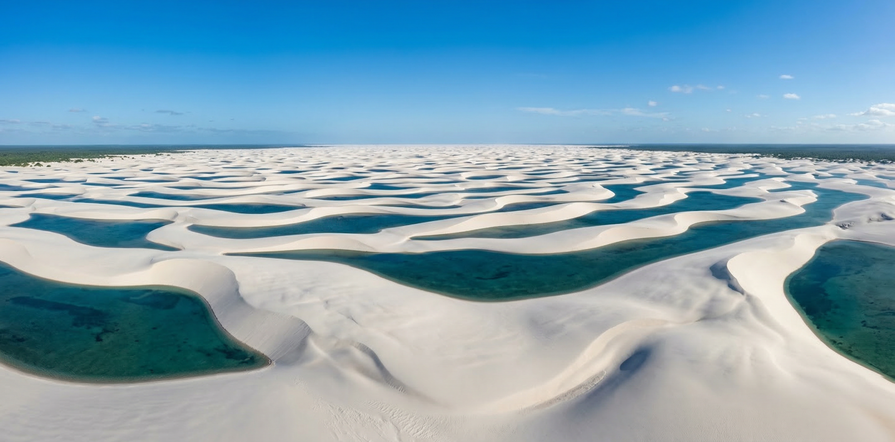</a>
<br/><b>巴西伦索伊斯马拉赫塞斯的沙漠奇景</b>
<br/> 
<br/><details><summary>📋 核心提示词</summary>

```json
{
  "{
  "图像元数据": {
    "类型": "360度等距柱状全景图",
    "投影": "完整球形等距柱状投影",
    "长宽比": "2比1",
    "分辨率": "8K极致清晰"
  },
  "场景构图": {
    "地点": "巴西马拉尼昂州伦索伊斯马拉赫塞斯国家公园",
    "相机位置": "沙海上空中高空悬停",
    "相机高度": "模拟广域高空航拍视角",
    "视野范围": "水平360度，垂直180度",
    "透视表现": "沙丘呈波浪状向地平线无限延伸，地平线平滑无缝衔接",
    "天气": "晴朗无云，空气通透度极佳",
    "景深控制": "近景沙丘纹理、中景湖泊层次与远景雨林交界线全清晰"
  },
  "视觉元素": {
    "前景": { "主要特征": "细腻的白色沙丘肌理，沙丘阴面的柔和阴影，沙丘间蓝绿色湖泊的澄澈水面", "动态": "完全静态" },
    "中景主体": { "地貌": "连绵起伏的新月形白色沙丘群，沙丘间镶嵌着大小不一的蓝绿色淡水湖", "细节": "沙丘的细腻风蚀纹理，湖水的澄澈透明质感，沙丘与湖泊交替的重复韵律", "特征": "纯净的亮白色沙丘与深邃蓝绿色湖水的极致色彩反差" },
    "背景": { "远景": "沙海与热带雨林的交界线延伸至无限远", "天空": "澄澈的湛蓝色，带有零星的轻薄白云" },
    "环境氛围": { "地面半球": "风与水雕琢的大地奇景", "氛围感": "奇幻、纯净、辽阔、静谧" }
  },
  "渲染风格": {
    "光影方案": "正午均匀的顶光照明，精准勾勒沙丘的立体纹理与起伏轮廓，强调沙粒的细腻质感与湖水的通透度",
    "色彩科学": "高饱和度的亮白色沙丘、澄澈蓝绿色湖水与湛蓝色天空形成极致的色彩对比，阴影区的浅灰色调完美塑造沙丘立体感",
    "质感质量": { "描述": "极高清的沙漠湖泊风光航拍", "细节": "完美的360度全视角无缝拼接，无畸变" }
  },
  "核心约束": {
    "必须保留": [ "沙丘的波浪状起伏纹理", "沙丘与湖泊交替的韵律感", "全景环绕的辽阔沙海空间感", "白与蓝的极致色彩反差" ],
    "严禁出现": [ "文字", "水印", "人工建筑", "游客", "车辆", "植被覆盖沙丘", "低对比度" ]
  },
  "负面提示词": [ "文字", "水印", "模糊", "低画质", "暗沉色调", "拼接裂缝", "畸变", "人工设施", "杂物", "沙丘植被覆盖" ]
}"
}
```

<sub>📄 [下载完整 JSON](prompts/case092.json)</sub>
</details>
</div>

<hr/>
<div align="center">
<a href="images/case096/output.png">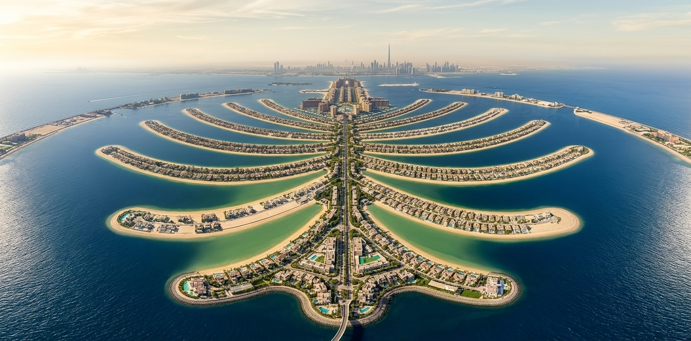</a>
<br/><b>沙漠未来：迪拜棕榈岛的人造奇迹航拍</b>
<br/> 
<br/><details><summary>📋 核心提示词</summary>

```json
{
  "{
  "图像元数据": {
    "类型": "360度等距柱状全景图",
    "投影": "完整球形等距柱状投影",
    "长宽比": "2比1",
    "分辨率": "8K极致清晰"
  },
  "场景构图": {
    "地点": "阿联酋迪拜朱美拉棕榈岛正上方",
    "相机位置": "极高空垂直俯瞰",
    "相机高度": "平流层航拍视角",
    "视野范围": "水平360度，垂直180度",
    "透视表现": "对称的棕榈叶结构向圆形护坡散开，地平线呈环形",
    "天气": "微雾，阳光明媚",
    "景深控制": "城市结构与海洋全清晰"
  },
  "视觉元素": {
    "前景": { "主要特征": "精密排列的高端别墅与私人沙滩，带有浅绿色的泳池点缀", "动态": "静态" },
    "中景主体": { "地貌": "宏大的棕榈叶形人造岛屿，深蓝色的海水环绕", "细节": "波光粼粼的海面，岛上的棕榈树绿化带", "标志": "远景可见的亚特兰蒂斯酒店" },
    "背景": { "远景": "迪拜市区的天际线，哈利法塔在薄霾中若隐若现", "天空": "淡金色的清晨天空" },
    "环境氛围": { "地面半球": "人类工程美学的巅峰展示", "氛围感": "宏伟、奢华、未来感" }
  },
  "渲染风格": {
    "光影方案": "侧光照明，突出建筑阴影与海面波纹的层次感",
    "色彩科学": "金色的沙滩、浅绿的内海与深蓝的外海对比",
    "质感质量": { "描述": "顶级商业航拍摄影，无缝连接", "细节": "极其锐利的城市几何线条" }
  },
  "核心约束": {
    "必须保留": [ "棕榈岛完整的对称几何外形", "碧绿的内海水域", "360度高空视角" ],
    "严禁出现": [ "文字", "水印", "低分辨率", "画面断层", "杂乱云层" ]
  },
  "负面提示词": [ "文字", "水印", "模糊", "低画质", "不规则结构", "灰暗色彩", "拼接缝隙" ]
}"
}
```

<sub>📄 [下载完整 JSON](prompts/case096.json)</sub>
</details>
</div>

<hr/>
<br/><hr/><br/>
<div align="center">
<h2 id="%E2%9D%84%EF%B8%8F%20%E9%9B%AA%E5%A2%83"></h2>
</div>
<div align="center">
<a href="images/case011/output.png">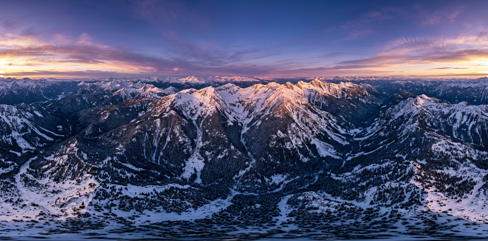</a>
<br/><b>暮色苍穹：雪国极巅的360度全景颂歌提示词</b>
<br/> 
<br/><details><summary>📋 核心提示词</summary>

```json
{
  "{
  "图像元数据": {
    "类型": "360度等距柱状全景图",
    "投影方式": "完整球形等距柱状投影",
    "宽高比": "2:1",
    "分辨率": "超高分辨率全景"
  },
  "场景构图": {
    "地点": "极寒雪国山脉腹地",
    "相机位置": "悬浮在万米高空的上帝视角",
    "相机高度": "极高，俯瞰整个山系",
    "视野范围": "水平360度，垂直180度",
    "投影行为": "正确的等距柱状畸变，确保完美的无缝球形拼接",
    "天气状况": "清澈的暮色，有柔和的夕阳云层",
    "景深": "全景锐利，所有元素清晰"
  },
  "视觉元素": {
    "前景": {
      "主体视图": "无干扰物，纯净的雪山全景",
      "动态": "无"
    },
    "中景主体": {
      "地形": "绵延不绝、崎岖不平的积雪山脉系，覆盖着成千上万棵深色针叶树（松树和杉树），山势雄伟复杂。主峰群沐浴在金色和粉色的夕阳中，岩石和积雪的细节清晰锐利，明暗对比极强。",
      "村落": "无任何建筑",
      "云雾": "在360度地平线上，有被夕阳染成柔和粉色和紫色的暮色云层环绕。"
    },
    "背景": {
      "景观": "向四面八方无限延伸的、逐渐变深和变暗的雪山山脊，最终融入幽蓝的暮色天际线。",
      "天空": "广阔无垠的暮色天空，上部保持幽深冷蓝色，接近地平线处则有夕阳的粉色和紫色过渡，整个天空在360度范围内环绕。"
    },
    "环境氛围": {
      "地面半球": "完全被覆盖着密集深色松林的雪原和山谷覆盖，地形纹理极富节奏感。",
      "整体氛围": "壮丽、清冷、神秘、寂静，远离尘嚣，神圣的暮色雪山颂歌。"
    }
  },
  "渲染风格": {
    "光照": "极具戏剧感的暮色光照。主峰和地平线云层被金色和粉色夕阳从低角度点亮，其他区域则处于幽蓝的阴影中，冷暖对比强烈。这种光照在360度范围内自然过渡。",
    "调色": "以幽蓝、深紫和冷白为主基调，局部点缀金色和粉色的暖色调。",
    "质感质量": {
      "描述": "高度写实摄影感，积雪颗粒、岩石粗糙度和松针细节清晰可见。画面纯净，高清晰度。",
      "痕迹": "无人工痕迹，画面纯净，自然锐化，无用户界面元素。",
      "拼接": "完美的360度无缝拼接"
    }
  },
  "约束条件": {
    "必须保留": [
      "纯360度全景透视",
      "无人机极高空上帝视角",
      "以宏大雪山为核心主体",
      "参考图片中特定的暮色光影（金色和粉色）",
      "密集的针叶林纹理",
      "无任何界面元素",
      "高度写实摄影感"
    ],
    "必须避免": [
      "城市或现代建筑",
      "人物",
      "道路",
      "电线杆",
      "电影感夸张灯光",
      "奇幻或游戏风格",
      "绘画或插画感",
      "非全景的普通照片布局",
      "用户界面、HUD、水印"
    ]
  },
  "负面提示词": [
    "用户界面",
    "抬头显示",
    "文本覆盖",
    "水印",
    "现代建筑",
    "桥梁",
    "行人",
    "汽车",
    "公路",
    "奇幻艺术",
    "插图",
    "绘画",
    "过度处理",
    "边框",
    "裁剪视图",
    "全景接缝断裂",
    "低分辨率"
  ]
}"
}
```

<sub>📄 [下载完整 JSON](prompts/case011.json)</sub>
</details>
</div>

<hr/>
<div align="center">
<a href="images/case125/output.png">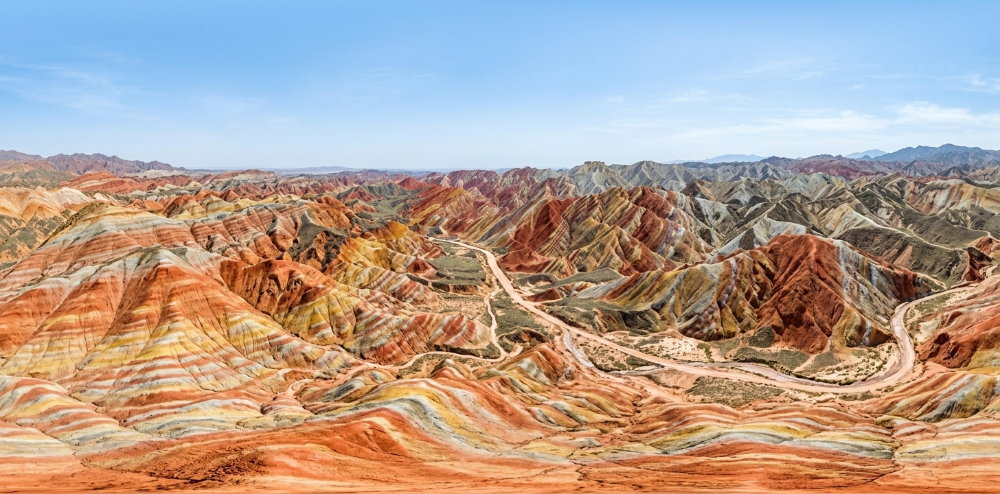</a>
<br/><b>拉普兰雾凇雪林日出360°全景</b>
<br/> 
<br/><details><summary>📋 核心提示词</summary>

```json
{
  "9. {
  "title": "张掖七彩丹霞层理地貌全景",
  "image_meta": {
    "type": "360度等距柱状全景图",
    "projection": "完整球形等距柱状投影",
    "aspect_ratio": "2:1",
    "resolution": "超高分辨率全景"
  },
  "scene_composition": {
    "location": "中国甘肃张掖七彩丹霞地质公园",
    "camera_position": "高空无人机航拍视角",
    "camera_height": "高空航拍视角",
    "field_of_view": "360° 水平，180° 垂直",
    "projection_behavior": "正确的等距柱状畸变",
    "weather": "晴朗，空气通透",
    "depth_of_field": "无限景深（整个全景清晰）"
  },
  "visual_elements": {
    "foreground": {
      "primary_view": "大跨度的彩色丹霞岩层，红、橙、黄、白、灰彩色水平层理极致清晰",
      "motion": "无明显动态，场景静谧"
    },
    "midground_subjects": {
      "terrain": "连绵起伏的丹霞丘陵，岩层呈现完美的平行层理结构，沟壑纵横",
      "landforms": "丹霞山体的褶皱、缓坡与峡谷结构向四周延伸，色彩层次随地形起伏变化",
      "valley": "丹霞峡谷的平缓地带与自然侵蚀痕迹清晰可见"
    },
    "background": {
      "landscape": "丹霞地貌群向远方延伸，与远山轮廓相接，逐渐融入薄雾",
      "sky": "澄澈的浅蓝色天空，点缀着轻薄的白色云絮"
    },
    "environment": {
      "ground_hemisphere": "从高空俯瞰彩色丹霞层理、丘陵与峡谷地貌",
      "atmosphere": "壮丽、雄浑、充满地质奇观感的丹霞地貌环境"
    }
  },
  "rendering_style": {
    "lighting": "自然正午顶光，均匀呈现岩层色彩与纹理",
    "color_grading": "真实自然色彩，以赤红、明黄、浅灰、浅蓝为主",
    "texture_quality": {
      "description": "超写实航拍摄影风格",
      "artifacts": "轻微自然锐化，无人工痕迹",
      "stitching": "无缝360度全景拼接"
    }
  },
  "constraints": {
    "must_keep": [
      "纯360°全景透视",
      "高空航拍视角",
      "七彩丹霞层理地貌为核心主体",
      "无任何UI或界面元素",
      "高度写实"
    ],
    "avoid": [
      "城市或人工建筑",
      "人物",
      "电影感灯光",
      "奇幻风格",
      "插画或绘画感",
      "单帧构图"
    ]
  },
  "negative_prompt": [
    "ui",
    "hud",
    "text overlay",
    "watermark",
    "buildings",
    "bridges",
    "people",
    "fantasy art",
    "illustration",
    "cinematic lighting",
    "hdr",
    "overprocessed",
    "frame",
    "border",
    "cropped view",
    "broken panorama seams"
  ]
}"
}
```

<sub>📄 [下载完整 JSON](prompts/case125.json)</sub>
</details>
</div>

<hr/>
<div align="center">
<a href="images/case128/output.png">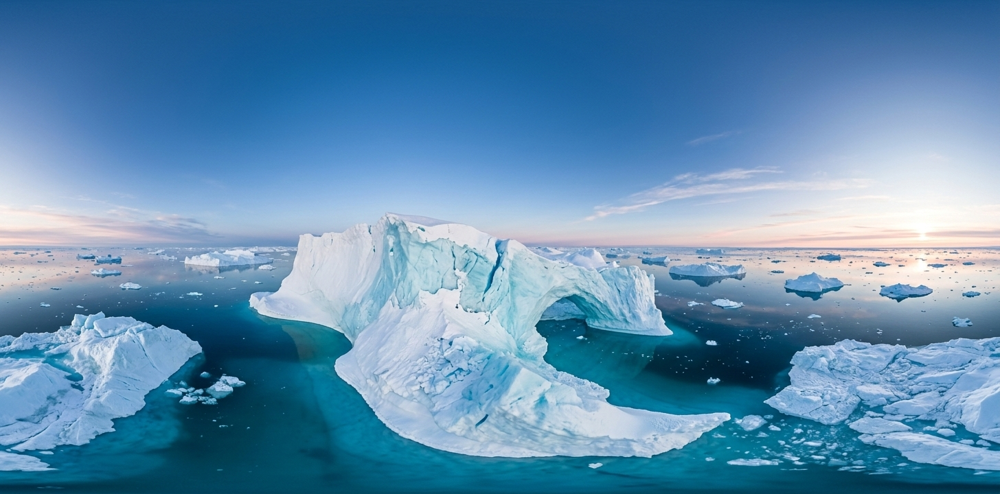</a>
<br/><b>格陵兰迪斯科湾巨型冰山360°全景</b>
<br/> 
<br/><details><summary>📋 核心提示词</summary>

```json
{
  "5. {
  "title": "格陵兰巨型冰山与冰海",
  "image_meta": {
    "type": "360度等距柱状全景图",
    "projection": "完整球形等距柱状投影",
    "aspect_ratio": "2:1",
    "resolution": "超高分辨率全景"
  },
  "scene_composition": {
    "location": "格陵兰迪斯科湾冰山群",
    "camera_position": "高空无人机航拍视角",
    "camera_height": "高空航拍视角",
    "field_of_view": "360° 水平，180° 垂直",
    "projection_behavior": "正确的等距柱状畸变",
    "weather": "晴朗，空气通透",
    "depth_of_field": "无限景深（整个全景清晰）"
  },
  "visual_elements": {
    "foreground": {
      "primary_view": "巨型南极/格陵兰冰山，冰体呈现纯白与蒂芙尼蓝渐变，冰面纹理与冰洞清晰可见",
      "motion": "无明显动态，场景静谧"
    },
    "midground_subjects": {
      "water_body": "澄澈的冰海，水面呈现从浅蓝到深蓝的渐变，清晰倒映冰山轮廓",
      "icebergs": "多座小型冰山漂浮在海面，沿地平线分布",
      "ice_texture": "冰山表面的冰裂、积雪与蓝冰结构纹理丰富"
    },
    "background": {
      "landscape": "冰海向远方无限延伸，与地平线无缝衔接",
      "sky": "澄澈的蓝天，日出/日落的暖光在天际线晕染，少量薄云点缀"
    },
    "environment": {
      "ground_hemisphere": "从高空俯瞰巨型冰山、冰海与远处冰山群",
      "atmosphere": "纯净、辽阔、充满极地气息的冰川海洋环境"
    }
  },
  "rendering_style": {
    "lighting": "自然极地日光，光线柔和，强化冰体通透感",
    "color_grading": "真实自然色彩，以蒂芙尼蓝、纯白、深蓝为主",
    "texture_quality": {
      "description": "超写实航拍摄影风格",
      "artifacts": "轻微自然锐化，无人工痕迹",
      "stitching": "无缝360度全景拼接"
    }
  },
  "constraints": {
    "must_keep": [
      "纯360°全景透视",
      "高空航拍视角",
      "巨型冰山与冰海为核心主体",
      "无任何UI或界面元素",
      "高度写实"
    ],
    "avoid": [
      "城市或人工建筑",
      "人物",
      "电影感灯光",
      "奇幻风格",
      "插画或绘画感",
      "单帧构图"
    ]
  },
  "negative_prompt": [
    "ui",
    "hud",
    "text overlay",
    "watermark",
    "buildings",
    "bridges",
    "people",
    "fantasy art",
    "illustration",
    "cinematic lighting",
    "hdr",
    "overprocessed",
    "frame",
    "border",
    "cropped view",
    "broken panorama seams"
  ]
}"
}
```

<sub>📄 [下载完整 JSON](prompts/case128.json)</sub>
</details>
</div>

<hr/>
<div align="center">
<a href="images/case038/output.png"></a>
<br/><b>极地冰雪日落，360度航拍全景提示词</b>
<br/> 
<br/><details><summary>📋 核心提示词</summary>

```json
{
  "{
  "图像元数据": {
    "类型": "360度等距柱状全景图",
    "投影方式": "完整球形等距柱状投影",
    "宽高比": "2:1",
    "分辨率": "超高分辨率全景"
  },
  "场景构图": {
    "地点": "极地冰封海湾",
    "相机位置": "高空航拍视角，上帝视角",
    "视野范围": "水平360度，垂直180度",
    "投影行为": "正确的等距柱状畸变，确保无缝球形拼接",
    "天气状况": "晴朗，伴有日落晚霞",
    "景深": "全景清晰"
  },
  "视觉元素": {
    "前景": {
      "主体视图": "冰封的海岸线，雪地，以及海湾中散落的小型浮冰",
      "动态": "平静的深蓝色海水"
    },
    "中景主体": {
      "地形": "白雪覆盖的岛屿和半岛，以及远处层叠的雪山",
      "村落": "无任何建筑",
      "云雾": "天空中飘浮着带有金色晚霞的云朵"
    },
    "背景": {
      "景观": "连绵不绝的冰川和雪山",
      "天空": "深蓝色天空，日落方向呈现金色和橙色晚霞"
    },
    "环境氛围": {
      "地面半球": "完全被冰雪覆盖的陆地和深蓝色海洋",
      "整体氛围": "寒冷、静谧、宏大、壮丽"
    }
  },
  "渲染风格": {
    "光照": "自然日落光，日落方向有强烈的逆光和金色光晕",
    "调色": "冷调（深蓝天空、海水、雪地阴影）与暖调（金色晚霞、日落光晕）的对比",
    "质感质量": {
      "描述": "高度写实摄影感",
      "痕迹": "右下角保留“AirPano”水印",
      "拼接": "完美的360度无缝拼接"
    }
  },
  "约束条件": {
    "必须保留": [
      "纯360度全景透视",
      "无人机高空视角",
      "极地冰雪为核心主体",
      "高度写实摄影感"
    ],
    "必须避免": [
      "城市或现代建筑",
      "人物",
      "电影感夸张灯光",
      "奇幻或游戏风格",
      "绘画或插画感",
      "非全景的普通照片布局"
    ]
  },
  "负面提示词": [
    "用户界面",
    "抬头显示",
    "文本覆盖（除原水印外）",
    "现代建筑",
    "桥梁",
    "行人",
    "奇幻艺术",
    "插图",
    "过度处理",
    "边框",
    "裁剪视图",
    "全景接缝断裂"
  ]
}"
}
```

<sub>📄 [下载完整 JSON](prompts/case038.json)</sub>
</details>
</div>

<hr/>
<div align="center">
<a href="images/case075/output.png">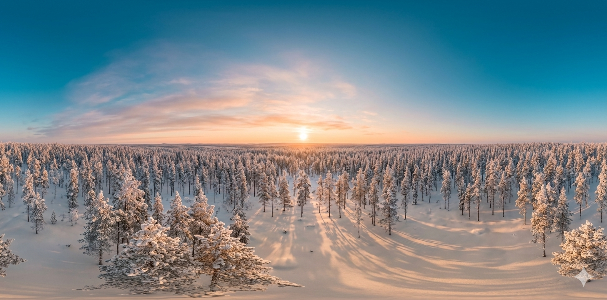</a>
<br/><b>雪林秘境：芬兰拉普兰雪林的日出盛景</b>
<br/> 
<br/><details><summary>📋 核心提示词</summary>

```json
{
  "{
  "图像元数据": {
    "类型": "360度等距柱状全景图",
    "投影": "完整球形等距柱状投影",
    "长宽比": "2比1",
    "分辨率": "8K极致清晰"
  },
  "场景构图": {
    "地点": "芬兰拉普兰罗瓦涅米附近雪松林",
    "相机位置": "雪林上空低空悬停",
    "相机高度": "模拟沉浸式低空航拍视角",
    "视野范围": "水平360度，垂直180度",
    "透视表现": "连绵雪松林向地平线无限延伸，雪地树影呈斜向线条铺满地面，地平线平滑无缝衔接",
    "天气": "晴朗少云，空气通透度极高",
    "景深控制": "近景雪林纹理、中景雪地光影与远景雪林天际线全清晰"
  },
  "视觉元素": {
    "前景": { "主要特征": "覆盖厚雪与雾凇的雪松树冠，蓬松积雪的奶油质感，雪地的树影长阴影", "动态": "完全静态" },
    "中景主体": { "地貌": "广袤无垠的雾凇雪松林，铺满厚雪的林间雪地", "细节": "雪松的垂直挺拔轮廓，雾凇的细腻冰晶质感，雪地的暖金色晨光质感，树影的长阴影层次", "特征": "暖金色的雾凇雪林、奶白色的蓬松积雪、暖棕色的树影阴影与渐变蓝天空的温柔组合" },
    "背景": { "远景": "连绵雪松林延伸至远方的地平线", "天空": "从暖橙色到澄澈湛蓝色渐变的日出天空，日出太阳悬于雪林上方，带有轻薄的粉橙色云霞" },
    "环境氛围": { "地面半球": "北极圈的冬日童话秘境", "氛围感": "治愈、温柔、静谧、纯净" }
  },
  "渲染风格": {
    "光影方案": "冬日日出的低角度斜射暖光，给雾凇雪林镀上温柔的暖金色，强调积雪的奶油质感与树影的长阴影层次，突出画面的温柔治愈氛围感",
    "色彩科学": "暖金色的晨光、奶白色的积雪、暖棕色的树影与从暖橙到湛蓝渐变的天空形成柔和的冷暖对比，色彩还原温柔自然",
    "质感质量": { "描述": "极高清的冬日雾凇雪林风光航拍", "细节": "完美的360度全视角无缝拼接，无畸变" }
  },
  "核心约束": {
    "必须保留": [ "雪松林的垂直挺拔轮廓", "雾凇积雪的奶油质感", "雪地的树影长阴影", "日出的暖调温柔氛围感", "全景环绕的雪林空间感" ],
    "严禁出现": [ "文字", "水印", "人工建筑", "游客", "车辆", "围栏", "低对比度", "色彩失真" ]
  },
  "负面提示词": [ "文字", "水印", "模糊", "低画质", "暗沉色调", "拼接裂缝", "畸变", "人工设施", "杂物", "色彩失真", "过曝" ]
}"
}
```

<sub>📄 [下载完整 JSON](prompts/case075.json)</sub>
</details>
</div>

<hr/>
<div align="center">
<a href="images/case085/output.png">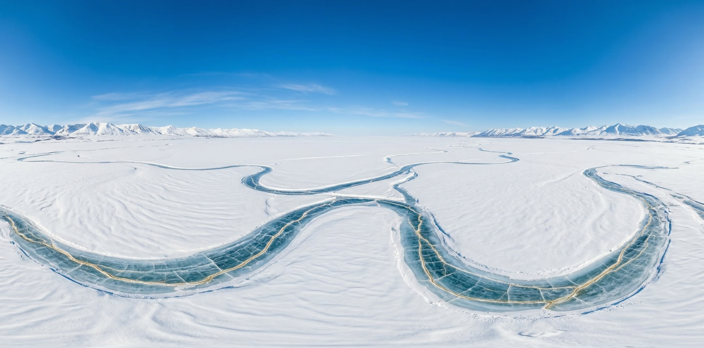</a>
<br/><b>雪原冰脉：极北冬日冰封雪原的正午盛景</b>
<br/> 
<br/><details><summary>📋 核心提示词</summary>

```json
{
  "{
  "图像元数据": {
    "类型": "360度等距柱状全景图",
    "投影": "完整球形等距柱状投影",
    "长宽比": "2比1",
    "分辨率": "8K极致清晰"
  },
  "场景构图": {
    "地点": "俄罗斯西伯利亚雅库特地区冰封雪原",
    "相机位置": "雪原上空中高空悬停",
    "相机高度": "模拟广域高空航拍视角",
    "视野范围": "水平360度，垂直180度",
    "透视表现": "冰冻河流呈蜿蜒状在雪原上无限延伸，地平线平滑无缝衔接",
    "天气": "晴朗无云，空气通透度极高",
    "景深控制": "近景冰面纹理、中景雪原层次与远景雪山山脉全清晰"
  },
  "视觉元素": {
    "前景": { "主要特征": "细腻的纯白积雪肌理，雪原平缓起伏的褶皱阴影，蜿蜒冰冻河流的冰裂纹理", "动态": "完全静态" },
    "中景主体": { "地貌": "广袤无垠的纯白冰封雪原，多条蜿蜒交错的冰冻河流", "细节": "冰冻河流的冰蓝色冰面，金色的冰裂纹理，雪原的细腻起伏褶皱", "特征": "极致纯净的亮白色雪原、冰蓝色的冰冻河流与深邃的阴影层次组合" },
    "背景": { "远景": "连绵的雪山山脉延伸至天际线", "天空": "澄澈的湛蓝色，正午的太阳悬于天空正中，带有极轻薄的高空卷云" },
    "环境氛围": { "地面半球": "极北之地的纯净冰雪世界", "氛围感": "孤寂、壮阔、纯净、凛冽" }
  },
  "渲染风格": {
    "光影方案": "冬日正午均匀的顶光照明，精准勾勒雪原的起伏肌理与冰冻河流的冰裂轮廓，强调积雪的细腻奶油质感与冰面的通透冰蓝色质感",
    "色彩科学": "高通透度的亮白色雪原、冰蓝色的冰冻河流与湛蓝色的天空形成极致的冷色调层次，阴影区的浅灰色调完美塑造雪原的立体感，太阳的暖金色形成柔和的冷暖对比",
    "质感质量": { "描述": "极高清的冰封雪原风光航拍", "细节": "完美的360度全视角无缝拼接，无畸变" }
  },
  "核心约束": {
    "必须保留": [ "冰冻河流的蜿蜒曲线与冰裂纹理", "雪原的细腻起伏肌理", "全景环绕的辽阔冰雪空间感", "纯白与冰蓝的极致色彩层次" ],
    "严禁出现": [ "文字", "水印", "人工建筑", "车辆", "游客", "植被", "冰雪脏污", "低对比度" ]
  },
  "负面提示词": [ "文字", "水印", "模糊", "低画质", "暗沉色调", "拼接裂缝", "畸变", "人工设施", "杂物", "冰雪脏污", "植被覆盖", "过曝" ]
}"
}
```

<sub>📄 [下载完整 JSON](prompts/case085.json)</sub>
</details>
</div>

<hr/>
<div align="center">
<a href="images/case098/output.png">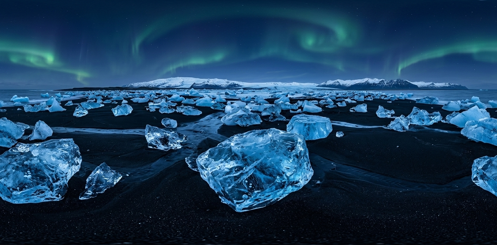</a>
<br/><b>冰与火之歌：瓦特纳冰川的幽蓝深处</b>
<br/> 
<br/><details><summary>📋 核心提示词</summary>

```json
{
  "{
  "图像元数据": {
    "类型": "360度等距柱状全景图",
    "投影": "完整球形等距柱状投影",
    "长宽比": "2比1",
    "分辨率": "8K极致清晰"
  },
  "场景构图": {
    "地点": "冰岛瓦特纳冰川边缘与黑沙滩交界",
    "相机位置": "低空平视全景",
    "相机高度": "地面三脚架高度视角",
    "视野范围": "水平360度，垂直180度",
    "透视表现": "巨大的冰块散落在黑色沙滩上，向四周呈放射状排列",
    "天气": "清冷，伴有微弱的极光影迹",
    "景深控制": "近处冰块纹理极其锐利，远景雪山清晰"
  },
  "视觉元素": {
    "前景": { "主要特征": "晶莹剔透的巨大冰块，表面有精细的裂纹与气泡，反射出幽蓝色光芒", "动态": "完全静态" },
    "中景主体": { "地貌": "纯黑色的火山沙滩，质感颗粒分明", "环境": "正在融化的冰川边缘，带有细微的水流纹路", "细节": "冰与沙的边缘分界线极其清晰" },
    "背景": { "远景": "连绵的白色冰盖与远方的雪山剪影", "天空": "深邃的墨蓝色夜空，带有淡绿色的极光带" },
    "环境氛围": { "地面半球": "荒凉而神圣的极北地貌", "氛围感": "冷峻、纯净、超脱尘世" }
  },
  "渲染风格": {
    "光影方案": "冷色调的环境光，冰块内部带有荧光感，高光处呈冷白色",
    "色彩科学": "极致的冷蓝色、纯黑色与纯白色的组合",
    "质感质量": { "描述": "极高像素的材质摄影，展现冰晶与砂砾的微观细节", "细节": "无缝360度全景衔接" }
  },
  "核心约束": {
    "必须保留": [ "蓝色的透明冰块", "纯黑色的沙滩", "极光背景", "全景环绕感" ],
    "严禁出现": [ "游客", "垃圾", "暖色调灯光", "画面噪点", "文字" ]
  },
  "负面提示词": [ "文字", "水印", "杂色", "人物", "现代建筑", "过曝", "模糊", "拼接裂缝" ]
}"
}
```

<sub>📄 [下载完整 JSON](prompts/case098.json)</sub>
</details>
</div>

<hr/>
<br/><hr/><br/>
<div align="center">
<h2 id="%F0%9F%8F%99%EF%B8%8F%20%E5%9F%8E%E5%B8%82"></h2>
</div>
<div align="center">
<a href="images/case116/output.png"></a>
<br/><b>迪拜哈利法塔夜景360度航拍全景</b>
<br/> 
<br/><details><summary>📋 核心提示词</summary>

```json
{
  "{
  "title": "迪拜哈利法塔巅峰夜景全景",
  "image_meta": {
    "type": "360度等距柱状全景图",
    "projection": "完整球形等距柱状投影",
    "aspect_ratio": "2:1",
    "resolution": "超高分辨率全景"
  },
  "scene_composition": {
    "location": "阿联酋迪拜市中心",
    "camera_position": "无人机俯瞰哈利法塔及喷泉区",
    "camera_height": "极高空视角",
    "field_of_view": "360° 水平，180° 垂直",
    "projection_behavior": "正确的等距柱状畸变",
    "weather": "清澈夜空，极少雾霭",
    "depth_of_field": "无限景深"
  },
  "visual_elements": {
    "foreground": {
      "primary_view": "哈利法塔如巨型钻针直插入云霄，塔身景观灯全亮，细节惊人",
      "motion": "复杂的立交桥车流光轨"
    },
    "midground_subjects": {
      "cityscape": "密集的摩天大楼矩阵与星罗棋布的城市灯光，迪拜喷泉可见轮廓",
      "infrastructure": "金色的谢赫扎耶德路如城市血脉蜿蜒"
    },
    "background": {
      "landscape": "远方暗处的沙漠腹地与地平线处的波斯湾星点灯光",
      "sky": "深蓝紫色夜空，群星微弱"
    },
    "environment": {
      "ground_hemisphere": "沙漠中建立起的未来感奢华都会夜景",
      "atmosphere": "奢华、现代、震撼"
    }
  },
  "rendering_style": {
    "lighting": "暖色路灯与冷白色摩天楼亮化灯光对比",
    "color_grading": "高动态对比，现代都市华丽色调",
    "texture_quality": {
      "description": "顶级城市夜景航拍",
      "stitching": "无缝拼接"
    }
  },
  "constraints": {
    "must_keep": ["哈利法塔中心构图", "灯光轨道细节", "360全景"],
    "avoid": ["白天", "噪点", "雾霾"]
  },
  "negative_prompt": ["ui", "watermark", "daylight", "low res", "foggy", "blurry"]
}"
}
```

<sub>📄 [下载完整 JSON](prompts/case116.json)</sub>
</details>
</div>

<hr/>
<div align="center">
<a href="images/case124/output.png">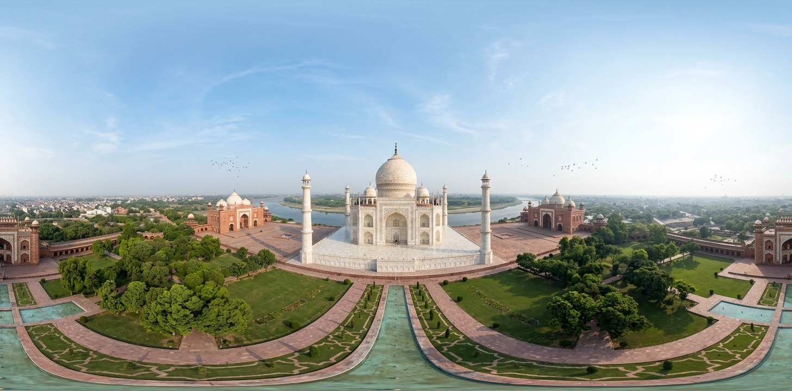</a>
<br/><b>泰姬陵360°航拍全景</b>
<br/> 
<br/><details><summary>📋 核心提示词</summary>

```json
{
  "10. {
  "title": "印度泰姬陵全景航拍",
  "image_meta": {
    "type": "360度等距柱状全景图",
    "projection": "完整球形等距柱状投影",
    "aspect_ratio": "2:1",
    "resolution": "超高分辨率全景"
  },
  "scene_composition": {
    "location": "印度阿格拉泰姬陵",
    "camera_position": "高空无人机航拍视角",
    "camera_height": "高空航拍视角",
    "field_of_view": "360° 水平，180° 垂直",
    "projection_behavior": "正确的等距柱状畸变",
    "weather": "晴朗，空气通透",
    "depth_of_field": "无限景深（整个全景清晰）"
  },
  "visual_elements": {
    "foreground": {
      "primary_view": "泰姬陵主体白色大理石建筑，穹顶、拱门与雕花细节清晰可见，两侧对称的宣礼塔笔直矗立",
      "motion": "飞鸟在空中飞行形成轻微动态模糊"
    },
    "midground_subjects": {
      "structures": "两侧对称的红砂岩附属建筑，拱门与穹顶结构完整",
      "plaza": "纯白色大理石广场，对称的几何步道与花园清晰可见",
      "garden": "前景的莫卧儿式花园，绿植、水池与步道呈现完美的中轴对称布局"
    },
    "background": {
      "landscape": "亚穆纳河与阿格拉城市远景在建筑后方延伸，与地平线相接",
      "sky": "澄澈的浅蓝色天空，带有拉丝状的白色云絮，整体通透干净"
    },
    "environment": {
      "ground_hemisphere": "从高空俯瞰泰姬陵主体、对称建筑群与花园",
      "atmosphere": "庄严、典雅、充满古典美学的世界文化遗产环境"
    }
  },
  "rendering_style": {
    "lighting": "自然日光，光线柔和，均匀呈现大理石建筑的质感",
    "color_grading": "真实自然色彩，以纯白、赭红、浅绿、浅蓝为主",
    "texture_quality": {
      "description": "超写实航拍摄影风格",
      "artifacts": "轻微自然锐化，无人工痕迹",
      "stitching": "无缝360度全景拼接"
    }
  },
  "constraints": {
    "must_keep": [
      "纯360°全景透视",
      "高空航拍视角",
      "泰姬陵主体建筑为核心主体",
      "无任何UI或界面元素",
      "高度写实"
    ],
    "avoid": [
      "现代密集建筑",
      "人物",
      "电影感灯光",
      "奇幻风格",
      "插画或绘画感",
      "单帧构图"
    ]
  },
  "negative_prompt": [
    "ui",
    "hud",
    "text overlay",
    "watermark",
    "buildings",
    "bridges",
    "people",
    "fantasy art",
    "illustration",
    "cinematic lighting",
    "hdr",
    "overprocessed",
    "frame",
    "border",
    "cropped view",
    "broken panorama seams"
  ]
}"
}
```

<sub>📄 [下载完整 JSON](prompts/case124.json)</sub>
</details>
</div>

<hr/>
<div align="center">
<a href="images/case017/output.png">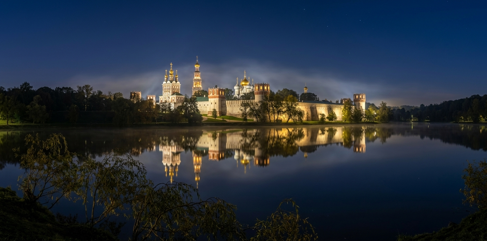</a>
<br/><b>莫斯科：新圣女修道院之夜</b>
<br/> 
<br/><sub>🎨 高定时尚大片、电影感胶片静帧、模拟胶片美学</sub>
<br/><details><summary>📋 核心提示词</summary>

```json
{
  "prompt": "电影感胶片静帧，**极限俯拍中景**。女性位于画面中心，**直视镜头，目光强烈对视**。她的身形突出，占据画面大部分比例。**严格复刻参考图中的发型、服装与配饰。**她坐在最高摩天大楼边缘。屋顶环境为粗糙混凝土纹理与凌乱钢结构。下方远处模糊的城市建筑营造令人眩晕的都市失重氛围。**戏剧性温暖自然日光，高对比度，阳光反射在她眼中。**低饱和工业色调，可见胶片颗粒，Kodak Portra 800质感。超精细，脸部与眼部锐利对焦，8K真实感。—ar 3:4",
  "negative_prompt": "不直视、闭眼、低头、远景、主体过小、人物太小、改变发型、不同服装、低质量、脸部扭曲",
  "style": "高定时尚大片、电影感胶片静帧、模拟胶片美学",
  "camera": "俯拍中景，直视镜头",
  "aspect_ratio": "3:4",
  "lighting": "自然日光、高对比、眼中高光"
}
```

<sub>📄 [下载完整 JSON](prompts/case017.json)</sub>
</details>
</div>

<hr/>
<div align="center">
<a href="images/case039/output.png"></a>
<br/><b>云端救赎：里约基督像与日照金山全景提示词</b>
<br/> 
<br/><details><summary>📋 核心提示词</summary>

```json
{
  "{
  "图像元数据": {
    "类型": "360度等距柱状全景图",
    "投影方式": "完整球形等距柱状投影",
    "宽高比": "2:1",
    "分辨率": "超高分辨率全景"
  },
  "场景构图": {
    "地点": "巴西里约热内卢驼背山救世基督像上空",
    "相机位置": "无人机位于雕像平视略高位置，穿梭于云层上方",
    "相机高度": "高空航拍视角，云端视角",
    "视野范围": "水平360度，垂直180度",
    "投影行为": "准确的等距柱状畸变，确保全景视角完整无缺",
    "天气状况": "壮丽云海，日出时分，空气带有湿润的雾气感",
    "景深": "全景深，雕像细节与远方日出天际线均保持清晰"
  },
  "视觉元素": {
    "前景": {
      "主体视图": "救世基督像矗立在画面一侧，云雾在雕像基座周围缠绕流动",
      "动态": "云海如波浪般翻涌，具有细腻的动态纹理感"
    },
    "中景主体": {
      "地形": "隐约可见的山脊线从云海中露出，展现出地形的起伏",
      "雕像细节": "雕像表面的石材纹理受到阳光映射，呈现出温暖的色调",
      "云雾": "浓厚的层积云覆盖了整个地表，阳光穿透云层边缘产生发光效果"
    },
    "background": {
      "景观": "远方连绵的山脉在云海中若隐若现，直至无限远的地平线",
      "天空": "日出中心点迸发出强烈的橙红色光芒，向四周扩散为淡蓝色与紫色的霞光"
    },
    "环境氛围": {
      "光影表现": "强烈的日出逆光，云层顶部被染成金红色，阴影处呈现幽深的紫灰色",
      "整体氛围": "神圣、宁静、宏大，带有超现实主义的自然崇拜感"
    }
  },
  "渲染风格": {
    "光照": "真实的日出自然光照，带有明显的丁达尔效应和体积光感",
    "调色": "高动态范围色彩，饱和的橙红色与深邃的冷蓝色对比，色彩过渡自然",
    "质感质量": {
      "描述": "超写实专业全景航拍",
      "细节": "云雾的颗粒感与雕像的质感清晰可见",
      "拼接": "无缝360度物理拼接，无任何视觉断层"
    }
  },
  "约束条件": {
    "必须保留": [
      "纯360度全景透视",
      "救世基督像作为视觉锚点",
      "波澜壮阔的云海日出",
      "无缝的球形投影",
      "高度写实的摄影质感"
    ],
    "必须避免": [
      "任何形式的文字或水印",
      "城市街道细节",
      "现代交通工具",
      "虚假的人工灯光",
      "插画或低模感",
      "断裂的天际线"
    ]
  },
  "负面提示词": [
    "水印",
    "标志",
    "文本覆盖",
    "地面建筑",
    "人群",
    "低分辨率",
    "画面噪点",
    "全景拼接痕迹",
    "过度曝光导致的色彩断层",
    "科幻元素",
    "卡通风格",
    "黑色边框"
  ]
}"
}
```

<sub>📄 [下载完整 JSON](prompts/case039.json)</sub>
</details>
</div>

<hr/>
<div align="center">
<a href="images/case063/output.png">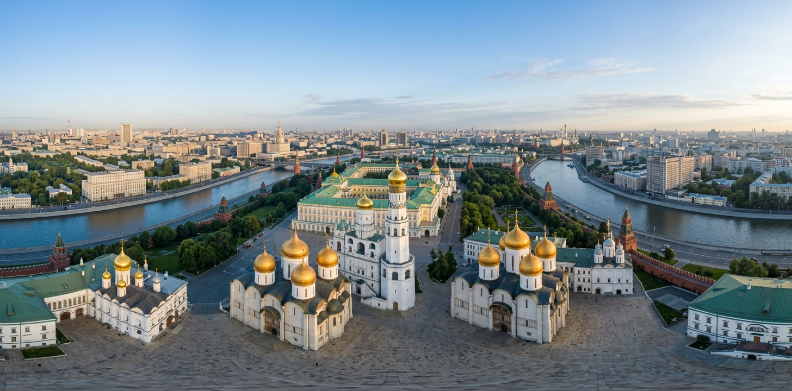</a>
<br/><b>莫斯科克里姆林宫教堂群日出 360° 全景航拍</b>
<br/> 
<br/><details><summary>📋 核心提示词</summary>

```json
{
  "{
    "图像元数据": {
        "类型": "360度等距柱状全景图",
        "投影方式": "完整球形等距柱状投影",
        "宽高比": "2:1",
        "分辨率": "超高分辨率全景"
    },
    "场景构图": {
        "拍摄地点": "莫斯科克里姆林宫教堂群上空",
        "机位": "无人机位于克里姆林宫正上方超高空航拍",
        "拍摄高度": "超高空无人机视角",
        "视野范围": "水平360°，垂直180°",
        "投影特性": "正确的等距柱状畸变",
        "天气状况": "日出晴朗天气，空气通透",
        "景深": "无限景深，全景画面全程清晰"
    },
    "视觉元素": {
        "前景": {
            "核心画面": "克里姆林宫教堂群，中心高耸的伊凡大帝钟楼，两侧东正教教堂的金色洋葱头穹顶，白色石材墙体，建筑细节完整精致，广场地面纹理清晰",
            "细节表现": "金色穹顶的反光质感、石材墙体的纹理、建筑的立体结构清晰自然"
        },
        "中景": {
            "地形": "克里姆林宫的绿化景观与广场，蜿蜒的莫斯科河穿城而过，河畔的城市建筑与绿化层次清晰",
            "环境细节": "河流的水面质感、城市绿化的层次、建筑的肌理自然真实"
        },
        "背景": {
            "远景": "莫斯科城市全景向天际线无限延伸，建筑轮廓柔和自然",
            "天空": "日出澄澈蓝天占据上半球，点缀少量轻薄流云，阳光明亮柔和"
        },
        "环境氛围": {
            "下半球视角": "从超高空俯瞰克里姆林宫建筑群、莫斯科河与城市全景",
            "整体气质": "庄严典雅的历史建筑与壮阔城市全景融合，还原城市原生风貌"
        }
    },
    "渲染风格": {
        "光影": "自然日出侧光，真实光影方向，建筑明暗层次自然，金色穹顶反光柔和真实",
        "色彩调校": "真实自然色彩，建筑白金色调、绿化绿色与天空蓝色平衡，还原实景质感",
        "纹理质感": {
            "描述": "超写实历史建筑航拍摄影风格",
            "处理细节": "轻微自然锐化，无人工痕迹",
            "拼接要求": "无缝360度全景拼接"
        }
    },
    "约束规则": {
        "必须保留": ["纯360°全景透视", "无人机超高空航拍视角", "克里姆林宫教堂群为核心主体", "无任何UI或界面元素", "高度写实"],
        "严格规避": ["奇幻风格", "插画或绘画感", "单帧构图", "建筑造型失真", "电影感灯光"]
    },
    "负面提示词": ["界面元素", "抬头显示", "文字叠加", "水印", "奇幻艺术", "插画", "电影感打光", "过度高动态范围", "过度处理", "画框", "边框", "裁切画面", "全景拼接断层", "建筑造型失真"]
}"
}
```

<sub>📄 [下载完整 JSON](prompts/case063.json)</sub>
</details>
</div>

<hr/>
<div align="center">
<a href="images/case064/output.png"></a>
<br/><b>芝加哥城市天际线日出 360° 全景航拍</b>
<br/> 
<br/><details><summary>📋 核心提示词</summary>

```json
{
  "{
    "图像元数据": {
        "类型": "360度等距柱状全景图",
        "投影方式": "完整球形等距柱状投影",
        "宽高比": "2:1",
        "分辨率": "超高分辨率全景"
    },
    "场景构图": {
        "拍摄地点": "芝加哥市中心城市天际线上空",
        "机位": "无人机位于城市中心正上方超高空航拍",
        "拍摄高度": "超高空无人机视角",
        "视野范围": "水平360°，垂直180°",
        "投影特性": "正确的等距柱状畸变",
        "天气状况": "日出晴朗天气，空气通透",
        "景深": "无限景深，全景画面全程清晰"
    },
    "视觉元素": {
        "前景": {
            "核心画面": "芝加哥市中心摩天大楼群，日出暖金色阳光覆盖建筑外立面，玻璃幕墙与钢结构轮廓清晰，建筑细节完整真实",
            "细节表现": "建筑的立体结构、光影层次清晰，玻璃反光自然真实"
        },
        "中景": {
            "地形": "画面左侧是广阔的密歇根湖，湖面形成日出阳光的明亮反光带；画面右侧是芝加哥城市建成区，棋盘式路网清晰，建筑从中心向远方延伸",
            "环境细节": "湖面的波光质感、城市路网的肌理层次自然真实"
        },
        "背景": {
            "远景": "城市建成区向天际线无限延伸，湖面与远方地平线自然衔接",
            "天空": "日出渐变蓝天占据上半球，从天际线暖橙到高空澄澈蓝自然过渡，点缀少量轻薄流云"
        },
        "环境氛围": {
            "下半球视角": "从超高空俯瞰城市天际线、密歇根湖与城市建成区",
            "整体气质": "繁华壮阔的现代都市日出环境，还原城市原生风貌"
        }
    },
    "渲染风格": {
        "光影": "自然日出低角度侧光，真实光影方向，建筑明暗层次自然，冷暖对比柔和",
        "色彩调校": "真实自然色彩，建筑暖金色、湖面冷蓝色与天空渐变色调平衡，还原实景质感",
        "纹理质感": {
            "描述": "超写实城市航拍摄影风格",
            "处理细节": "轻微自然锐化，无人工痕迹",
            "拼接要求": "无缝360度全景拼接"
        }
    },
    "约束规则": {
        "必须保留": ["纯360°全景透视", "无人机超高空航拍视角", "芝加哥城市天际线为核心主体", "无任何UI或界面元素", "高度写实"],
        "严格规避": ["奇幻风格", "插画或绘画感", "单帧构图", "过度夸张的建筑造型", "电影感灯光"]
    },
    "负面提示词": ["界面元素", "抬头显示", "文字叠加", "水印", "奇幻艺术", "插画", "电影感打光", "过度高动态范围", "过度处理", "画框", "边框", "裁切画面", "全景拼接断层", "建筑造型失真"]
}"
}
```

<sub>📄 [下载完整 JSON](prompts/case064.json)</sub>
</details>
</div>

<hr/>
<div align="center">
<a href="images/case095/output.png">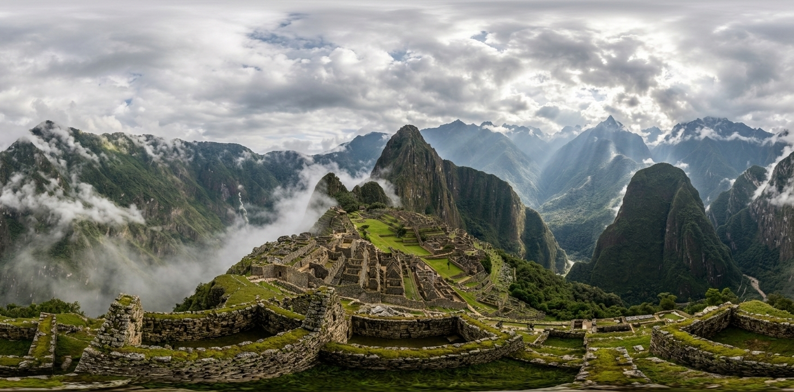</a>
<br/><b>古城回响：马丘比丘云端之城的全景秘境</b>
<br/> 
<br/><details><summary>📋 核心提示词</summary>

```json
{
  "{
  "图像元数据": {
    "类型": "360度等距柱状全景图",
    "投影": "完整球形等距柱状投影",
    "长宽比": "2比1",
    "分辨率": "8K极致清晰"
  },
  "场景构图": {
    "地点": "秘鲁库斯科马丘比丘遗址最高点",
    "相机位置": "俯瞰古城全景",
    "相机高度": "山巅站立高度",
    "视野范围": "水平360度，垂直180度",
    "透视表现": "古城梯田呈环状分布，四周被险峻山峰环抱",
    "天气": "多云，山雾缭绕",
    "景深控制": "石块纹理与远景高峰全清晰"
  },
  "视觉元素": {
    "前景": { "主要特征": "精细的印加石墙遗址，覆盖着深绿色的苔藓与草坪", "动态": "雾气流动" },
    "中景主体": { "地貌": "层层叠叠的石头建筑群与农业梯田", "细节": "标志性的瓦纳比丘峰，陡峭的悬崖边缘", "环境": "山间快速移动的白色薄雾" },
    "背景": { "远景": "无尽的安第斯山脉群峰，层峦叠嶂", "天空": "戏剧性的多云天气，阳光透过云隙射下丁达尔光柱" },
    "环境氛围": { "地面半球": "古老文明与壮丽自然的交响", "氛围感": "神圣、苍茫、震撼" }
  },
  "渲染风格": {
    "光影方案": "散射光结合局部光柱，增强遗址的神秘感",
    "色彩科学": "古朴的石灰色、深郁的草绿色与雾白色的和谐统一",
    "质感质量": { "描述": "极高像素的历史遗迹摄影", "细节": "完美的360度环境沉浸感" }
  },
  "核心约束": {
    "必须保留": [ "马丘比丘标志性地貌", "流动的山雾", "深绿的梯田", "360度全景" ],
    "严禁出现": [ "游客", "现代围栏", "指示牌", "文字", "水印" ]
  },
  "负面提示词": [ "文字", "水印", "现代人", "背包", "电线", "色彩过艳", "拼接错误" ]
}"
}
```

<sub>📄 [下载完整 JSON](prompts/case095.json)</sub>
</details>
</div>

<hr/>
<br/><hr/><br/>
<div align="center">
<h2 id="%F0%9F%8C%B8%20%E6%98%A5%E6%99%AF"></h2>
</div>
<div align="center">
<a href="images/case003/output.png">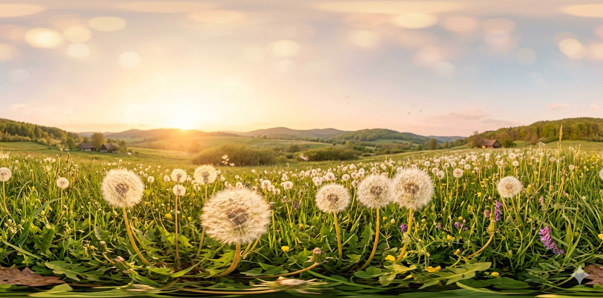</a>
<br/><b>金色黄昏下的蒲公英花田360全景提示词</b>
<br/> 
<br/><details><summary>📋 核心提示词</summary>

```json
{
  "{
  "图像元数据": {
    "类型": "360度等距柱状全景图",
    "投影方式": "完整球形（Equirectangular）等距柱状投影",
    "宽高比": "2:1",
    "分辨率": "超高分辨率全景，8K+"
  },
  "场景构图": {
    "地点": "偏远的、未受破坏的乡村草甸",
    "相机位置": "极低视角，贴近地面（大约15-20厘米高），仿佛置身于草丛中",
    "视野范围": "完整的水平360度，垂直180度天顶至底点",
    "投影行为": "正确的、数学上精确的等距柱状畸变，确保从底点到天顶的无缝球形拼接，无可见接缝",
    "天气状况": "清澈的春日黄昏，空气纯净",
    "景深": "浅景深（浅F-stop，如F/1.8），前景和中景焦点清晰，远景和天空完全散焦"
  },
  "视觉元素": {
    "前景（0-2米）": {
      "主体视图": "无数精致、毛茸茸的蒲公英种球（类似于参考图中的三个），它们是画面的核心焦点，被细腻的绿叶、小野花芽、嫩草茎和少量其他野花（如小黄花和紫色野豌豆）包围。这些元素在前景中占据较大的画面比例。每一个种球的纤细结构和绒毛都极其细腻，仿佛可以触摸。",
      "动态": "极轻的春风微动，几粒零星的蒲公英种子正在空中轻轻飘舞（类似于参考图中的状态）。"
    },
    "中景主体（2-10米）": {
      "地形": "起伏的草甸和低矮的灌木丛，蒲公英种球逐渐增多，形成一片花海。地面细节（草、叶）逐渐过渡为更柔和的纹理。",
      "村落": "在极远的中景（大约在90度和270度方向）有几座极小的、传统的、土坯和木质结构的古老农舍（非现代建筑），它们与环境完美融合。",
      "云雾": "无，空气清晰。"
    },
    "背景（10米-无穷大）": {
      "景观": "起伏的低山丘陵，覆盖着春天的嫩绿树林，形成一个包围式的天际线。",
      "天空": "完整的、包围式、柔焦的天空（Bokeh）。在“主体视图”方向（约0度）有强烈的、柔和的、金橙色的“黄金时刻”太阳光晕（Bokeh），正如参考图所示。这个光晕柔和地散射，延伸至约180度（反方向），那里的天空逐渐转为温暖的、柔焦的淡蓝色和粉色调。天空完全散焦成柔软、温暖的光斑。"
    },
    "环境氛围": {
      "地面半球（底点）": "完全覆盖着细腻的、低角度透视的草地、野花、落叶和蒲公英根部，形成一个完美的、无接缝的圆形底点。",
      "整体氛围": "宁静、梦幻、金色、怀旧、宏观般的细腻与无限宏大的全景视角的奇妙结合。"
    }
  },
  "渲染风格": {
    "光照": "极致温暖、金色的自然光。太阳位于主体视图方向（约0度），光线强烈且柔和地散射开来，形成包围式的光晕。中景和前景元素被温暖的背光和侧光照亮，强调其透明和纤细的质感。全景图反方向（180度）则表现出更柔和、更凉爽的余晖色调。",
    "调色": "温暖的金色和淡黄色调，与春天的嫩绿、淡蓝和粉色调平衡。高饱和度的金色，低饱和度的绿色。怀旧、柔和的电影感色调。",
    "质感质量": {
      "描述": "超高分辨率、宏观级的清晰度（针对前景物体）。蒲公英绒毛的每一根纤维都必须清晰可辨。场景整体具有柔焦和光斑（Bokeh）的艺术感。",
      "痕迹": "无人工痕迹，画面纯净，自然锐化，无过度处理。",
      "拼接": "完美的360度无缝拼接，确保在任何角度查看都不会出现断裂、拉伸或错位。"
    }
  },
  "约束条件": {
    "必须保留": [
      "纯360度全景透视，无缝拼接",
      "极低地面视角（Ground-level macro perspective）",
      "以宏观蒲公英种球为核心前景主体（参考图的扩展）",
      "金色散焦的“黄金时刻”光照（参考图的扩展）",
      "无任何现代人类活动或建筑（除了极远的古老农舍）",
      "极高的写实摄影感"
    ],
    "必须避免": [
      "城市或现代建筑",
      "人物、车辆、电线杆",
      "电影感夸张灯光、科幻或奇幻元素",
      "绘画或插画风格，必须是摄影质感",
      "非全景的普通照片布局"
    ]
  },
  "负面提示词": [
    "用户界面 (UI)",
    "抬头显示 (HUD)",
    "文本覆盖",
    "水印",
    "现代建筑",
    "桥梁",
    "行人",
    "车辆",
    "科幻艺术",
    "奇幻艺术",
    "插图",
    "过度处理",
    "边框",
    "裁剪视图",
    "全景接缝断裂",
    "底点或天顶扭曲",
    "非球形透视"
  ]
}"
}
```

<sub>📄 [下载完整 JSON](prompts/case003.json)</sub>
</details>
</div>

<hr/>
<div align="center">
<a href="images/case013/output.png">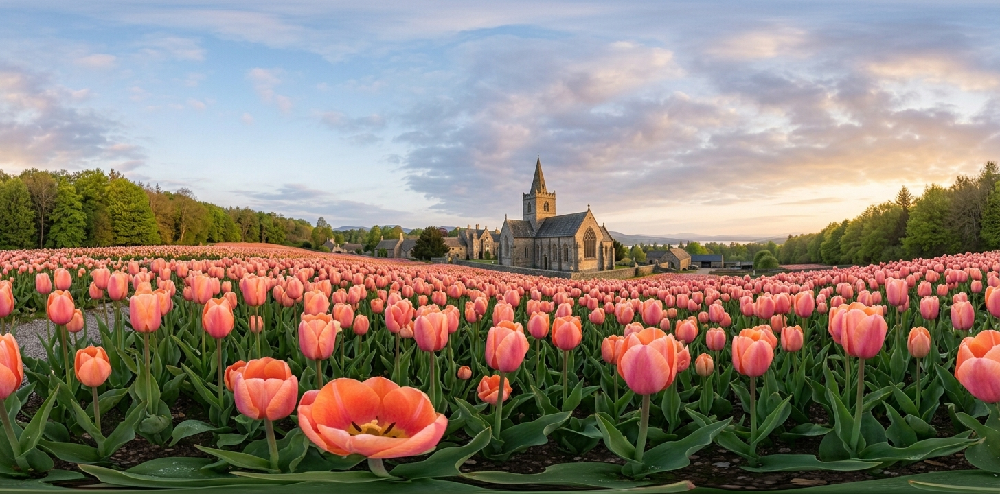</a>
<br/><b>欧式庄园春日郁金香360全景提示词</b>
<br/> 
<br/><details><summary>📋 核心提示词</summary>

```json
{
  "{
  "图像元数据": {
    "类型": "360度等距柱状全景图",
    "投影方式": "完整球形等距柱状投影",
    "宽高比": "2:1",
    "分辨率": "12K超高分辨率全景"
  },
  "场景构图": {
    "地点": "一座古老的欧式乡村庄园，以参考图image_0.png中的古老石砌哥特式教堂为核心地标",
    "相机位置": "直接放置在庄园郁金香花海中间的地面上，极低视角",
    "相机高度": "地面低视角（约30厘米），被郁金香包围",
    "视野范围": "水平360度，垂直180度",
    "投影行为": "完美的等距柱状畸变，确保全景浏览无断裂、无拉伸",
    "天气状况": "清晨黄金时刻，柔和且有方向性的日光，天空有淡淡的、层次丰富的云朵",
    "景深": "深景深，前、中、远景皆清晰，突出前景细节"
  },
  "视觉元素": {
    "前景": {
      "主体视图": "360度环绕的、极近距离的粉橙双色（pink-orange bi-color）郁金香花朵和茎叶。用户仿佛被无数巨大的花朵包围。花瓣上的细微脉络、花蕊结构、甚至叶片上的露珠都极度清晰。",
      "动态": "微风吹过，密集的花丛和茎叶产生细微的摇曳动态（静态全景中表现为柔和的姿态分布）"
    },
    "中景主体": {
      "地形": "起伏的低丘陵，全部被密集的郁金香花海覆盖。透过花丛的缝隙，隐约可见蜿蜒的碎石小径和古老的庄园石墙根部。",
      "古老庄园建筑群": "位于郁金香花丛的上方和远处，以参考图image_0.png中的石砌哥特式教堂建筑（带有尖拱窗）为主要地标，透过密集的花朵和茎叶缝隙可见。其他古老的庄园建筑、钟楼和庄园主屋也被保留在远处。",
      "森林": "建筑群周围和远处的丘陵上是茂密的、具有春日嫩绿叶片的森林，环绕整个全景，位于郁金香花海的上方。"
    },
    "背景": {
      "景观": "地平线尽头是绵延的低山脉和一片宁静的、倒映着天空的湖泊。",
      "天空": "完整的360度天空穹顶，从东方的清晨金色霞光过渡到西方的柔和蔚蓝，云朵层次清晰。"
    },
    "环境氛围": {
      "地面半球": "完全被密集、延伸的郁金香茎叶、根部和小径碎石填满，无缝拼接。",
      "整体氛围": "生机勃勃、宁静、古老、充满历史感和诗意的春日早晨，极具沉浸感和压迫感。"
    }
  },
  "渲染风格": {
    "光照": "清晨黄金时刻的柔和、温暖日光，在密集的花瓣、茎叶和古老石墙根部之间产生丰富复杂的、穿梭的光影效果。",
    "调色": "自然、饱和度适中的春日色彩，保留参考图的粉、橙、绿、灰调。具有细腻的电影级色彩分级。",
    "质感质量": {
      "描述": "超高清写实摄影感，具有细腻的胶片颗粒感（细颗粒，约2-5%），使画面看起来更自然、更有质感。所有花瓣纹理、叶片、石材根部的细节都极度清晰。",
      "痕迹": "无任何数字人工合成痕迹，画面纯净，自然锐化，确保球形拼接处无重影。",
      "拼接": "完美的360度水平和垂直无缝拼接，地平线平直"
    }
  },
  "约束条件": {
    "必须保留": [
      "纯360度全景透视",
      "地面极低视角，被郁金香包围",
      "粉橙双色郁金香花海为核心主体，细节极致呈现",
      "透过花丛缝隙可见的石砌哥特式教堂建筑群（质感复刻自参考图）",
      "极高的细节和写实胶片质感",
      "无任何界面元素"
    ],
    "必须避免": [
      "高空俯视上帝视角",
      "现代城市或混凝土建筑",
      "人物和现代交通工具",
      "电影感夸张灯光（如霓虹灯）",
      "奇幻或游戏风格",
      "绘画或插画感",
      "非全景的普通照片布局"
    ]
  },
  "负面提示词": [
    "上帝视角",
    "高空俯视",
    "用户界面",
    "抬头显示",
    "文本覆盖",
    "水印",
    "现代城市建筑",
    "混凝土大楼",
    "柏油路",
    "现代汽车",
    "行人",
    "奇幻艺术",
    "插图",
    "过度锐化",
    "边框",
    "裁剪视图",
    "全景接缝断裂",
    "重影"
  ]
}"
}
```

<sub>📄 [下载完整 JSON](prompts/case013.json)</sub>
</details>
</div>

<hr/>
<div align="center">
<a href="images/case138/output.png"></a>
<br/><b>高山草甸的野花与虹光</b>
<br/> 
</div>

<hr/>
<div align="center">
<a href="images/case014/output.png"></a>
<br/><b>🌷 春意盎然：微距视界下的360全景宇宙提示词</b>
<br/> 
<br/><details><summary>📋 核心提示词</summary>

```json
{
  "{
  "图像元数据": {
    "类型": "360度等距柱状全景图 (Equirectangular Panorama)",
    "投影方式": "完整球形 360x180 投影",
    "宽高比": "2:1",
    "分辨率": "16K 超高解析度，极致微距细节"
  },
  "场景构图": {
    "地点": "一片未受干扰的、生机勃勃的春日草地中心",
    "相机位置": "地面微距视角 (Macro Viewpoint)，高度约3-5厘米",
    "视角": "模拟昆虫视线，被巨大的草叶和花卉环绕",
    "视野范围": "水平360度无缝，垂直180度完整球形",
    "投影行为": "正确的等距柱状畸变处理，确保极点无拉伸，接缝处完美拼接",
    "天气与光照": "清晨黄金时段 (Golden Hour)，强烈的低角度逆光，空气中有极轻微的丁达尔效应"
  },
  "视觉元素": {
    "前景核心": {
      "主体描述": "一朵半透明的淡粉色铁筷子花 (Helleborus)，逆光穿透花瓣展示出细腻的静脉纹理，边缘带有金色的光晕。",
      "地表细节": "地面覆盖着质感清晰的棕橙色落叶、晶莹剔透的晨露、以及刚破土的嫩绿色幼苗。"
    },
    "中景环境": {
      "植被": "错落有致的草茎和花苞，形成层层叠叠的焦外层次。",
      "光影": "光线穿过草丛缝隙形成的细碎光影，充满律动感。"
    },
    "背景/天空": {
      "视觉效果": "360度环绕的梦幻圆形散景 (Bokeh)，大面积绚烂的光斑效果，色彩涵盖淡金、柔粉与翠绿。",
      "天空部分": "天顶呈现清透的淡蓝色与晨曦的暖橙色自然过渡，无云，光线通透。"
    }
  },
  "渲染风格": {
    "光照模型": "电影级逆光渲染，全局光照 (GI)，次表面散射 (SSS) 应用于花瓣",
    "色彩科学": "低饱和度粉色与高饱和度嫩绿、暖棕的和谐对比，画面干净清透",
    "画质指标": "无人工痕迹，写实摄影质感，8k/16k 纹理映射，完美球形拼合"
  },
  "约束条件": {
    "必须保留": [
      "纯净的360度全景透视",
      "极低空微距视角",
      "逆光半透明花瓣效果",
      "全方位的梦幻散景光斑",
      "高度写实的自然材质"
    ],
    "严禁出现": [
      "任何人类建筑或人工制品",
      "任何人物、动物或昆虫实体",
      "文字、水印、UI界面",
      "广角镜头边缘的直线断裂",
      "插画感、油画感或CG感过强的塑料质感"
    ]
  },
  "负面提示词": [
    "text, watermark, logo, architecture, people, street, distortion at poles, broken seams, painting, cartoon, blurry foreground, dark shadows, flat lighting, high camera angle"
  ]
}"
}
```

<sub>📄 [下载完整 JSON](prompts/case014.json)</sub>
</details>
</div>

<hr/>
<br/><hr/><br/>
<div align="center">
<h2 id="%F0%9F%8C%B2%20%E6%A3%AE%E6%9E%97"></h2>
</div>
<div align="center">
<a href="images/case114/output.png"></a>
<br/><b>生命律动：蒙古大草原上的普氏野马群自由奔袭</b>
<br/> 
<br/><details><summary>📋 核心提示词</summary>

```json
{
  "{
  "image_meta": {
    "type": "360度等距柱状全景图",
    "projection": "完整球形等距柱状投影",
    "aspect_ratio": "2:1",
    "resolution": "超高分辨率全景"
  },
  "scene_composition": {
    "location": "辽阔的蒙古大草原",
    "camera_position": "无人机中低空航拍",
    "camera_height": "低空视角",
    "field_of_view": "360° 水平，180° 垂直",
    "projection_behavior": "自然地平线延展",
    "weather": "晴朗，伴有拉伸的卷云",
    "depth_of_field": "全景深"
  },
  "visual_elements": {
    "foreground": { "primary_view": "一群普氏野马在绿色的草原上自由奔跑与站立", "motion": "野马带有轻微的动态感" },
    "midground_subjects": { "terrain": "一望无际的、平缓起伏的绿色草地", "river": "远方隐约可见的蓝色地表水体", "mist": "无" },
    "background": { "landscape": "地平线极低，草原与天空在远方交汇成一线", "sky": "巨大的、呈现弧形畸变的湛蓝天空，伴有稀疏白云" },
    "environment": { "ground_hemisphere": "纯净、广阔的草原植被", "atmosphere": "宁静、原始、充满生命力" }
  },
  "rendering_style": {
    "lighting": "明亮的自然日光，阴影柔和地投射在草地上",
    "color_grading": "高饱和度的鲜绿色与天空蓝",
    "texture_quality": { "description": "国家地理风格野生动物摄影", "artifacts": "无人工痕迹", "stitching": "无缝拼接" }
  },
  "constraints": {
    "must_keep": [ "野马群主体", "地平线居中", "纯粹草原景观", "360°全景" ],
    "avoid": [ "人类建筑", "围栏", "道路", "过度锐化" ]
  },
  "negative_prompt": [ "ui", "text", "buildings", "fence", "people", "cars", "distorted horses" ]
}"
}
```

<sub>📄 [下载完整 JSON](prompts/case114.json)</sub>
</details>
</div>

<hr/>
<div align="center">
<a href="images/case122/output.png"></a>
<br/><b>拉普兰极地雪树森林日落360度全景</b>
<br/> 
<br/><details><summary>📋 核心提示词</summary>

```json
{
  "{
  "title": "拉普兰极地雪树森林日落全景",
  "image_meta": {
    "type": "360度等距柱状全景图",
    "projection": "完整球形等距柱状投影",
    "aspect_ratio": "2:1",
    "resolution": "超高分辨率全景"
  },
  "scene_composition": {
    "location": "芬兰拉普兰极地森林",
    "camera_position": "无人机悬停于雪坡林带上方",
    "camera_height": "低空航拍视角",
    "field_of_view": "360° 水平，180° 垂直",
    "projection_behavior": "正确的等距柱状畸变",
    "weather": "极地清澈寒冷，日落余晖",
    "depth_of_field": "无限景深"
  },
  "visual_elements": {
    "foreground": {
      "primary_view": "被厚重积雪包裹的云杉林，呈现奇特的白色圆锥状‘雪怪’造型",
      "motion": "静止"
    },
    "midground_subjects": {
      "terrain": "起伏的雪原山丘，树木密集，雪地反射着淡淡的紫红色余晖",
      "details": "雪面质感蓬松松软，无人类足迹"
    },
    "background": {
      "landscape": "无边无际的北极圈雪原向远方延伸",
      "sky": "低垂的金紫色夕阳，渐变色天空，带有丝状薄云"
    },
    "environment": {
      "ground_hemisphere": "被白雪完全覆盖的极地生态系统",
      "atmosphere": "纯净、宁静、童话般的极寒氛围"
    }
  },
  "rendering_style": {
    "lighting": "极地暖色侧光，照亮树木一侧，另一侧呈现冰蓝色阴影",
    "color_grading": "粉紫色、冰蓝色与金色的梦幻交织",
    "texture_quality": {
      "description": "超写实极地摄影",
      "stitching": "无缝360度全景拼接"
    }
  },
  "constraints": {
    "must_keep": ["360°视角", "雪树细节", "高度写实"],
    "avoid": ["融化的雪", "裸露的绿色叶片", "足迹", "建筑"]
  },
  "negative_prompt": ["ui", "text", "watermark", "green grass", "human cabins", "dirt"]
}"
}
```

<sub>📄 [下载完整 JSON](prompts/case122.json)</sub>
</details>
</div>

<hr/>
<div align="center">
<a href="images/case020/output.png">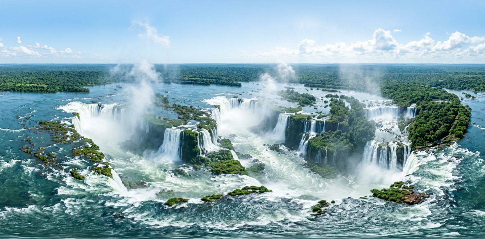</a>
<br/><b>伊瓜苏：雨林之巅的圣水</b>
<br/> 
<br/><details><summary>📋 核心提示词</summary>

```json
{
  "{
  "图像元数据": {
    "类型": "360度等距柱状全景图",
    "投影方式": "完整球形等距柱状投影",
    "宽高比": "2:1",
    "分辨率": "超高分辨率全景"
  },
  "场景构图": {
    "地点": "伊瓜苏大瀑布 (Iguazu Falls)",
    "相机位置": "马蹄形瀑布群中央正上方",
    "相机高度": "高空航拍视角，上帝视角",
    "视野范围": "水平360度，垂直180度",
    "投影行为": "正确的等距柱状畸变，确保无缝球形拼接",
    "天气状况": "晴朗，伴有热带特有的湿气云团",
    "景深": "多层对焦，前景水花到远方雨林皆清晰"
  },
  "视觉元素": {
    "前景": {
      "主体视图": "急促交汇的上游河水与即将跌落的崖缘",
      "动态": "奔腾的水流"
    },
    "中景主体": {
      "地形": "半圆环形分布的巨型瀑布群与热带绿岛",
      "村落": "无",
      "云雾": "深谷升腾的大面积半透明水汽雾团"
    },
    "背景": {
      "景观": "连绵不断的原始热带雨林冠层",
      "天空": "明净的浅蓝色天空"
    },
    "环境氛围": {
      "地面半球": "水的迷宫，白色与绿色的交响",
      "整体氛围": "磅礴、湿润、充满原始自然力量"
    }
  },
  "渲染风格": {
    "光照": "明亮的自然顶光，柔和的光雾效果",
    "调色": "高饱和度绿色与蓝色，水流呈现纯净白色",
    "质感质量": {
      "描述": "水流的动态模糊与凝固瞬间的平衡感",
      "痕迹": "无人工痕迹，画面纯净，自然锐化",
      "拼接": "完美的360度无缝拼接"
    }
  },
  "约束条件": {
    "必须保留": ["纯360度全景透视", "瀑布群的环绕感", "植被细节清晰"],
    "必须避免": ["旅游观光船", "观景桥梁", "人物", "非写实感"]
  },
  "负面提示词": ["用户界面", "抬头显示", "文本覆盖", "水印", "现代建筑", "桥梁", "行人", "奇幻艺术", "插图", "过度处理", "边框", "裁剪视图", "全景接缝断裂"]
}"
}
```

<sub>📄 [下载完整 JSON](prompts/case020.json)</sub>
</details>
</div>

<hr/>
<div align="center">
<a href="images/case074/output.png">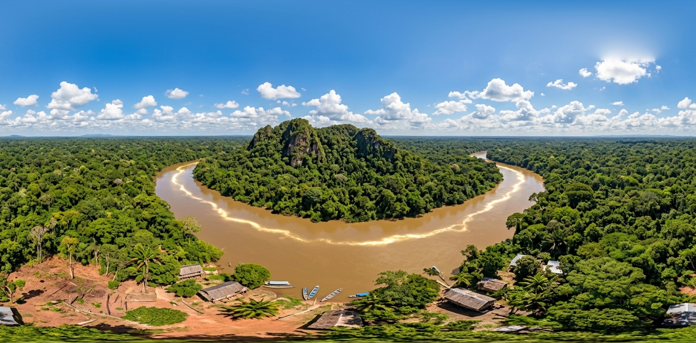</a>
<br/><b>亚马逊热带雨林流域原生地貌 360° 全景航拍</b>
<br/> 
<br/><details><summary>📋 核心提示词</summary>

```json
{
  "{
    "图像元数据": {
        "类型": "360度等距柱状全景图",
        "投影方式": "完整球形等距柱状投影",
        "宽高比": "2:1",
        "分辨率": "超高分辨率全景"
    },
    "场景构图": {
        "拍摄地点": "亚马逊热带雨林流域上空",
        "机位": "无人机位于雨林与河流正上方高空航拍",
        "拍摄高度": "高空无人机视角",
        "视野范围": "水平360°，垂直180°",
        "投影特性": "正确的等距柱状畸变",
        "天气状况": "晴朗多云天气，空气通透",
        "景深": "无限景深，全景画面全程清晰"
    },
    "视觉元素": {
        "前景": {
            "核心画面": "雨林边缘的裸露土地与残留植被，简易林间木屋与停靠的船只，土地纹理与植被细节清晰",
            "细节表现": "雨林乔木的层叠结构清晰可见"
        },
        "中景": {
            "地形": "河道两侧极致茂密的热带雨林，高大乔木连绵成片，植被郁郁葱葱",
            "水体": "蜿蜒浑浊的棕色河流贯穿画面，河道自然弯曲，水面反射自然光",
            "环境细节": "雨林与河流的自然衔接，植被覆盖度极高"
        },
        "背景": {
            "远景": "广阔的雨林平原向远方无限延伸",
            "天空": "澄澈蓝天占据上半球，布满蓬松自然的白色积云"
        },
        "环境氛围": {
            "下半球视角": "从空中俯瞰热带雨林、蜿蜒河流与平原地形",
            "整体气质": "原始湿热的热带雨林流域环境，保留自然原生状态"
        }
    },
    "渲染风格": {
        "光影": "自然正午顶光，真实阴影方向，光影层次自然",
        "色彩调校": "真实自然色彩，浓郁的雨林绿色与河流棕色调平衡，还原实景质感",
        "纹理质感": {
            "描述": "超写实航拍摄影风格",
            "处理细节": "轻微自然锐化，无人工痕迹",
            "拼接要求": "无缝360度全景拼接"
        }
    },
    "约束规则": {
        "必须保留": ["纯360°全景透视", "无人机高空航拍视角", "热带雨林与河流为核心主体", "无任何UI或界面元素", "高度写实"],
        "严格规避": ["城市建筑", "人物", "电影感灯光", "奇幻风格", "插画或绘画感", "单帧构图"]
    },
    "负面提示词": ["界面元素", "抬头显示", "文字叠加", "水印", "城市建筑", "人物", "奇幻艺术", "插画", "电影感打光", "过度高动态范围", "过度处理", "画框", "边框", "裁切画面", "全景拼接断层", "人工结构"]
}"
}
```

<sub>📄 [下载完整 JSON](prompts/case074.json)</sub>
</details>
</div>

<hr/>
<br/><hr/><br/>
<div align="center">
<h2 id="%F0%9F%8E%A8%20%E5%85%B6%E4%BB%96"></h2>
</div>
<div align="center">
<a href="images/case105/output.png"></a>
<br/><b>世界之巅：喜马拉雅珠穆朗玛峰的宏伟群峰</b>
<br/> 
<br/><details><summary>📋 核心提示词</summary>

```json
{
  "{
  "image_meta": {
    "type": "360度等距柱状全景图",
    "projection": "完整球形等距柱状投影",
    "aspect_ratio": "2:1",
    "resolution": "超高分辨率全景"
  },
  "scene_composition": {
    "location": "尼泊尔喜马拉雅山脉，珠穆朗玛峰近距离航拍",
    "camera_position": "超高空飞行平台视角",
    "camera_height": "极高海拔全景",
    "field_of_view": "360° 水平，180° 垂直",
    "projection_behavior": "雪山峰顶呈放射状环绕，天底可见巨大的冰川裂隙",
    "weather": "晴朗，伴有强烈的峰顶旗云（Flag cloud）",
    "depth_of_field": "无限景深"
  },
  "visual_elements": {
    "foreground": { "primary_view": "近处被积雪和浮冰覆盖的黑色岩石脊线，质感极度清晰", "motion": "旗云在峰顶被强风吹拂的动感" },
    "midground_subjects": { "terrain": "深邃的昆布冰川，布满蓝色的裂缝与冰塔林", "river": "冰川形成的白色冰流感", "mist": "高海拔细碎的雪雾" },
    "background": { "landscape": "连绵不绝的喜马拉雅八千米级群峰，延伸至弧形的地平线", "sky": "深邃的深蓝色天空，接近近地空间色调" },
    "environment": { "ground_hemisphere": "纯净的冰雪世界，无任何生命迹象", "atmosphere": "冷峻、神圣、极致荒凉" }
  },
  "rendering_style": {
    "lighting": "强烈的极高海拔直射光，产生极深的暗部阴影",
    "color_grading": "冷色调，强调纯白雪面与深蓝天空的对比",
    "texture_quality": { "description": "写实主义高空摄影", "artifacts": "无缝360全景拼接", "stitching": "完美无暇" }
  },
  "constraints": {
    "must_keep": [ "珠穆朗玛峰标志性三角形轮廓", "峰顶旗云", "深蓝色高空", "360°包围感" ],
    "avoid": [ "登山队", "帐篷", "任何颜色鲜艳的人造物体", "电影特效感" ]
  },
  "negative_prompt": [ "ui", "text", "human", "tent", "helicopter", "pixelated", "overexposed snow" ]
}"
}
```

<sub>📄 [下载完整 JSON](prompts/case105.json)</sub>
</details>
</div>

<hr/>
<div align="center">
<a href="images/case144/output.png"></a>
<br/><b>日落全景，温暖的金紫色天空</b>
<br/> 
</div>

<hr/>
<div align="center">
<a href="images/case145/output.png"></a>
<br/><b>高山场景全景，彩虹横跨</b>
<br/> 
</div>

<hr/>
<div align="center">
<a href="images/case148/output.png"></a>
<br/><b>高山草甸上的彩虹与繁花邂逅</b>
<br/> 
</div>

<hr/>
<div align="center">
<a href="images/case150/output.png">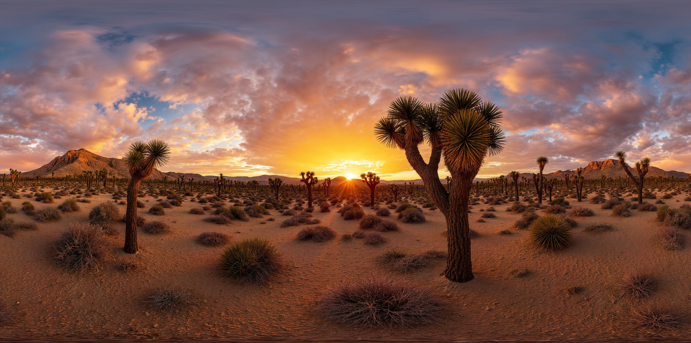</a>
<br/><b>约书亚树国家公园的日落盛景</b>
<br/> 
</div>

<hr/>
<div align="center">
<a href="images/case157/output.png"></a>
<br/><b>自然风景户外山林草地商业照片</b>
<br/> 
</div>

<hr/>
<div align="center">
<a href="images/case158/output.png"></a>
<br/><b>自然风景户外山林草地商业照片</b>
<br/> 
</div>

<hr/>
<div align="center">
<a href="images/case016/output.png">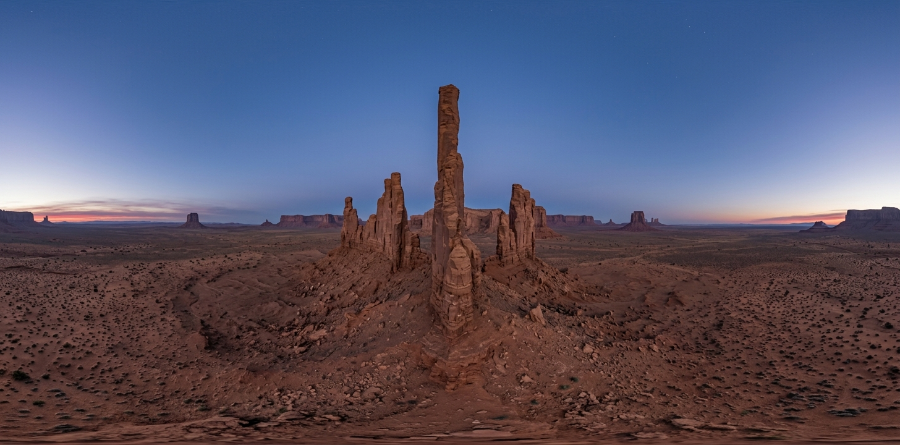</a>
<br/><b>纪念碑谷：图腾柱的时间之塔</b>
<br/> 
<br/><details><summary>📋 核心提示词</summary>

```json
{
  "{
  "图像元数据": {
    "类型": "360度等距柱状全景图",
    "投影方式": "完整球形等距柱状投影",
    "宽高比": "2:1",
    "分辨率": "超高分辨率全景"
  },
  "场景构图": {
    "地点": "美国，纪念碑谷图腾柱 (Totem Pole)",
    "相机位置": "石塔群正中心",
    "相机高度": "高空航拍视角，上帝视角",
    "视野范围": "水平360度，垂直180度",
    "投影行为": "正确的等距柱状畸变，确保无缝球形拼接",
    "天气状况": "清冷微光，地平线上有微弱余晖",
    "景深": "全景深聚焦"
  },
  "视觉元素": {
    "前景": {
      "主体视图": "布满砂砾与点状灌木的荒漠大地",
      "动态": "静止"
    },
    "中景主体": {
      "地形": "极其纤细的图腾柱石塔与石林群",
      "村落": "无",
      "云雾": "空气透明度极高"
    },
    "背景": {
      "景观": "远方模糊的平顶山地平线",
      "天空": "带渐变色调的澄澈夜幕或余晖天空"
    },
    "环境氛围": {
      "地面半球": "广袤、干旱、红褐色的地表",
      "整体氛围": "神圣、孤绝、带有地质纪念碑般的严肃感"
    }
  },
  "渲染风格": {
    "光照": "微弱的散射光，岩石轮廓被光晕微微勾勒",
    "调色": "低饱和度红褐色调，强调土地色彩",
    "质感质量": {
      "描述": "极端侵蚀后的岩石结构细节",
      "痕迹": "无人工痕迹，画面纯净，自然锐化",
      "拼接": "完美的360度无缝拼接"
    }
  },
  "约束条件": {
    "必须保留": ["纯360度全景透视", "石塔的垂直延伸感", "高度写实摄影感"],
    "必须避免": ["奇幻灯光", "人工建筑", "人物", "电影感滤镜"]
  },
  "负面提示词": ["用户界面", "抬头显示", "文本覆盖", "水印", "现代建筑", "车辆", "行人", "奇幻艺术", "插图", "过度处理", "边框", "裁剪视图", "全景接缝断裂"]
}"
}
```

<sub>📄 [下载完整 JSON](prompts/case016.json)</sub>
</details>
</div>

<hr/>
<div align="center">
<a href="images/case019/output.png">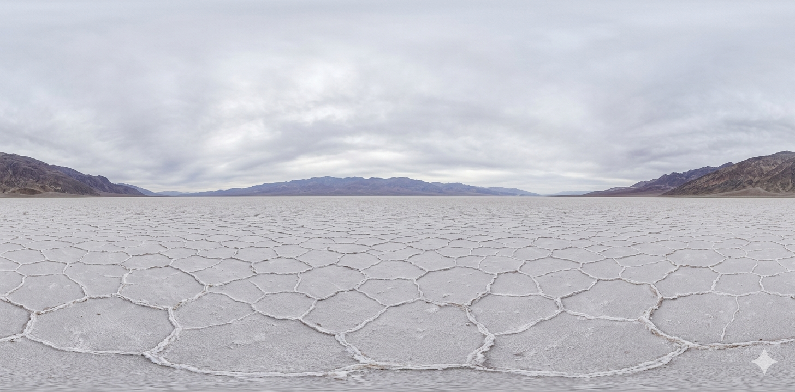</a>
<br/><b>死谷恶水盆地：盐碱之花的几何</b>
<br/> 
<br/><details><summary>📋 核心提示词</summary>

```json
{
  "{
  "图像元数据": {
    "类型": "360度等距柱状全景图",
    "投影方式": "完整球形等距柱状投影",
    "宽高比": "2:1",
    "分辨率": "超高分辨率全景"
  },
  "场景构图": {
    "地点": "死谷国家公园，恶水盆地 (Badwater Basin)",
    "相机位置": "盐滩开阔区中心",
    "相机高度": "高空航拍视角，上帝视角",
    "视野范围": "水平360度，垂直180度",
    "投影行为": "正确的等距柱状畸变，确保无缝球形拼接",
    "天气状况": "多云，柔和的散射光，无直射阴影",
    "景深": "超大幅深景深"
  },
  "视觉元素": {
    "前景": {
      "主体视图": "洁白的六角形盐壳结晶地貌，裂纹清晰",
      "动态": "静止"
    },
    "中景主体": {
      "地形": "延展至天际的平坦盐原",
      "村落": "无",
      "云雾": "空气清透，无雾"
    },
    "背景": {
      "景观": "远方呈现紫色和灰色的干旱褶皱山脉",
      "天空": "带有些许忧郁色彩的浅灰色多云天空"
    },
    "环境氛围": {
      "地面半球": "银白色的几何荒原",
      "整体氛围": "极度静谧、荒凉、超现实、极简主义"
    }
  },
  "渲染风格": {
    "光照": "柔和的全局漫反射，消除硬调阴影",
    "调色": "低饱和度调色，以白、灰、淡紫为主色调",
    "质感质量": {
      "描述": "结晶体的矿物感，地质表面的粗糙细节",
      "痕迹": "无人工痕迹，画面纯净，自然锐化",
      "拼接": "完美的360度无缝拼接"
    }
  },
  "约束条件": {
    "必须保留": ["纯360度全景透视", "六角形盐滩纹理", "极度开阔的视野"],
    "必须避免": ["人物", "现代建筑", "彩色植物", "奇幻风格"]
  },
  "负面提示词": ["用户界面", "抬头显示", "文本覆盖", "水印", "现代设施", "车辆", "行人", "奇幻艺术", "插图", "过度处理", "边框", "裁剪视图", "全景接缝断裂"]
}"
}
```

<sub>📄 [下载完整 JSON](prompts/case019.json)</sub>
</details>
</div>

<hr/>
<div align="center">
<a href="images/case022/output.png">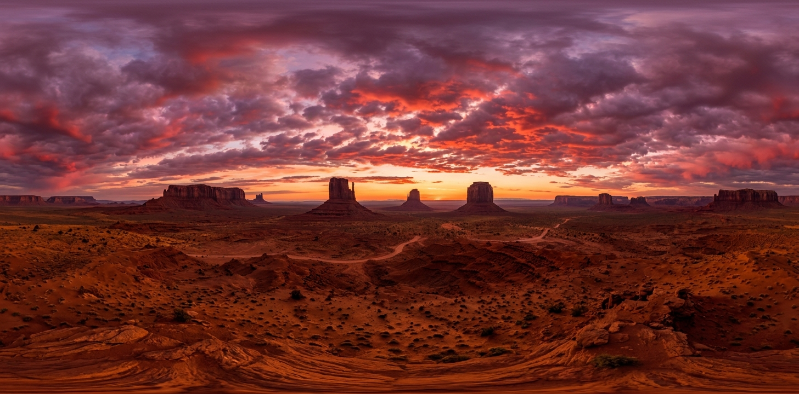</a>
<br/><b>纪念碑谷：史诗般的晚霞孤峰</b>
<br/> 
<br/><details><summary>📋 核心提示词</summary>

```json
{
  "{
  "图像元数据": {
    "类型": "360度等距柱状全景图",
    "投影方式": "完整球形等距柱状投影",
    "宽高比": "2:1",
    "分辨率": "超高分辨率全景"
  },
  "场景构图": {
    "地点": "美国，纪念碑谷 (Monument Valley)",
    "相机位置": "荒漠盆地中心",
    "相机高度": "高空航拍视角，上帝视角",
    "视野范围": "水平360度，垂直180度",
    "投影行为": "正确的等距柱状畸变，确保无缝球形拼接",
    "天气状况": "极致的日落奇观，天空中布满被晚霞染红的积云",
    "景深": "远距离全聚焦"
  },
  "视觉元素": {
    "前景": {
      "主体视图": "布满灌木与风蚀波纹的红色沙土地",
      "动态": "静止"
    },
    "中景主体": {
      "地形": "巨大的砂岩孤峰、平顶山与尖塔群",
      "村落": "无",
      "云雾": "无"
    },
    "背景": {
      "景观": "地平线上重叠的远山轮廓",
      "天空": "色彩斑斓的火烧云，极具电影感的晚霞"
    },
    "环境氛围": {
      "地面半球": "暖红色调的干旱地表",
      "整体氛围": "雄壮、苍凉、带有古典西部片的浪漫色彩"
    }
  },
  "渲染风格": {
    "光照": "极低角度的日落侧光，强烈的明暗对比",
    "调色": "浓郁的暖色调，紫色与橙红色的互补配合",
    "质感质量": {
      "描述": "岩石表面的颗粒纹理与云层的厚重感",
      "痕迹": "无人工痕迹，画面纯净，自然锐化",
      "拼接": "完美的360度无缝拼接"
    }
  },
  "约束条件": {
    "必须保留": ["纯360度全景透视", "无人机高空视角", "孤峰群分布", "高度写实摄影感"],
    "必须避免": ["现代建筑", "人物", "游戏UI设计", "绘画质感"]
  },
  "负面提示词": ["用户界面", "抬头显示", "文本覆盖", "水印", "现代设施", "车辆", "行人", "奇幻艺术", "插图", "过度处理", "边框", "裁剪视图", "全景接缝断裂"]
}"
}
```

<sub>📄 [下载完整 JSON](prompts/case022.json)</sub>
</details>
</div>

<hr/>
<div align="center">
<a href="images/case024/output.png"></a>
<br/><b>亚利桑那州：马蹄湾翡翠之环</b>
<br/> 
<br/><details><summary>📋 核心提示词</summary>

```json
{
  "{
  "图像元数据": {
    "类型": "360度等距柱状全景图",
    "投影方式": "完整球形等距柱状投影",
    "宽高比": "2:1",
    "分辨率": "超高分辨率全景"
  },
  "场景构图": {
    "地点": "亚利桑那州，马蹄湾 (Horseshoe Bend)",
    "相机位置": "峡谷边缘正上方中心",
    "相机高度": "高空航拍视角，上帝视角",
    "视野范围": "水平360度，垂直180度",
    "投影行为": "正确的等距柱状畸变，确保无缝球形拼接",
    "天气状况": "极致晴朗，午后强光，伴有高空卷云",
    "景深": "超大深景深，全幅锐利"
  },
  "视觉元素": {
    "前景": {
      "主体视图": "陡峭的砂岩峭壁边缘，带有风化裂纹和细碎砂石",
      "动态": "静止"
    },
    "中景主体": {
      "地形": "巨大的U形砂岩孤峰，科罗拉多河深切河谷形成的环绕水带",
      "村落": "无",
      "云雾": "无"
    },
    "背景": {
      "景观": "地平线上延绵不绝的平顶山与红色荒漠高原",
      "天空": "纯净的渐变深蓝色天空"
    },
    "环境氛围": {
      "地面半球": "干旱的红褐色沉积岩地貌",
      "整体氛围": "极其震撼的自然景观，宏伟且具有神圣感"
    }
  },
  "渲染风格": {
    "光照": "硬调日光，创造出岩石凹陷处的深黑色阴影",
    "调色": "高对比度自然调色，强调红土与绿水的补色关系",
    "质感质量": {
      "描述": "极致的岩石物理质感，水面具有真实的折射与透明度",
      "痕迹": "无人工痕迹，画面纯净，自然锐化",
      "拼接": "完美的360度无缝拼接"
    }
  },
  "约束条件": {
    "必须保留": ["纯360度全景透视", "无人机高空视角", "U型河道完整闭环", "高度写实摄影感"],
    "必须避免": ["城市建筑", "人物", "电影感色彩过度处理", "非全景比例"]
  },
  "负面提示词": ["用户界面", "抬头显示", "文本覆盖", "水印", "现代建筑", "桥梁", "行人", "奇幻艺术", "插图", "过度处理", "边框", "裁剪视图", "全景接缝断裂"]
}"
}
```

<sub>📄 [下载完整 JSON](prompts/case024.json)</sub>
</details>
</div>

<hr/>
<div align="center">
<a href="images/case031/output.png"></a>
<br/><b>光影赞歌：塞洛姆主峰的“日照金山”360度落日全景</b>
<br/> 
<br/><details><summary>📋 核心提示词</summary>

```json
{
  "{
  "图像元数据": {
    "类型": "360度等距柱状全景图 (360 Equirectangular Panorama)",
    "投影方式": "完整球形等距柱状投影",
    "宽高比": "2:1",
    "分辨率": "极致高清摄影 (8K UHD Quality)"
  },
  "场景构图": {
    "地点": "塞洛姆山脉（Tsey-Loam），高海拔峡谷区",
    "相机位置": "中高空航拍，正对夕阳落下的方向",
    "相机高度": "上帝视角，俯瞰蜿蜒的山路与群峰",
    "视野范围": "水平360度，垂直180度，完美的天地无缝球形衔接",
    "投影行为": "正确的等距柱状畸变，前景公路在天底呈长弧线延伸，地平线居中且平稳",
    "天气状况": "极致通透的晴朗黄昏，带有微弱的云彩",
    "景深": "全景深，捕捉从近处岩石纹理到远方天际线的一切细节"
  },
  "视觉元素": {
    "前景": {
      "主体视图": "下方是深色的高山草甸，多条蜿蜒的发夹弯公路（Serpentine road）在阴影中闪烁着灰白色的光泽。",
      "动态": "大地的寂静感，与天空的光影流动形成对比。"
    },
    "中景主体": {
      "地形": "画面中心左侧是陡峭的尖峰，阳光精准地平射在主峰顶端，呈现出极其浓郁的橘金色（Alpenglow）。",
      "植被": "山脚和谷底被深绿色的森林覆盖，大部分区域已没入冷蓝色的阴影中。",
      "光源": "太阳在地平线上放射出星芒状（Sunstar）的光芒，光线横穿峡谷，产生迷人的容积光（God rays）。"
    },
    "背景": {
      "景观": "群山层峦叠嶂，远方天际线上隐约可见白雪皑皑的巅峰，在余晖下呈现出淡粉色。",
      "天空": "从落日处的亮橙色完美过渡到天顶的深宝石蓝色，散布着丝缕状的卷云。"
    },
    "环境氛围": {
      "地面半球": "冷色调的暗部阴影占据大部分地表，反衬出被阳光点亮的峰顶。",
      "整体氛围": "神圣、辉煌、壮丽，一种令人屏息的大自然时刻。"
    }
  },
  "渲染风格": {
    "光照": "剧烈的侧逆光构图。落日的星芒效果与受光面的橘红影调构成核心视觉点。",
    "调色": "高对比度的冷暖对比（Teal and Orange）。深蓝的阴影与炽热的峰顶光辉形成极强视觉张力。",
    "质感质量": {
      "描述": "岩石的每一道缝隙和树林的绒毛质感清晰可见，动态范围极高。",
      "痕迹": "纯净无暇，无镜头光斑干扰，无全景接缝感。",
      "拼接": "完美的360度无缝球形拼接"
    }
  },
  "约束条件": {
    "必须保留": [
      "日照金山的视觉奇观",
      "落日产生的星芒和射线",
      "360度全视角空间布局",
      "深邃的冷蓝色峡谷与金色峰顶的对比",
      "蜿蜒且具有投影几何感的盘山路"
    ],
    "必须避免": [
      "由于后期过度导致的色彩断层",
      "模糊的边缘细节",
      "现代工业设施或大型车辆",
      "任何导致空间沉浸感中断的拼接线"
    ]
  },
  "负面提示词": [
    "低分辨率",
    "模糊不清",
    "过饱和的假色",
    "电力塔",
    "城市杂乱感",
    "黑边",
    "拼接错位",
    "光线平淡"
  ]
}"
}
```

<sub>📄 [下载完整 JSON](prompts/case031.json)</sub>
</details>
</div>

<hr/>
<div align="center">
<a href="images/case033/output.png"></a>
<br/><b>暮色金顶：塞洛姆山脊的360度黄昏全景史诗</b>
<br/> 
<br/><details><summary>📋 核心提示词</summary>

```json
{
  "{
  "图像元数据": {
    "类型": "360度等距柱状全景图 (360 Equirectangular Panorama)",
    "投影方式": "完整球形等距柱状投影",
    "宽高比": "2:1",
    "分辨率": "8K超高清摄影质感"
  },
  "场景构图": {
    "地点": "高海拔岩石山脉 (高加索或类似塞洛姆山脉地貌)",
    "相机位置": "中高空无人机悬停视角",
    "相机高度": "上帝视角 (Aerial Overlook)",
    "视野范围": "水平360度，垂直180度，全方位无死角覆盖",
    "投影行为": "完美的等距柱状畸变，地平线居中对齐，天顶与天底无缝衔接",
    "天气状况": "黄昏时分，薄云，空气通透度极高",
    "景深": "全景深，远近山峦层次清晰"
  },
  "视觉元素": {
    "前景": {
      "主体视图": "画面下方为暗褐色的高山草甸，一条灰色的盘山公路如银色丝带般在山谷间剧烈蜿蜒。道路在全景投影下呈现出优雅的弧形曲线。",
      "动态": "静谧，无车辆，强调大自然的荒凉与宏伟。"
    },
    "中景主体": {
      "地形": "中央屹立着巍峨的尖锐岩石主峰，山体由陡峭的灰岩组成，棱角分明。山脚下是平缓的黄绿色坡地。",
      "村落/建筑": "在道路拐弯处的平缓地带，隐约可见极小规模的人类定居点或营地（蓝色顶棚）。",
      "光影表现": "日照金山效果。夕阳的余晖斜射在主峰最顶端的岩壁上，呈现出明亮的橘金色，与阴影中的深蓝色山体形成强烈对比。"
    },
  "背景": {
    "景观": "远方地平线上群山起伏，最远端的雪峰被夕阳染成淡粉红色。山谷间笼罩着一层薄薄的蓝色暮霭。",
    "天空": "广阔的黄昏天空，由地平线处的暖橙色过渡到天顶的深紫色/墨蓝色，点缀着几缕被晚霞染亮的卷云。"
  },
  "环境氛围": {
    "地面半球": "深色基调的荒野，体现黄昏时分大地的沉寂感。",
    "整体氛围": "庄严、孤寂、壮丽，充满大自然的崇高感 (Sublime)。"
  }
  },
  "渲染风格": {
    "光照": "黄金时刻 (Golden Hour) 侧逆光，强调山体浮雕感。",
    "调色": "冷暖对比色调。天空的深蓝与山尖的明金形成经典互补色。",
    "质感质量": {
      "描述": "极致的岩石纹理细节，无噪点，色彩过渡细腻。",
      "痕迹": "纯净画面，无任何拍摄设备阴影或拼接错位。",
      "拼接": "360度无缝闭环"
    }
  },
  "约束条件": {
    "必须保留": [
      "360度全景等距柱状格式",
      "日照金山的视觉核心",
      "极具形式感的盘山公路",
      "冷蓝色的暮霭与暖金色的山尖对比",
      "写实主义摄影风格"
    ],
    "必须避免": [
      "现代城市景观",
      "过饱和的合成感色彩",
      "科幻或奇幻元素",
      "人物及动物近景",
      "广角镜头拉伸导致的边缘模糊"
    ]
  },
  "负面提示词": [
    "水印",
    "标志",
    "断裂的地平线",
    "拼接痕迹",
    "噪点",
    "曝光过度",
    "虚假的光晕",
    "现代电线杆",
    "围栏",
    "不自然的光影"
  ]
}"
}
```

<sub>📄 [下载完整 JSON](prompts/case033.json)</sub>
</details>
</div>

<hr/>
<div align="center">
<a href="images/case057/output.png"></a>
<br/><b>黄山花岗岩峰林日出 360° 全景航拍</b>
<br/> 
<br/><details><summary>📋 核心提示词</summary>

```json
{
  "{
    "图像元数据": {
        "类型": "360度等距柱状全景图",
        "投影方式": "完整球形等距柱状投影",
        "宽高比": "2:1",
        "分辨率": "超高分辨率全景"
    },
    "场景构图": {
        "拍摄地点": "黄山花岗岩峰林地貌上空",
        "机位": "无人机位于奇峰正上方高空航拍",
        "拍摄高度": "高空无人机视角",
        "视野范围": "水平360°，垂直180°",
        "投影特性": "正确的等距柱状畸变",
        "天气状况": "清晨晴朗薄雾天气，空气通透",
        "景深": "无限景深，全景画面全程清晰"
    },
    "视觉元素": {
        "前景": {
            "核心画面": "陡峭的花岗岩峰林，岩壁纹理与节理清晰，日出暖光照射下呈现暖橙与深灰的明暗对比，立体轮廓极致突出",
            "细节表现": "花岗岩岩壁的质感与光影层次清晰自然"
        },
        "中景": {
            "地形": "层叠错落的峰林峡谷，纵深极强，山峦连绵起伏，山间萦绕轻薄晨雾",
            "植被细节": "山体缝隙生长的黄山松姿态苍劲，与岩石形成自然对比"
        },
        "背景": {
            "远景": "远方层叠的山脉向天际线延伸，逐渐融入云海",
            "天空": "清晨渐变蓝天占据上半球，高空点缀丝状流云，天际线有朦胧晨雾"
        },
        "环境氛围": {
            "下半球视角": "从空中俯瞰花岗岩峰林、峡谷与远山云海",
            "整体气质": "原始奇峻的山岳地貌环境，无人类开发痕迹"
        }
    },
    "渲染风格": {
        "光影": "自然清晨侧光，柔和真实光影，山体明暗层次自然",
        "色彩调校": "真实自然色彩，岩石暖橙、深灰与天空蓝平衡，还原实景质感",
        "纹理质感": {
            "描述": "超写实航拍摄影风格",
            "处理细节": "轻微自然锐化，无人工痕迹",
            "拼接要求": "无缝360度全景拼接"
        }
    },
    "约束规则": {
        "必须保留": ["纯360°全景透视", "无人机高空航拍视角", "黄山奇峰为核心主体", "无任何UI或界面元素", "高度写实"],
        "严格规避": ["城市或人工建筑", "人物", "电影感灯光", "奇幻风格", "插画或绘画感", "单帧构图"]
    },
    "负面提示词": ["界面元素", "抬头显示", "文字叠加", "水印", "建筑", "人物", "奇幻艺术", "插画", "电影感打光", "过度高动态范围", "过度处理", "画框", "边框", "裁切画面", "全景拼接断层", "人工元素"]
}"
}
```

<sub>📄 [下载完整 JSON](prompts/case057.json)</sub>
</details>
</div>

<hr/>
<div align="center">
<a href="images/case073/output.png">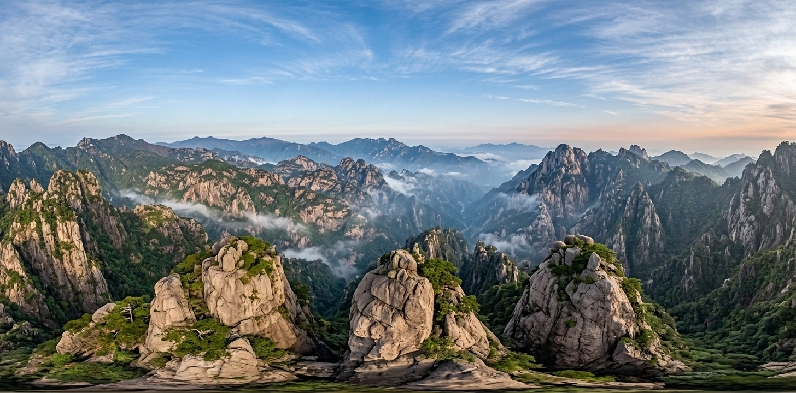</a>
<br/><b>黄山花岗岩峰林晨雾 360° 全景航拍</b>
<br/> 
<br/><details><summary>📋 核心提示词</summary>

```json
{
  "{
    "图像元数据": {
        "类型": "360度等距柱状全景图",
        "投影方式": "完整球形等距柱状投影",
        "宽高比": "2:1",
        "分辨率": "超高分辨率全景"
    },
    "场景构图": {
        "拍摄地点": "黄山花岗岩峰林地貌上空",
        "机位": "无人机位于奇峰正上方高空航拍",
        "拍摄高度": "高空无人机视角",
        "视野范围": "水平360°，垂直180°",
        "投影特性": "正确的等距柱状畸变",
        "天气状况": "清晨晴朗薄雾天气，空气通透",
        "景深": "无限景深，全景画面全程清晰"
    },
    "视觉元素": {
        "前景": {
            "核心画面": "三座陡峭的花岗岩奇峰，岩壁纹理与节理清晰，峰顶与岩壁缝隙生长黄山松，植被细节自然",
            "细节表现": "花岗岩岩壁的质感与光影层次清晰"
        },
        "中景": {
            "地形": "层叠错落的峰林峡谷，纵深极强，山峦连绵起伏，山间萦绕轻薄晨雾",
            "植被细节": "山体覆盖的原生植被层次清晰，与岩石形成自然对比"
        },
        "背景": {
            "远景": "远方层叠的山脉向天际线延伸，逐渐融入晨雾",
            "天空": "清晨渐变蓝天占据上半球，高空点缀丝状流云，天际线有朦胧晨雾"
        },
        "环境氛围": {
            "下半球视角": "从空中俯瞰花岗岩峰林、峡谷与远山地形",
            "整体气质": "原始奇峻的山岳地貌环境，无人类开发痕迹"
        }
    },
    "渲染风格": {
        "光影": "自然清晨侧光，柔和真实光影，山体明暗层次自然",
        "色彩调校": "真实自然色彩，岩石灰调、植被绿与天空蓝平衡，还原实景质感",
        "纹理质感": {
            "描述": "超写实航拍摄影风格",
            "处理细节": "轻微自然锐化，无人工痕迹",
            "拼接要求": "无缝360度全景拼接"
        }
    },
    "约束规则": {
        "必须保留": ["纯360°全景透视", "无人机高空航拍视角", "黄山奇峰为核心主体", "无任何UI或界面元素", "高度写实"],
        "严格规避": ["城市或人工建筑", "人物", "电影感灯光", "奇幻风格", "插画或绘画感", "单帧构图"]
    },
    "负面提示词": ["界面元素", "抬头显示", "文字叠加", "水印", "建筑", "人物", "奇幻艺术", "插画", "电影感打光", "过度高动态范围", "过度处理", "画框", "边框", "裁切画面", "全景拼接断层", "人工元素"]
}"
}
```

<sub>📄 [下载完整 JSON](prompts/case073.json)</sub>
</details>
</div>

<hr/>
<div align="center">
<a href="images/case078/output.png">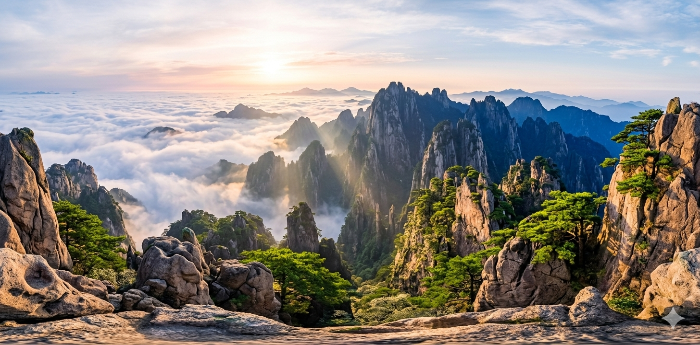</a>
<br/><b>黄山奇境：黄山花岗岩峰林的日出丁达尔盛景</b>
<br/> 
<br/><details><summary>📋 核心提示词</summary>

```json
{
  "{
  "图像元数据": {
    "类型": "360度等距柱状全景图",
    "投影": "完整球形等距柱状投影",
    "长宽比": "2比1",
    "分辨率": "8K极致清晰"
  },
  "场景构图": {
    "地点": "中国黄山风景区猴子观海景区",
    "相机位置": "峰林上空中低空悬停",
    "相机高度": "模拟沉浸式低空航拍视角",
    "视野范围": "水平360度，垂直180度",
    "透视表现": "花岗岩峰林呈层叠状向远方无限延伸，云海填满山谷，地平线平滑无缝衔接",
    "天气": "晴好，山间有轻薄云海，空气通透度高",
    "景深控制": "近景峰林纹理、中景云海层次与远景山峦天际线全清晰"
  },
  "视觉元素": {
    "前景": { "主要特征": "花岗岩怪石的粗糙岩壁质感，怪石上生长的黄山奇松，岩壁的侵蚀纹理", "动态": "云海缓慢流动" },
    "中景主体": { "地貌": "错落林立的花岗岩峰林，山谷间填满轻薄云海", "细节": "峰林的垂直陡峭轮廓，黄山奇松的翠绿针叶，云海的朦胧通透质感，晨光穿透形成的丁达尔光效", "特征": "暖金棕色的向阳岩壁、翠绿色的奇松、朦胧奶白色云海与黛蓝色背光峰林的层次组合" },
    "背景": { "远景": "层叠的峰林在云海中若隐若现延伸至天际线", "天空": "淡蓝色与金粉色交织的日出霞光，带有轻薄的白色云朵" },
    "环境氛围": { "地面半球": "东方水墨意境的仙山圣境", "氛围感": "空灵、神圣、仙气、壮阔" }
  },
  "渲染风格": {
    "光影方案": "日出破晓的低角度斜射暖光，穿透云海形成强烈丁达尔光效，强调花岗岩岩壁的立体雕刻感与奇松的鲜活质感，突出云海的朦胧仙气感",
    "色彩科学": "暖金色的晨光、金棕色的岩壁、翠绿色的奇松、奶白色的云海与淡蓝色的天空形成丰富柔和的色彩层次，阴影区的黛蓝色调增强空间深度",
    "质感质量": { "描述": "极高清的黄山峰林云海风光航拍", "细节": "完美的360度全视角无缝拼接，无畸变，云海动态自然" }
  },
  "核心约束": {
    "必须保留": [ "花岗岩峰林的陡峭轮廓", "奇松怪石的东方意境", "晨光的丁达尔光效", "云海的朦胧通透感", "全景环绕的峰林空间感" ],
    "严禁出现": [ "文字", "水印", "人工建筑", "游客", "栈道", "围栏", "电线", "低对比度", "色彩失真" ]
  },
  "负面提示词": [ "文字", "水印", "模糊", "低画质", "暗沉色调", "拼接裂缝", "畸变", "人工设施", "杂物", "色彩失真", "过曝" ]
}"
}
```

<sub>📄 [下载完整 JSON](prompts/case078.json)</sub>
</details>
</div>

<hr/>


<div align="center">
<h2>📊 分类统计</h2>

<sub>🌊 水域 </sub><code>███████████████░░░░░░░░░░░░░░░░░░░░░░░░░</code> <sub>58 (38%)</sub><br/>
<sub>🏔️ 山川 </sub><code>██████████████░░░░░░░░░░░░░░░░░░░░░░░░░░</code> <sub>57 (37%)</sub><br/>
<sub>🎨 其他 </sub><code>████░░░░░░░░░░░░░░░░░░░░░░░░░░░░░░░░░░░░</code> <sub>16 (10%)</sub><br/>
<sub>❄️ 雪境 </sub><code>█░░░░░░░░░░░░░░░░░░░░░░░░░░░░░░░░░░░░░░░</code> <sub>7 (5%)</sub><br/>
<sub>🏙️ 城市 </sub><code>█░░░░░░░░░░░░░░░░░░░░░░░░░░░░░░░░░░░░░░░</code> <sub>7 (5%)</sub><br/>
<sub>🌸 春景 </sub><code>█░░░░░░░░░░░░░░░░░░░░░░░░░░░░░░░░░░░░░░░</code> <sub>4 (3%)</sub><br/>
<sub>🌲 森林 </sub><code>█░░░░░░░░░░░░░░░░░░░░░░░░░░░░░░░░░░░░░░░</code> <sub>4 (3%)</sub><br/>
</div>


<div align="center">
<b>Made with ❤️</b> by <a href="https://www.diysq.com"><b>绘梦拾光</b></a>
<br/><br/>
<sub>数据来源于 <a href="https://www.diysq.com/archives/category/aitupian/360quanjing">360全景视觉</a> 专栏 · 仅供学习参考</sub>
</div>