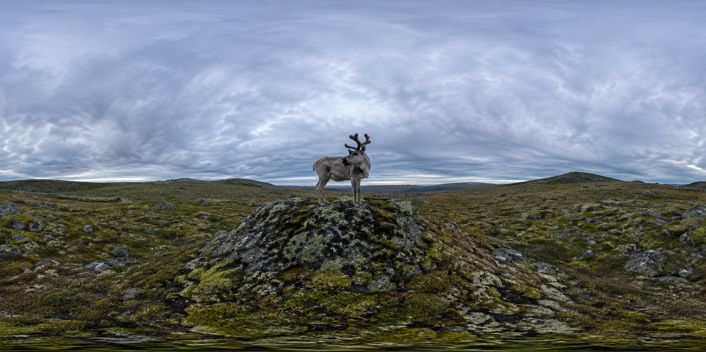
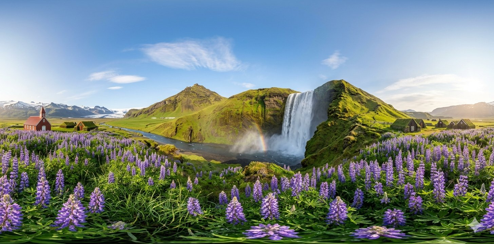

# 🌍 Awesome 360° Panorama Prompts

> 最大的开源 360° 全景图提示词库 · 从 <a href="https://www.diysq.com" target="_blank">DIYSQ.com</a> 自动同步

<p align="center">
  <a href="https://huimeng8090-byte.github.io/Awesome-360-Panorama-Prompts/" target="_blank">
    
  </a>
</p>

<p align="center">
  <a href="https://www.diysq.com/" target="_blank"></a>
  <a href="https://www.diysq.com/ai360/" target="_blank"></a>
  
  
</p>

本仓库收录 **449+** 条 360° 全景图提示词，每条包含完整的结构化 JSON，可直接用于 GPT Image 等模型生成无缝拼接的等距柱状投影（Equirectangular）全景图。

## ✨ 特性

- 🤖 **GPT Image 兼容** — 结构化 JSON 格式，直接粘贴即可生成
- 🥽 **VR Ready** — 标准 2:1 等距柱状投影，支持 Pannellum / Krpano 等全景播放器
- 📄 **JSON Format** — 全景规范、场景描述、光影氛围、材质细节、负面约束等完整字段
- 🔄 **自动同步** — GitHub Actions 每天自动从 diysq.com 拉取最新全景图
- 🖼️ **预览图** — 每条提示词附带生成效果预览
- 🔍 **在线浏览** — 支持搜索、分类筛选、卡片/列表双视图

## 🖼️ 预览

|  |  |  |
|---|---|---|
|  |  |  |
|  |  |  |

<p align="center"><a href="https://huimeng8090-byte.github.io/Awesome-360-Panorama-Prompts/" target="_blank">→ 查看全部 449 条</a></p>

## 📁 目录结构

```
├── prompts/              # 提示词 JSON 文件（case013.json 起）
├── images/               # 预览图（每条一个目录，含 output.jpg）
├── scripts/sync.py       # 同步脚本
├── .github/workflows/    # 自动同步工作流
├── index.html            # 在线演示页
├── PROMPTS_LIST.md       # 提示词索引表
└── README.md
```

## 🚀 快速开始

1. 访问 <a href="https://huimeng8090-byte.github.io/Awesome-360-Panorama-Prompts/" target="_blank">在线演示页</a>
2. 按分类浏览或搜索目标场景
3. 点击「查看 Prompt」复制完整 JSON
4. 粘贴到 GPT Image 等模型，调整场景变量生成全景图
5. 导入 Pannellum / Krpano 验证无缝拼接

## 📊 分类统计

<p align="center">
<a href="https://huimeng8090-byte.github.io/Awesome-360-Panorama-Prompts/?category=360%E5%85%A8%E6%99%AF%E8%A7%86%E8%A7%89" target="_blank"></a>
<a href="https://huimeng8090-byte.github.io/Awesome-360-Panorama-Prompts/?category=GPT%20Image%202.0" target="_blank"></a>
<a href="https://huimeng8090-byte.github.io/Awesome-360-Panorama-Prompts/?category=%E6%99%AF%E5%8C%BA" target="_blank"></a>
<a href="https://huimeng8090-byte.github.io/Awesome-360-Panorama-Prompts/?category=%E8%A1%97%E5%A4%B4" target="_blank"></a>
<a href="https://huimeng8090-byte.github.io/Awesome-360-Panorama-Prompts/?category=%E5%AE%A2%E5%8E%85" target="_blank"></a>
<a href="https://huimeng8090-byte.github.io/Awesome-360-Panorama-Prompts/?category=%E4%BA%BA%E7%89%A9" target="_blank"></a>
<a href="https://huimeng8090-byte.github.io/Awesome-360-Panorama-Prompts/?category=%E6%8F%92%E7%94%BB" target="_blank"></a>
<a href="https://huimeng8090-byte.github.io/Awesome-360-Panorama-Prompts/?category=%E8%8A%B1" target="_blank"></a>
<a href="https://huimeng8090-byte.github.io/Awesome-360-Panorama-Prompts/?category=%E6%B8%B8%E6%88%8F%E5%9C%BA%E6%99%AF" target="_blank"></a>
<a href="https://huimeng8090-byte.github.io/Awesome-360-Panorama-Prompts/?category=%E7%A7%91%E5%B9%BB%E5%9C%BA%E6%99%AF" target="_blank"></a>
<a href="https://huimeng8090-byte.github.io/Awesome-360-Panorama-Prompts/?category=%E5%8F%A4%E5%BB%BA%E7%AD%91" target="_blank"></a>
<a href="https://huimeng8090-byte.github.io/Awesome-360-Panorama-Prompts/?category=%E5%8A%A8%E7%89%A9" target="_blank"></a>
<a href="https://huimeng8090-byte.github.io/Awesome-360-Panorama-Prompts/?category=%E5%BB%BA%E7%AD%91" target="_blank"></a>
<a href="https://huimeng8090-byte.github.io/Awesome-360-Panorama-Prompts/?category=%E7%80%91%E5%B8%83" target="_blank"></a>
<a href="https://huimeng8090-byte.github.io/Awesome-360-Panorama-Prompts/?category=%E9%85%92%E5%BA%97" target="_blank"></a>
<a href="https://huimeng8090-byte.github.io/Awesome-360-Panorama-Prompts/?category=%E6%B5%B7%E5%BA%95%E4%B8%96%E7%95%8C" target="_blank"></a>
</p>

## 🔄 自动同步机制

GitHub Actions 每天北京时间 8:00 自动运行：

- 通过 WordPress REST API 拉取 diysq.com 全景分类文章
- 对比缓存，仅同步新发布或更新的内容（增量同步）
- 自动压缩预览图至 2048px JPEG
- 提交并推送到本仓库

**手动触发**：仓库 → Actions → Sync from DIYSQ → Run workflow

## 📝 提示词格式示例

```json
{
  "全景规范": {
    "图片类型": "360度等距长方全景图",
    "画幅比例": "2:1",
    "投影方式": "完整球形柱状投影"
  },
  "场景描述": "...",
  "光影氛围": "...",
  "材质细节": "...",
  "负面约束": [...]
}
```

## 🌐 相关网站

<p align="center">
  <a href="https://www.diysq.com/" target="_blank">
    
  </a>
  <a href="https://www.diysq.com/ai360/" target="_blank">
    
  </a>
</p>

### 🏠 DIYsq 官网
**https://www.diysq.com/**

创意设计资源平台，提供丰富的设计素材、教程和工具，涵盖 AI 绘画、3D 建模、全景图制作等多个领域，是创作者的灵感源泉和工具箱。

### 🎨 AI 360° 全景绘图站
**https://www.diysq.com/ai360/**

专业的 AI 360° 全景图在线生成平台，支持一键生成等距柱状投影全景图，可直接用于 VR 漫游、虚拟展厅、游戏场景等领域。无需复杂操作，输入描述即可生成无缝拼接的 360° 全景图。

---

## 📄 License

MIT
